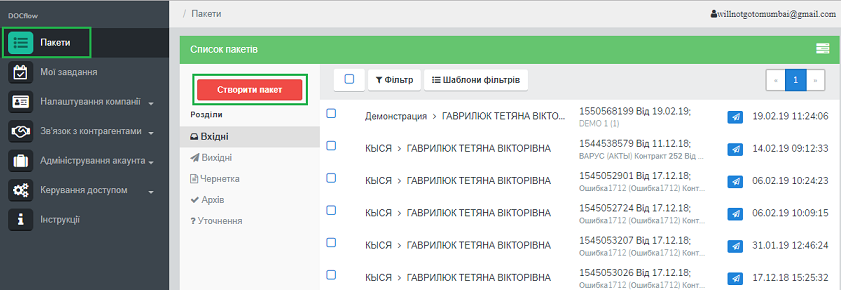
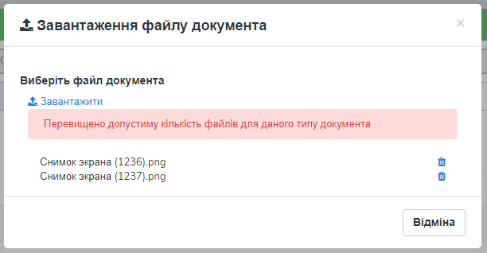
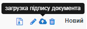
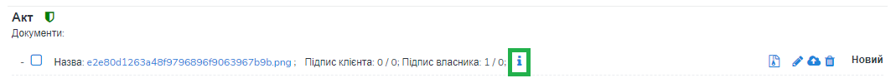
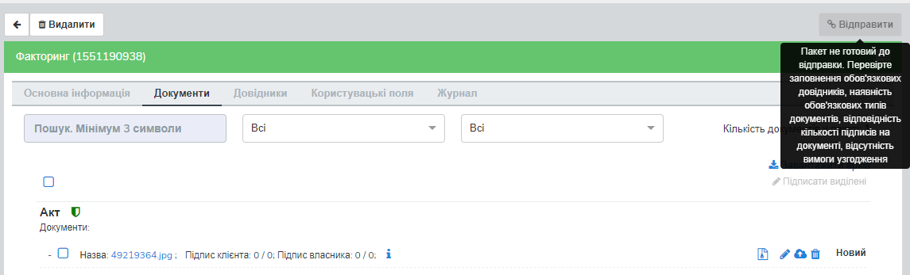
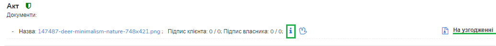
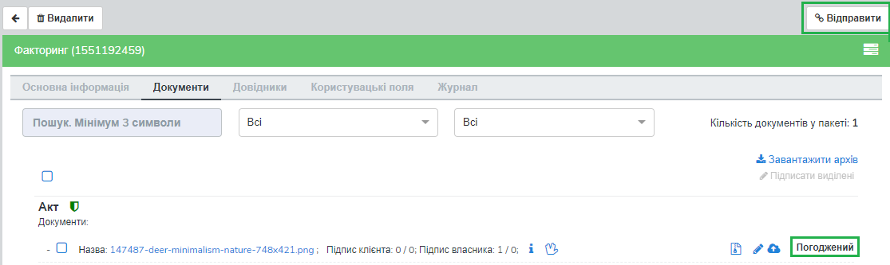
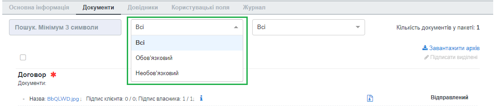
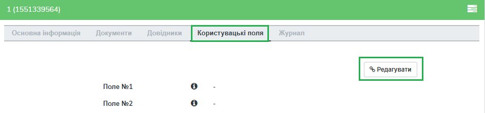
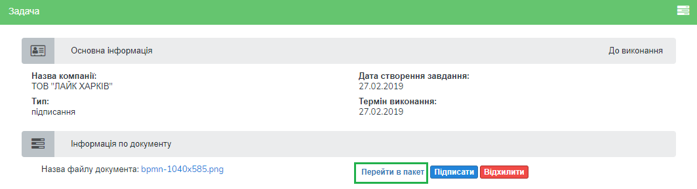

##############################################
Інструкція користувача з обміну комплектами
##############################################

---------

.. contents:: Зміст:
   :depth: 2

---------

Дана інструкція описує порядок дій користувача на платформі DOCflow з підготовки до обміну комплектами, створення та відправлення комплекта документів.

-------------------------

1 Терміни та визначення
------------------------

 - Компанія – юридична чи фізична особа, яка використовує систему для виконання своїх процесів. До одного акаунта можливо прив’язати декілька компаній. Документи, довідники, типи комплектів, контракти, маршрути, налаштування узгодження створюються в межах компанії і закріплюються за нею.

 - Тип документа – спеціальний системний довідник, що містить дані за типами документів, якими виконуватиметься обмін між сторонами.

 - Тип комплекта – налаштування та параметри комплекта документів для обміну.

 - Контракт – форма налаштування зв’язку між контрагентами, у відповідності до якої відбувається обмін комплектами документів.

 - Маршрут – операція визначення працівників отримувача, які будуть отримувати та обробляти комплекти документів. Маршрут будується на основі переліку доступних користувачеві контрактів і типів комплекта.

 - Електронний цифровий підпис (ЕЦП/КЕП) — електронний цифровий підпис уповноважених осіб та окремий електронний цифровий підпис, що виконує функцію печатки (у разі наявності), з посиленим сертифікатом ключа, наданим акредитованими центрами сертифікації ключів (далі – АЦСК).

2 Авторизація
--------------
Для авторизації на платформі перейдіть за посиланням https://doc.edi-n.com/auth та введіть свої логін = email і пароль на формі авторизації. Детальна інформація з авторизації міститься в  `«Інструкції з авторизації»`_.

.. _«Інструкції з авторизації»: https://wiki.edi-n.com/ru/latest/services/EDIN_DOCflow/edin_docflow/instruktsia-avtorizatsia.html

3 Передумови обміну комплектами
-----------------------------
Налаштування, які є передумовами обміну комплектами, детально викладені в «Інструкції бізнес-адміністратора», «Інструкції з налаштування ЕЦП/КЕП», «Інструкції з налаштування шифрування». Деталі процедури створення та налаштування облікових записів користувачів та їх ролей описані в «Інструкції адміністратора користувачів».

Для пришвидшення та полегшення налаштування аккаунту на платформі, скористайтеся Майстром налаштувань, що з'явиться при першому відвідуванні платформи після авторизації.

За допомогою майстра ви зможете створити картку вашої компанії, створите перші типи документів, якими плануєте обмінюватися зі своїми контрагентами, та налаштуєте правила обробки документів.
Слідуйте підсказкам та підготуйте усі умови для зручного та швидкого обміну комплектами документів.

В майстрі налаштовуємо тільки неструктуровані документи (наприклад, документи типу pdf). Для налаштування структурованих документів необхідно скористатися розширеними налаштуваннями платформи.

Якщо не хочете знову бачити майстер налаштувань, відмітьте позначку *Не показувати майстер при повторному вході*.

4 Створення та відправка комплекта
---------------------------------  
Для створення комплекта перейдіть до розділу меню «комплекти» і натисніть «Створити комплект»:

У формі створення комплекта виберіть компанію, яка відправлятиме комплект документів, із випадаючого списку: 

.. image:: pics_instruktsia_korystuvacha_obminy_paketami/instruktsia_korystuvacha_obminy_paketami_2.png
   :align: center
 
Після вибору компанії стане доступним поле для вибору контракту. Поле містить  перелік активних (діючих) контрактів за обраною компанією, що відображаються випадаючим списком.

Після вибору контракту система відобразить перелік доступних комплектів за обраним контрактом:

Для вибору типу комплекта натисніть на його назву. Після цього автоматично відкриється форма для заповнення обраного типу комплекта.

.. admonition:: Зверніть увагу! 

   Якщо у формі контракту не налаштований перелік типів комплектів, система повідомить про їх відсутність.

У такому випадку слід виконати налаштування переліку вихідних типів комплектів відповідно до пункту 5.1.2 даної інструкції (для вихідних контрактів) або узгодити відповідні налаштування на стороні контрагента (для вхідних контрактів).

**4.1 Заповнення комплекта**

При створенні чи редагуванні комплекта відкриється форма обробки комплекта, що містить наступні вкладки:

 - Основна інформація – містить загальну інформацію про комплект (дані про Відправника та Отримувача, дані про контракт, дані про комплект, статус комплекта)
 
 - Документи – основний розділ для обробки документів.

 - Довідники – використовується для керування довідниками, що пов’язані з комплектом.

 - Користувацькі поля – використовується для керування користувацькими полями, що пов’язані з комплектом.

 - Журнал – містить інформацію щодо змін і коментарів до документів та комплекта.
 
 .. image:: pics_instruktsia_korystuvacha_obminy_paketami/instruktsia_korystuvacha_obminy_paketami_4.png
    :align: center

*4.1.1 Введення довідників*

Вкладка «Довідники» містить перелік довідників, які потребують заповнення  відповідно до налаштувань типу комплекта. Для заповнення довідника виберіть значення з випадаючого списку (обов’язкові для заповнення поля виділені червоним):

.. image:: pics_instruktsia_korystuvacha_obminy_paketami/instruktsia_korystuvacha_obminy_paketami_5.png
   :align: center

Після введення значень відбувається автоматичне збереження внесених даних і з’являється відповідне повідомлення.

*4.1.2 Введення користувацьких полів*

Вкладка «Поля» містить перелік користувацьких полів, які потребують заповнення. Для заповнення поля введіть у нього необхідні дані. Обов’язкові для заповнення поля виділені червоним. 
 
Для отримання підказки щодо заповнення користувацького поля наведіть курсор миші на іконку «Інформація»:

Після введення значень натисніть «Зберегти». У разі успішного збереження з’явиться відповідне повідомлення.

*4.1.3 Введення документів*

Вкладка «Документи» містить перелік обов’язкових та не обов’язкових документів для даного комплекта. Обов’язкові для конкретного комплекта документи позначаються відміткою |иконка-звезда|. Документи, що потребують шифрування, позначаються відміткою |иконка-щит|.

Для завантаження документа натисніть «Додати»:

Після цього з’явиться можливість завантажити файли документів. Для завантаження файлу або файлів натисніть кнопку «Завантажити» та виберіть необхідні файли (обмеження до 10МБ для одного файлу).

Якщо для даного типу документа встановлено обмеження кількості документів, система повідомить про помилку (обмеження кількості документів встановлюється у налаштуваннях типу комплекта): 

Якщо для документа встановлено ознаку шифрування, перед початком завантаження файлу необхідно вибрати ЕЦП/КЕП, який буде використано для шифрування. При цьому сертифікати для шифрування повинні бути завантажені як на стороні відправника, так і отримувача.

Після завантаження файлу з’явиться можливість ввести обов’язкові та необов’язкові поля для документа. Для цього необхідно натиснути на кнопку «Додаткова інформація по документу»: 

У формі, що відкриється, потрібно натиснути кнопку «Редагувати»: 

Після чого відкриється форма для редагування: 

.. admonition:: Зверніть увагу! 

   Для документів, які відповідно до налаштувань типу комплекта повинні бути завантажені на стороні контрагента (довкладення), відсутня  кнопка «Додати». 
   
При додаванні документа з привязаним довідником, необхідно заповнити усі значення довідника до фінального дочірнього значення. Ви можете також редагувати довідники, які привязані до типу докумена у комплекті.

Для цього необхідно перейти в "Чернетки", вибрати комплект що потребує редагування, та внести зміни. Довідники доступні до редагування тільки на стороні відправника комплекта.

Документ у якому потрібно редагувати довідник, показує підсказку "Потрібно додати значення". 
Натисніть кнопку "Редагувати значення", для того щоб вибрати усі небхідні значення довідника, потім натисніть "Зберегти".

*4.1.4 Додання раніше підписаного документа*

Якщо завантажений документ був підписаний раніше із використанням зовнішнього підписання (тобто накладення підпису), необхідно завантажити файли підписів. Для цього натисніть кнопку «Завантажити підписи» та виберіть файли підписів.

   
Якщо для документа встановлено ознаку шифрування, перед завантаженням файлів підписів документ необхідно розшифрувати. Для цього на формі виберіть ключ для розшифрування:

Після цього натисніть «Завантажити». При завантаженні система перевіряє валідність підпису. Файли підписів, що пройшли перевірку, можливо зберегти. У разі помилки верифікації підпису з’явиться відповідне повідомлення. Завантажені підписи додаються до загальної кількості підписів на документі.

*4.1.5 Підписання документа(ів)*

Для підписання одиничного документа натисніть на кнопку підпису |иконка-ручка| в необхідному рядку:

Якщо для документа встановлено ознаку шифрування, перед підписанням його необхідно розшифрувати. Для цього виберіть ЕЦП/КЕП для розшифрування.  Успішно розшифрований документ можливо буде підписати. У разі виникнення помилки розшифрування з’явиться відповідне повідомлення, і подальше підписання буде неможливим:

У разі використання MobileID користувачеві буде надіслано sms-запит на номер телефону, зв’язаний із ЕЦП/КЕП. Для підтвердження підписання введіть код підтвердження.

Для масового підписання виберіть у списку потрібні документи та натисніть кнопку «Підписання виділених». При цьому відкриється форма підписання з переліком вибраних файлів. Якщо серед вибраних документів є такі, що потребують шифрування, їх потрібно розшифрувати.

.. admonition:: Зверніть увагу! 

   Підписати документ тим самим підписом декілька разів неможливо.

*4.1.6 Видалення документа*

Для видалення документа натисніть відповідну кнопку |иконка-ведерко|. Підтвердження дії призведе до видалення контенту та підписів, що були накладені чи завантажені окремо:

*4.1.7 Перегляд детальної інформації*

Для отримання детальної інформації  за документом та накладеними на нього підписами або для переходу до редагування даних документа натисніть на іконку |иконка-информация| «Додаткова інформація за документом»:

На формі, що відкриється, будуть відображені наступні дані: назва типу документа, ім’я файлу, № та дата документа, коментар, дата/час відправки, кількість підписів, а також детальна інформація щодо накладених підписів з позначкою часу, додаткові користувацькі поля, посилання для скачування документу, тощо.

Для редагування даних документа натисніть «Редагувати» і внесіть необхідні зміни. Для збереження внесених даних натисніть «Зберегти документ».

**4.2 Відправлення комплекта**

Для відправки комплекта натисніть кнопку «Відправити» на формі комплекта:

У разі, якщо в комплекті не заповнені обов’язкові  довідники чи користувацькі поля, обов’язкові документи не містять файлів або не дотримано вимоги щодо мінімальної кількісті ЕЦП/КЕП, кнопка «Відправити» буде заблокована. Для отримання повідомлення-підказки наведіть курсор на неактивну кнопку:

У разі, якщо до складу комплекта входять документи, що потребують узгодження, замість кнопки «Відправити» відображатиметься кнопка «Надіслати на узгодження»:

.. image:: pics_instruktsia_korystuvacha_obminy_paketami/instruktsia_korystuvacha_obminy_paketami_24.png
   :align: center

Відправити контрагенту комплект із документами, для яких процес узгодження не завершено, неможливо. Для запуску процедури узгодження натисніть кнопку «Надіслати на узгодження». Документу буде надано статус «На узгодженні».

Для перегляду статусу узгодження документа натисніть на іконку |иконка-информация| «Додаткова інформація по документу»: 

У блоці «Журнал узгодження» міститься інформація щодо статусів узгодження, дати та часу виконання завдання (погодити, підписати або переглянути документ), коментар у разі відхилення документа в процесі узгодження: 

Після надання документу фінального статусу узгодження активується кнопка «Відправити»: 

Для масової відправки / видалення комплектів із папки «Чернетки» виділіть необхідні комплекти і натисніть кнопку «Надіслати» / «Видалити»:

Незаповнені комплекти не підлягають відправці і позначаються іконкою |иконка-значок|. При масовій відправці такі комплекти не будуть відправлені.

5 Редагування комплекта та відстеження статусу
---------------------------------------------
Для роботи з комплектами перейдіть до розділу «комплекти» (Зовнішні комплекти документів) на навігаційній панелі. Розділ містить наступні папки:

 - Вхідні – для отриманих комплектів документів

 - Вихідні – для відправлених комплектів

 - Чернетки – для зберігання комплектів на стадії обробки

 - Архів – для відображення отриманих та відправлених комплектів, які були оброблені і переведені в архів

 - Уточнення – для комплектів, що потребують уточнення.

Для кожної папки відображається список комплектів.

Необроблені та нерозглянуті на стороні контрагента комплекти відображаються зі статусом «Прийнятий» («Надісланий») та виділяються жирним шрифтом. комплекти відображаються за датою / часом зміни у порядку зменшення.

Для редагування комплекта натисніть на рядок із потрібним комплектом, після чого  відкриється форма редагування.

**5.1 Контроль статусу комплекта**

Статус комплекта відображається у списку комплектів у вигляді відповідної іконки, а також на формі редагування комплекта у вкладці «Загальна інформація»:

Статуси комплекта: |иконка-получен| Отриманий;	|иконка-отправлен| Надісланий; |иконка-отказ| Відмова; |иконка-отклонен| Відхилений; |иконка-черновик| Оброблений / Чернетка; |иконка-уточнение| Запит на уточнення						         	 						          						                                         
Для перегляду інформації щодо зміни статусів документів,  комплектів та коментарів за  даними змінами (причини відхилення документа / комплекта, коментар до уточнення) перейдіть до розділу «Журнал» форми обробки комплекта. 

Статуси документів відображаються напроти кожного конкретного документа безпосередньо у формі обробки комплекта:

Історія зміни статусів зберігається у розділі «Журнал» форми обробки:  

**5.2 Фільтр (пошук комплекта)**

Для пошуку потрібного комплекта натисніть «Фільтр»:

Пошук виконується за наступними атрибутами:

 - Номер (для пошуку вкажіть три або більше символів номера комплекта)

 - Статус (поле містить системний перелік статусів у відповідності до обраного розділу)

 - Відправник (ЄДРПОУ, назва)

 - Отримувач (ЄДРПОУ, назва)

 - Тип комплекта (для фільтрування за типом комплекта необхідно обрати отримувача у відповідному полі фільтра)

 - Дата (вказується в діапазоні від _  до)

Для одночасного видалення внесених у налаштування фільтра значень натисніть «Скинути».

**5.3 Шаблони фільтрів**

Для спрощення фільтрації комплектів у розділах, реалізована можливість зберегти потрібні параметри фільтра. Для цього натисніть кнопку "Додати ярлик" (є у кожному розділі), заповніть необхідні атрибути і натисніть кнопку «Зберегти»:

Створиться новий фільтр-підпапка, де буде відображено лише документи які відповідають заданим у фільтрі параметрам.
Фільтр можливо редагувати або видалити за допомогою відповідних кнопок.

**5.4 Уточнення до комплекта з боку відправника**

До комплекта в статусі «Відправлено» чи «Уточнення» можливо довкласти (додати, завантажити) файли на стороні відправника.

комплекти в статусі «Уточнення» відображаються в папці «Уточнення». Також для таких комплектів у журналі відображені коментарі, зроблені власником контракту (отримувачем).

Для додання файлу зайдіть в комплект, натисніть кнопку «Редагувати» та додайте файл. Підпишіть додані файли (якщо вони потребують підпису) та відправте комплект з новими файлами.

6 Обробка вхідних комплектів документів
-------------------------------------
Для обробки комплектів,  що надійшли від контрагентів, перейдіть до розділу «комплекти» на навігаційній панелі меню, папка «Вхідні», та натисніть на рядок із потрібним комплектом.

**6.1 Керування довідниками**

Для перегляду чи редагування довідника, прикріпленого до комплекта, перейдіть на вкладку «Довідники». На вкладці відображені довідники комплекта з заповненими значеннями, що вказав відправник при формуванні комплекта:

Для редагування довідника на стороні отримувача натисніть «Редагувати». При цьому будуть відображені лише ті довідники, які дозволено редагувати користувачеві. Після введення значень виконується їх автоматичне збереження.

**6.2 Фільтр та пошук документа у комплекті**

Для пошуку документа за назвою у формі обробки введіть три або більше символів у відповідне поле на  панелі пошуку:

Для фільтрування документів за ознаками «обов’язковий» / «необов’язковий» виберіть відповідне значення на панелі пошуку:

Для фільтрування типів документів за ознаками «з документами» / «без документів» виберіть відповідне значення на панелі пошуку:

**6.3 Обробка документів у комплекті**

Для обробки надісланих контрагентами документів перейдіть до вкладки «Документи» у формі обробки комплекта. На вкладці буде відображений список типів документів з завантаженими файлами, панель для пошуку та фільтрації списку, інформація щодо кількості вкладених файлів.

Обов’язкові для конкретного комплекта документи позначаються відміткою |иконка-звезда|. Зашифровані документи позначаються відміткою |иконка-щит|. У списку документів відображається назва файлу та кількість накладених підписів.

Для отримання детальної інформації за документом та накладеними на нього підписами натисніть на іконку |иконка-информация| «Додаткова інформація про документ»:

Форма детальної інформації містить наступні дані: назва типу документа, ім’я файлу, посилання для скачування документа, № та дата документа, коментар, дата/час відправки, кількість підписів та інформація про них із позначкою часу,  тощо.

Під *обробкою документа* слід розуміти надання статусу «Прийнято» чи «Відхилено». Для цього натисніть на відповідну кнопку навпроти кожного документа:

.. image:: pics_instruktsia_korystuvacha_obminy_paketami/instruktsia_korystuvacha_obminy_paketami_43.png
   :align: center

При відхиленні документа необхідно вказати причину відхилення у відповідному вікні:

Встановлення статусу записується в журнал дії за комплектом.

**6.4 Підписання документа отримувачем**

Документ можна підписувати  як зовнішнім так і внутрішнім Електронним цифровим підписом. Внутрішній ЕЦП додається в тіло документу, зовнішній - створюється в окремому файлі. 

Для підписання документа внутрішнім підписом натисніть на іконку підпису |иконка-ручка|:

Якщо для документа встановлено ознаку шифрування, перед підписанням його необхідно розшифрувати. Для цього виберіть ЕЦП/КЕП для розшифрування. Успішно розшифрований документ можливо буде підписати. У разі виникнення помилки розшифрування з’явиться відповідне повідомлення, і подальше підписання буде неможливим.

Після розшифрування виберіть потрібні ЕЦП/КЕП з переліку зчитаних, якими буде виконане підписання документа, і натисніть «Підписати». Кількість накладених ЕЦП/КЕП буде відображена в списку документів:

Для масового підписання виберіть у списку потрібні документи та натисніть кнопку «Підписати виділені». При цьому відкриється форма підписання з переліком вибраних файлів. Якщо серед вибраних документів є такі, що потребують шифрування, їх потрібно розшифрувати. Слід мати на увазі, що підписати документ тим самим підписом декілька разів неможливо.

Для накладення зовнішнього підпису натисніть відповідну іконку:

.. admonition:: Зверніть увагу! 

   Підписаний отримувачем документ автоматично набуває статусу «Прийнятий».

**6.5 Скачування документа та архіву**

Для перегляду (ознайомлення) з документом натисніть на його назву або на іконку «Скачати архів» навпроти документу, а для скачування всіх документів у комплекті натисніть «Завантажити архів»:

В залежності від налаштувань методу розшифрування будуть завантажені відповідні дані у .zip архіві або окремим файлом.

.. admonition:: Зверніть увагу! 

   Параметри скачування (каталог для зберігання, відображення після скачування тощо) залежать від налаштувань браузера.

*6.5.1 Незашифрований документ або розшифрування на WEB*

Якщо для типу документа, який скачується, вказано «Нешифрований», або в налаштуваннях шифрування для користувача, який скачує, вказано «Розшифрування на WEB», то при натисканні на ім’я файлу буде скачаний оригінальний файл, а при натисканні на кнопку «Скачати архів» — оригінальний файл та архів підписів. В архіві підписів містяться файли ЕЦП/КЕП, що були накладені, та файл із візуалізацією ЕЦП/КЕП у форматі PDF.

Якщо для типу документа встановлено ознаку шифрування, перед скачуванням файлу необхідно вибрати ЕЦП/КЕП з переліку зчитаних, за допомогою якого буде виконуватись розшифрування контенту.

У разі помилки розшифрування з’явиться відповідне повідомлення і скачування файлу не відбудеться.

*6.5.2 Cryptex*

Якщо в налаштуваннях розшифрування користувача вказано «Розшифрування Cryptex», то при натисканні на назву файлу чи на кнопку «Скачати архів» буде скачаний архів документів, який містить оригінальний файл, файли підписів, якими підписано документ, файл з візуалізацією ЕЦП/КЕП та друкований макет з «водяними знаками» (тільки якщо оригінальний файл у форматі PDF).

**6.6 Довкладення документа в комплект**

Під довкладенням  мається на увазі можливість додати (завантажити) документ на стороні отримувача комплекта.  Довкладення можливе лише для документа з ознакою «Довкладення отримувача» (встановлюється в налаштуваннях типу комплекта, детальніше про порядок налаштування в «Інструкції бізнес-адміністратора»).

Для завантаження документа перейдіть у форму обробки комплекта, вкладка «Документи», і натисніть «Додати»:

Після цього з’явиться можливість завантажити файли документів. Для завантаження файлу натисніть на кнопку «Завантажити»:

Якщо для документа встановлено ознаку шифрування, перед початком завантаження файлу необхідно вибрати ЕЦП/КЕП, який буде використано для шифрування. При цьому сертифікати для шифрування повинні бути завантажені як на стороні відправника, так і на стороні отримувача:

Завантажені файли будуть відображені у списку зі статусом «Новий»:

Для передачі довкладення на розгляд відправникові комплекта натисніть кнопку «Уточнення». У вікні, що відкриється, зазначте причину відхилення (коментар щодо довкладення). Поле є обов’язковим для заповнення:

Після внесення коментаря, для передачі даних відправникові комплекта натисніть «Так». Довкладенню буде наданий статус «Надісланий», комплект набуде статусу «Запит на уточнення», і відповідно буде перенесений до папки «Уточнення», підпапка «Вхідні». У свою чергу, відправник комплекта отримає можливість перегляду та обробки довкладення у папці «Уточнення»,  підпапка «Вихідні». 

**6.7 Обробка комплекта**

Під *обробкою комплекту* слід розуміти надання комплекту відповідного статусу. Статус комплекту можливо встановити лише за умови, що всі документи в комплекті оброблені. Для встановлення потрібного статусу натисніть відповідну кнопку: «Прийняти», «Відхилити», «Уточнення»:

При встановленні статусу «Відмова», «Відхилено» або «Уточнення» необхідно вказати причину відхилення / уточнення у відповідному вікні. 

комплекти у статусі «Оброблено», «Відмова», «Відхилено» відображатимуться в папці «Архів». комплекти в статусі «Уточнення» відображатимуться в папці «Уточнення».

*6.7.1 Керування користувацькими полями*

Для перегляду чи редагування користувацького поля перейдіть до вкладки «Поля». В розділі відображаються користувацькі поля з заповненими значеннями, що вказав відправник при формуванні комплекта.

Для редагування поля на стороні обробника (отримувача) натисніть «Редагувати». При цьому будуть відображені лише ті поля, які може редагувати користувач:

Після внесення змін натисніть «Зберегти».

**6.8 Журнал**

Для перегляду інформації про зміну статусів документів чи комплекта та коментарів по даних змінах (причини відхилення документа / комплекта, коментар до уточнення) перейдіть до розділу «Журнал»:

Записи в журналі відображаються в зворотному хронологічному порядку.

7 Мої завдання
----------------
Для документів, що входять у комплект, може бути налаштований процес узгодження (детальніше в «Інструкції  бізнес-адміністратора», п. 13). У такому випадку користувачеві, який входить до групи виконавців, необхідно виконати потрібну дію за документом.

Для перегляду завдань для виконання перейдіть до розділу «Мої завдання» навігаційної панелі сервісу, де у вигляді таблиці будуть відображені всі завдання користувача:

Таблиця складається з наступних колонок: 
 
 - Компанія одержувач – назва та код ЄДРПОУ компанії, у межах якої виконується узгодження
 - Компанія відправник – назва та код ЄДРПОУ компанії, у межах якої виконується узгодження
 - Напрямок – напрямок руху документа, вхідний чи вихідний
 - Тип завдання - узгодження, підписання, повідомлення
 - Дата створення завдання – дата і час створення завдання
 - Термін виконання – кінцева дата і час виконання
 - Тип документа – тип документа, що підлягає узгодженню
 - Завантажити / Переглянути документ – містить посилання на скачування чи форму перегляду документу, що підлягає узгодженню
 - Статус завдання - статус виконяння завдання: Виконано, Відхилено, Прострочено;

Статус завдання – містить наступні значення: «до виконання» - надається новому завданню; «виконано» - надається завданню, за яким виконана потрібна дія; «відхилено» - фінальний статус, при наданні якого документ вибуває з процесу узгодження, а завдання автоматично анулюється; статуси відображаються за допомогою іконок, при наведенні курсору на які спливає підказка.

Під виконанням завдання мається на увазі надання документу відповідного статусу за допомогою кнопок:  узгодження - «Погодити» або «Відхилити», підписання - «Підписати» та «Завантажити підпис», повідомлення -  «Переглянути». Кнопки відображаються в залежності від типу завдання, зазначеного в налаштуваннях. Для типу завдання підписання необхідно підписати документ, вибравши з переліку зчитаних потрібний ЕЦП/КЕП.

Для перегляду форми задачі натисніть на назву компанії (перша колонка в таблиці):

Форма містить загальні дані щодо завдання, а також інформацію по документу із можливістю виконати потрібну дію або переглянути додаткову інформацію чи структуру документу,та можливість перейти в комплект (у вигляді посилання),:

При переході за посиланням відкривається форма перегляду комплекта, що містить документ:

Дії узгодження за документом відображаються у «Журналі узгодження» на формі перегляду додаткової інформації про документ (розділ «комплекти», форма редагування, вкладка «Документи»):

8 Внутрішній документообіг компанії
----------------------------------------
Внутрішній документообіг необхідний для узгодження внутрішніх документів у межах однієї компанії - наприклад, коли потрібно узгодити зміну тарифу чи розмір знижки для контрагента, або коли заява на відпустку потребує узгодження.
Для створення внутрішніх документів перейдіть до розділу «**Внутрішній документообіг**».

Розділ **Внутрішній документообіг** складається з розділів "Мої Чернетки" та "Мої Відправлені документи".

В меню Внутрішній документообіг можливо створити документ для відправки на узгодження за допомогою кнопки "Створити документ", або вибрати й відмітити вже створений документ із списку у вкладці Мої Чернетки. 

Таблична частина розділу "*Мої Чернетки*" складається з стовбців з інформацією по документу й відображають наступну інформацію:

- "**Відправник**"  -назва і код ЕДРПОУ/ІНН компанії
- "**Тип документу**" - структурований або неструктурований
- "**Завантажити/Переглянути**" - скачування або перегляд документу чи архіву з документом та підписом
- "**Додаткова Інформація**" - інформація про документ та підписи

   
Таблична частина розділу "*Мої Відправлені документи*" відображає ті ж стовпці що в Чернетках, але додатково ще:

- "**Дата відправлення**" - дата та час відправки
- "**Статус документу**" - Потребує узгодження; Погоджений; Не погоджений

**8.1 Відправка документів на внутрішнє узгодження в рамках компанії**

За допомогою кнопки "**Створити документ**" можливо створити новий структурований або неструктурований документ з наступними елементами:

- Поле "Компанія" зі списком компаній, доступних відповідно до ролі;
- Поле "Доступні внутрішні документи компанії" з списком активних типів документів з ознакою "Внутрішній документ" і зв'язкою з налаштуванням узгодження, за компанією обраною в полі "Компанія";
- Поле "Коментар" (зберігається в стовбці "Дод. Інформація по документу")
- Кнопка "Завантажити" (тільки якщо обраний неструктурований тип документа);

При створенні документа на узгодження обовязково потрібно вибрати компанію із списку, вибрати тип документу із доступних і завантажити сам документ (якщо вибрано неструктурований документ).
У списку будуть відображені всі типи документів, закріплені за обраною компанією.

Тільки після заповнення усіх полів на формі з’явиться кнопка **Створити документ**.

Якщо обраний структурований тип документа, після збереження з'явиться форма для заповнення полей структурованого документу.

   
Створений документ відобразиться у вкладці "*Мої Чернетки*".

.. admonition:: Зверніть увагу! 

   Якщо у списку немає необхідного типу документу, зверніться до бізнес-адміністратора вибраної компанії та попросіть створити тип у «Мої компанії -> Внутрішні документи компанії».
   Якщо при створенні явилася помилка "Не налаштоване правило узгодження документа" - потрібно налаштувати документ у розділі «Налаштування узгодження -> Узгодження».

Документ у розділі можна відмітити й Підписати (за необхідності), Надіслати, або Видалити за допомогою відповідних кнопок. Також можливо скачати/переглянути документ, або переглянути додаткову інформацію про документ та підписи сторін.

Відправлений документ відобразиться у вкладці "*Мої відправлені документи*" з актуальним статусом.

Відправлений документ з'явиться у розділі "**Мої завдання**" у людини яка вказана у Узгоджені типу документу, з напрямком Внутрішній документ.

Для кожного типу документа процес узгодження налаштовується окремо. Для налаштування правил і послідовності процесу узгодження перейдіть до розділу «Налаштування узгодження» - «`Узгодження`_». 
В розділі списком будуть відображені вже створені процеси узгодження по всіх компаніях, доступних користувачеві за маршрутом і роллю.

9 Візуалізація ЕЦП
----------------------------------------
У підписаних документах без шифрування та у форматі PDF відображається візуалізація ЕЦП у листі підписання при скачуванні архіва.

Обовязкова умова - увімкнути ознаку "Відображати штамп ЕЦП" для документу,  детальніше - у пункті `Налаштування доступу для провайдера`_.

Внизу сторінки листа підпису буде відображено штамп "Документ підписаний..." та вказано  id документа.

   
У листі підписання з архіву,у тому числі відображається основна інформація по документу, а також про підписантів, та загальна інформація про електронний документ з Електроннім цифровим підписом.

Також, у структурованому документі, в формі перегляду \ редагування структурованого документа (внизу форми) відображається інформація про підпис, а саме поле "Власник", поле "ЄДРПОУ" та поле "Посада".

Підпис в структурованому документі відображається:

- в комплекті 
- в розділі "Внутрішній документообіг"
- в задачі на узгодження

10 Багатоступеневе узгодження за допомогою ієрархічних довідників
--------------------------------------------------------------------

Використання ієрархічних довідників полегшує узгодження документів в комплекті. 
Ієрархічні (або древовидні) довідники  дозволяють застосовувати до одного типу документа різні маршрути узгодження.
Різні типи документів мають різних узгоджувачів - наприклад, бухгалтера, менеджера напрямку, директора.
Один раз налаштувавши маршрути, документи завжди будуть надходити до правильного Узгоджувача.

**Налаштування на стороні одержувача комплекта**

Налаштування маршруту узгодження проводиться на стороні отримувача комплекта. Для цього необхідно:

1. Створити ієрархічний довідник. Меню "Налаштування компанії" → "Мої компанії" → відкрити форму редагування компанії (кліком по назві) → вкладка "Довідники" → кнопка "Створити". Додайте необхідні значення.

2. Зв'язати довідник з типом документа. Перейти у вкладку "Документи" → натиснути на іконку "Зв'язок з довідником" (у виді ланцюжка) і вибрати потрібний довідник зі списку.

3. Додати документ в налаштування узгодження, вказавши фінальні значення довідника. Меню "Управління доступом" → "Налаштування етапів узгодження" → вкладка "Типи документа". Виберіть тип документа й значення. Детальніше про налаштування узгодження в інструкції «`Узгодження`_».

   
**Налаштування на стороні відправника комплекта (контрагент)**

При відпраці комплекта, контрагентам більше не потрібно шукати та вказувати відповідних узгоджувачів для різних документів, а просто вибрати потрібні значення при відпраці комплекта. Для цього:

1. У комплекті по кожному файлу документа заповнити значення довідників до "фінальних" і відправити комплект.

11 Копіювання комплекту с документами, позначеними для редагування
--------------------------------------------------------------------------------------------------------------------

У *Налаштування - Налаштування комплектів документів*, при `додаванні звязку комплекта з типами документів <https://wiki.edi-n.com/uk/latest/EDIN_DOCflow/edin_docflow/instruktsia-biznes-administratora.html#pack_with_docs>`_  можливо налаштувати правила роботи з документом.

Для зручності користувачів на платформі, та простішого обміну структурованими документами, реалізована можливість копіювання і редагування документів отриманих від контрагента.

Якщо обрано структурований документ та без відмітки «Довкладення отримувача», можливо встановити відмітку «**Документ дозволений для редагування партнером**».

Даний функціонал дозволяє вашому партнеру редагувати отриманий документ. Дозволяючи вам, тим самим, відправити структурованний документ партнеру для довнесення інформації.

Це зручно якщо ви хочете отримувати документи лише певного вигляду та структури, а також зручно для партнерів тим, що можна просто скопіювати документи й заповнити необхідні поля, без необхідності налаштовувати структуру.

Усі документи з відміткою «Документ дозволений для редагування партнером» буде позначено у комплекті спеціальною іконкою зі спливаючою підказкою, а також додано примітку у блоці *Додаткова інформація*.

Отримувач вхідного комплекта з такими документами може створити копію комплекту документів за допомогою відповідної кнопки **Створити у відповідь копію**. Новий створений комплект буде збережено у Чернетках.

У новому комплекті у вкладці "Документи" відображаються тільки документи з ознакою «Дозволений для редагування партнером» в статусі "Новий"  - отримувач може редагувати структуровані документи, тобто заповнити їх інформацією. 

До скопійованих типів документів застосовуються усі налаштування правил роботи з документом з комплекта-основи. Наприклад необхідна кількість підписів ініціатора і клієнта, допустима кількість файлів та термін підписання. Партнер не зможе редагувати налаштування.
Номер комплекта-основи зберігається у вкладці "Основна інформація" при опрацюванні комплекту.

.. admonition:: Зверніть увагу! 

   У скопійованих документах зберігається налаштування Терміну підписання документа отримувачем. Після закінчення терміну, партнер не зможе підписати документ, але зможе скопіювати, та надіслати у відповідь з ідентичним терміном підписання.

У вкладках "Довідники" й "Користувацькі поля" зберігаються налаштування комплекту-основи. Журнал комплекту-основи не зберігається. Неможливо прикріпити довкладення.

.. include:: kontakti.rst

.. _`Узгодження`: https://wiki.edi-n.com/uk/latest/EDIN_DOCflow/edin_docflow/instruktsia-biznes-administratora.html#id17

.. _`Налаштування доступу для провайдера`: https://wiki.edi-n.com/uk/latest/EDIN_DOCflow/edin_docflow/instruktsia-biznes-administratora.html#id9

