##################################
Інструкція з налаштування ЕЦП/КЕП
##################################

---------

.. contents:: Зміст:
   :depth: 2

---------
	
Дана інструкція описує  порядок завантаження  та налаштування електронного цифрового підпису. 

------------------

.. |иконка-плюсик| image:: pics_instruktsia-nastroyka-ecp/instruktsia_nastroyka_ecp_1_plusik.png
.. |иконка-ключик| image:: pics_instruktsia-nastroyka-ecp/instruktsia_nastroyka_ecp_2_kluchik.png

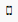

1 Терміни та визначення
------------------------
Електронний цифровий підпис (ЕЦП/КЕП) — електронний цифровий підпис уповноважених осіб та окремий електронний цифровий підпис, що виконує функцію печатки (у разі наявності), з посиленим сертифікатом ключа, наданим акредитованими центрами сертифікації ключів (далі – АЦСК).

2 Авторизація в системі
------------------------
Для авторизації на платформі перейдіть за посиланням https://doc.edi-n.com/auth та введіть свої логін = email і пароль на формі авторизації. Детальна інформація з авторизації міститься в  `«Інструкції з авторизації»`_.

.. _«Інструкції з авторизації»: https://wiki.edi-n.com/ru/latest/services/EDIN_DOCflow/edin_docflow/instruktsia-avtorizatsia.html

3 Налаштування підпису
-----------------------
Для підписання та шифрування документів необхідно, щоб у системі  користувача були зчитані (завантажені) ключі підписів.

**3.1 Зчитування ключа**

Для зчитування ключа перейдіть до розділу «Налаштування ЕЦП/КЕП»:

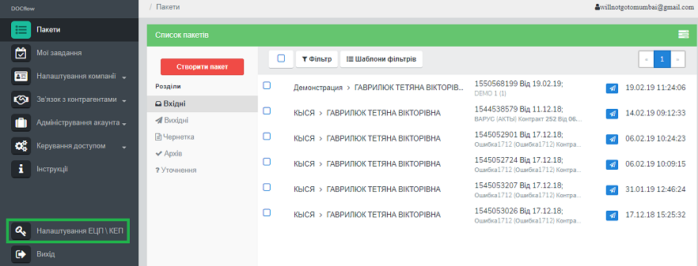

У формі налаштування ключів натисніть іконку |иконка-плюсик| «Зчитати ключі» для зчитування електронного цифрового підпису:

.. image:: pics_instruktsia-nastroyka-ecp/instruktsia_nastroyka_ecp_2.png
   :align: center

Наступним кроком виберіть файл підпису в каталозі на жорсткому диску ПК (чи на іншому носії) та натисніть «Відкрити»:

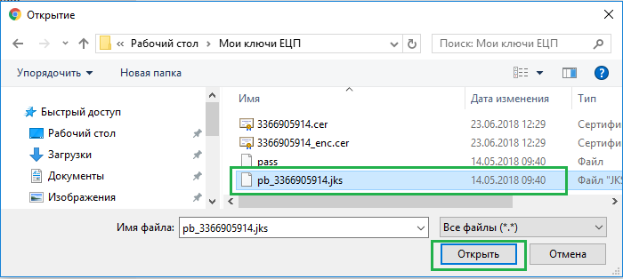

Система відобразить форму  для вибору АЦСК (видавця електронного цифрового підпису) та вводу пароля (до ЕЦП).

До поля «Автовизначення АЦСК» підключений системний довідник з усіма існуючими АЦСК:

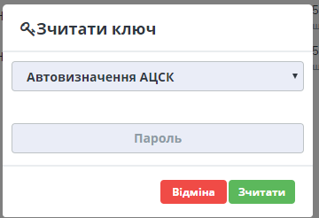

Поряд із вибором акредитованого центру вручну, для спрощення робочого процесу реалізована можливість автоматичного визначення АЦСК. 

Після вибору АЦСК та вводу пароля натисніть «Зчитати». У разі успішного зчитування ЕЦП/КЕП з’явиться відповідне повідомлення: 

Зчитування підписів виконується по черзі, кожен файл підпису зчитується окремо:

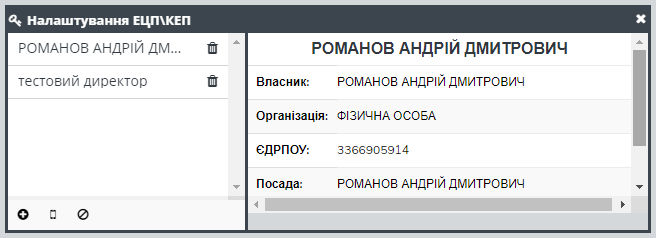

Згідно з політикою безпеки, паролі до ЕЦП/КЕП зберігаються лише упродовж сеансу роботи з браузером. 

**3.2 Активація ЕЦП/КЕП для нової сесії**

При повторному сеансі необхідно активувати ЕЦП/КЕП, вказавши пароль до ключа. Неактивовані ключі на формі налаштування ЕЦП/КЕП виділені сірим кольором та містять іконку |иконка-ключик| ключа біля назви. 

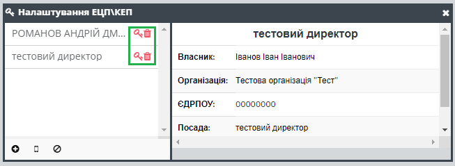

Для активації ключа натисніть на іконку |иконка-ключик|. У формі зчитування ключа поле для вибору АЦСК буде автоматично заповнене значенням, вибраним при зчитуванні ЕЦП/КЕП. Для активації ключа введіть пароль у відповідне поле та натисніть «Зчитати»:

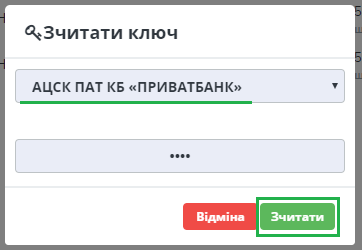

**3.3 Скидання пароля та видалення ключа**

Підписи зберігаються у локальному сховищі браузера. Для скидання пароля зчитаного та активованого ключа завершіть сеанс роботи в браузері або натисніть на іконку |иконка-ведерко| біля необхідного ключа чи на кнопку |иконка-сброс| «Скинути всі ключі».

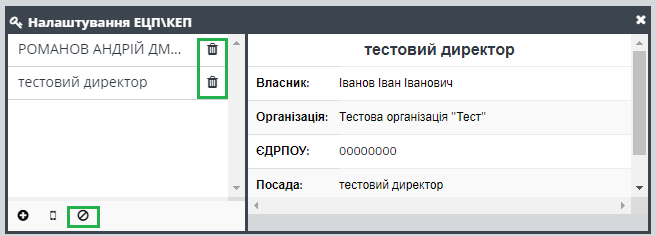

Для остаточного видалення ключів натисніть на іконку |иконка-ведерко| або на кнопку «Скинути всі ключі» для неактивного ключа(ів).

При скиданні ключів необхідно підтвердити дію у відповідному запиті системи. 

4 Налаштування MobileID
------------------------
Для зчитування ключа з допомогою технології MobileID перейдіть до розділу «Налаштування ЕЦП/КЕП». У формі налаштування ключів натисніть на іконку |иконка-мобилка| «Зчитати MobileID»: 

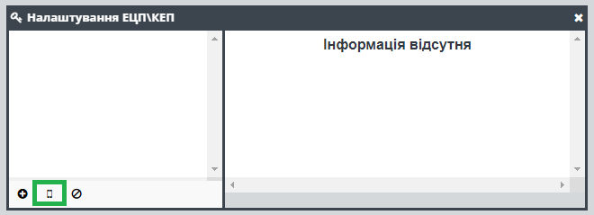

Наступним кроком вкажіть номер телефону у форматі 380 00 000 00 00 та натисніть на кнопку «Зчитати».

.. admonition:: Зверніть увагу!
   Зчитування ЕЦП/КЕП з допомогою технології MobileID реалізовано лише для sim-карт оператора мобільного зв’язку Vodafone. 

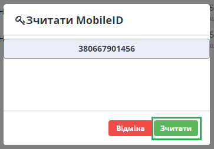

На вказаний номер надійде sms-запит для підтвердження зчитування ключа. Введіть код підтвердження (видається оператором).

Після введення коду система відобразить список сертифікатів  ЕЦП/КЕП, прив’язаних до номера телефону. Оберіть зі списку потрібний електронний підпис, встановивши відмітку навпроти нього, та натисніть «Зчитати»: 

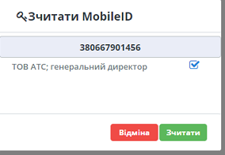

У разі успішного зчитування у формі налаштування ЕЦП/КЕП з’явиться детальна інформація про підпис: 

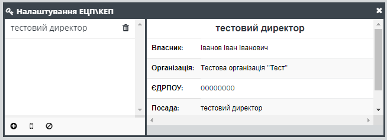

5 Налаштування Апаратного ключа (Токен)
-----------------------------------------------

В сервісі DOCflow реалізована можливість підписання документів використовуючи зовнішній Електронний USB-ключ, токен від виробника ТОВ “Автор” сумісні з АЦСК “Україна”: «Алмаз-1К» та «SecureToken-337М».

Токен – це носій інформації у формі флешки із захистом від несанкціонованого доступу при генерації секретних ключів, зберіганні цифрового підпису та підписанні електронних документів.

При підписанні документа, є можливість вибрати яким Електронний ключем підписати документ - за допомогою налаштованого КЕП/ЕЦП, чи USB-ключем.

Для використання токена, необхідно вставити Електронний USB-ключ у ваш ПК, потім у документі що потребує підписання, натиснути **Підписати**, потім вибрати **Робота з захищеним носієм (Token)**.

Виберіть підпис із списку що відобразиться та натисніть **ОК**.

З використанням апаратного ключа не потрібно проводити жодних налаштувань КЕП/ЕЦП!

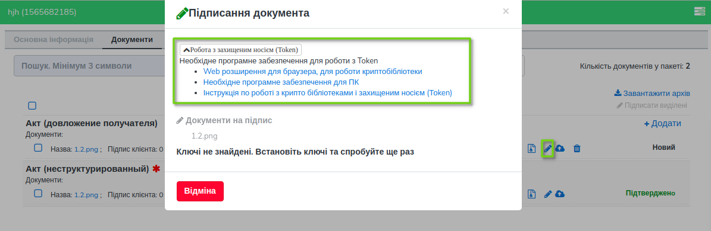

Якщо для роботи із зовнішнім токеном, вам необхідно буде здійснити налаштування й встановити необхідне програмне забезпечення, зявиться підказка:

- Web розширення для браузера, для роботи криптобібліотеки
- Необхідне програмне забезпечення для ПК
- Інструкція по роботі з крипто бібліотеками і захищеним носієм (Тоken)

Усі пункти є робочими посиланнями з необхідною інформацією. Натиснувши **Необхідне програмне забезпечення для ПК** почнеться автоматичне завантаження програми для ПК. Подальші дії детально описані у `«Інструкція по роботі з крипто бібліотеками і захищеним носієм»`_.

.. _«Інструкція по роботі з крипто бібліотеками і захищеним носієм»: https://iit.com.ua/download/productfiles/EUSignWebOManual.pdf

.. include:: kontakti.rst
