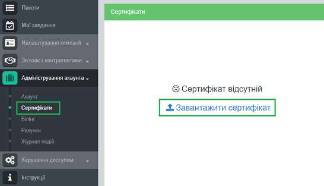
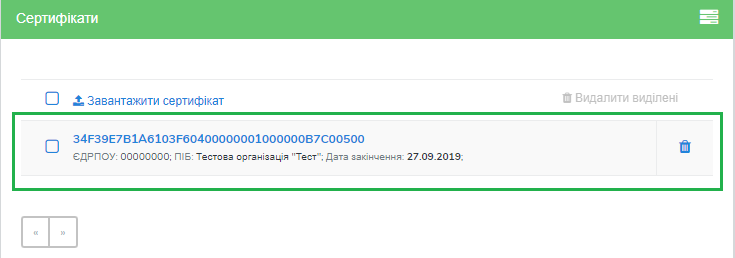
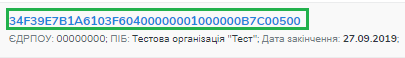
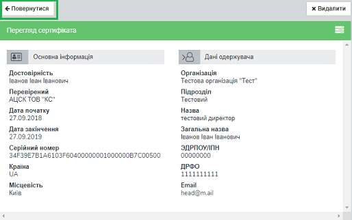
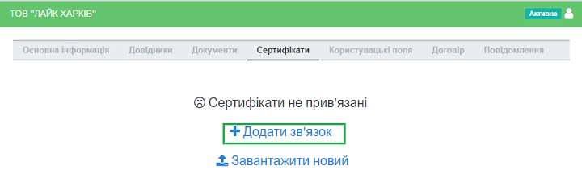
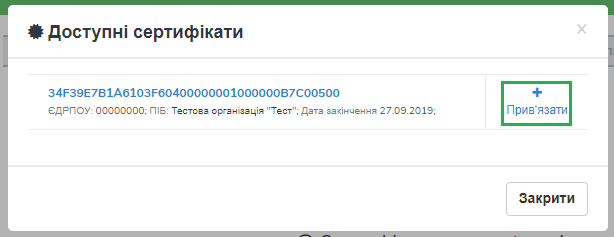
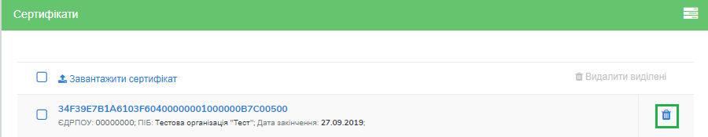
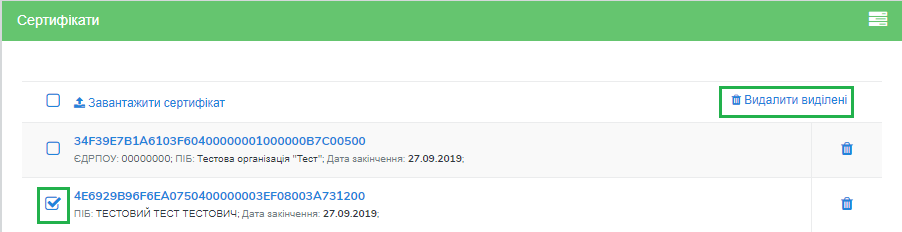
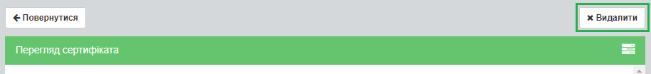

####################################################
Інструкція з налаштування шифрування
####################################################

Дана інструкція описує порядок налаштування сертифікатів для шифрування.

1 Авторизація в системі
------------------------

Для авторизації на платформі перейдіть за посиланням http://doc.edi-n.com/auth та введіть свої логін = email і пароль на формі авторизації. Детальна інформація з авторизації міститься в  `«Інструкції з авторизації»`_.

.. _«Інструкції з авторизації»: https://wiki.edi-n.com/ru/latest/services/EDIN_DOCflow/edin_docflow/instruktsia-avtorizatsia.html

2 Завантажити сертифікат
-------------------------

Для завантаження сертифіката перейдіть до розділу меню «Адміністрування акаунта» – «Сертифікати» та натисніть «Завантажити сертифікат»:

Система повідомить про успішне завантаження, після чого сертифікат з’явиться у переліку
завантажених сертифікатів. За сертифікатом відображатиметься серійний номер, код ЄДРПОУ
організації, назва та дата закінчення дії. Завантаження сертифікатів після закінчення строку їх дії блокується системою.

Для перегляду детальнішої інформації за сертифікатом натисніть на його серійний номер:

Для повернення з форми деталізації до переліку сертифікатів натисніть на кнопку «Назад»:

**2.1 Налаштування зв’язку з сертифікатом**

Для налаштування зв’язку сертифіката з конкретною компанією виберіть на навігаційній панелі меню «Налаштування компанії» – «Мої компанії», відкрийте форму обробки компанії, натиснувши на її назву, та перейдіть до розділу «Сертифікати».
Наступним кроком натисніть «Додати зв’язок» та «Прив’язати», обравши сертифікат з переліку доступних, що відображені системою:

Опція завантажити сертифікат присутня також безпосередньо у формі налаштування зв’язку. Для завантаження сертифіката натисніть «Завантажити сертифікат» або «Завантажити новий».

**2.2 Видалення сертифіката**

Для видалення сертифіката натисніть на кнопку «Кошик» напроти обраного сертифіката:

Для одночасного видалення декількох сертифікатів відмітьте обрані для видалення сертифікати та натисніть кнопку «Видалити виділені»:

Опція видалення доступна також безпосередньо у формі детальної інформації за сертифікатом:

