####################################################
Інструкція з налаштування структурованого документа 
####################################################	

Дана інструкція описує налаштування та порядок роботи з структурованим документом. 

-------------------------

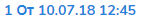
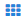

1 Авторизація в системі
------------------------
Для авторизації на платформі перейдіть за посиланням https://doc.edi-n.com/auth та введіть свої логін = email і пароль на формі авторизації. Детальна інформація з авторизації міститься в  `«Інструкції з авторизації»`_.

.. _«Інструкції з авторизації»: https://wiki.edi-n.com/ru/latest/services/EDIN_DOCflow/edin_docflow/instruktsia-avtorizatsia.html

2 Налаштування структурованого документа 
------------------------------------------
У межах документообігу EDIN-DOCflow, поряд із неструктурованими (звичайними) документами, реалізована можливість передачі структурованих (XML) документів у пакеті. Визначення типу документа як структурованого відбувається на етапі налаштування типів документів у межах компанії.   

Для налаштування структурованого документа перейдіть в меню «Налаштування компанії» – «Мої  компанії» та оберіть потрібну компанію зі списку, натиснувши на її назву. У формі редагування, що відкриється, перейдіть до вкладки «Документи». Вкладка містить вже закріплені за компанією типи документів. Для додання нового документа з ознакою «Структурований» натисніть на кнопку «Додати»: 

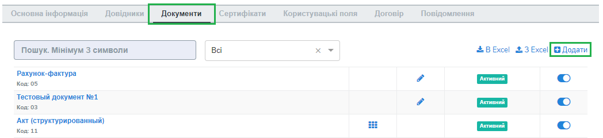

У формі додання типу документа заповніть обов’язкові поля: 

 - Назва – поле призначене для введення літер, цифр або спеціальних символів, мінімальна кількість знаків – три

 - Код - поле призначене для введення літер, цифр або спеціальних символів, мінімальна кількість знаків – один. Значення, введене в поле «Код», має бути унікальним у межах компанії. У разі введення значення, що вже використовується, система відобразить відповідне повідомлення. 

Наступним кроком встановіть відмітку напроти типу документа, а саме «Структурований», і натисніть «Зберегти»:

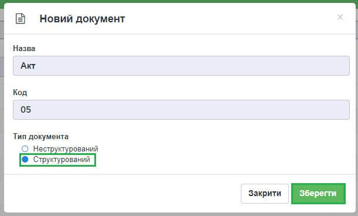

Документ буде збережено та відображено в переліку типів документів з позначкою «Структурований» |иконка-кубик|:

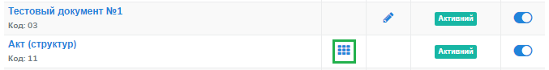

Для редагування назви або коду типу документа натисніть на його назву у загальному переліку, внесіть потрібні зміни та натисніть «Зберегти».

**2.1 Опис (налаштування) структури документа**
 
Для опису і зберігання структури документа використовується текстовий формат JSON. Параметри, що прописуються у налаштуваннях структури, визначають порядок відображення на web-формі елементів структури документа і правила їх заповнення.
 
При описі структурованого документа використовуються певні типи даних, кожен з яких є окремим типом елемента і описується у вигляді окремої структури зі своїм переліком параметрів, наприклад:

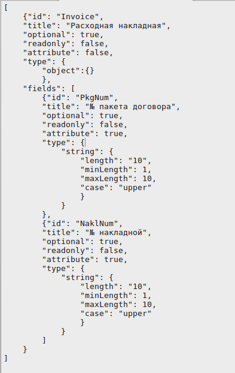

Основні параметри, що використовуються при описі структурованого документа:

 - **id** — ідентифікатор елемента, назва елемента в документі XML_.

 - **title** — назва елемента на web-формі при заповненні документа 

 - **readonly** (true / false) — визначає можливість редагування відповідного елемента структури

 - **attribute** (true / false) — при встановленому параметрі відповідний елемент є атрибутом в XML-файлі, при невстановленому — тегом

 - **optional** (true / false) — визначає обов'язковість заповнення поля

 - **type** — спеціальна секція для визначення типу елемента

 - **data** — спеціальна секція для визначення заповнення елемента певними значеннями, посиланнями на об'єкти плафторми, тощо

 - **fields** — спеціальна секція для опису масиву полів для типів елементів object і array

 - **function** — function - задана функція виконання вибірки з довідника або математичних операцій по вже введеним інших полях документа (функції updateDictLink і arithmeticOperate) 

.. XML_

.. admonition:: Зверніть увагу!

   Імена елементів у структурі XML повинні дотримуватись наступних правил написання імен:
   
   - Імена можуть містити літери, цифри та інші символи, але,
   - Імена *не* можуть починатися з цифри або символу пунктуації
   - Імена *не* можуть починатися з поєднання "xml" (або XML, або Xml і т.п.)
   - Імена *не* можуть містити пробіли

Кожен тип елемента описується у вигляді окремої, особливої структури зі своїм переліком параметрів. На поточний момент реалізовані наступні типи:

 - **рядок (string)** - дозволяє зберігати текстові значення
 - **число (number)** - дозволяє зберігати числові значення зі знаком і розділювач дробової частини, кількість цифр після коми 
 - **дата (date)** - дозволяє зберігати дату без часу
 - **час (time)** - дозволяє зберігати час
 - **перелік (enum)** - дозволяє задати список значень з можливістю вибору одного значення
 - **об'єкт (object)** - дозволяє вказати елемент, який є вузлом, структурою зі своїми полями
 - **масив (array)** - дозволяє вказати елемент, який є таблицею або масивом значень зі своїми полями

Таблиця 1 - Типи даних (типи елементів) із параметрами, що застосовуються при описі структурованого документа:

+--------+----------+------------------------------------------------------+-----------------------------------------------------------------------------+---------------------------------------------------------+
|  Тег   | Значення |                         Опис                         |                                  Параметр                                   |                         Приклад                         |
+========+==========+======================================================+=============================================================================+=========================================================+
| string | рядок    | Для внесення  і збереження                           | minLength —  мінімальна кількість символів не меньше 1;                     | "string": {                                             |
|        |          | текстових значень                                    |                                                                             |                                                         |
|        |          |                                                      | maxLength — максимальна кількість символів не більше 9999;                  | "minLength": 1,                                         |
|        |          |                                                      |                                                                             |                                                         |
|        |          |                                                      | regexp — регулярний вираз                                                   | "maxLength": 10,                                        |
|        |          |                                                      |                                                                             |                                                         |
|        |          |                                                      | case (реєстр) — визначає, в якому                                           | "regexp": "....",                                       |
|        |          |                                                      | реєстрі використовувати рядок (upper, lower, camel)                         |                                                         |
|        |          |                                                      |                                                                             | "case": "upper│lower│camel"                             |
|        |          |                                                      |                                                                             |                                                         |
|        |          |                                                      |                                                                             | },                                                      |
+--------+----------+------------------------------------------------------+-----------------------------------------------------------------------------+---------------------------------------------------------+
| number | число    | Для внесення  і збереження                           | type (тип) — позитивне / негативне;                                         | "number": {                                             |
|        |          | числових значень                                     |                                                                             |                                                         |
|        |          |                                                      | decimal (дріб) — вказується кількість цифр після коми                       | "type": "positive│negative",                            |
|        |          |                                                      | (для дробів)                                                                |                                                         |
|        |          |                                                      |                                                                             | "decimal": 3                                            |
|        |          |                                                      |                                                                             |                                                         |
|        |          |                                                      |                                                                             | },                                                      |
+--------+----------+------------------------------------------------------+-----------------------------------------------------------------------------+---------------------------------------------------------+
| date   | дата     | Для внесення  і збереження дати,                     | format — вказується формат дати, где Y - рік, M - місяць, D - день          | "type": {                                               |
|        |          | без позначки часу                                    |                                                                             | "date": {                                               |
|        |          |                                                      |                                                                             | "format": "DD.MM.YYYY"                                  |
|        |          |                                                      |                                                                             | }                                                       |
+--------+----------+------------------------------------------------------+-----------------------------------------------------------------------------+---------------------------------------------------------+
| time   | час      | Для внесення  і збереження часу                      | format — вказується формат часу, де H - година, M - хвилина, S - секунда;   | "type": {                                               |
|        |          |                                                      | при цьому H використовується для 24-годинного формату, h - для 12-годинного |                                                         |
|        |          |                                                      |                                                                             | "time": {                                               |
|        |          |                                                      |                                                                             |                                                         |
|        |          |                                                      |                                                                             | "format": "HH:MM:SS"                                    |
|        |          |                                                      |                                                                             |                                                         |
|        |          |                                                      |                                                                             | }                                                       |
+--------+----------+------------------------------------------------------+-----------------------------------------------------------------------------+---------------------------------------------------------+
| enum   | перелік  | Для внесення  і збереження списку                    | value (значення) — значення, яке буде додане в тег;                         | "enum": [                                               |
|        |          | значень із можливістю вибору одного значення         | name (назва) — назва значення                                               |                                                         |
|        |          |                                                      |                                                                             | {                                                       |
|        |          |                                                      |                                                                             |                                                         |
|        |          |                                                      |                                                                             | "value": "Значение которое будет добавлено в документ", |
|        |          |                                                      |                                                                             |                                                         |
|        |          |                                                      |                                                                             | "name": "Название значения"                             |
|        |          |                                                      |                                                                             |                                                         |
|        |          |                                                      |                                                                             | }                                                       |
|        |          |                                                      |                                                                             |                                                         |
|        |          |                                                      |                                                                             | ]                                                       |
+--------+----------+------------------------------------------------------+-----------------------------------------------------------------------------+---------------------------------------------------------+
| object | об'єкт   | Для позначення елемента, який є структурою зі        |                                                                             | "type": {                                               |
|        |          | своїми полями                                        |                                                                             | "object": {}                                            |
|        |          |                                                      |                                                                             | },                                                      |
+--------+----------+------------------------------------------------------+-----------------------------------------------------------------------------+---------------------------------------------------------+
| array  | масив    | Для позначення елемента, який є таблицею або масивом | minLength —  мінімальна кількість рядків не менше 1;                        | "array": {                                              |
|        |          | значень зі своїми полями                             |                                                                             | "minLength": 1,                                         |
|        |          |                                                      | maxLength — максимальна кількість рядків не более 9999;                     | "maxLength": 10                                         |
|        |          |                                                      |                                                                             | },                                                      |
+--------+----------+------------------------------------------------------+-----------------------------------------------------------------------------+---------------------------------------------------------+

Секція **data** описує правила і можливості щодо заповнення елемента.

Таблиця 2 - Структура секції data:

+----------+-------------------------------------------------------------------------------------------------------------------------------------------------------------------------------+--------------------------------------------------------------------------------------------+
|   Тег    |                                                                                     Опис                                                                                      |                                          Приклад                                           |
+==========+===============================================================================================================================================================================+============================================================================================+
| index    | В даному параметрі вказується індекс (ID) рядка для масиву                                                                                                                    | "index": 0                                                                                 |
|          | значень, нумерація починається з 0                                                                                                                                            |                                                                                            |
+----------+-------------------------------------------------------------------------------------------------------------------------------------------------------------------------------+--------------------------------------------------------------------------------------------+
| template | В параметрі задається шаблон даних для відповідного елемента                                                                                                                  | "template": "Простий текст з використанням функції отримання поточної дати з форматуванням |
|          | документа. Якщо даний параметр заповнено, елемент документа                                                                                                                   | #sys.currentDate│convertDate:'yyyy-mm-dd'#                                                 |
|          | недоступний для редагування користувачем. В шаблоні поряд із                                                                                                                  |                                                                                            |
|          | текстом реалізовані наступні можливості:                                                                                                                                      |                                                                                            |
|          |                                                                                                                                                                               |                                                                                            |
|          | - посилання на системну функцію                                                                                                                                               |                                                                                            |
|          | - посилання на поле з документа чи з пакета                                                                                                                                   |                                                                                            |
|          | - посилання на прикріплений до пакета довідник                                                                                                                                |                                                                                            |
|          | - посилання на описаний вище елемент документа                                                                                                                                |                                                                                            |
|          | - використання функцій-модифікаторів                                                                                                                                          |                                                                                            |
|          |                                                                                                                                                                               |                                                                                            |
|          |                                                                                                                                                                               |                                                                                            |
|          | Посилання позначається символами ##. Формат опису посілань - див. для параметра ref                                                                                           |                                                                                            |
|          |                                                                                                                                                                               |                                                                                            |
|          | Для введення модифікатора в опис посилання використовується                                                                                                                   |                                                                                            |
|          | символ "│" (вертикальний слеш), після якого йде опис функції-                                                                                                                 |                                                                                            |
|          | модифікатора з атрибутами.                                                                                                                                                    |                                                                                            |
|          | Якщо даний параметр заповнений, елемент документа не редагується користувачем і завжди буде з типом "рядок" незалежно від того, що зазначено в секції type.                   |                                                                                            |
|          |                                                                                                                                                                               |                                                                                            |
|          |                                                                                                                                                                               |                                                                                            |
|          |                                                                                                                                                                               |                                                                                            |
|          |                                                                                                                                                                               |                                                                                            |
+----------+-------------------------------------------------------------------------------------------------------------------------------------------------------------------------------+--------------------------------------------------------------------------------------------+
| ref      | В параметрі вказується посилання, за яким встановлюється значення для елемента документа. На відміну від шаблона, в даному параметрі можливо дати посилання лише на 1 об'єкт. | "ref": "sys.currentDate"                                                                   |
|          | При цьому використовуються наступні префікси:                                                                                                                                 |                                                                                            |
|          |                                                                                                                                                                               | "ref": "pack.senderCompany.companyId"                                                      |
|          | - **sys** - при посиланні на системну функцію                                                                                                                                 |                                                                                            |
|          | - **pack** - при посиланні на поле з пакета                                                                                                                                   | "ref": "dict.1"                                                                            |
|          | - **xml** - при посиланні на тег документа                                                                                                                                    |                                                                                            |
|          | - **dict** - и посиланні на довідник із зазначенням ID довідника (dict.14)                                                                                                    |                                                                                            |
|          | - **user** - при посиланні на дані користувача із зазначенням поля з даних користувача (user.fio)                                                                             |                                                                                            |
|          | - **doc** - при посиланні на поле з документа                                                                                                                                 |                                                                                            |
|          | - **extra** - при посиланні на користувацьке поле із зазначенням ID поля (extra.12)                                                                                           |                                                                                            |
|          |                                                                                                                                                                               |                                                                                            |
|          | Реалізовані системні функції:                                                                                                                                                 |                                                                                            |
|          |                                                                                                                                                                               |                                                                                            |
|          | - currentDate - отримання поточної дати і часу                                                                                                                                |                                                                                            |
|          | - replaceSpace - заміна пробілів у текстовому значенні                                                                                                                        |                                                                                            |
+----------+-------------------------------------------------------------------------------------------------------------------------------------------------------------------------------+--------------------------------------------------------------------------------------------+
| default  | Параметр для введення довільного тексту в якості значення, без посилань та функцій                                                                                            | "default": "Простий текст"                                                                 |
+----------+-------------------------------------------------------------------------------------------------------------------------------------------------------------------------------+--------------------------------------------------------------------------------------------+
| Function | задана функція виконання вибірки даних з довідника або для  математичних операцій по вже введеним іншим полях документа (**updateDictLink** і **arithmeticOperate**)          | "function": "$                                                                             |
|          |                                                                                                                                                                               | updateDictLink                                                                             |
|          | Початок і кінець оголошення функції обрамляється символом **$**. Функції можливо записувати послідовно, наприклад, $функція1$$функція2$.                                      | ('Акт.Послуги[@index].Код'                                                                 |
|          | Також у функціях при вказівці шляхів задається індекс **[@index]** елемента масиву, в якому викликається ф-ція:                                                               |                                                                                            |
|          |                                                                                                                                                                               |                                                                                            |
|          | - [2] - фіксоване значення індексу (індексація починається з "0")                                                                                                             | "function": "$                                                                             |
|          | - [-1] - операція буде виконана над усіма елементами масиву.                                                                                                                  | arithmeticOperate                                                                          |
|          |                                                                                                                                                                               | ('Акт.Послуги[@index].Сума',                                                               |
|          |                                                                                                                                                                               | 'Акт.Послуги[@index].Кількість', '*', 'Акт.Послуги[@index].Ціна')$"                        |
+----------+-------------------------------------------------------------------------------------------------------------------------------------------------------------------------------+--------------------------------------------------------------------------------------------+

**Функції**:

1. **updateDictLink** - здійснює вибірку з довідника за шаблоном: ``$updateDictLink('Акт.Послуги[2].Код', 'code')$``, де

- ``Акт.Послуги[2].Код`` - маршрут до поля, яке потрібно заповнити code зі довідника;
- ``code`` - поле значення довідника, з якого потрібно взяти значення.

Якщо тип даних (array) і функція вказана в полі **data** - то вона буде працювати тільки для зазначеного елемента масиву, наприклад:

.. code-block:: rst

   "data": [
        {
          "index": 1,
          "ref": "dict.10",
         **"function": "$updateDictLink('Акт.Послуги[1].Код', 'code')$"**
        }
    ]

*Пояснення до прикладу:* при зміні в першому елементі масиву **"index": 1** поля **"id": "Назва"**, буде виконана функція
**$ UpdateDictLink ('Акт.Послугі [1] .Код', 'code') $** "яка запише в поле **Акт.Послуги [1].Код** значення **code** із довідника.

Якщо функція вказана в самому вузлі **field**, то вона буде працювати для кожного елемента масиву, також якщо маршрут вказати наступним чином **'Акт.Послуги [@index] .Код'**, то він буде посилатися на той же елемент масиву, в якому функція була викликана, наприклад:

.. code-block:: rst

     "fields": [
    {
      "id": "Назва",
      "title": "Найменування робіт, послуг",
      "optional": false,
      "readonly": false,
      "attribute": true,
      "data": [
        {
          "index": -1,
          "ref": "dict.10"
        }
      ],
     **"function": "$updateDictLink('Акт.Послуги[@index].Код', 'code')$"**,
      "type": {
        "enum": []
      }
    }]

2. **arithmeticOperate** - виконує математичні операції по вже введених інших полях. Шаблон: ``$arithmeticOperate(resultPath: string, sourcePath1: string, operationType: string, sourcePath2: string)$``, де

- ``resultPath`` - шлях до елементу структурованого документа в який потрібно записати результат;
- ``sourcePath1`` - шлях до елементу структурованого документа в якому міститься перший аргумент для арифметичної операції;
- ``operationType`` - вид операції, можливі значення "+", "-", "/", "*";
- ``sourcePath2`` - шлях до елементу структурованого документа в якому міститься другий аргумент для арифметичної операції (sourcePath2 може бути відсутнім);

.. admonition:: Зверніть увагу!

   Важливо! У разі, якщо схема документа створена з використанням типу даних **enum**, для відображення значень довідника в структурованому документі необхідно вказати **"type": {"enum": []}}**.

Для завантаження (внесення) опису структури документа натисніть на іконку «Структурований»:

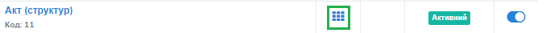

У формі, що відкриється, натисніть на кнопку «Додати»:

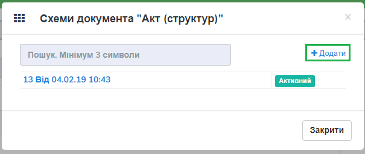

Наступним кроком введіть опис структури документа у форматі JSON, оберіть кодування xml для документа і натисніть «Зберегти»:

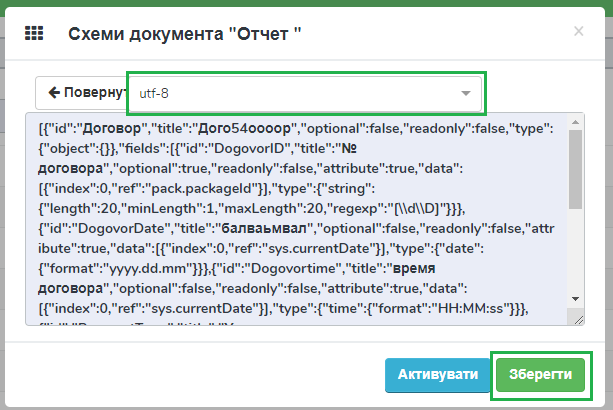

Система повідомить про успішне збереження відповідним повідомленням. Під час збереження опису структури відбувається перевірка валідності внесених даних на відповідність формату JSON та перевірка на дублі. 

Перевірка елементів структурованого документа при збереженні:

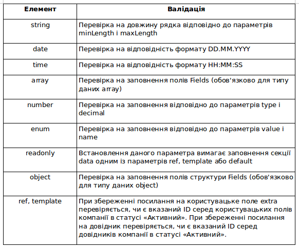

У разі внесення не коректних даних кнопка «Зберегти» не активується. При внесенні дублюючого опису користувачеві буде відображене відповідне повідомлення. Перевірка на дублі виконується у межах компанії. 

Збереження опису структури відбувається по версіях створення. Номер версії присвоюється автоматично. Система також фіксує дату та час модифікації кожної версії. 

Під версією мається на увазі збереження певної модифікації опису структури. Система передбачає можливість роботи з різними модифікаціями одного типу документа за рахунок активації тієї чи іншої версії структури даних. Не активована схема зберігається у статусі «Чернетка». 

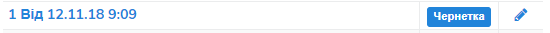

Схема у статусі «Чернетка» доступна для редагування. Для переходу у режим редагування натисніть на номер версії |иконка-дата|  або на кнопку «Редагувати». Для активації певної версії структури натисніть «Активувати» у формі редагування опису даних:

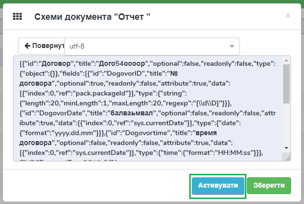

Для зручності у формі додання версій реалізований пошук за номером і датою. Для старту пошуку введіть початкові символи у пошукове поле:  

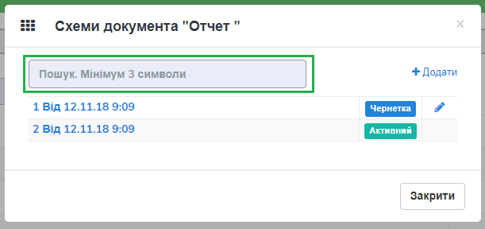

.. admonition:: Зверніть увагу!

   У статусі «Активний» і «Чернетка» може бути лише одна версія структури. 

3 Налаштування зв’язку структурованого документа з типом пакета
----------------------------------------------------------------
Налаштування виконується на загальних підставах. Детальний опис процедури в пункті 8 `«Інструкції бізнес-адміністратора»`_.

.. _«Інструкції бізнес-адміністратора»: https://wiki.edi-n.com/ru/latest/services/EDIN_DOCflow/edin_docflow/instruktsia-biznes-administratora.html

4 Заповнення структурованого документа
---------------------------------------- 
Форма заповнення структури відкривається при доданні документа з ознакою «структурований» до пакета. Для цього перейдіть в меню «Пакети», вкладка «Документи», і натисніть «Додати»:

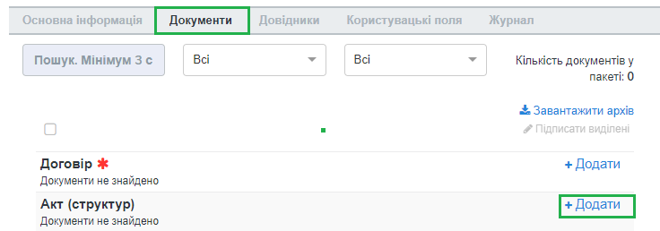

Після цього відкриється форма для заповнення структурованого документа, складена відповідно до опису його структури. 

Елементи структури документа відображаються послідовно, у порядку, заданому в налаштуваннях структури. При цьому типи елемента (секції) відображаються у вигляді окремих структур, складові компоненти яких розташовуються горизонтально по три в ряд. Назва структури (типу елемента) виділяється жирним шрифтом:  

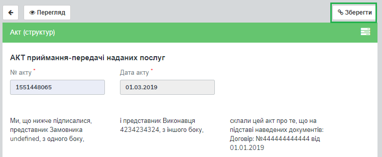

Заповніть поля документа і натисніть кнопку «Зберегти». Для повторного перегляду збереженого структурованого документа в пакеті натисніть на іконку |иконка-кубик| напроти документа: 

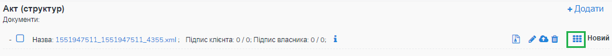

5 Блокування типу документа
-----------------------------
Для блокування типу документа оберіть потрібний тип з переліку закріплених  за компанією, меню «Налаштування компанії» – «Мої компанії» – «Документи», та  переведіть перемикач у положення «Заблокувати»:  

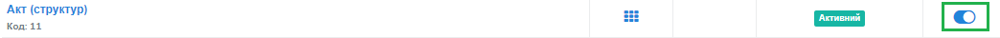

Тип документа буде переведений у статус «Заблокований». Даний статус блокує використання типу документа у будь-яких операціях з моменту призначення статусу. 
