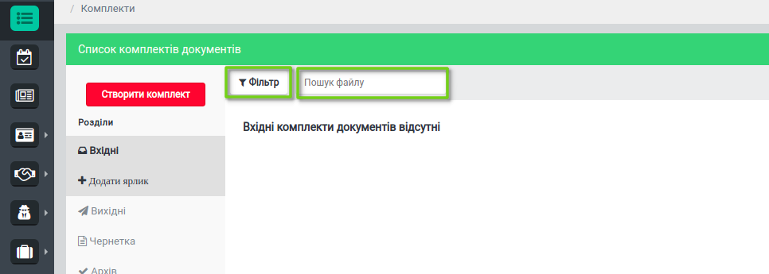
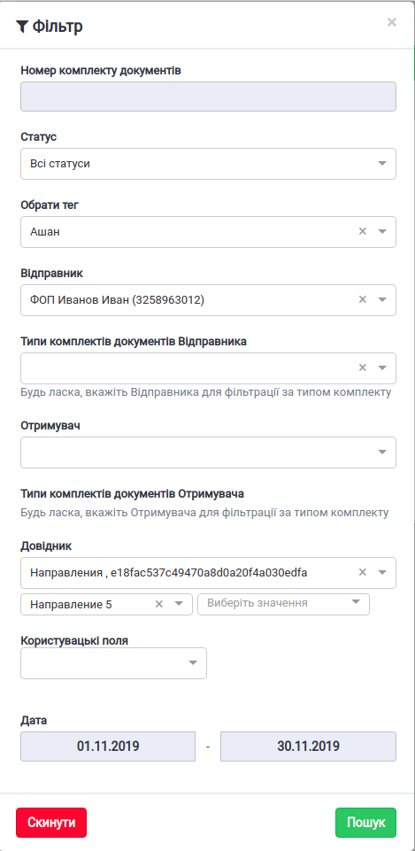
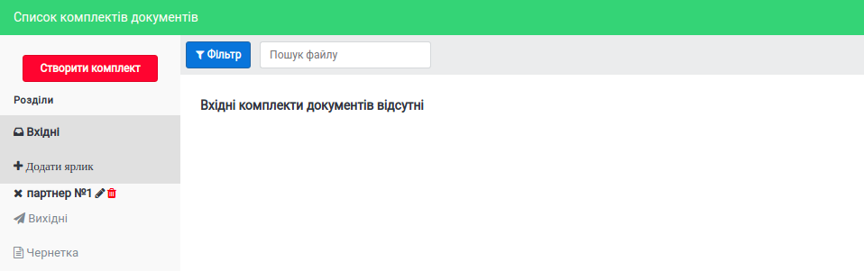
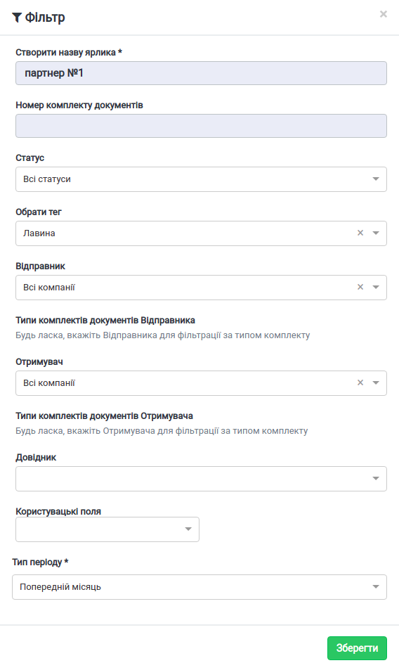
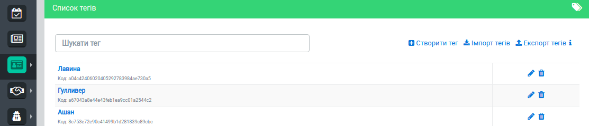
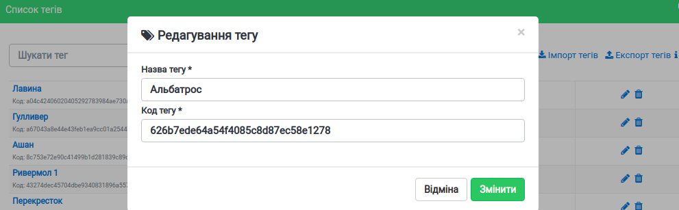
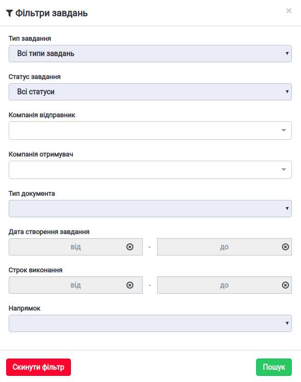
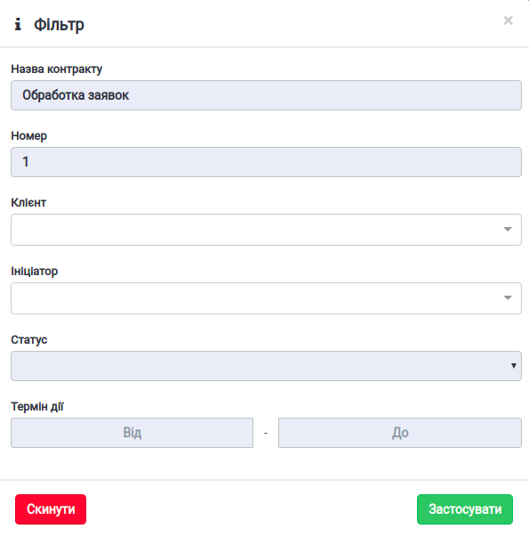
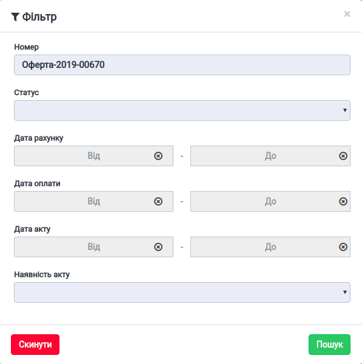
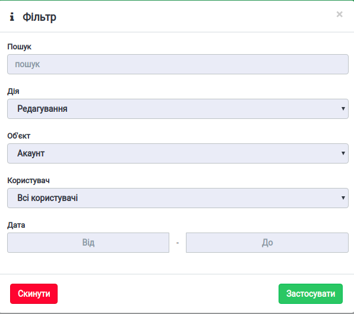

####################################################
Інструкція користування пошуком та фільтрами
####################################################

---------

.. contents:: Зміст:
   :depth: 2

---------

Дана інструкція описує порядок дій користувачів для здійснення пошуку або користування фільтрами на платформі. У кожного розділу, де наявні фільтри та пошук, є свої ообливості та правила, яких потрібно притримуватися для коректного пошуку та фільтрації.

Пошук у розділі Зовнішні комплекти документів
-------------------------------------------------

Для здійснення пошуку файлу за назвою, необхідно у полі **Пошук файлу** ввести назву файлу. Для пошуку необхідно ввести мінімум **4 символа**. При пошуку не повинно бути зайвих пробілів до чи після запиту!

    Назва файлу - це назва прикладеного документу, назва відображається при Завантаженні файлів документів, також можна переглянути назву файлу всередині комплекту у вікні *Документи*.

Для розширеного пошуку за іншими параметрами, використовуйте функціонал **Фільтр**.

У формі **Фільтр** шукайте конкретний комплект у правильному вибраному розділі. Тобто, у розділі *Вхідні* пошук можливий лише серед вхідних комплектів документів, відповідно у розділі *Вихідні* пошук можливий лише серед відправлених вихідних комплектів.

Доступні наступні поля для фільтрації:

- Номер комплекту документів
- Статус (Надіслано, Прийнято, Додано документ)
- Обрати тег
- Відправник
- Типи комплектів документів Відправника (комплекти налаштовані для компаніх у меню Налаштування комплектів документів, поле доступно лише якщо вибрано Відправника)
- Отримувач та 
- Типи комплектів документів Отримувача (поле доступно лише якщо вибрано Отримувача)
- Довiдник ( якщо у довідника є Значення, потрібно заповнити значення)
- Користувацькi поля
- Дата

Будьте уважні! Залежно від напрямку (Вхідні чи Вихідні) Відправник та Отримувач відображається по різному - у розділі Вхідні для поля Відправник вибирається контрагент, а у розділі Вихідні - Відправником виступають ваші власні компанії.

Для пошуку за тегами необхідно вибрати з випадаючого списку тег за яким ви шукаете комплект. Головна умова - тег повинен бути створений раніше, а також доданий до комплекту документів або до контракту з партнером.

Для пошуку за вибраними фільтрами обов'язково натисніть кнопку **Пошук**. Пошук здійсниться лише по заповненим параметрам - тобто, якщо заповнити лише поле Відправник, відобразиться вся вибірка типів комплектів цього Відправника.

Якщо ви бачите повідомлення "*Комплекти документів відсутні*", це означає що за заданими параметрами пошуку немає вхідних чи вихідних комплектів (залежно від того в якому розділі ви знаходитеся). 
Спробуйте перевірити введені дані та ,можливо, змінити деякі параметри пошуку.

Коли фільтр активний, кнопка Фільтр відображається у синьому кольорі та на сторінці відображенно лише дані за вибіркою.

Для відображення усіх комплектів обов'язково натисніть у фільтрах кнопку **Скинути**.

У розділах Вхідні, Вихідні та Чернетки можливо створити ярлик, тобто постійний пошуковий запит за допомогою кнопки **Додати ярлик** та заповнивши поля фільтру для ярлика. 

Обов'язкові поля для збереження ярлика:

- Створити назву
- Вибрати Тип періоду (поточний місяць, попередній місяць, фіксована дата або поточна дата мінус N-днів - вказується кількість днів).

Опціональні поля для ярлика:

- Номер комплекту документів
- Статус
- Тег
- Відправник та Типи комплектів документів Відправника (доступно лише якщо вибрано відправника)
- Отримувач та Типи комплектів документів Отримувача (доступно лише якщо вибрано отримувача)
- Довiдник та Значення
- Користувацькi поля

Створення та додавання тегів
^^^^^^^^^^^^^^^^^^^^^^^^^^^^^^^^^^
Налаштуйте зручний пошук комплектів за індивідуальними тегами. Ви можете додати тег до комплекту документів у будь-якому статусі - теги видимі лише вам.

Для початку створіть унікальні теги у меню *Налаштування компанії* - *Керування тегами*. 
Для цього натисніть **Створити тег** та придумайте назву, унікальний код тегу сформується автоматично. 

Додавайте теги при створенні або редагуванні комплекту або присвойте контракту при створенні або редагуванні.

Пошук за тегами можливий лише у **Фільтрі** у розділі *Зовнішні комплекти документів*, якщо тег додано або до контракту або до комплекту.

Мої завдання
-------------------------------
Якщо ви входите до групи виконавців узгодження комплектів або внутрішніх документів, знайти конкретне завдання серед списку вам допоможуть **Фільтри завдань**.

Пошук можливий за такими ,полями:

- Тип завдання - Узгодження; Підписання; Повідомлення;
- Статус завдання - До виконання, Виконано, Відхилено, Прострочена;
- Компанія відправник
- Компанія отримувач
- Тип документа - можливо вибрати серед тих типів, які є серед доданих до завдань;
- Дата створення завдання
- Строк виконання
- Напрямок - Вхідні або Вихідні завдання

Для пошуку за вибраними фільтрами обов'язково натисніть кнопку **Пошук**.

Для відображення усіх завдань обов'язково натисніть у фільтрах кнопку **Скинути**.

Взаємодія з Партнерами - Контракти
-------------------------------------
Контракт - спеціальний договір, форма зв’язку між партнерами, згідно з якою відбувається обмін комплектами документів. У контракті визначається перелік вхідних та вихідних (по відношенню до власника контракту) типів комплектів та довідники.
Власник контракту – ініціатор процесу обміну комплектами та є відправником контракту.

Пошук контракту, спеціального договору з партнером, можна знайти за такими полями:

- Назва контракту - відображається у стовбці *Назва контракту*, та у контракті в блоці *Дані*
- Номер - номер контракту, що відображається у контракті в блоці *Дані*
- Клієнт - той хто отримав контракт, пошук за компанією, для розділів Вхідні та Вихідні відображаються різні компанії; 
- Ініціатор - той хто надіслав контракт; власник контракту;
- Статус -  Новий; Прийнятий; Відхилений; Розірваний; Очікує підписання;
- Термін дії

У розділах Вхідні та Вихідні контракти поля Клієнт та Ініціатор відрізняються - відображаються або внутрішні компанії або партнери, так як у вихідних контрактах власником-ініціатором є наші внутрішні компанії (що відображаються у меню Мої компанії).

Якщо ви бачите повідомлення "*Контракти не знайдені*", це означає що за заданими параметрами пошуку немає вхідних чи вихідних контрактів (залежно від того в якому розділі ви знаходитеся). 
Спробуйте перевірити введені дані та можливо змінити деякі параметри пошуку. Перевірте введені дані на наявність зайвих пробілів.

Для пошуку за вибраними фільтрами обов'язково натисніть кнопку **Застосувати**.

Для відображення усіх контрактів обов'язково натисніть у фільтрах кнопку **Скинути**.

Особистий кабінет - Рахунки та Журнал подій
--------------------------------------------

У розділі Рахунки у вигляді таблиці відображені всі рахунки та акти по компаніях акаунта із виведенням такої інформації як Номер рахунку, Дата здійснення рахунку, Сума рахунку та Період оплати.

Для пошуку конкретного рахунку, або віведення рахунків лише за певний період часу скористайтеся фільтрами.

Фільтр Рахунки дозволяє пошук за такими полями:

 - Номер
 - Статус (оплачений / неоплачений)
 - Дата рахунку
 - Дата оплати
 - Дата акту
 - Наявність акту (акт сформовано/ не сформовано)

У поле **Номер** введіть точну та повну назву рахунку, відображену в стовбці *Номер рахунку*.  Перевірте введені дані на наявність зайвих пробілів.

Для пошуку за вибраними фільтрами обов'язково натисніть кнопку **Пошук**.

Для відображення усіх контрактів обов'язково натисніть у фільтрах кнопку **Скинути**.

Журнал подій містить інформацію щодо змін і коментарів до документів та комплектів

Фільтр у Журналі подій

- Пошук
- Дія
- Об'єкт
- Користувач
- Дата

Для пошуку за вибраними фільтрами обов'язково натисніть кнопку **Застосувати**.

Для відображення усіх завдань обов'язково натисніть у фільтрах кнопку **Скинути**.

.. include:: kontakti.rst
