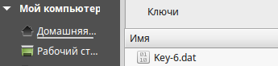

####################################################
Подписание документов ЭЦП на web-платформе
####################################################

---------

.. contents:: Содержание:

---------

Подписание документа на web-платформе
==========================================

Для подписания документов на Web-платформе, необходимо открыть нужный юридически значимый документ и нажать кнопку **«Подписать»**.

Для первичной настройки ЭЦП, дождитесь загрузки страницы, а затем нажмите кнопку **“Считать ключи”**.

.. image:: pics_Podpisanie_dokumentov_ECP_na_web-platofrme_EDIN/pics_Podpisanie_dokumentov_ECP_na_web-platofrme_EDIN_02.png
   :align: center

Затем, в блоке настройки ЭЦП, нажмите на изображение ключа и выберете из каталога, в котором хранятся ваши секретные ключи, соответствующий файл.

Виды файлов электронно-цифровой подписи
================================================

Если Вы используете ключи от **АЦСК “Украина”**, файлы подписей секретных ключей имеют расширение **.ZS2**, и следующие значения в именах файлов:

* Директор «DS»
* Бухгалтер «BS»
* Сотрудник «SS»
* Печать «S»
* Шифрование «C»
* Универсальный ключ печати и шифрования «U»

.. image:: pics_Podpisanie_dokumentov_ECP_na_web-platofrme_EDIN/pics_Podpisanie_dokumentov_ECP_na_web-platofrme_EDIN_04.png
   :align: center

Если Вы используете ключи от **АЦСК “ПриватБанк”**, файлы подписей секрентных ключей имеют расширение **.jks**.

.. image:: pics_Podpisanie_dokumentov_ECP_na_web-platofrme_EDIN/pics_Podpisanie_dokumentov_ECP_na_web-platofrme_EDIN_05.png
   :align: center

Если Вы используете ключи от любых других АЦСК, файлы подписей секрентных ключей имеют наименование **Key-6.dat**.

После выбора секретных ключей, введите пароли под каждым из них, а затем нажмите кнопку **“Считать ключи”**.

.. image:: pics_Podpisanie_dokumentov_ECP_na_web-platofrme_EDIN/pics_Podpisanie_dokumentov_ECP_na_web-platofrme_EDIN_07.png
   :align: center

При корректном считывании ключей, в блоке **“ЭЦП”** появится информация о владельцах ключей. После проверки информации нажмите кнопку **“Подписать”**.

.. image:: pics_Podpisanie_dokumentov_ECP_na_web-platofrme_EDIN/pics_Podpisanie_dokumentov_ECP_na_web-platofrme_EDIN_08.png
   :align: center

После подписания нажмите на кнопку **“Отправить”**.

   
**Служба Технической Поддержки**

* edi-n.com
* +38 (044) 359-01-12 
* support@edi-n.com
