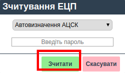

######################################################
Подписание коммерческих документов на платформе OBMIN
######################################################
---------

.. contents:: Зміст:

---------

.. |иконка-ключ| image:: pics_Robota_z_web-platformoju_EDIN-OBMIN/pics_Robota_z_web-platformoju_EDIN-OBMIN_25_key.png

Введение
====================================

Інструкція описує етапи підписання комерційних документів окремо та массово на платформі OBMIN.

Вход на платформу
====================================

Для входу на платформу необхідно перейти за посиланням https://obmin.edi-n.com/.
На сторінці, введіть логін і пароль для доступу в систему.

.. image:: pics_Pidpis_komercijnih_dokumentiv_na_platformi_OBMIN/Pidpis_komercijnih_dokumentiv_na_platformi_OBMIN_01.png
   :align: center

Настройка ЭЦП
============================
Для того, щоб мати можливість підписувати ЕЦП документи, необхідно налаштувати електронно-цифровий підпис. В правому верхньому куті потрібно натиснути на «ключ» |иконка-ключ| і відкриється вікно для налаштувань, де необхідно натиснути кнопку **Додати ЕЦП**

.. image:: pics_Pidpis_komercijnih_dokumentiv_na_platformi_OBMIN/Pidpis_komercijnih_dokumentiv_na_platformi_OBMIN_02.png
   :align: center

Відкриється Провідник, де необхідно буде вказати каталог з секретними ключами і обрати ключі.

Якщо ключі отримані в АЦСК ІДД (ДФС), тоді необхідно вибирати ключі (key-6.dat).
Якщо ви використовуєте для підписання ключі АЦСК «Україна», тоді вид ключів такий:

- Ключ директора: ЄДРПОУ_ІНН підписанта_D1111111.ZS2
- Ключ бухгалтера: ЄДРПОУ_ІНН підписанта _B1111111.ZS2
- Ключ печатки: ЄДРПОУ_S1111111.ZS2 (ЄДРПОУ _U1111111.ZS2)
- Ключ шифрування: ЄДРПОУ_С1111111.ZS2 (ЄДРПОУ _U1111111.ZS2)

Після того, як ключ обраний, зʼявляється вікно, в якому необхідно
ввести пароль і натиснути кнопку **Зчитати**.
Коли ключі зчитані, у вікні ЕЦП можна буде побачити інформацію про ЕЦП:

.. image:: pics_Pidpis_komercijnih_dokumentiv_na_platformi_OBMIN/Pidpis_komercijnih_dokumentiv_na_platformi_OBMIN_04.png
   :align: center

Подписание документов
=======================

На платформі OBMIN є можливість підписувати комерційні документи окремо та масово.

Подписание коммерческих документов отдельно
----------------------------------------------------

Для вибору необхідного документа є можливість скористатися фільтрами, які відображаються над документами:

- Перший фільтр відображає всі, прочитані і непрочитані документи;
- Другий фільтр дозволяє вибрати конкретний тип документа;

Після того як Ви оберете потрібний Вам документ, натисніть на нього для відкриття.
Для того, щоб підписати документ ЕЦП, необхідно натиснути кнопку **Підписати**.

Відкриється вікно для підписання, в якому необхідно натиснути кнопку **Підписати**:

Далі відкриється вікно, в якому необхідно відмітити чекерами типи ключів, якими буде підписано документ.
Потім встановлюємо послідовність підпису, наприклад:

- Директор - 1
- Печатка - 2

.. image:: pics_Pidpis_komercijnih_dokumentiv_na_platformi_OBMIN/Pidpis_komercijnih_dokumentiv_na_platformi_OBMIN_07.png
   :align: center

і натискаємо кнопку **Підписати**. Після процесу підписання необхідно натиснути кнопку **Відправити**.

.. image:: pics_Pidpis_komercijnih_dokumentiv_na_platformi_OBMIN/Pidpis_komercijnih_dokumentiv_na_platformi_OBMIN_08.png
   :align: center

Массовое подписание документов
-----------------------------------------------

Масове підписання, дозволяє підписувати одночасно всі комерційні документи на сторінці. Для цього необхідно відібрати по фільтрам потрібний тип документа, після того як вони відобразяться, натиснути на чекер у лівому кутку екрану, та натиснути:  **Підписати комерційний документ**.

Також, Ви можете вибрати чекером декілька документів на сторінці, які потребують підписання і підписати їх разом, натиснувши на кнопку: **Підписати комерційний документ**.

Для підтвердження підписання необхідно натиснути на кнопку **Підписати** і в блоці «ЕЦП» ввести паролі для підписання документа.

.. image:: pics_Pidpis_komercijnih_dokumentiv_na_platformi_OBMIN/Pidpis_komercijnih_dokumentiv_na_platformi_OBMIN_10.png
   :align: center

У разі якщо ЕЦП не налаштовано, поверніться до Пункту "Налаштування ЕЦП" даної інструкції.

.. image:: pics_Pidpis_komercijnih_dokumentiv_na_platformi_OBMIN/Pidpis_komercijnih_dokumentiv_na_platformi_OBMIN_11.png
   :align: center

**Служба Технічної Підтримки**

* edi-n.com
* +38 (044) 359-01-12
* support@edi-n.com
