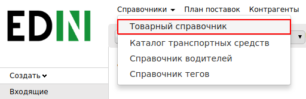
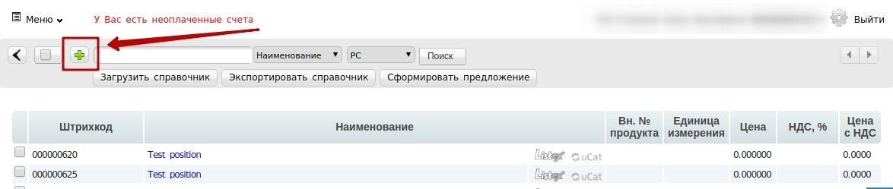
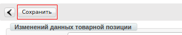
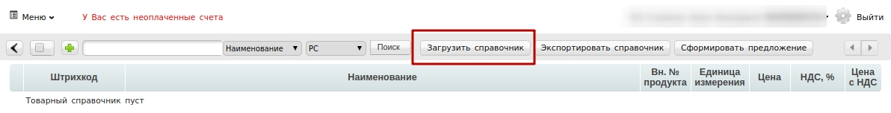
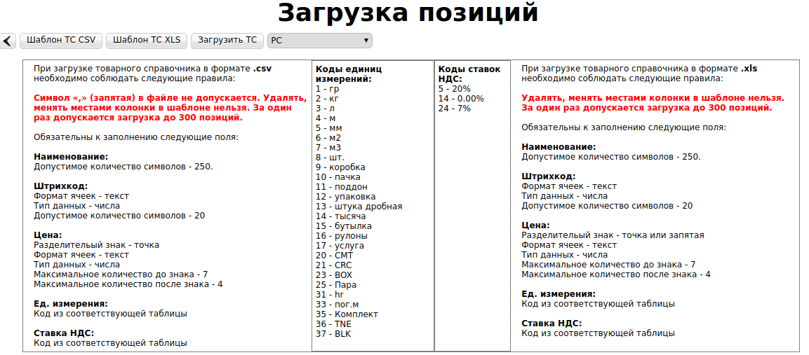
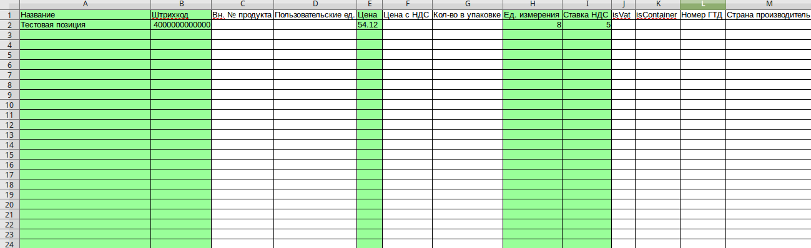
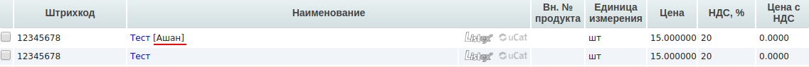
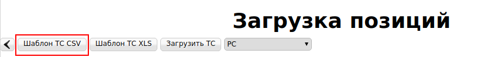
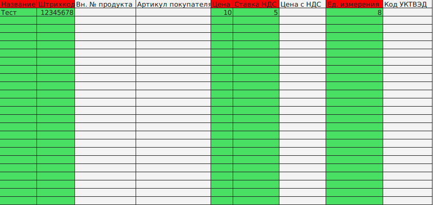

####################################################
Заполнение Товарного Справочника
####################################################
---------

.. contents:: Содержание:

---------

Введение
===================================

Данная инструкция описывает порядок заполнения **«Товарного Справочника»** **(ТС)**, а также обязательных для заполнения полей.

Заполнить Товарный Справочник на Web-платформе можно несколькими способами:

**Вручную на платформе, Через шаблон .CSV, Через шаблон .XLS**. 
Ниже будут приведены примеры всех способов.

Заполнение Товарного Справочника вручную
===============================================

Для перехода к заполнению Товарного справочника, необходимо перейти в раздел **«Меню»-> «Справочники» ->«Товарный Справочник»**

Для того чтобы добавить товарную позицию, нажмите на кнопку **«+»**.

После нажатия на которую у вас откроется форма **«Изменения данных товарной позиции»**.

**Обязательные для заполнения поля**:

.. image:: pics_zapolnenie_tovarnogo_spravochnika/zapolnenie_tovarnogo_spravochnika_03.png
   :align: center

#. **Наименование*** - укажите наименование товарной позиции.
#. **Штрихкод*** - укажите штрихкод позиции.
#. **Цена***- укажите цену без НДС.
#. **Ед.изм***- из выпадающего списка выберите единицу измерения.
#. **НДС***-Укажите ставку НДС.
#. **РС** - укажите, к каким торговым сетям будет относится данный товар. По умолчанию стоит значение “Все”.

Позиция с пометкой **РС** может быть добавлена только в случае, если эта товарная позиция уже существует в общем справочнике.

После заполнения **обязательных полей**, нажмите на **«Сохранить»** для внесения изменений по товарной позиции.

Позиция будет сохранена и отображаться в общем справочнике.

Позиции с пометкой **РС** будут отображаться в справочнике с наименованием сети в квадратных скобках после наименования.

.. image:: pics_zapolnenie_tovarnogo_spravochnika/zapolnenie_tovarnogo_spravochnika_05.png
   :align: center

Загрузка Товарного Справочника через шаблон
=============================================

Для того чтобы перейти в Меню загрузки шаблона Товарного Справочника, нажмите на кнопку **«Загрузить справочник»**.

После чего откроется форма **«Загрузка позиций»**.

Для загрузки позиций на платформу, нужно скачать структурированный шаблон нажатием на кнопку - **«Шаблон ТС»**, заполнить его согласно инструкции которая находится в нижней части экрана.

.. important:: **Обратите внимание!** Коды «Единиц Измерений» и Коды «Ставок НДС» нужно заполнить согласно таблицы, которая расположена в центральной части экрана

Заполнение ТС с помощью шаблона .csv
--------------------------------------------

.. important:: Если Ваша программа не поддерживает формат .csv (или файл отображается некорректно), вы можете уcтановить бесплатный пакет офисных программ LibreOffice перейдя по ссылке: http://free-software.com.ua/office/libreoffice/

.. image:: pics_zapolnenie_tovarnogo_spravochnika/zapolnenie_tovarnogo_spravochnika_08.png
   :align: center

Для того чтобы скачать шаблон, нажмите на кнопку **«Шаблон ТС.CSV»**. После чего начнется скачивание файла.

Откройте пустой файл Excel, после чего нажатием на кнопку **«Файл»**->**«Открыть»** откройте загруженный шаблон.

.. image:: pics_zapolnenie_tovarnogo_spravochnika/zapolnenie_tovarnogo_spravochnika_09.png
   :align: center

Для того чтобы открыть таблицу Шаблона ТС.CSV, укажите в Таблице **«Импорт данных из текста»** корректные данные.

.. image:: pics_zapolnenie_tovarnogo_spravochnika/zapolnenie_tovarnogo_spravochnika_10.png
   :align: center

Для корректного открытия документа укажите в поле **Кодировка - «Кириллица (Windows-1251)»**, в поле **Параметры разделителя** – **«Запятая/ Точка с запятой»** и в поле **Другие параметры** – **«Распознавать любые числа»**, и нажмите клавишу **ОК**.

Откройте загруженный файл Excel и заполните **обязательные колонки**, выделенные цветом, согласно инструкции на сайте:

После заполнения таблицы, сохраните файл на рабочий стол.

Загрузка шаблона Товарного Справочника
--------------------------------------------

Для загрузки шаблона, вернитесь в Товарный Справочник, и нажатием на кнопку **«Загрузить Шаблон»**, при необходимости, отметьте розничную сеть, для которой вы хотите загрузить справочник.

Затем выберите созданный документ, который вы сохранили ранее.
После загрузки позиции будут сохранены и отобразятся в общем справочнике.

Позиции с пометкой **РС** будут отображаться в справочнике с наименованием сети в квадратных скобках после наименования.

Заполнение ТС с помощью шаблона .xls
------------------------------------------------

Для того чтобы скачать шаблон, нажмите на кнопку **«Шаблон ТС CSV»**, после чего начнется скачивание файла.

Откройте загруженный файл Excel и заполните **обязательные колонки**, выделенные цветом, согласно инструкции на сайте:

После заполнения шаблона, сохраните файл на рабочий стол.

Для загрузки шаблона на платформу, вернитесь в Товарный Справочник, и нажатием на кнопку **«Загрузить Шаблон»**, при необходимости, отметьте розничную сеть, для который вы хотите загрузить справочник.

Затем выберите созданный документ, который вы сохранили.
После загрузки позиции будут сохранены и отобразятся в общем справочнике.

Позиции с пометкой **РС** будут отображаться в справочнике с наименованием сети в квадратных скобках после наименования.

После загрузки позиции будут сохранены и отобразятся в общем справочнике.

**Служба Технической Поддержки**

* edi-n.com
* +38 (044) 359-01-12 
* support@edi-n.com
