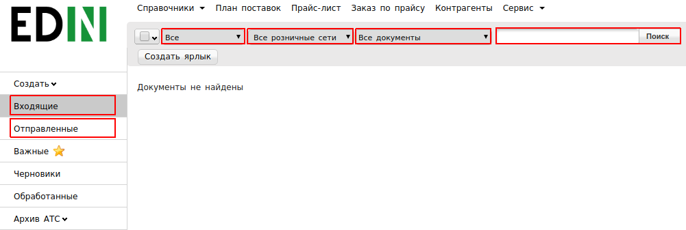
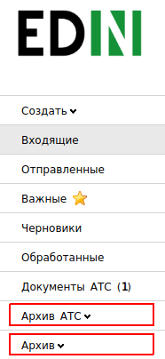
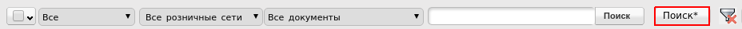

####################################################
Инструкция по поиску документов на веб-платформе
####################################################

У каждого пользователя веб-платформы неоднократно может возникать трудность с успешным поиском необходимых документов. Причиной могут быть различные факторы, среди которых:

1. первый фильтр (все, прочитанные, не прочитанные) не соответствует тому статусу, в котором сейчас документ;
2. неправильно указан номер документа при поиске;
3. не правильно выбран GLN-номер компании на который должен был поступить документ.

Если понимать, каким образом выполняется поиск на платформе и последовательность выполняемых действий, то он кажется простым и понятным. В данной инструкции описаны основные возможности фильтра, которыми стоит воспользоваться для успешного поиска необходимого документа.

**Используем фильтр**
==========================

.. attention:: Начинайте поиск документа убедившись, что выбран верный GLN-номер Вашей компании.

Для поиска документов на платформе необходимо использовать доступный функционал имеющегося фильтра. Существуют как основные критерии поиска, так и расширенные. К основным относятся:

* **Направление документа:** Входящий, Отправленный
* **Статус документа:** Прочитанный, Непрочитанный, Все
* **Розничная сеть:** (Пример: Новус, Велика Кишеня)
* **Тип документа:** (Пример: Заказ, Коммерческий документ)
* **Номер документа**

Поиск можно использовать по каждому критерию отдельно, но более целесообразным и эффективным будет поиск, который сочетает несколько критериев.
Данных фильтров для поиска документов в большинстве случаев хватает и при правильному установлении фильтра поиск документа заканчивается успешно.

**Помним про архивные документы**
====================================================

Документы, срок которых больше 3-х месяцев, попадают в архив.
На платформе Вы можете увидеть следующие вкладки:

* Архив АТС (период и 01.06.2018)
* Архив (период до 01.06.2018)

Если заблаговременно известно, что документ, который нужно найти, является архивным, тогда необходимо открыть соответствующую вкладку, в зависимости от периода документа и выполнить поиск восспользовавшись основными елементами фильтра.

* **Тип документа** (Пример: Заказ)
* **Розничная сеть** (Пример: Новус, Велика Кишеня)
* **Период** (месяц)
* **Номер документа**

В случае, если найти документ при помощи основных критериев не удалось, рекомендуем воспользоваться возможностями расширенного поиска, доступным при нажатии на кнопку, как на изображении ниже.

.. include:: kontakti.rst