####################################################
Работа с платформой EDIN
####################################################

Данная инструкция описывает общие принципы работы на web-платформе.

---------

.. contents:: Содержание:
   :depth: 6

---------

.. important:: **Внимание!** Перед началом работы на web-платформе Вам на почту поступит письмо с данными для доступа.

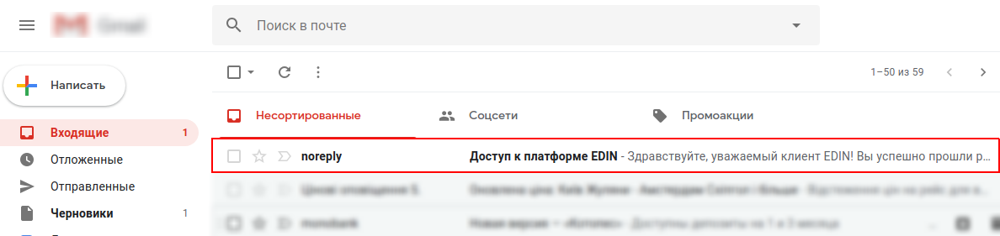

Генерация пароля
================
Для доступа на портал, необходимо создать пароль, для генерации пароля, откройте письмо и перейдите по ссылке для создания пароля из пункта 3:

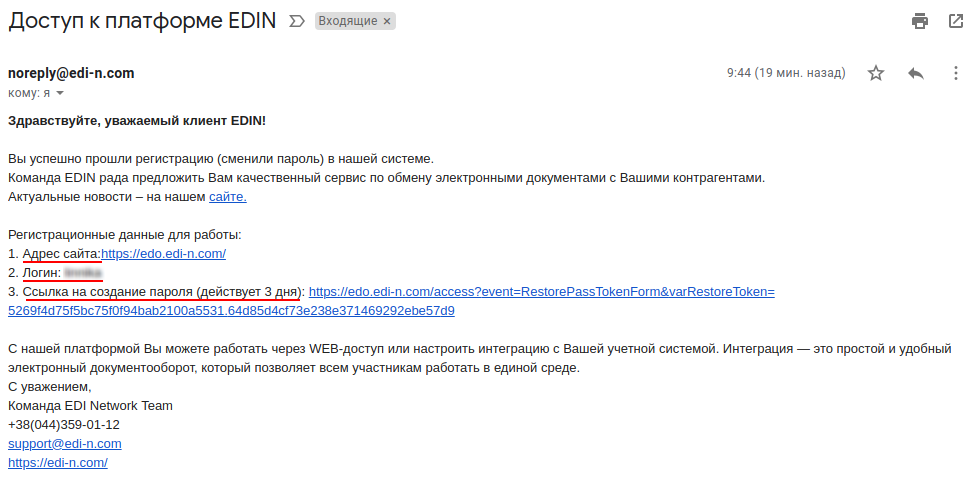

В открывшейся форме введите новый пароль, а затем повторите его и нажмите кнопку **«Сохранить»**.
Пароль должен состоять минимум из **6 символов** и содержать **цифры и буквы**.

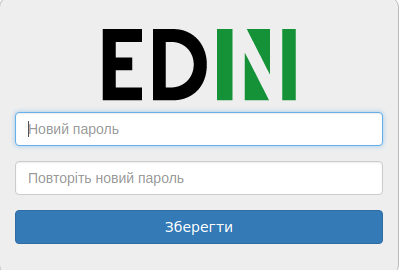

После сохранения пароля, система перенаправит Вас на главную страницу для входа. Для доступа на web-платформу введите логин из письма (пункт 2) и придуманный пароль.

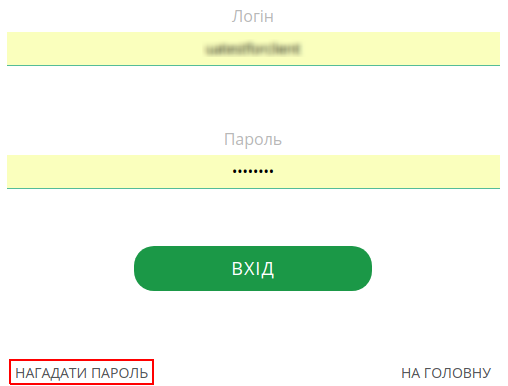

Восстановление пароля
=====================
Если Вы забыли пароль, воспользуйтесь формой для восстановления нажав кнопку **«Напомнить пароль»**.

Основные папки
==============
После ввода логина и пароля в левом блоке web-портала отображаются основные папки для документов, по умолчанию отображается папка  **«Входящие»**. Здесь находятся все документы, которые были отправлены со стороны контрагента.

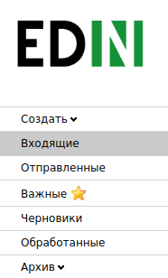

Фильтры
=======
В данной папке есть возможность использовать **фильтры** для 
быстрого отображения нужных типов документов от определенной сети. Для этого нужно воспользоваться полями, которые 
отображены выше над документами.

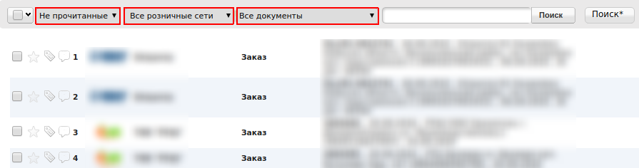

Если у Вас несколько GLN, переключиться возможно нажав на 13-тизначный номер/название компании в правом верхнем углу экрана и ввести первые символы номера/названия компании. Чтобы при следующем входе на платформу отображался определенный GLN, его нужно отметить **«звездочкой»**.

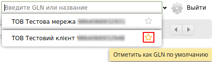

Изначально все документы, поступившие на платформу, выделены 
жирным шрифтом и являются в статусе **«Не прочитанные»**. После 
просмотра (открытия) документ становится прочитанным. Вернуть 
его в прежний статус невозможно.

Если в строке документа возле наименования сети стоит какая-либо 
цифра, она отображает количество документов, находящихся в 
цепочке. Например, открыв Заказ, есть возможность перейти в 
документ **«Подтверждение заказа»**.

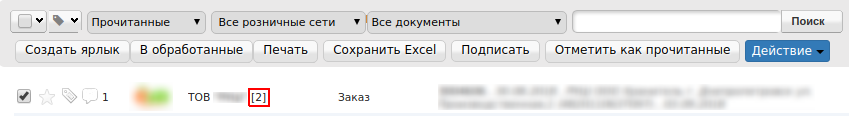

При отметке галочкой документа (не заходя в документ), есть 
возможность произвести следующие действия:

#. Создать ярлык
#. Перенести в **«Обработанные»** (вернуть документ обратно возможно, так же отметив галочкой)
#. Напечатать
#. Сохранить в формате Excel
#. Подписать (в случае, если это юридически значимый документ)
#. Отметить как прочитанный
#. Распечатать в формате .PDF

При отметке звездочкой документ автоматически копируется в 
папку **«Важные»**.

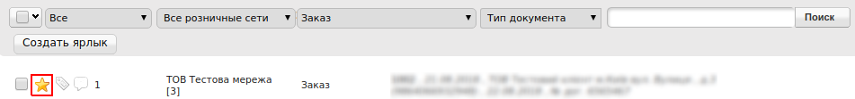

После открытия документа (входящего/отправленного) есть 
возможность:

#. Напечатать документ
#. Сохранить в формате Excel
#. Сохранить в формате XML
#. Сформировать ответные документы
#. Подписать (в случае, если это юридически значимый документ)
#. Открыть полный вид документа
#. Перенести документ в папку **«Обработанные»**

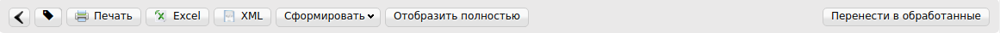

При нажатии кнопки **«Сохранить»**, документ сохраняется в папке **«Черновики»**. В дальнейшем из Черновиков можно отправить несколько документов одновременно, отметив галочкой и нажав кнопку **«Отправить»**. Такая же возможность есть при подписании нескольких ЮЗД.
После нажатия кнопки **«Отправить»**, документ переносится в 
папку **«Отправленные»**

Для работы с архивом достаточно нажать на кнопку **«Архив»** и 
выбрать год. Далее нужно выбрать месяц, за который нужно 
найти документ.

По умолчанию отображается 40 последних документов. Для 
перехода на следующие 40 достаточно нажать на кнопку **«вправо»**, которая находится в правой верхней части экрана.

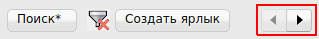

Завершает список, папка **«Документы АТС»**. Которая содержит в себе первичную документацию и налоговые накладные от ТОВ «АТС». Документ **«Акт предоставленных услуг»**, требует подписания ЭЦП с вашей стороны. Процедура подписания указана в соответствующей инструкции.

Ярлыки
======
Помимо основных папок на Web-платформе, есть возможность создать **«Ярлык»** для определенных типов документов и сетей. Для этого необходимо нажать на кнопку **«Создать ярлык»**.

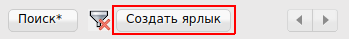
Данная функция позволяет создать отдельный ярлык, под определенные типы документов, состояния документов (прочитанные и непрочитанные), выбрать раздел **«Входящие»**, **«Отправленные»**, **«Важные»**, **«Черновики»** или **«Обработанные»**.
Так же можно добавить GLN номер, определенную розничную сеть или место доставки.

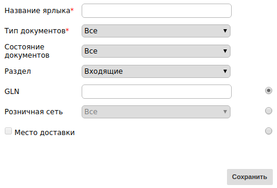

После внесения необходимых данных, под стандартными папками на web-платформе появится созданный Ярлык с документами по указанным параметрам.

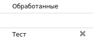

Поиск
======

.. sidebar:: Расширенный **«Поиск»***

    .. image:: pics_rabota_s_platformoj_EDIN/Instrukcija_po_rabote_s_platformoj_EDIN_17.png
   

Поиск документов на платформе осуществляется двумя способами:

Обычный **«Поиск»**, и
Расширенный **«Поиск»***

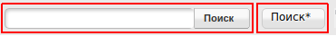

Для поиска достаточно ввести корректный номер документа в поле 
**«Поиск»**. При этом нужно выставить фильтр на **«все»**. Так как, например, при выбранном фильтре **«Прочитанные»**, поиск будет 
осуществляться только по прочитанным. Для сброса фильтра нажмите кнопку: |кубик-рубика| после этого все фильтры будут сброшены.

Кнопка **«Поиск*»** имеет расширенный функционал поиска документов, нажав на соответствующую кнопку, появиться окно для ввода данных.
После ввода нужного критерия для поиска документа, нажмите кнопку **«Найти»**. Поиск будет осуществляться по заданным параметрам.

Для того что бы отменить поиск по данным критериям, перейдите повторно в раздел **«Поиск»** и нажмите **«Сброс»**. После этого все фильтры будут сброшены.

Настройки
==========
Кнопка настроек находится в правом верхнем углу: 

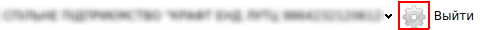

В настройках находятся следующие вкладки: 

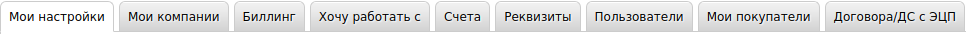

Во вкладке **«Мои настройки»** есть возможность изменить свой 
пароль для входа на платформу, e-mail для отправки уведомлений, язык интерфейса, а так же добавить сервисные уведомления.
Во вкладке **«Мои компании»** отображается список ваших 
компаний с отдельными GLN. При выборе одной из компаний есть возможность внести данные, которые могут использоваться автоматически при формировании некоторых типов 
документов. Например, данные подписанта в Коммерческом документе. Далее обязательно нужно нажать кнопку **«Сохранить»**.

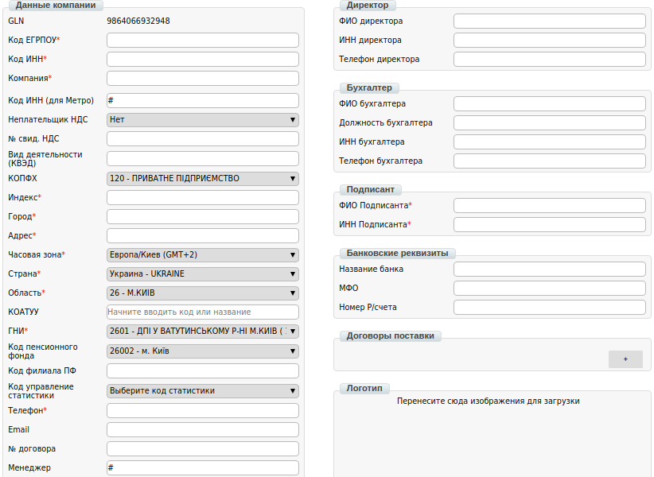

Во вкладке **«Биллинг»** можно скачать отчет по совершенным транзакциям. Для этого нужно выбрать период (при необходимости тип документа) и нажать кнопку **«Фильтровать»**, а затем **«Отчет»**. Далее файл загружается в формате .xls.

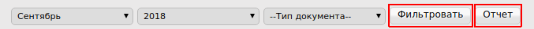
Функционал во вкладке «Биллинг», находится на стадии разработки.

Во вкладке **«Счета»** находятся документы, выставленные от 
контрагента. Их можно напечатать нажав на иконку в колонке **«Действия»**.

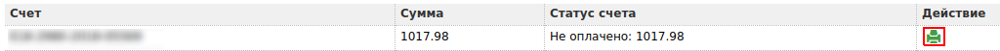

Перейти во вкладку счета так же можно нажав на уведомление вверху платформы:

.. image:: pics_rabota_s_platformoj_EDIN/Instrukcija_po_rabote_s_platformoj_EDIN_23.png
   :align: center

Во вкладке **«Реквизиты»** отображаются реквизиты вашей компании. 
После заполнения полей нужно нажать кнопку **«Отправить»**.

Во вкладке **«Пользователи»** отображаются все логины, через которые совершается доступ к платформе. В данной вкладке есть возможность создать нового пользователя, нажав на соответствующую кнопку или редактировать существующий.

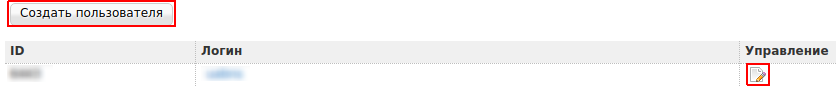
Функционал во вкладке **«Мои покупатели»**, находится в на стадии разработки.

Меню
==========
На верхней панели Web-платформы содержится следующее меню:

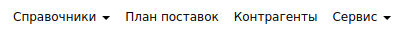

Раздел **«Справочники»** содержит в себе:

* **Товарный справочник**
* **Каталог транспортных средств**
* **Справочник водителей**
* **Справочник тегов**

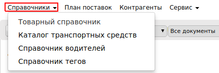

**Товарный справочник** — необходим для внесения цен и номенклатуры для корректной работы с ответными документами по некоторым торговым сетям.

**Каталог транспортных средств** — содержит в себе справочник автомобилей. Упрощает работу с некоторыми сервисами электронного документооборота.

**Справочник водителей** — содержит в себе справочник водителей. Упрощает работу с некоторыми сервисами электронного документооборота.

**Справочник тегов** — содержит в себе справочник тегов.

Раздел **«План поставок»** представляет собой календарь:

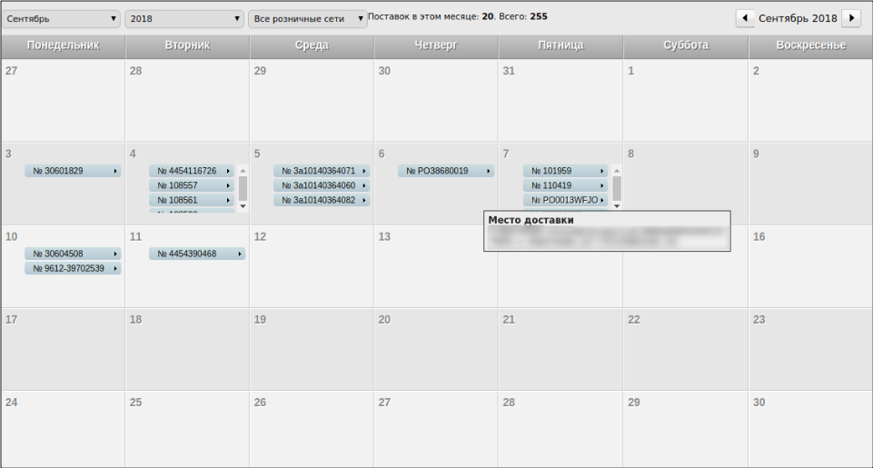
В данном календаре можно проверить все ваши прошлые и будущее поставки по всем торговым сетям. Дата поставки указывается в соответствии с датой доставки, указанной в заказе от сети.
При наведении курсором мыши на определенный номер заказа, во всплывающем окне будет отображена точка доставки по данному заказу. Кликнув по номеру заказа, будет выполнен переход в соответствующий заказ.
Для удобства отображения, план поставок можно отфильтровать по месяцу, году и необходимой торговой сети. Для этого воспользуйтесь соответствующими кнопками:

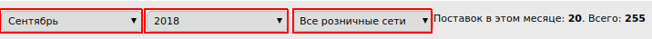

Функционал во вкладке **«Контрагенты»** находится в на стадии разработки.

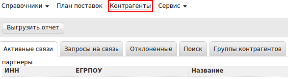

Сервисы
==========
Раздел **«Сервис»** содержит в себе функционал, который подключается дополнительно:

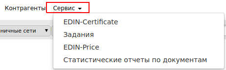

* **EDIN-Certificate**
* **Задания**
* **EDIN-Price**
* **Статистические отчеты по документам**

**EDIN-Certificate** — Сервис обмена электронными сертификатами, позволяет прикреплять и обмениваться сертификатами качества, экспертными заключениями, декларациями производителя и др.

**Задания** — Сервис, позволяет массово выгружать документы в .PDF формате;

**EDIN-Price** — Сервис согласования цен в электронном виде;

**Статистические отчеты по документам** — Сервис находится на стадии разработки.

Для подключения или отключения сервисов обратитесь к ведущему менеджеру нашей компании.

.. include:: kontakti.rst
