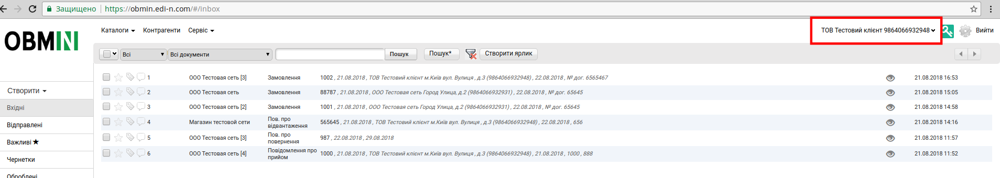

####################################################
Работа з веб-платформой EDIN-OBMIN
####################################################
Инструкція по формуванню і відправленню документа Договір на веб-платформі EDIN-OBMIN

---------

.. contents:: Содержание:

---------

Структура веб-платформи EDIN-OBMIN
=======================================

Увійшовши до свого персонального кабінету на веб-платформі ви
побачите інтуітивно зрозумілий інтерфейс, схожий на персональний
кабінет вашої електронної пошти.

1. Зліва побачите каталоги, в яких будуть розміщені відповідні документи:

* Вхідні – знаходяться всі вхідні документи
* Відправлені – знаходяться всі відправлені документи
* Важливі – знаходяться документи, які ви відмітите, як важливі (поруч з документом натиснути зірку)
* Чернетки – знаходяться всі збережені документи
* Оброблені – знаходяться документи, які були вами підписані і відправлені, а також ті, які ви перенесли сюди примусово

2. Посередені платформи розташовані самі документи. Кожна стрічка
(окремий документ), в якій ви вже можете бачити основну інформацію
по документу. Для того, щоб увійти в документ, необхідно натиснути
на ньому один раз лівою клавішею миші.

3. Над документами розміщена пошукова панель, де можна фільтрувати документи за принципом:

* Всі, Прочитані, Не прочитані
* Всі документи або по типу документу
* По імені документу, попередньо внести дані в пошукове поле і натиснути кнопку **“Пошук"**
* Натиснувши копку **“Пошук *"**, можна ввести у випадаючому вікні більше реквізитів для пошуку
* Натиснувши кнопку скидання |иконка-удалить| ви видалите всі введені фільтри
* Натиснувши кнопку **“Створити ярлик"** ви зможете створити власний каталог для фільтрації документів

4. Натиснувши кнопку **Онлайн чат** ви зможете онлайн поставити запитання технічному спеціалісту щодо документообігу і отримати вичерпну відповідь.

5. В правому верхньому куті відтворюється назва вашого підприємства і GLN номер.

Заполнение карты предприятия
=======================================

Перед початком роботи на веб-платформі необхідно заповнити картку вашого підприємства. Для цього необхідно натиснути в правому верхньому куті на ярлик налаштувань |иконка-настройки|, відкриється панель **Налаштування**. Вам необхідно перейти у вкладення **Мої компанії**

Потім необхідно обрати потрібне підприємство і натиснути лівої клавішею миші по ньому, й відкриється картка підприємства.

**Обов`язковими полями для заповнення є поля відмічені
“червоною зіркою", а також "Менеджер" і "Директор**":

* Код ЄДРПОУ
* Код ІПН
* Компані
* Індекс (юр. адреса)
* Місто (юр. Адреса)
* Адреса (юр. Адреса, вулиця, будинок)
* Часова зона
* Країну (обирайте з списку)
* Область (обирайте з списку)
* ДПІ (обирайте з списку податкову, в яку подаєте звітність)
* Телефон
* Менеджер (вказати відп.особу на вашому підприємстві)
* Форма власності
* Директор
* Бухгалтер
* Підписант

Після того, як всі необхідні поля будуть заповнені, необхідно натиснути
в лівому верхньому куті кнопку **Зберегти**.

Настройка ЭЦП
==========================

Для того, щоб мати можливість підписувати ЕЦП документи необхідно налаштувати електронно-цифровий підпис. В правому верхньому куті потрібно натиснути кнопку ключа |иконка-ключ| і відкриється вікно для налаштувань, де необхідно натиснути кнопку **Додати ЕЦП**.

.. image:: pics_Robota_z_web-platformoju_EDIN-OBMIN/pics_Robota_z_web-platformoju_EDIN-OBMIN_07.png
   :align: center

Відкриється Провідник, де необхідно буде вказати каталог з секретними
ключами і обрати ключі.
Якщо ключі отримані в АЦСК ІДД (ДФС), тоді необхідно вибирати ключі **(key-6.dat)**.

Якщо ви використовуєте для підписання ключі АЦСК «Україна», тоді вид ключів такий:

- Ключ директора: ЄДРПОУ_ІНН підписанта_D1111111.ZS2
- Ключ бухгалтера: ЄДРПОУ_ІНН підписанта _B1111111.ZS2
- Ключ печатки: ЄДРПОУ_S1111111.ZS2 (ЄДРПОУ _U1111111.ZS2)
- Ключ шифрування: ЄДРПОУ_С1111111.ZS2 (ЄДРПОУ _U1111111.ZS2)

Після того, як ключ обраний, зʼявляється вікно, в якому необхідно ввести пароль і натиснути кнопку **Зчитати**:

.. image:: pics_Robota_z_web-platformoju_EDIN-OBMIN/pics_Robota_z_web-platformoju_EDIN-OBMIN_08.png
   :align: center

Коли ключі считані, у вікні ЕЦП можна буде побачити інформацію щодо ЕЦП:

.. image:: pics_Robota_z_web-platformoju_EDIN-OBMIN/pics_Robota_z_web-platformoju_EDIN-OBMIN_09.png
   :align: center

Создание документа Договор
=======================================

Для того, щоб створити Договір необхідно натиснути на кнопку **Створити** і з контекстного меню обрати **Коммерційний документ- Договір**

Відкриється форма для заповнення.
Обовʼязковими полями для заповнення є ті, що відмічені “червоною зіркою":

Після заповнення обов`язкових полів ви можете внести основну інформацію по **Договору** в поле **Текст документа**. Також ви можете внести **Термін дії документа** і вказати **Період підписання документа**. Якщо в документ внесена уся необхідна інформація, то після
цього натискаємо кнопку **Зберегти**.

Отправка документа Договор
=======================================

Як тільки документ збережено, ви можете його відправити, підписавши своєю ЕЦП або відправити без підписання.

Подписание документа Договор
=======================================

Для того, щоб підписати документ ЕЦП, необхідно натиснути кнопку **Підписати**.

.. image:: pics_Robota_z_web-platformoju_EDIN-OBMIN/pics_Robota_z_web-platformoju_EDIN-OBMIN_13.png
   :align: center

Відкриється вікно для підписання, в якому необхідно повторно натиснути кнопку **Підписати**:

.. image:: pics_Robota_z_web-platformoju_EDIN-OBMIN/pics_Robota_z_web-platformoju_EDIN-OBMIN_14.png
   :align: center

Далі відкриється вікно, в якому необхідно відмітити чекерами типи ключів, якими буде підписано документ. Потім встановлюємо послідовність підпису, наприклад:

- **Директор - 1**
- **Печатка - 2**

.. image:: pics_Robota_z_web-platformoju_EDIN-OBMIN/pics_Robota_z_web-platformoju_EDIN-OBMIN_15.png
   :align: center

і натискаємо кнопку **Підписати**. Після процесу підписання необхідно натиснути кнопку **Відправити**.

.. image:: pics_Robota_z_web-platformoju_EDIN-OBMIN/pics_Robota_z_web-platformoju_EDIN-OBMIN_16.png
   :align: center

Получение документа Договор и подписание его со стороны получателя
====================================================================

Коли документ відправлений, отримувач , що вказаний в документі, побачить його в своєму персональному кабінеті, в каталозі **Вхідні**.

Для того, щоб відкрити документ, необхідно натиснути на ньому лівою клавішею миші.

Потім, щоб підписати його, потрібно натиснути кнопку **Підписати**:

і у полі ЕЦП, що відкриється, повторно натиснути зелену кнопку **Підписати**:

Якщо ЕЦП були зчитані в попередньому сеансі, тоді необхідно спочатку їх авторизувати, натиснувши в правому верхньому куті на ярлик ключа |иконка-ключ| і у вікні, що відкриється, необхідно вказати пароль до раніше зчитаного ключа і натиснути на кнопку збереження |иконка_сохранить| .

Якщо ключі вже зчитані, то після натискання зеленої кнопки **Підписати**, з`явиться вікно, в якому необхідно відмітити чекерами типи ключів, якими буде підписано документ. Потім встановлюємо послідовність підпису, наприклад:

- **Директор - 1**
- **Печатка - 2**

і натискаємо кнопку **Підписати**. Після процесу підписання необхідно натиснути кнопку **Відправити**.

.. image:: pics_Robota_z_web-platformoju_EDIN-OBMIN/pics_Robota_z_web-platformoju_EDIN-OBMIN_22.png
   :align: center

Печать документа
==========================

Для того, щоб роздрукувати документ, необхідно натиснути кнопку **Друк**:

**Служба Технічної Підтримки**

* edi-n.com
* +38 (044) 359-01-12
* support@edi-n.com
