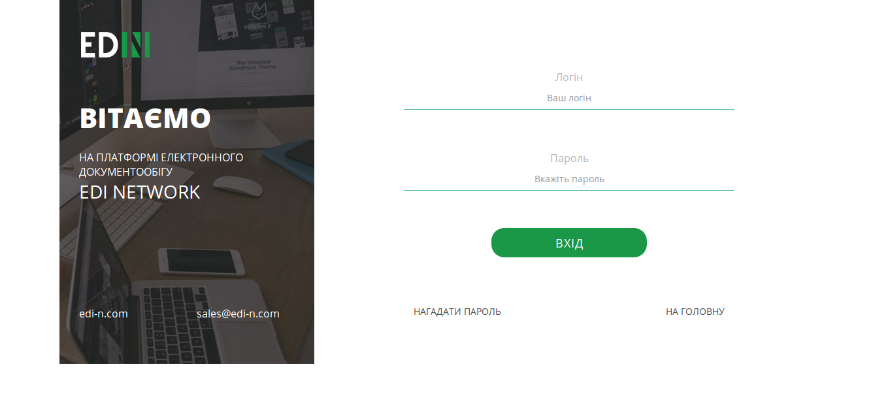
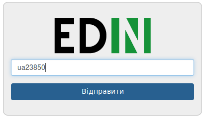
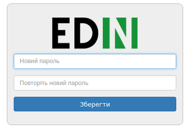
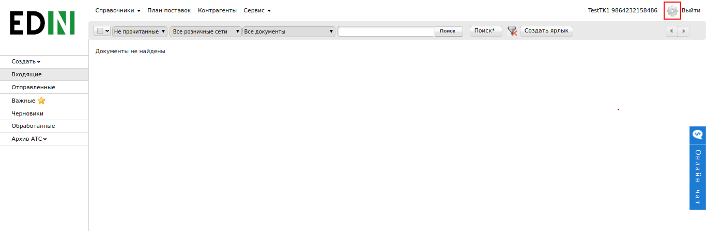
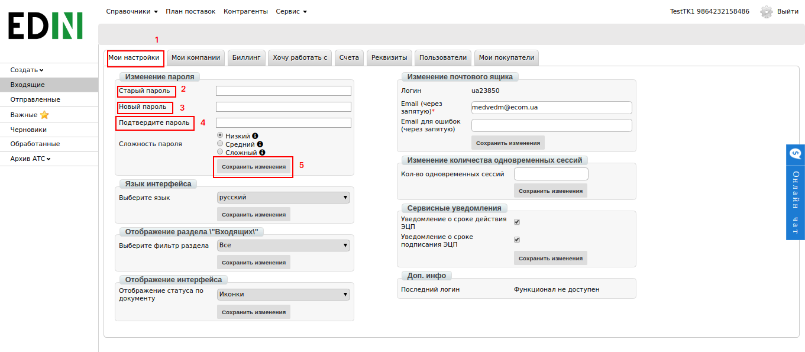
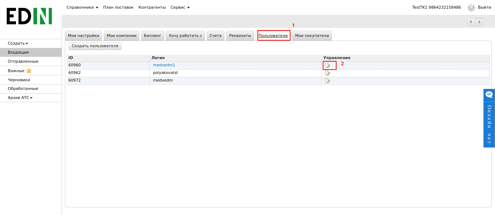
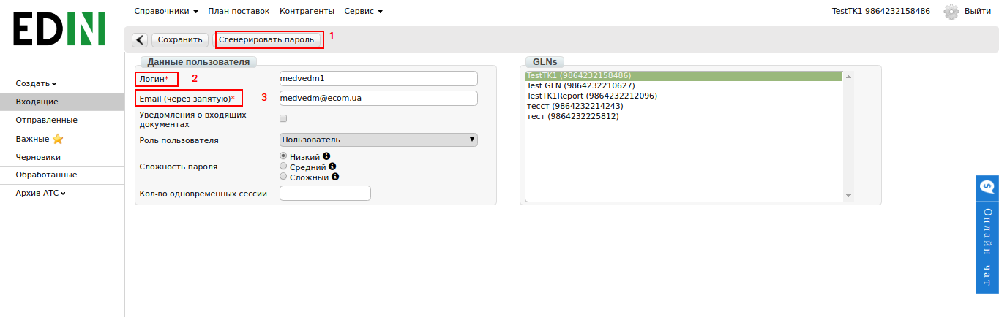

####################################################
Изменение Логина и Пароля на EDIN
####################################################

---------

.. contents:: Зміст:

---------

1. Вход на платформу EDIN
==============================
Для входу на web платформу EDIN необхідно перейти за посиланням: https://edo.edi-n.com

На початковій сторінці необхідно ввести Логін та Пароль доступу та натиснути кнопку “Вхід”.

2. Восстановление Пароля (в случае утери пароля)
================================================

Розглянемо ситуацію, коли пароль доступу до входу на платформу EDIN було втрачено або пароль є недостовірним.

#.  На сторінці входу необхідно натиснути кнопку “Нагадати пароль” .

2.  Далі з'явиться сторінка відновлення паролю, де потрібно вказати “Логін” для якого потрібно виконати відновлення та натиснути “Відправити”.

3. Перевірити e-mail, що раніше був закріплений за вказаним Логіном. На пошту автоматично надходить лист з посиланням для генерації нового паролю.
Приклад:

*Для генерации нового пароля перейдитепо ссылке:
https://edo.edi-n.com/access?event........*

Необхідно ввести двічі новий пароль та натиснути кнопку «Зберегти».
Після проведення даних дій пароль буде змінено.

3. Установление нового пароля (если пароль известен)
=====================================================

Розглянемо ситуацію, коли пароль доступу до входу на платформу EDIN вам відомий, але вам необхідно його змінити.

#. Вам необхідно увійти на платформу EDIN. В правому верхньому куті перейти до налаштувань.

2. Перейти на сторінку «Мої налаштування». В полі змінення паролю внести необхідні данні та натиснути «Зберегти зміни».

4. Редактирование Логина и Пароля (для нового пользователя)
===========================================================

#. Вам необхідно увійти на платформу EDIN. В правому верхньому куті перейти до налаштувань.

.. image:: pics_vosstanovlenie_parolja_na_platforme_EDIN/vosstanovlenie_parolja_na_platforme_EDIN_07.png
   :align: center

2. Перейти на сторінку «Користувачі». Вибрати Логін для якого необхідно внести зміни.

На сторінці редагування можливо змінити:

#. Згенерувати посилання на зміну паролю доступу.
#. Змінити Логін Користувача.
#. Додати або змінити існуючу ел.пошту.

Будь які зміни вступають в силу після натискання кнопки «Зберегти».

**Служба Технічної Підтримки**

* edi-n.com
* +38 (044) 359-01-12
* support@edi-n.com
