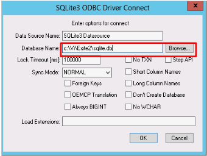

1C FTP Инструкция разработчика
################################

1.Первый запуск и настройка модуля
================================================

1.1 Скопируйте файл модуля интеграции Integration_(версия_модуля).epf и папку с инсталляциями необходимых программ /install/ в общий каталог.

Из 1С-Предприятия запускаем файл внешней обработки **Integration_(версия_модуля).epf** (Файл->Открыть)

Первый запуск и установку модуля рекомендуется производить пользователем с правами администратора.
 
1.2 Из появившегося главного меню «**Интеграция EDI**» вызвать «**Настройки**»

1.3 В вызванном меню «**Интеграция: настройки**» перейти в **мастер настроек**:

1.4 В окне мастера настроек последовательно выполнить настройки во вкладках расположенных слева:

1.5 Во вкладке «**Общие настройки интеграции**» в выпадающем списке выбрать вид конфигурации в которой работает Ваша 1С.

Также модуль может подключаться и к нетиповым конфигурациям. Для такого подключения из списка выберете наиболее близкую конфигурацию. Каждый случай требует индивидуальной проверки на работоспособность.

1.6 Представленные ниже настройки выбираются опционально, в зависимости от индивидуальных особенностей работы поставщика.

Немного подробнее про некоторые из них:

**Контрагент = грузополучателю** – устанавливается в зависимости от требований поставщика по указанию грузополучателя в заказах.
Грузополучатель — это элемент справочника контрагентов. В базе может создаваться:

- один контрагент и несколько точек доставки, которые часто и есть грузополучателями (поле *Грузополучатель*, в таком случае, в справочнике *Точки доставки* заполняется при необходимости);
- отдельный контрагент на каждую точку доставки: грузополучатель подменяет контрагента.

Для указания грузополучателя как контрагента отметьте флаг **Контрагент = Грузополучатель**. Таким образом, при импорте заказа контрагент подменяется на грузополучателя (если заполнено поле Грузополучатель).

**Вести учёт в разрезе характеристик** - для поставщиков, которые используют в учете характеристики номенклатурных позиций.

**Поиск контрагента по точке доставки** – во время загрузки заказов игнорируется поиск контрагентов по GLN, происходит поиск по точке доставки и устанавливается контрагент указанный в справочнике Точки доставки. Во время выгрузки файлов поиск кодов по номенклатуре происходит по контрагенту указанному в документе.
	
1.7 Перейдя во вкладку «**Настройка БД**» мастера настроек, необходимо установить ODBC драйвер для *SQLlite* нажав на соответствующую кнопку.

Запустится установщик ODBC драйвера, во время установки которого не меняйте параметры по умолчанию (ничего дополнительно не указывая). 

.. important:: В случае необходимости повторной установки драйвера необходимо удалить же установленный драйвер с помощью стандартных средств удаления программ операционной системы.

После успешной установки драйвера установите строку подключения.

После нажатия кнопки выбора появится системное окно свойств канала передачи данных:

На закладке **Соединение** в пункте **1. Источник данных** установите переключатель на **Использовать строку соединения** и нажмите кнопку **Сборка…**

В появившемся окне выбора источника данных на закладке **Источник данных компьютера** выберете **SQLite3 Datasource** и нажмите **ОК**.

В появившемся окне настроек соединения ODBC-драйвера в поле **Database Name:** прописываем путь, где будет находиться файл с данными для интеграции.

В поле **Database Name**: можно вписать несуществующее имя файла, который будет создан для базы данных SQLite.

Для возврата в окно свойств канала передачи данных нажмите кнопку **ОК**.
	
Строка соединения будет заполнена. Для тестирования соединения с базой данных нажмите кнопку **Проверить соединение**. Для возврата в окно свойств канала передачи данных нажмите кнопку **ОК**. 

Во вкладке **Настройки БД** строка подключения и файл с внешней базой данных будут заполнены. После этого создайте структуру базы данных, нажав на кнопку **Создать структуру БД.** 

1.8 Во вкладке **Java Мастера** настройки необходимо указать путь к Java на Вашем ПК, если она установлена. В противном случае, необходимо сначала её установить. 

1.9 Во вкладке Настройка FTP прописываем пути к локальным каталогам для входящих, исходящих и архивных документов, нажав «**Заполнить по умолчанию**» или указываем их вручную.
	
Указываем настройки для сервера обмена и устанавливаем галочку «**Пассивный режим**»:

.. note:: Если планируется работать с большим количеством документов, то при синхронизации на закачку новых документов может потребоваться большее времени (1С вначале закачивает, а потом обрабатывает добавившиеся файлы). Для ускорения процесса синхронизации возможно использовать **FTP-клиент**, который в фоновом режиме закачивает файлы и также автоматически отсылает файлы, подготовленные к отправке. В этом случае FTP клиент загружает файлы с сервера в локальный каталог, а 1С работает уже с локальными каталогами. Для активации этой функции установите галочку напротив «**Загружать файлы с использованием локального каталога**»
	
1.10 Настройки на вкладке «**ІТТ Користувач ЦСК-1**» необходимо выполнить в случае работы с юридически значимыми документами. Их описание можно найти в разделе «**Настройка и работа с юридически значимыми документами**»

1.11 Во вкладке Организации из перечня организаций выбрать необходимую.

По двойному клику по организации откроется форма элемента Организации. 

В открывшейся форме нажимаем «**+**» и заполняем GLN организации, логин и пароль для подключения к FTP.
	
.. note:: **GLN** (англ. Global Location Number ‘глобальный номер расположения’) представляет собой номер структуры EAN/UCC-13 (из 13 цифр, последняя — контрольная). GLN не содержит в себе никакой конкретной информации, он обеспечивает только уникальную ссылку на субъекта хозяйствования или его производственный или функциональный объект.

Ваш GLN доступен Вам на веб-портале в правом верхнем углу. Также вы можете узнать его в службе технической поддержки или у своего менеджера.
Для работы с электронным документооборотом обязательным условием является также заполнение GLN контрагентов с которыми планируется обмен документов.

Для этого из меню настроек интеграции необходимо перейти в справочник Контрагентов нажав на кнопку «**Контрагенты**».

В форме списка Контрагенты выберете контрагента с которым планируется электронный документооборот.

По двойному клику вызовите окно формы элемента Контрагенты.

Заполните GLN контрагента и активируйте типы документов, которыми будете обмениваться с данным контрагентом.

1.12. В справочник **Розничные сети** вносится информация о розничных сетях, с которыми планируется производить EDI-обмен. Эту информацию можно получить автоматически, нажав на кнопку **Загрузить розничные сети с сервера**.

В загрузившемся списке розничных сетей выбираем наименование необходимой сети, устанавливаем галочку и в столбце Контрагент выбираем соответствующего контрагента в открывшейся форме списка контрагентов.

После проставления соответствия справочников нажать на кнопку **Загрузить точки доставки с сервера** (автоматически заполнится справочник **Точки доставки**). 
	
1.13 В разделе Точки доставки доступен список точек доставки загруженных ранее с сервера. Точки доставки также можно вносить в справочник вручную. Для этого нажмите «**+**» (Добавить), откроется форма элемента «**Контрагенты точки доставки**». 
Далее следует выбрать необходимого контрагента в строке «Контрагент» и заполнить информацию по данной точке доставки.

1.14 В справочник **Номенклатура контрагентов** вносится перечень номенклатуры, которая будет участвовать в документообороте с указанным контрагентом. Для корректной синхронизации товарных справочников в указанном регистре **обязательно** (!) должны быть заполнены поля **Контрагент**, **Номенклатура**, **Единица измерения**, **Штрихкод номенклатуры контрагента**. Список номенклатуры, штрихкодов и единиц измерения можно получить непосредственно у розничной сети, с которой будет производиться EDI-обмен.

.. note:: Для поиска номенклатуры также используется поле Артикул номенклатуры, а если установлен флаг **Вести учёт номенклатуры в разрезе характеристик** (см. пункт Мастер настройки), то и по характеристикам.

Все вышеописанные справочники и настройки доступны из главного меню настроек. 

