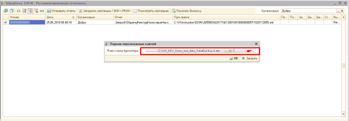
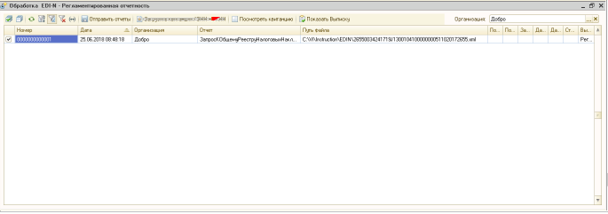

1C FTP Руководство пользователя
##################################
---------

.. contents:: Содержание:
   :depth: 6

---------

Работа с модулем
********************
Загрузка Заказов
================================================

Для получения и обработки заказов в главном окне нажмите кнопку **Заказы**.

В появившемся окне отображается журнал заказов.

Для загрузки новых заказов нажмите на кнопку **Импорт ORDERS**.

После чего появятся новые записи в журнале заказов.

Загруженные заказы не создаются сразу в 1С, а загружаются в базу данных модуля интеграции. Если на основании загруженного заказа были созданы в 1С документы **Заказ покупателя** и/или **Реализация товаров и услуг**, то ссылки на созданные документы можно увидеть в колонках **Заказ 1С** и **Расх.накл. 1С**.

Описание процедуры создания данных документов в п.2.3, 2.4.

Отправка подтверждения заказов (ORDRSP)
--------------------------------------------------

Загруженный заказ можно просмотреть, дважды кликну мышью на элементе списка, и, при необходимости, отредактировать его. Можно редактировать подтверждённое количество в столбце «Количество». Таким образом сеть получит Подтверждение заказа с количеством отличным от заказанного.

В случае, если на данном этапе по каким-то причинам невозможно указать подтверждённое количество (например если необходим запрос на склады по остаткам, что возможно после создания Реализации в 1С), есть возможность количество подтверждённое брать из Реализации созданной на основании загруженного заказа. Для этого необходимо предварительно установить соответствующую галочку в «**Настройки» – «Общие настройки интеграции**»:

После окончания редактирования установите состояние заказа в **Готов к отправке** и нажмите кнопку Записать (для сохранения изменений) или ОК (для сохранения и закрытия окна).

Для отправки подтверждения заказа отметьте в списке заказы, готовые к отправке, и нажмите кнопку **Экспорт ORDRSP**.

Изменить состояние документа (или нескольких) можно не открывая документ. Для этого необходимо выделить документ (или несколько) проставив галочки, а затем в правом верхнем углу изменить состояние на «**Готов к отправке**».

.. image:: pics_user_1C_FTP_integration/user_1C_FTP_integration_08.png
   :align: center

Если отправка прошла успешно, то состояние заказа изменится на **Отправлен**. После произведения действий с заказами изменяются состояния флагов: **ORDRSP выгружен**, **DESADV выгружен**, **RECADV загружен**.

Создание заказов в 1С
--------------------------------------------------

Для создания записи в журнале заказов 1С выберете заказ и нажмите кнопку **Создать Заказ в 1С**.

Или в окне заказа нажмите кнопку **Создать Заказ в 1С**.

В результате отобразится окно с созданным заказом (*если одновременно создаются несколько заказов, то окно не появится*).

В форме списка заказов заполнится поле **Заказ 1С** номером заказа в 1С.

.. image:: pics_user_1C_FTP_integration/user_1C_FTP_integration_13
   :align: center

Для просмотра заказа в 1С выберите заказ в списке (флажок можно не устанавливать) и нажмите кнопку **Открыть Заказ 1С**.

.. important:: На основании загруженного в базу модуля интеграции заказа возможно создать лишь один заказ в 1С.

Создание расходной накладной
--------------------------------------------------

Для создания записи в журнале расходных накладных 1С выберете заказ и нажмите кнопку **Создать Расх. накл**.

В результате отобразится окно с созданной расходной накладной (если одновременно создаются несколько расходных накладных, то окно не появится).

В форме списка заказов напротив заказа заполнится поле **Ссылки на Расх. накл**. номером документа **Реализация товаров и услуг** в 1С.

Для просмотра документа 1С **Реализация товаров и услуг** в журнале заказов дважды кликните на поле **Расх. накл. 1С**, а для просмотра формы расходных накладных — нажмите кнопку **Открыть Расх. накл. 1С** –> **Реализация товаров и услуг №XXXXXXXXX от DD.MM.YYYY hh:mm:ss**.

.. important:: На основании загруженного в EDI заказа возможно создать несколько реализаций в 1С.

Расходные накладные
--------------------------------------------------

Для работы с расходными накладными в главном окне нажмите кнопку **Расходные накладные**.

В появившемся окне отображается журнал расходных накладных.

**Важно**! В случае, если Расходная накладная была создана **Вводом на основании из Заказа 1С** (который в свою очередь был создан обработкой на основании загруженного заказа EDI(!) ), а не через обработку как описано в п. 2.4, то необходимо установить связь с заказом EDI вручную. Для этого в **форме списка Расходные накладные** необходимо установить галочки на необходимых документах и нажать кнопку Создать Акты EDI-N:

После чего, если заказ по этой Реализации был загружен обработкой, в столбце **Состояние** отобразиться статус по этой Реализации «*НЕ ОБРАБОТАН*». Это означает, что связь с заказом установлена и по такому заказу возможна отправка Уведомления об отгрузке.

Отправка уведомлений об отгрузке (DESADV)
--------------------------------------------------

Для отправки уведомлений об отгрузке выберете расходную накладную из списка и дважды кликните на ней. В появившемся окне установите состояние **Готов к отправке**.

.. image:: pics_user_1C_FTP_integration/user_1C_FTP_integration_20.png
   :align: center

Из расходной накладной можно отправить уведомление об отгрузке розничной сети, нажав кнопку **Экспорт DESADV**. Также можно отправить одно или несколько уведомлений из списка расходных накладных.

После отправки Состояние сменится с «*ГОТОВ К ОТПРАВКЕ*» на «*ОТПРАВЛЕН*».

Получение уведомлений о приеме (RECADV)
--------------------------------------------------

Для загрузки уведомлений о приеме нажмите на кнопку **Импорт RECADV**.

В расходной накладной после успешной загрузки **RECADV** изменится **Количество принятое**.

.. image:: pics_user_1C_FTP_integration/user_1C_FTP_integration_2g
   :align: center

Экспорт приложения к Уведомлению об отгрузке QUOTES для сети Розетка.
-----------------------------------------------------------------------------------------------

В форме списка **Расходные накладные** зайти в нужную Реализацию и в форме реализации нажать кнопку **QUOTES**.

В открывшейся форме справа нажать кнопку «**+**» и ввести серийные номера по позициям. Количество серийных номеров по каждой из товарных позиций должно быть равно количеству единиц этой товарной позиции в **Реализации**.

Отправка **QUOTES** происходит аналогично отправке DESADV, только по нажатию кнопки **Экспорт QUOTES**:

Отправка инструкции по транспортировке IFTMIN
--------------------------------------------------

В форме списка **Расходные накладные** зайти в нужную Реализацию и в форме реализации перейти на вкладку **Транспорт** и в открывшейся форме заполнить соответствующую информацию:

.. image:: pics_user_1C_FTP_integration/user_1C_FTP_integration_27.png
   :align: center

Отправка **IFTMIN** происходит аналогично отправке DESADV, только по нажатию кнопки **Экспорт IFTMIN**:

  
Настройка и работа с юридически значимыми документами
================================================================

**Коммерческий документ (COMDOC) и налоговая накладная (DECLAR)**

В общих настройках интеграции (**Настройки –> Общие настройки интеграции**), необходимо активировать коммерческий документ *COMDOC* и налоговую накладную *DECLAR* установив соответствующие отметки.

 В Мастере настройки (**Настройки –> Мастер настройки**) перейти на вкладку «**ITT Користувач ЦСК-1**».

**Мастер настройки**

На данную вкладку также можно перейти из формы «**Настройки**», нажав на кнопку «**ITT Користувач ЦСК-1**» 

Необходимо выполнить следующие действия:

Установить крипто-библиотеку, нажав на кнопку «**Установить библиотеку криптографии Користувач ЦСК-1**».

Если вы используете ключи ЭЦП, полученные от *АЦСК «УСЦ»* (МЕДок) или *АЦСК «Украина»*, то данный пункт можно пропустить. Если у вас ключи ЭЦП, полученные от других АЦСК (*ИДД, Masterkey* и пр.), то необходимо установить программу «**Користувач АЦСК ІДД Міндоходів**», нажав на кнопку «**Установить «Користувач АЦСК ІДД Міндоходів**» в мастере настроек.

После установки запустить программу «Користувач АЦСК ІДД Міндоходів», перейти в пункт меню «**Параметри**» и выбрать пункт «**Перейти в режим on-line**».

Далее устанавливаем путь к хранилищу сертификатов, нажать на кнопку «**Параметри**» –> «**Встановити**». В открывшемся диалоговом окне необходимо установить путь к каталогу с сертификатами, нажав на кнопку «**Змінити**».

Для того, чтоб добавить в хранилище сертификатов ваши сертификаты ЭЦП для подписания Налоговых накладных и других документов, необходимо нажать на кнопку «**Просмотр сертификатов**» на вкладке «**ITT Користувач ЦСК-1**» Мастера настройки.

В открывшемся диалоговом окне «**Сертифікати**» необходимо нажать на кнопку «**Імпортувати**» и указать путь к сертификатам, которые находятся в папке с инсталляциями необходимых программ /*install/certificates*.

Кроме переданных нами сертификатов аналогично необходимо проимпортировать сертификаты Вашей компании.

В диалоговом окне «Сертифікати» можно также проверить сертификат или удалить из хранилища.

Далее необходимо выбрать **сертификаты для шифрования ДФС** (Державної фіскальної служби) та **сертификат EDI-N**.

Далее следует указать пути для ключей ЭЦП. Для этого необходимо перейти в «**Настройки ЭЦП**».

В открывшемся окне указываем пути для ключа бухгалтера, ключа директора (при необходимости), а также ключа печати для подписания и ключа печати для шифрования.

Для всех контрагентов с которыми будет производиться обмен электронными налоговыми накладными, необходимо в настройках активировать данный тип документа - **ЭНН**.

Для отправки ЭНН необходимо:

- Загрузить обработкой интеграции заказ от розничной сети, переданный по EDI.
- На основании заказа создать в 1С расходную накладную (документ «Реализация товаров и услуг»).
- На основании Расходной накладной (документ «Реализация товаров и услуг») отправить розничной сети уведомление об отгрузке (DESADV).
- Загрузить от розничной сети документ COMDOC, отправленный в ответ на DESADV.

Для этого необходимо в обработке интеграции перейти в форму «**Коммерческий документ**».

В появившемся окне «**Коммерческие документы COMDOC**» установить период, за который необходимо загрузить документы «*COMDOC*», выбрать организацию в поле «**Организация**» и нажать на кнопку «**Загрузить COMDOC**»

На основании загруженного документа «*COMDOC*» подкорректировать (при необходимости) расходную накладную.

Если на загруженном документе COMDOC были подписи розничной сети, то в колонке «Подписан» для данного документа будет установлена соответствующая отметка.

Такой документ необходимо подтвердить, нажав на кнопку «**Подтвердить COMDOC**».

При подтверждении документа COMDOC обработка предложит выбрать ключ ЭЦП подписанта и ввести пароль подписи, а также выбрать ключ ЭЦП печати и ввести пароль подписи.

Также реализована возможность отправить отказ от подписания COMDOC.

В этом случае, в ранее загруженном Коммерческом документе необходимо заполнить поле комментарий, мотивирующий отказ от подписания.

Необходимо записать изменения и в форме списка Коммерческие документы нажать «**Экспорт отказов от подписания**», предварительно выделив необходимый документ отметкой.

. Для отправки налоговой накладной основании расходной накладной в 1С необходимо создать документ «**Налоговая накладная**».

. В обработке интеграции перейти на форму «**Налоговые накладные**», нажав на кнопку «**ЭНН/РКНН**».

 На вкладке «**Новые**» установить галочки напротив документов, на основании которых необходимо отправить ЭНН, и нажать «**Подписать и отправить ЭНН**».

При отправке электронной налоговой накладной (ЭНН) обработка предложит выбрать ключ ЭЦП подписанта и ввести пароль выбранной подписи, а также выбрать ключ ЭЦП печати и ввести пароль выбранной подписи.

После этого подписанные и зашифрованные документы **DECLAR (ЭНН)** будут отправлены на FTP, откуда будут автоматически отправлены в Единый реестр налоговых накладных (ЕРНН) для регистрации.

Ссылки на отправленные налоговые накладные перейдут на вкладку «**В обработке**».

. Для получения квитанции от **ЕРНН** о результате регистрации ЭНН, на вкладке «**В обработке**» нужно нажать на кнопку «**Получить квитанции**»

На вкладках «**В обработке**» и «**Завершённые**» отображаются события по выделенному документу «**Налоговая накладная**», а также отображается информация по нанесенным на документ подписям.

После успешной загрузки квитанций от ЕРНН, ссылки на соответствующие налоговые накладные перейдут во вкладку «**Завершённые**».

Во вкладке Завершённые, для просмотра квитанций по принятым налоговым накладным необходимо нажать «**Посмотреть квитанцию**», предварительно выбрав интересующий документ.

В случае необходимости отправки расчёта корректировки налоговой накладной необходимо создать такую корректировку в 1С.

Перейти во вкладку «**РКНН (Приложение2)**» в форме списка Налоговые накладные.

Далее действовать аналогично отправке как при отправке электронной налоговой накладной.

Также реализована возможность выгрузки **РКНН** в файл формата **XML**. Для этого в списке документов выделите необходимый и нажмите «**Выгрузить в XML**».

Вышеописанная процедура отправки НН реализована таким образом, что после подписания и отправки Вами НН она сначала передаётся контрагенту для подтверждения, а далее в ЕРНН для регистрации. В этом случае в НН передаются все необходимые реквизиты EDI.

В случае необходимости подписания и отправки НН непосредственно в ЕРНН, например по клиентам, которые не работают по EDI, необходимо воспользоваться формой отправки «**Отчётность НН**»

Если данная кнопка не активна, её необходимо активировать. Для этого перейдите в меню Настроек модуля интеграции и выберете раздел «**Общие настройки интеграции**».

.. image:: pics_user_1C_FTP_integration/user_1C_FTP_integration_50.png
   :align: center

В общих настройках интеграции установите соответствующую отметку напротив «**Используем отчётность НН**».

Порядок работы с формой «**Отчётность НН**» аналогичен работе в форме «**ЭНН/РКНН**».

Отправка Коммерческого документа с ЭЦП «Расходная накладная»
----------------------------------------------------------------------

Выполнить пункты в Мастере настройки по настройке подписания документов с ЭЦП, если ранее они не выполнялись (установить криптобиблиотеку, указать пути для ключей ЭЦП, и т.д.).

В форме списка **Коммерческие документы «COMDOC»** перейти на вкладку «**Исходящие**», из отобразившегося за вышеуказанный период списка Расходных накладных выделить галочками необходимые и нажать «**Отправить Расходную накладную**». Обработка предложит выбрать ключ ЭЦП подписанта и ввести пароль подписи, а также выбрать ключ ЭЦП печати и ввести пароль подписи после чего Коммерческий документ «**Расходная накладная**» будет отправлен для его подтверждения сетью:

После получения Коммерческого документа «**Расходная накладная**» сеть в случае отсутствия замечаний накладывает на него свою электронную подпись и печать и отправляет данный документ уже с четырьмя подписями (две подписи покупателя и две поставщика) обратно Вам после чего Вы можете его загрузить нажав на кнопку **Загрузить COMDOC** предварительно выбрав период загрузки. Если по какому-то из отправленных Вами документов на сервере уже есть подтверждённые со стороны покупателя, то они будут загружены и соответствующий статус «**Принят**» будет установлен в списке Расходных накладных:

Загрузка STATUS файлов от сети
----------------------------------------

В случае, если сеть поддерживает отправку статусов по отправленным поставщиком документам, эти статус файлы можно загрузить.

Предварительно в «**Настройки» – «Общие настройки интеграции**» необходимо установить соответствующую галочку для активации возможности загрузки таких статус файлов:

Для загрузки статус файлов необходимо выбрать **период загрузки** и нажать кнопку **Импорт STATUS**.

Загруженный статус можно просмотреть путём выбора необходимого документа и нажатия на кнопку **STATUS файлы**:

Статус файлы можно также загружать и по отправленным Коммерческим документам на соответствующей форме:

Регламентированные отчёты и запросы в ЕРНН.
================================================

В данном модуле интеграции реализована возможность отправки регламентированной отчетности с ЭЦП.

**Принцип работы модуля**:

Вне зависимости от того, как Вы сформировали регламентированные отчеты (в вашей учетной системе или с помощью модуля) Вы можете:

- сформировать отчеты заново (и они отобразятся в соответствующем журнале «Регламентированный отчет» (название журнала зависит от конфигурации 1С Предприятие) 
- сохранить отчет в формат XML
- подписать и отправить отчет
- загрузить квитанции\\реестр из ЕРНН

Для отправки регламентированной отчётности в главном меню обработки выберете «**Создать Регл.отчёты и Запрос ЕРНН**»

Откроется окно формирования регламентированной и финансовой отчётности.

При необходимости сформируйте отчёт.

Для формирования запроса выделите необходимую запись и дважды кликните по ней.

При необходимости смените организацию или период формирования, и нажмите кнопку **ОК**.

После этого в открывшейся форме нажмите на кнопку **Выгрузить в формат ГНАУ**. После чего закройте форму формирования запроса.

В появившемся окне «**Мастера выгрузки отчётов**» нажмите «Далее»:

Для сохранения отчёта выберите необходимые данные, проставив галочки, укажите путь для сохранения и нажмите «**Сформировать электронные документы в формате XML**».

Отчёт будет выгружен в указанный каталог.

Для отправки запроса в общий реестр налоговых накладных в главном меню модуля выберете «**Запрос в ЕРНН/НН и РКНН**»

В появившемся окне пометьте необходимые документы проставив галочки и нажмите «**Отправить отчёты**»

Для подписания запроса в ЕРНН обработка запросит ввести пароль для ключа бухгалтера, директора и печати предприятия (если у печати - 2 ключа, потребуется дважды ввести пароль).

Введите необходимые пароли, подтверждая каждый ввод кнопкой **ОК**.

**Загрузка квитанций**

Для загрузки квитанций нажмите кнопку «**Загрузить квитанции /ЭНН+РКНН**».

Далее обработка запросит ввести пароль печати предприятия для расшифровки квитанций.

Если при нажатии на кнопку «**Загрузить квитанции /ЭНН+РКНН**» в служебном сообщении внизу экрана отобразился текст «*Отсутствуют файлы для импорта в каталоге*» - это означает, что квитанции ещё не были получены от налоговой или все доступные квитанции уже были загружены.

Для просмотра загруженных квитанций, выделите курсором необходимый отчёт и нажмите кнопку «**Посмотреть квитанцию**».

Все загруженные квитанции для данного отчёта отобразятся на экране в текстовом виде и, по мере загрузки квитанций для этого отчёта, будут добавляться в конец документа.

