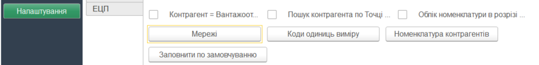
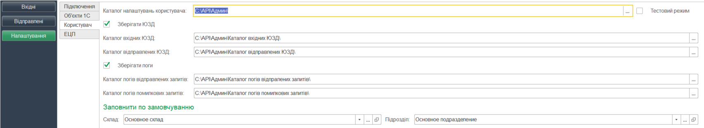
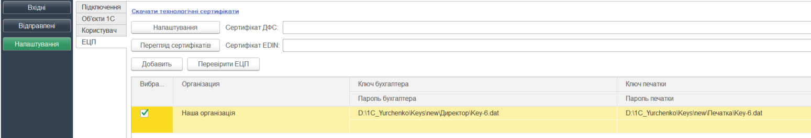

########################################################################################################
Описание файла пользовательских настроек UserSettinsg.txt модуля для интеграции с платформой EDIN 2.0 
########################################################################################################

.. contents:: Содержание:
   :depth: 6

---------

Файл **UserSettinsg.txt** создается при использовании обработки 1С интеграции API платформы EDIN 2.0. Файл **UserSettings.txt** - текстовый файл, в котором хранятся настройки пользователя обработки 1С интеграции платформы EDIN 2.0 (далее **ОИ_EDIN20**). Сохранены в файле настройки являются персональными для каждого из пользователей **ОИ_EDIN20** и полноту их заполнения определяет сам пользователь.
При первом запуске **ОИ_EDIN20** в «1С Предприятии» в каталоге, в котором размещена **ОИ_EDIN20**, проходит поиск каталога, название которого совпадает с названием текущего пользователя 1С. Если такой каталог отсутствует - он создается. В каталоге пользователя проверяется наличие файла **UserSettings.txt**. Если файл не найден - он создается. Перед началом работы необходимо убедиться, что у пользователя операционной системы есть права на чтение и запись в каталоге, в котором расположена **ОИ_EDIN20**.
Данные в файле хранятся в виде JSON строки, в котором данные разделены по определенным информативным блокам. Содержание, структура, последовательность данных файла напрямую зависит от настроек, которые внесены **ОИ_EDIN20**.

****************************************
**Данные пользователя**
****************************************

Перечень персональных данных пользователя хранится в блоке **USER_DATA**. Данные пользователь заполняет на закладке **«Настройки»**.

+---------------+------------------------------------------------------------------------+----------------------------------------------------------------------------------------------------------------------------------------------------------------------------------------------------------------------------------------------------------------------+
| **USER_DATA** |                                                                        |                                                                                                                                                                                                                                                                      |
+===============+========================================================================+======================================================================================================================================================================================================================================================================+
|               | EDIN_USER_Warehouse                                                    | Содержит JSON строку описания поиска склада 1С, который будет по умолчанию заполняться в документ 1С. Описание строки ниже. Указывается в поле «Склад».                                                                                                                       |
+---------------+------------------------------------------------------------------------+----------------------------------------------------------------------------------------------------------------------------------------------------------------------------------------------------------------------------------------------------------------------+
|               | EDIN_USER_Organization_Unit                                            | Содержит JSON строку описания поиска подразделения 1С, который будет по умолчанию заполняться в документ 1С. Описание строки ниже. Указывается в поле «Подразделение».                                                                                                                |
+---------------+------------------------------------------------------------------------+----------------------------------------------------------------------------------------------------------------------------------------------------------------------------------------------------------------------------------------------------------------------+
|               | EDIN_USER_Save_Loggs                                                   | Указывает необходимость сохранения логов при формировании записей на отправку документов. Указывается флажком «Хранить логи».                                                                                                                                       |
+---------------+------------------------------------------------------------------------+----------------------------------------------------------------------------------------------------------------------------------------------------------------------------------------------------------------------------------------------------------------------+
|               | EDIN_USER_Log_Folder_Sent                                              | Каталог сохранения логов успешно отправленных запросов. Указывается в поле «Каталог логов отправленных запросов».                                                                                                                                                       |
+---------------+------------------------------------------------------------------------+----------------------------------------------------------------------------------------------------------------------------------------------------------------------------------------------------------------------------------------------------------------------+
|               | EDIN_USER_Log_Folder_Error                                             | Каталог сохранения логов запросов с ошибками. Указывается в поле «Каталог логов ошибочных запросов».                                                                                                                                                                  |
+---------------+------------------------------------------------------------------------+----------------------------------------------------------------------------------------------------------------------------------------------------------------------------------------------------------------------------------------------------------------------+
|               | EDIN_USER_Test_Mode                                                    | Указывает на необходимость создания черновиков (не документов) и просмотра уже созданных. Указывается флажком «Тестовый режим». Если флажок не установлен, тогда в таблице закладки «Отправленные» черновики не отображаются, а при отправке формируются документы. |
+---------------+------------------------------------------------------------------------+----------------------------------------------------------------------------------------------------------------------------------------------------------------------------------------------------------------------------------------------------------------------+
|               | EDIN_USER_Save_UZD_DOCUMENTS                                           | Указывает на необходимость сохранения полученных и отправленных юридически значимых документов локально. Указывается флажком «Хранить ЮЗД».                                                                                                                              |
+---------------+------------------------------------------------------------------------+----------------------------------------------------------------------------------------------------------------------------------------------------------------------------------------------------------------------------------------------------------------------+
|               | EDIN_USER_Inbox_UZD_Folder                                             | Каталог сохранения входящих ЮЗД. Указывается в поле «Каталог входных ЮЗД».                                                                                                                                                                                             |
+---------------+------------------------------------------------------------------------+----------------------------------------------------------------------------------------------------------------------------------------------------------------------------------------------------------------------------------------------------------------------+
|               | EDIN_USER_Outbox_UZD_Folder                                            | Каталог сохранения отправленных ЮЗД. Указывается в поле «Каталог отправленных ЮЗД».                                                                                                                                                                                   |
+---------------+------------------------------------------------------------------------+----------------------------------------------------------------------------------------------------------------------------------------------------------------------------------------------------------------------------------------------------------------------+
|               | USER_1                                                                 | Название пользователя с табличной части подключения в колонке «Имя», в строке которого установлен флажок «Выбрать».                                                                                                                                     |
+---------------+------------------------------------------------------------------------+----------------------------------------------------------------------------------------------------------------------------------------------------------------------------------------------------------------------------------------------------------------------+
|               | ...                                                                    |                                                                                                                                                                                                                                                                      |
+---------------+------------------------------------------------------------------------+----------------------------------------------------------------------------------------------------------------------------------------------------------------------------------------------------------------------------------------------------------------------+
|               | USER_[количество пользователей API, с которыми работает пользователь ОИ_EDIN20] |                                                                                                                                                                                                                                                                      |
+---------------+------------------------------------------------------------------------+----------------------------------------------------------------------------------------------------------------------------------------------------------------------------------------------------------------------------------------------------------------------+
|               | USER_RETAILERS                                                         | Блок списка сетей, с которыми работает пользователь. Список избирается в форме сетей после нажатия кнопки «Сети»                                                                                                                                                       |
+---------------+------------------------------------------------------------------------+----------------------------------------------------------------------------------------------------------------------------------------------------------------------------------------------------------------------------------------------------------------------+
|               | Retailer1                                                              | ИД выбранной сети                                                                                                                                                                                                                                                  |
+---------------+------------------------------------------------------------------------+----------------------------------------------------------------------------------------------------------------------------------------------------------------------------------------------------------------------------------------------------------------------+
|               | ...                                                                    |                                                                                                                                                                                                                                                                      |
+---------------+------------------------------------------------------------------------+----------------------------------------------------------------------------------------------------------------------------------------------------------------------------------------------------------------------------------------------------------------------+
|               | Retailer[порядковый номер выбранной сети]                             | ИД выбранной сети                                                                                                                                                                                                                                                  |
+---------------+------------------------------------------------------------------------+----------------------------------------------------------------------------------------------------------------------------------------------------------------------------------------------------------------------------------------------------------------------+

****************************************
**Электронно-цифровые подписи**
****************************************

Список ключей, которые пользователь использует или будет использовать указывается на закладке **ЭЦП**. На момент подписания в табличной части по одной организации может быть установлен флажок только по одной из строк. Это необходимо, чтобы при подписании однозначно определить необходимую пару ключей. Внесенные ключи хранятся в блоке **SIGN_KEYS**.

+---------------+---------------------+-----------------+-------------------------------------------------------------------------------------------------------------+
| **SIGN_KEYS** |                     |                 | Описание                                                    |
+===============+=====================+=================+=============================================================================================================+
|               | Keys_1              |                 | Блок описания пары подписей организации                                                                      |
+---------------+---------------------+-----------------+-------------------------------------------------------------------------------------------------------------+
|               |                     | Use             | Отметка использования данной парі ключей. Указывается в колонке «Выбрать»                               |
+---------------+---------------------+-----------------+-------------------------------------------------------------------------------------------------------------+
|               |                     | Organization    | Уникальный идентификатор справочника организации. Определяется по значению указанному в колонке «Организация» |
+---------------+---------------------+-----------------+-------------------------------------------------------------------------------------------------------------+
|               |                     | KeyAccountant   | Полный путь к ключу бухгалтера. Указывается в колонке «Ключ бухгалтера»                                    |
+---------------+---------------------+-----------------+-------------------------------------------------------------------------------------------------------------+
|               |                     | KeyDigitalStamp | Полный путь к ключу печати. Указывается в колонке «Ключ печати»                                          |
+---------------+---------------------+-----------------+-------------------------------------------------------------------------------------------------------------+
|               | ...                 |                 |                                                                                                             |
+---------------+---------------------+-----------------+-------------------------------------------------------------------------------------------------------------+
|               | Keys_[к-во строк] |                 |                                                                                                             |
+---------------+---------------------+-----------------+-------------------------------------------------------------------------------------------------------------+

***************************************************
**Пример файла пользовательских настроек**
***************************************************

::

        {
            "USER_DATA": {
                "EDIN_USER_Warehouse": "{\r\n\"MetaDataObject\": \"Справочники\",\r\n\"Name\": \"Склады\",\r\n\"ID\": \"59c9e0fe-56a3-11e9-941e-70c94ef89d69\"\r\n}",
                "EDIN_USER_Organization_Unit": "{\r\n\"MetaDataObject\": \"Справочники\",\r\n\"Name\": \"ПодразделенияОрганизаций\",\r\n\"ID\": \"59c9e0fb-56a3-11e9-941e-70c94ef89d69\"\r\n}",
                "EDIN_USER_Save_Loggs": "1",
                "EDIN_USER_Log_Folder_Sent": "C:\\API\\Админ\\Каталог логів відпралених запитів\\",
                "EDIN_USER_Log_Folder_Error": "C:\\API\\Админ\\Каталог логів помилкових запитів\\",
                "EDIN_USER_Test_Mode": "1",
                "EDIN_USER_Save_UZD_DOCUMENTS": "1",
                "EDIN_USER_Inbox_UZD_Folder": "C:\\API\\Админ\\Каталог вхідних ЮЗД\\",
                "EDIN_USER_Outbox_UZD_Folder": "C:\\API\\Админ\\Каталог відправлених ЮЗД\\",
                "USER_1": "uatestAPIpost",
                "USER_RETAILERS": {
                    "retailer1": "16404",
                    "retailer2": "17046"
                }
            },
            "SIGN_KEYS": {
                "Keys_1": {
                    "Use": 1,
                    "Organization": "59c9e0fa-56a3-11e9-941e-70c94ef89d69",
                    "KeyAccountant": "D:\\1C_Yurchenko\\Keys\\new\\Директор\\Key-6.dat",
                    "KeyDigitalStamp": "D:\\1C_Yurchenko\\Keys\\new\\Печатка\\Key-6.dat"
                }
            }
        }

