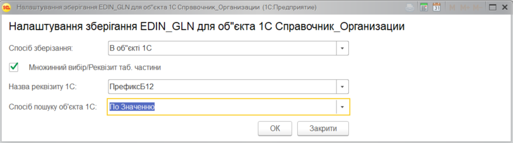
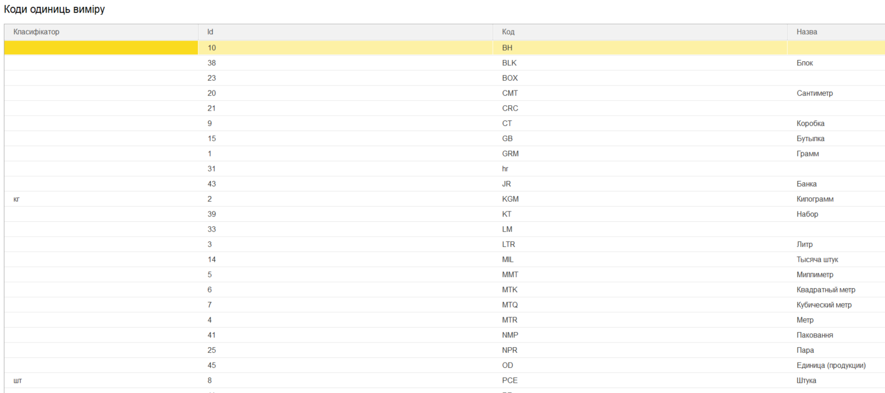

#############################################################################################
Описание конфигурационного файла Config.txt модуля для интеграции с платформой EDIN 2.0 
#############################################################################################

.. contents:: Содержание:
   :depth: 6

---------

Файл **Config.txt** создается при использовании обработки 1С интеграции API платформы EDIN 2.0. Файл **Config.txt** - текстовый файл, в котором хранятся основные настройки обработки 1С интеграции платформы EDIN 2.0 (далее **ОИ_EDIN20**). Настройка являются общей для всех пользователей **ОИ_EDIN20**, поэтому ее заполнение необходимо сделать в самом начале использования интеграции и внимательно подходить к ее изменению в будущем.

Типичная интеграция электронного документооборота EDIN не предусматривает внесения изменений в конфигурацию, поэтому **ОИ_EDIN20** позволяет пользователю выбрать место сохранения данных EDIN.

Есть два способа хранения данных:
1) В дополнительных свойствах объекта 1С. Рассматривается **ОИ_EDIN20** как наиболее предпочтительный, указывается по умолчанию при нажатии кнопок «Заполнить по умолчанию».
2) Непосредственно в объекте 1С в определенном реквизите.
При определении желаемых способов хранения данных EDIN необходимо убедиться, что у всех пользователей **ОИ_EDIN20** есть права на изменение и чтение соответствующих объектов 1С.
Кроме описания места хранения можно указать, что именно будет храниться для идентификации данных. Это необходимо в случае использования при установлении соответствия со справочниками, которые не предусмотрены для указания в качестве значений для дополнительных свойств или в объекте 1С отсутствует реквизит для его сохранения. Предусмотрены следующие способы поиска:
- По значению - указывает, что будет непосредственно храниться требуемое значение;
- По Коду - сохраняется код выбранного элемента справочника;
- По Названию - сохраняется название выбранного элемента справочника.
Заполнение настроек сохранения данных EDIN выполняется на закладке «Объекты 1С» в таблицах. Сохранение одной настройки описывается отдельным блоком в файле **Config.txt**. Блок заполняется на основании данных, которые пользователь может просмотреть в форме внесения настроек.

+---------------+--------------------------------------------------------------------------------------------------------------------------------------------------------------------------------------------------------------------------------------------------------------+
| Setting_Name  |                                                                                                                      Название настройки                                                                                                                      |
+===============+==============================================================================================================================================================================================================================================================+
| Storage_Index | Индекс способа хранения данных (отсчет начинается с 0)                                                                                                                                                                                                       |
+---------------+--------------------------------------------------------------------------------------------------------------------------------------------------------------------------------------------------------------------------------------------------------------+
| Multi_Data    | Указывает на необходимость сохранения нескольких данных (например несколько GLN для организации) или для возможности выбирать реквизит табличной части (например, для указания колонки таблицы документа, в которой хранится количество товара для выгрузки) |
+---------------+--------------------------------------------------------------------------------------------------------------------------------------------------------------------------------------------------------------------------------------------------------------+
| Prop_Name     | Название реквизита объекта 1С, в котором будут храниться данные. Заполняется при указанном способе сохранения «В объекте 1С»                                                                                                                                 |
+---------------+--------------------------------------------------------------------------------------------------------------------------------------------------------------------------------------------------------------------------------------------------------------+
| Search_Index  | Способ поиска объекта 1С (отсчет начинается с 0)                                                                                                                                                                                                             |
+---------------+--------------------------------------------------------------------------------------------------------------------------------------------------------------------------------------------------------------------------------------------------------------+

****************************************
**Настройка справочников**
****************************************

В файле ** Config.txt ** настройки для справочников хранятся в блоке **Catalog1C_Settings**.

+------------------------+----------------------------+---------------------+--------------------------------------------------------------------------------------------------------------------------------------------------------------------+
| **Catalog1C_Settings** | Блок настроек справочников |                     |                                                                              Описание                                                                              |
+========================+============================+=====================+====================================================================================================================================================================+
|                        | Organization               |                     | Блок сохранения настроек для организаций                                                                                                                           |
+------------------------+----------------------------+---------------------+--------------------------------------------------------------------------------------------------------------------------------------------------------------------+
|                        |                            | Catalog1C           | Название справочника 1С к элементам которого в соответствии относятся организации на платформе                                                                     |
+------------------------+----------------------------+---------------------+--------------------------------------------------------------------------------------------------------------------------------------------------------------------+
|                        |                            | EDIN_GLN            | Блок описания настройки по сохранению GLN организации                                                                                                              |
+------------------------+----------------------------+---------------------+--------------------------------------------------------------------------------------------------------------------------------------------------------------------+
|                        | Partner                    |                     |                                                                                                                                                                    |
+------------------------+----------------------------+---------------------+--------------------------------------------------------------------------------------------------------------------------------------------------------------------+
|                        |                            | Catalog1C           | Название справочника 1С элементам которого в соответствии относятся партнеров на платформе                                                                         |
+------------------------+----------------------------+---------------------+--------------------------------------------------------------------------------------------------------------------------------------------------------------------+
|                        |                            | EDIN_GLN            | Блок описания настройки по сохранению GLN партнера                                                                                                                 |
+------------------------+----------------------------+---------------------+--------------------------------------------------------------------------------------------------------------------------------------------------------------------+
|                        |                            | EDIN_Forma          | Блок описания настройки по сохранению формата                                                                                                                      |
+------------------------+----------------------------+---------------------+--------------------------------------------------------------------------------------------------------------------------------------------------------------------+
|                        |                            | FormatTaxInvoice    | Выгрузка налоговых накладных. Возможные значения: 0 - выгрузки не предусмотрено, 1 - по умолчанию, 2 - Метро                                                       |
+------------------------+----------------------------+---------------------+--------------------------------------------------------------------------------------------------------------------------------------------------------------------+
|                        |                            | EDIN_BasePrice      | Блок описания настройки по сохранению необходимости заполнению цен из базы при заполнении документа 1С                                                             |
+------------------------+----------------------------+---------------------+--------------------------------------------------------------------------------------------------------------------------------------------------------------------+
|                        |                            | EDIN_Price_Incl_NDS | Блок описания настройки по сохранению необходимости заполнению цен с НДС при заполнении документа 1С                                                               |
+------------------------+----------------------------+---------------------+--------------------------------------------------------------------------------------------------------------------------------------------------------------------+
|                        |                            | EDIN_AvtoExchange   | Блок описания настройки по сохранению отметки включения контрагента в список для автоматического обмена документами                                                |
+------------------------+----------------------------+---------------------+--------------------------------------------------------------------------------------------------------------------------------------------------------------------+
|                        | DeliveryPoint              |                     |                                                                                                                                                                    |
+------------------------+----------------------------+---------------------+--------------------------------------------------------------------------------------------------------------------------------------------------------------------+
|                        |                            | Catalog1C           | Название справочника 1С элементам которого в соответствии относятся точек доставки на платформе                                                                    |
+------------------------+----------------------------+---------------------+--------------------------------------------------------------------------------------------------------------------------------------------------------------------+
|                        |                            | EDIN_GLN            | Блок описания настройки по сохранению GLN точки доставки                                                                                                           |
+------------------------+----------------------------+---------------------+--------------------------------------------------------------------------------------------------------------------------------------------------------------------+
|                        |                            | EDIN_MetroCode      | Блок описания настроек по сохранению двузначного кода, который используется при отправки пакета Метро                                                              |
+------------------------+----------------------------+---------------------+--------------------------------------------------------------------------------------------------------------------------------------------------------------------+
|                        |                            | EDIN_Partner        | Блок описания настройки по сохранению контрагента, которому принадлежит точка доставки. Используется при установленном флагу «Поиск контрагента по точке доставки» |
+------------------------+----------------------------+---------------------+--------------------------------------------------------------------------------------------------------------------------------------------------------------------+

************************************************
**Настройка документов поставщика**
************************************************

У файле **Config.txt** настройки для документов поставщика хранятся в блоке **Supplier_Documents**. Структура блока аналогична блока настроек справочников.

+------------------------+-------------------------------------+---------------------+----------------------------------------------------------------------------------------------------------------------------------------------------------+
| **Supplier_Documents** | Блок настроек документов поставщика |                     |                                                                         Описание                                                                         |
+========================+=====================================+=====================+==========================================================================================================================================================+
|                        | ORDER                               |                     | Блок сохранения настроек для заказов покупателя                                                                                                          |
+------------------------+-------------------------------------+---------------------+----------------------------------------------------------------------------------------------------------------------------------------------------------+
|                        |                                     | Document1с          | Название документа 1С который будет создаваться на основании заказа                                                                                      |
+------------------------+-------------------------------------+---------------------+----------------------------------------------------------------------------------------------------------------------------------------------------------+
|                        |                                     | EDIN_ID             | Блок описания настройки по сохранению идентификатора документа с платформы EDIN                                                                          |
+------------------------+-------------------------------------+---------------------+----------------------------------------------------------------------------------------------------------------------------------------------------------+
|                        |                                     | EDIN_ID_CHAIN       | Блок описания настройки по сохранению идентификатора цепочки документов с платформы EDIN, к которому относится заказ EDIN                                |
+------------------------+-------------------------------------+---------------------+----------------------------------------------------------------------------------------------------------------------------------------------------------+
|                        |                                     | EDIN_DocumentNumber | Блок описания настройки по сохранению номера заказа EDIN                                                                                                 |
+------------------------+-------------------------------------+---------------------+----------------------------------------------------------------------------------------------------------------------------------------------------------+
|                        |                                     | EDIN_DocumentDate   | Блок описания настройки по сохранению даты заказа EDIN                                                                                                   |
+------------------------+-------------------------------------+---------------------+----------------------------------------------------------------------------------------------------------------------------------------------------------+
|                        |                                     | EDIN_Partner        | Блок описания настройки по сохранению элемента справочника 1С, отвечающий покупателю в заказе EDIN                                                       |
+------------------------+-------------------------------------+---------------------+----------------------------------------------------------------------------------------------------------------------------------------------------------+
|                        |                                     | EDIN_DeliveryPoint  | Блок описания настройки по сохранению элемента справочника 1С, соответствующий точке доставки в заказе EDIN                                              |
+------------------------+-------------------------------------+---------------------+----------------------------------------------------------------------------------------------------------------------------------------------------------+
|                        |                                     | EDIN_Quantity       | Блок описания настройки по сохранению количества по заказу EDIN в табличной части документа 1С                                                           |
+------------------------+-------------------------------------+---------------------+----------------------------------------------------------------------------------------------------------------------------------------------------------+
|                        | ORDRSP                              |                     | Блок збереження налаштувань для вивантаження підтвердження замовлення                                                                                    |
+------------------------+-------------------------------------+---------------------+----------------------------------------------------------------------------------------------------------------------------------------------------------+
|                        |                                     | Document1с          | Название документа 1С который будет выступать основанием для выгрузки подтверждения заказа                                                               |
+------------------------+-------------------------------------+---------------------+----------------------------------------------------------------------------------------------------------------------------------------------------------+
|                        |                                     | EDIN_ID             | Блок описания настройки по сохранению идентификатора документа с платформы EDIN при выгрузке подтверждения заказа                                        |
+------------------------+-------------------------------------+---------------------+----------------------------------------------------------------------------------------------------------------------------------------------------------+
|                        |                                     | EDIN_ID_CHAIN       | Блок описания настройки по сохранению идентификатора цепочки документов с платформы EDIN, к которому относится подтверждения заказа EDIN                 |
+------------------------+-------------------------------------+---------------------+----------------------------------------------------------------------------------------------------------------------------------------------------------+
|                        |                                     | EDIN_DocumentNumber | Блок описания настройки по сохранению места поиска номера для подтверждения заказа EDIN                                                                  |
+------------------------+-------------------------------------+---------------------+----------------------------------------------------------------------------------------------------------------------------------------------------------+
|                        |                                     | EDIN_DocumentDate   | Блок описания настройки по сохранению места поиска даты для подтверждения заказа EDIN                                                                    |
+------------------------+-------------------------------------+---------------------+----------------------------------------------------------------------------------------------------------------------------------------------------------+
|                        |                                     | EDIN_Quantity       | Блок описания настройки по сохранению места поиска количества для подтверждения заказа EDIN в табличной части документа                                  |
+------------------------+-------------------------------------+---------------------+----------------------------------------------------------------------------------------------------------------------------------------------------------+
|                        | DESADV                              |                     | Блок сохранения настроек для создания документа реализации и настройки для выгрузки сообщение об отгрузке                                                |
+------------------------+-------------------------------------+---------------------+----------------------------------------------------------------------------------------------------------------------------------------------------------+
|                        |                                     | Document1с          | Название документа 1С который будет создаваться на основании заказа                                                                                      |
+------------------------+-------------------------------------+---------------------+----------------------------------------------------------------------------------------------------------------------------------------------------------+
|                        |                                     | EDIN_ID             | Блок описания настройки по сохранению идентификатора документа с платформы EDIN при выгрузке сообщения об отгрузке                                       |
+------------------------+-------------------------------------+---------------------+----------------------------------------------------------------------------------------------------------------------------------------------------------+
|                        |                                     | EDIN_ID_CHAIN       | Блок описания настройки по сохранению идентификатора цепочки документов с платформы EDIN, к которому относится документ 1С                               |
+------------------------+-------------------------------------+---------------------+----------------------------------------------------------------------------------------------------------------------------------------------------------+
|                        |                                     | EDIN_DocumentNumber | Блок описания настройки по сохранению места поиска номера сообщения об отгрузке EDIN                                                                     |
+------------------------+-------------------------------------+---------------------+----------------------------------------------------------------------------------------------------------------------------------------------------------+
|                        |                                     | EDIN_DocumentDate   | Блок описания настройки по сохранению места поиска даты для сообщения об отгрузке EDIN                                                                   |
+------------------------+-------------------------------------+---------------------+----------------------------------------------------------------------------------------------------------------------------------------------------------+
|                        |                                     | EDIN_Partner        | Блок описания настройки по сохранению элемента справочника 1С, отвечающий покупателю в заказе EDIN                                                       |
+------------------------+-------------------------------------+---------------------+----------------------------------------------------------------------------------------------------------------------------------------------------------+
|                        |                                     | EDIN_DeliveryPoint  | Блок описания настройки по сохранению элемента справочника 1С, соответствующий точке доставки в заказе EDIN                                              |
+------------------------+-------------------------------------+---------------------+----------------------------------------------------------------------------------------------------------------------------------------------------------+
|                        |                                     | EDIN_Quantity       | Блок описания настройки по сохранению количества в табличной части документа 1С по заказу EDIN и получения количества для выгрузки сообщение об отгрузке |
+------------------------+-------------------------------------+---------------------+----------------------------------------------------------------------------------------------------------------------------------------------------------+
|                        | RECADV                              |                     | Блок сохранения настроек для загрузки сообщения о приеме                                                                                                 |
+------------------------+-------------------------------------+---------------------+----------------------------------------------------------------------------------------------------------------------------------------------------------+
|                        |                                     | Document1с          | Название документа 1С, который будет содержать данные сообщения о приеме                                                                                 |
+------------------------+-------------------------------------+---------------------+----------------------------------------------------------------------------------------------------------------------------------------------------------+
|                        |                                     | EDIN_ID             | Блок описания настройки по сохранению идентификатора документа с платформы EDIN при загрузке                                                             |
+------------------------+-------------------------------------+---------------------+----------------------------------------------------------------------------------------------------------------------------------------------------------+
|                        |                                     | EDIN_ID_CHAIN       | Блок описания настройки по сохранению идентификатора цепочки документов с платформы EDIN, к которому относится сообщение о приеме EDIN                   |
+------------------------+-------------------------------------+---------------------+----------------------------------------------------------------------------------------------------------------------------------------------------------+
|                        |                                     | EDIN_DocumentNumber | Блок описания настройки по сохранению места сохранения номера сообщения о приеме EDIN                                                                    |
+------------------------+-------------------------------------+---------------------+----------------------------------------------------------------------------------------------------------------------------------------------------------+
|                        |                                     | EDIN_DocumentDate   | Блок описания настройки по сохранению места хранения даты уведомления о приеме EDIN                                                                      |
+------------------------+-------------------------------------+---------------------+----------------------------------------------------------------------------------------------------------------------------------------------------------+
|                        |                                     | EDIN_Quantity       | Блок описания настройки по сохранению места сохранения количества сообщение о приеме EDIN в табличной части документа                                    |
+------------------------+-------------------------------------+---------------------+----------------------------------------------------------------------------------------------------------------------------------------------------------+
|                        | INVOICE                             |                     | Блок сохранения настроек для выгрузки счета                                                                                                              |
+------------------------+-------------------------------------+---------------------+----------------------------------------------------------------------------------------------------------------------------------------------------------+
|                        |                                     | Document1с          | Название документа 1С, выступающий основанием для выгрузки счета                                                                                         |
+------------------------+-------------------------------------+---------------------+----------------------------------------------------------------------------------------------------------------------------------------------------------+
|                        |                                     | EDIN_ID_CHAIN       | Блок описания настройки по сохранению идентификатора цепочки документов с платформы EDIN, к которому относится документ 1С                               |
+------------------------+-------------------------------------+---------------------+----------------------------------------------------------------------------------------------------------------------------------------------------------+
|                        |                                     | EDIN_DocumentNumber | Блок опису налаштування по збереженню місця пошуку номера для рахунку EDIN                                                                               |
+------------------------+-------------------------------------+---------------------+----------------------------------------------------------------------------------------------------------------------------------------------------------+
|                        |                                     | EDIN_DocumentDate   | Блок описания настройки по сохранению места поиска даты для счета EDIN                                                                                   |
+------------------------+-------------------------------------+---------------------+----------------------------------------------------------------------------------------------------------------------------------------------------------+
|                        |                                     | EDIN_Quantity       | Блок описания настройки для получения количества для выгрузки счета EDIN                                                                                 |
+------------------------+-------------------------------------+---------------------+----------------------------------------------------------------------------------------------------------------------------------------------------------+
|                        | COMDOC_006                          |                     | Блок сохранения настроек для выгрузки коммерческого документа «Расходная накладная»                                                                      |
+------------------------+-------------------------------------+---------------------+----------------------------------------------------------------------------------------------------------------------------------------------------------+
|                        |                                     | Document1с          | Назва документа 1С, який виступає підставою для вивантаження рахунку                                                                                     |
+------------------------+-------------------------------------+---------------------+----------------------------------------------------------------------------------------------------------------------------------------------------------+
|                        |                                     | EDIN_ID             | Блок опису налаштування по збереженню ідентифікатора документа із платформи EDIN при вивантаженні видаткової накладної EDIN                              |
+------------------------+-------------------------------------+---------------------+----------------------------------------------------------------------------------------------------------------------------------------------------------+
|                        |                                     | EDIN_ID_CHAIN       | Блок описания настройки по сохранению идентификатора цепочки документов с платформы EDIN, к которому относится документ 1С                               |
+------------------------+-------------------------------------+---------------------+----------------------------------------------------------------------------------------------------------------------------------------------------------+
|                        |                                     | EDIN_DocumentNumber | Блок описания настройки по сохранению места поиска номера расходной накладной EDIN                                                                       |
+------------------------+-------------------------------------+---------------------+----------------------------------------------------------------------------------------------------------------------------------------------------------+
|                        |                                     | EDIN_DocumentDate   | Блок описания настройки по сохранению места поиска даты для расходной накладной EDIN                                                                     |
+------------------------+-------------------------------------+---------------------+----------------------------------------------------------------------------------------------------------------------------------------------------------+
|                        |                                     | EDIN_Partner        | Блок описания настройки по сохранению места поиска даты для расходной накладной EDIN                                                                     |
+------------------------+-------------------------------------+---------------------+----------------------------------------------------------------------------------------------------------------------------------------------------------+
|                        |                                     | EDIN_DeliveryPoint  | Блок описания настройки по поиску точки доставки в документе 1С при выгрузке расходной накладной EDIN                                                    |
+------------------------+-------------------------------------+---------------------+----------------------------------------------------------------------------------------------------------------------------------------------------------+
|                        |                                     | EDIN_Quantity       | Блок описания настройки для получения количества для выгрузки расходной накладной EDIN                                                                   |
+------------------------+-------------------------------------+---------------------+----------------------------------------------------------------------------------------------------------------------------------------------------------+
|                        | COMDOC_007                          |                     | Блок сохранения настроек для загрузки коммерческих документов «Приходная накладная»                                                                      |
+------------------------+-------------------------------------+---------------------+----------------------------------------------------------------------------------------------------------------------------------------------------------+
|                        |                                     | Document1с          | Название документа 1С, который будет соответствовать загруженному документу EDIN                                                                         |
+------------------------+-------------------------------------+---------------------+----------------------------------------------------------------------------------------------------------------------------------------------------------+
|                        |                                     | EDIN_ID             | Блок описания настройки по сохранению идентификатора документа с платформы EDIN                                                                          |
+------------------------+-------------------------------------+---------------------+----------------------------------------------------------------------------------------------------------------------------------------------------------+
|                        |                                     | EDIN_ID_CHAIN       | Блок описания настройки по сохранению идентификатора документа с платформы EDIN                                                                          |
+------------------------+-------------------------------------+---------------------+----------------------------------------------------------------------------------------------------------------------------------------------------------+
|                        |                                     | EDIN_DocumentNumber | Блок описания настройки по сохранению номера коммерческого документа EDIN                                                                                |
+------------------------+-------------------------------------+---------------------+----------------------------------------------------------------------------------------------------------------------------------------------------------+
|                        |                                     | EDIN_DocumentDate   | Блок описания настройки по сохранению даты коммерческого документа EDIN                                                                                  |
+------------------------+-------------------------------------+---------------------+----------------------------------------------------------------------------------------------------------------------------------------------------------+
|                        | DECLAR                              |                     | Блок сохранения настроек для выгрузки налоговой накладной                                                                                                |
+------------------------+-------------------------------------+---------------------+----------------------------------------------------------------------------------------------------------------------------------------------------------+
|                        |                                     | EDIN_ID             | Блок описания настройки по сохранению идентификатора документа с платформы EDIN при выгрузке налоговой накладной EDIN                                    |
+------------------------+-------------------------------------+---------------------+----------------------------------------------------------------------------------------------------------------------------------------------------------+
|                        |                                     | EDIN_ID_CHAIN       | Блок описания настройки по сохранению идентификатора цепочки документов с платформы EDIN, к которому относится документ 1С                               |
+------------------------+-------------------------------------+---------------------+----------------------------------------------------------------------------------------------------------------------------------------------------------+

************************************************
**Настройка единиц измерения**
************************************************

На платформе предусмотрено условно постоянный список кодов единиц измерения, используемых платформа. Для корректной загрузки позиций номенклатуры необходимо указывать им соответствие в 1C. Блок соответствии единиц измерения называется **UNITS**.
Список единиц измерения платформы **EDIN20** описываются в форме, которая открывается при нажатии кнопки «Коды единиц измерения». Каждая строка в таблице с заполненным значением в колонке «Классификатор» описывается в отдельном подблоке **UNIT_[текущий номер заполнении строки]**.

+-----------+-------------------------------------------------------------------------------------+-------+---------------------------------------------------------+
| **UNITS** |                                                                                     |       |                        Описание                         |
+===========+=====================================================================================+=======+=========================================================+
|           | UNIT_1                                                                              |       |                                                         |
+-----------+-------------------------------------------------------------------------------------+-------+---------------------------------------------------------+
|           |                                                                                     | id    | Идентификационный номер на платформе                    |
+-----------+-------------------------------------------------------------------------------------+-------+---------------------------------------------------------+
|           |                                                                                     | name  | Кодовое название                                        |
+-----------+-------------------------------------------------------------------------------------+-------+---------------------------------------------------------+
|           |                                                                                     | 1C_ID | Уникальный идентификатор 1С выбранной единицы измерения |
+-----------+-------------------------------------------------------------------------------------+-------+---------------------------------------------------------+
|           | UNIT_2                                                                              |       |                                                         |
+-----------+-------------------------------------------------------------------------------------+-------+---------------------------------------------------------+
|           | ...                                                                                 |       |                                                         |
+-----------+-------------------------------------------------------------------------------------+-------+---------------------------------------------------------+
|           | UNIT_[количество строк в таблице с заполненным значением в колонке «Классификатор»] |       |                                                         |
+-----------+-------------------------------------------------------------------------------------+-------+---------------------------------------------------------+

****************************************
**Пример конфигурационного файла**
****************************************

::

    {
        "API_USERS": {
            "USER_1": {
                "login": "bb8442f8d12ab8dff75997f7890e7a248e8110bcb3371c870a68",
                "api_key": "bbb242acd166b8fcf71e97c5897e7a328efa10f8b36c1ccc0a5d268c7b3f3aa86500e2294f0ec33d33dfa8550a8933fb6aaad1269b056b1543845b7843d8e10d",
                "password": "bbc242ddd112b8eff74797f5"
            }
        },
        "General_Settings": {
            "EDIN_Configuration_1C_Type": "БП30",
            "EDIN_API_address": "https://edo-v2.edi-n.com/",
            "EDIN_Partner_Equal_Consignee": 0,
            "EDIN_Search_Partner_By_Delivery_Point": 0,
            "EDIN_Use_Characteristics": 0,
            "EDIN_Order_Upload_Date": 0,
            "EDIN_Realization_Upload_Date": 0,
            "EDIN_EUTaxService_СертификатМДС": "",
            "EDIN_EUTaxService_СертификатEDIN": ""
        },
        "Catalog1C_Settings": {
            "Organization": {
                "Catalog1C": "Организации",
                "EDIN_GLN": {
                    "Setting_Name": "EDIN_GLN",
                    "Storage_Index": 0,
                    "Multi_Data": 1,
                    "Search_Index": 0
                }
            },
            "Partner": {
                "Catalog1C": "Контрагенты",
                "EDIN_GLN": {
                    "Setting_Name": "EDIN_GLN",
                    "Storage_Index": 0,
                    "Search_Index": 0
                },
                "EDIN_FormatTaxInvoice": {
                    "Setting_Name": "EDIN_FormatTaxInvoice",
                    "Storage_Index": 0,
                    "Search_Index": 0
                },
                "EDIN_BasePrice": {
                    "Setting_Name": "EDIN_BasePrice",
                    "Storage_Index": 0,
                    "Search_Index": 0
                },
                "EDIN_Price_Incl_NDS": {
                    "Setting_Name": "EDIN_Price_Incl_NDS",
                    "Storage_Index": 0,
                    "Search_Index": 0
                },
                "EDIN_AvtoExchange": {
                    "Setting_Name": "EDIN_AvtoExchange",
                    "Storage_Index": 0,
                    "Search_Index": 0
                }
            },
            "DeliveryPoint": {
                "Catalog1C": "Контрагенты",
                "EDIN_GLN": {
                    "Setting_Name": "EDIN_GLN",
                    "Storage_Index": 0,
                    "Search_Index": 0
                },
                "EDIN_MetroCode": {
                    "Setting_Name": "EDIN_MetroCode",
                    "Storage_Index": 0,
                    "Search_Index": 0
                },
                "EDIN_Partner": {
                    "Setting_Name": "EDIN_Partner",
                    "Storage_Index": 0,
                    "Search_Index": 0
                }
            }
        },
        "Supplier_Documents": {
            "ORDER": {
                "Document1с": "СчетНаОплатуПокупателю",
                "EDIN_ID": {
                    "Setting_Name": "EDIN_ID",
                    "Storage_Index": 0,
                    "Search_Index": 0
                },
                "EDIN_ID_CHAIN": {
                    "Setting_Name": "EDIN_ID_CHAIN",
                    "Storage_Index": 0,
                    "Search_Index": 0
                },
                "EDIN_DocumentNumber": {
                    "Setting_Name": "EDIN_DocumentNumber",
                    "Storage_Index": 0,
                    "Search_Index": 0
                },
                "EDIN_DocumentDate": {
                    "Setting_Name": "EDIN_DocumentDate",
                    "Storage_Index": 0,
                    "Search_Index": 0
                },
                "EDIN_Partner": {
                    "Setting_Name": "EDIN_Partner",
                    "Storage_Index": 0,
                    "Search_Index": 0
                },
                "EDIN_DeliveryPoint": {
                    "Setting_Name": "EDIN_DeliveryPoint",
                    "Storage_Index": 0,
                    "Search_Index": 0
                },
                "EDIN_Quantity": {
                    "Setting_Name": "EDIN_Quantity",
                    "Storage_Index": 1,
                    "Multi_Data": 1,
                    "Prop_Name": "Товары.Количество",
                    "Search_Index": 0
                }
            },
            "ORDRSP": {
                "Document1с": "СчетНаОплатуПокупателю",
                "EDIN_ID": {
                    "Setting_Name": "EDIN_ID",
                    "Storage_Index": 0,
                    "Search_Index": 0
                },
                "EDIN_ID_CHAIN": {
                    "Setting_Name": "EDIN_ID_CHAIN",
                    "Storage_Index": 0,
                    "Search_Index": 0
                },
                "EDIN_DocumentNumber": {
                    "Setting_Name": "EDIN_DocumentNumber",
                    "Storage_Index": 0,
                    "Search_Index": 0
                },
                "EDIN_DocumentDate": {
                    "Setting_Name": "EDIN_DocumentDate",
                    "Storage_Index": 0,
                    "Search_Index": 0
                },
                "EDIN_Quantity": {
                    "Setting_Name": "EDIN_Quantity",
                    "Storage_Index": 1,
                    "Multi_Data": 1,
                    "Prop_Name": "Товары.Количество",
                    "Search_Index": 0
                }
            },
            "DESADV": {
                "Document1с": "РеализацияТоваровУслуг",
                "EDIN_ID": {
                    "Setting_Name": "EDIN_ID",
                    "Storage_Index": 0,
                    "Search_Index": 0
                },
                "EDIN_ID_CHAIN": {
                    "Setting_Name": "EDIN_ID_CHAIN",
                    "Storage_Index": 0,
                    "Search_Index": 0
                },
                "EDIN_DocumentNumber": {
                    "Setting_Name": "EDIN_DocumentNumber",
                    "Storage_Index": 0,
                    "Search_Index": 0
                },
                "EDIN_DocumentDate": {
                    "Setting_Name": "EDIN_DocumentDate",
                    "Storage_Index": 0,
                    "Search_Index": 0
                },
                "EDIN_Partner": {
                    "Setting_Name": "EDIN_Partner",
                    "Storage_Index": 0,
                    "Search_Index": 0
                },
                "EDIN_DeliveryPoint": {
                    "Setting_Name": "EDIN_DeliveryPoint",
                    "Storage_Index": 0,
                    "Search_Index": 0
                },
                "EDIN_Quantity": {
                    "Setting_Name": "EDIN_Quantity",
                    "Storage_Index": 1,
                    "Multi_Data": 1,
                    "Prop_Name": "Товары.Коэффициент",
                    "Search_Index": 0
                }
            },
            "RECADV": {
                "Document1с": "РеализацияТоваровУслуг",
                "EDIN_ID": {
                    "Setting_Name": "EDIN_ID",
                    "Storage_Index": 0,
                    "Search_Index": 0
                },
                "EDIN_ID_CHAIN": {
                    "Setting_Name": "EDIN_ID_CHAIN",
                    "Storage_Index": 0,
                    "Search_Index": 0
                },
                "EDIN_DocumentNumber": {
                    "Setting_Name": "EDIN_DocumentNumber",
                    "Storage_Index": 0,
                    "Search_Index": 0
                },
                "EDIN_DocumentDate": {
                    "Setting_Name": "EDIN_DocumentDate",
                    "Storage_Index": 0,
                    "Search_Index": 0
                },
                "EDIN_Quantity": {
                    "Setting_Name": "EDIN_Quantity",
                    "Storage_Index": 1,
                    "Multi_Data": 1,
                    "Prop_Name": "Товары.Коэффициент",
                    "Search_Index": 0
                }
            },
            "INVOICE": {
                "Document1с": "РеализацияТоваровУслуг",
                "EDIN_ID": {
                    "Setting_Name": "EDIN_ID",
                    "Storage_Index": 0,
                    "Search_Index": 0
                },
                "EDIN_ID_CHAIN": {
                    "Setting_Name": "EDIN_ID_CHAIN",
                    "Storage_Index": 0,
                    "Search_Index": 0
                },
                "EDIN_DocumentNumber": {
                    "Setting_Name": "EDIN_DocumentNumber",
                    "Storage_Index": 0,
                    "Search_Index": 0
                },
                "EDIN_DocumentDate": {
                    "Setting_Name": "EDIN_DocumentDate",
                    "Storage_Index": 0,
                    "Search_Index": 0
                },
                "EDIN_Partner": {
                    "Setting_Name": "EDIN_Partner",
                    "Storage_Index": 0,
                    "Search_Index": 0
                },
                "EDIN_DeliveryPoint": {
                    "Setting_Name": "EDIN_DeliveryPoint",
                    "Storage_Index": 0,
                    "Search_Index": 0
                },
                "EDIN_Quantity": {
                    "Setting_Name": "EDIN_Quantity",
                    "Storage_Index": 1,
                    "Multi_Data": 1,
                    "Prop_Name": "Товары.Коэффициент",
                    "Search_Index": 0
                }
            },
            "COMDOC_006": {
                "Document1с": "РеализацияТоваровУслуг",
                "EDIN_ID": {
                    "Setting_Name": "EDIN_ID",
                    "Storage_Index": 0,
                    "Search_Index": 0
                },
                "EDIN_ID_CHAIN": {
                    "Setting_Name": "EDIN_ID_CHAIN",
                    "Storage_Index": 0,
                    "Search_Index": 0
                },
                "EDIN_DocumentNumber": {
                    "Setting_Name": "EDIN_DocumentNumber",
                    "Storage_Index": 0,
                    "Search_Index": 0
                },
                "EDIN_DocumentDate": {
                    "Setting_Name": "EDIN_DocumentDate",
                    "Storage_Index": 0,
                    "Search_Index": 0
                },
                "EDIN_Partner": {
                    "Setting_Name": "EDIN_Partner",
                    "Storage_Index": 0,
                    "Search_Index": 0
                },
                "EDIN_DeliveryPoint": {
                    "Setting_Name": "EDIN_DeliveryPoint",
                    "Storage_Index": 0,
                    "Search_Index": 0
                },
                "EDIN_Quantity": {
                    "Setting_Name": "EDIN_Quantity",
                    "Storage_Index": 1,
                    "Multi_Data": 1,
                    "Prop_Name": "Товары.Коэффициент",
                    "Search_Index": 0
                }
            },
            "COMDOC_007": {
                "Document1с": "РеализацияТоваровУслуг",
                "EDIN_ID": {
                    "Setting_Name": "EDIN_ID",
                    "Storage_Index": 0,
                    "Search_Index": 0
                },
                "EDIN_ID_CHAIN": {
                    "Setting_Name": "EDIN_ID_CHAIN",
                    "Storage_Index": 0,
                    "Search_Index": 0
                },
                "EDIN_DocumentNumber": {
                    "Setting_Name": "EDIN_DocumentNumber",
                    "Storage_Index": 0,
                    "Search_Index": 0
                },
                "EDIN_DocumentDate": {
                    "Setting_Name": "EDIN_DocumentDate",
                    "Storage_Index": 0,
                    "Search_Index": 0
                }
            },
            "DECLAR": {
                "Document1с": "НалоговаяНакладная",
                "EDIN_ID": {
                    "Setting_Name": "EDIN_ID",
                    "Storage_Index": 0,
                    "Search_Index": 0
                },
                "EDIN_ID_CHAIN": {
                    "Setting_Name": "EDIN_ID_CHAIN",
                    "Storage_Index": 0,
                    "Search_Index": 0
                }
            }
        },
        "UNITS": {
            "UNIT_1": {
                "id": "2",
                "name": "KGM",
                "1C_ID": "41ca5947-561b-11e9-941e-70c94ef89d69"
            },
            "UNIT_2": {
                "id": "8",
                "name": "PCE",
                "1C_ID": "41ca5948-561b-11e9-941e-70c94ef89d69"
            }
        }
    }

