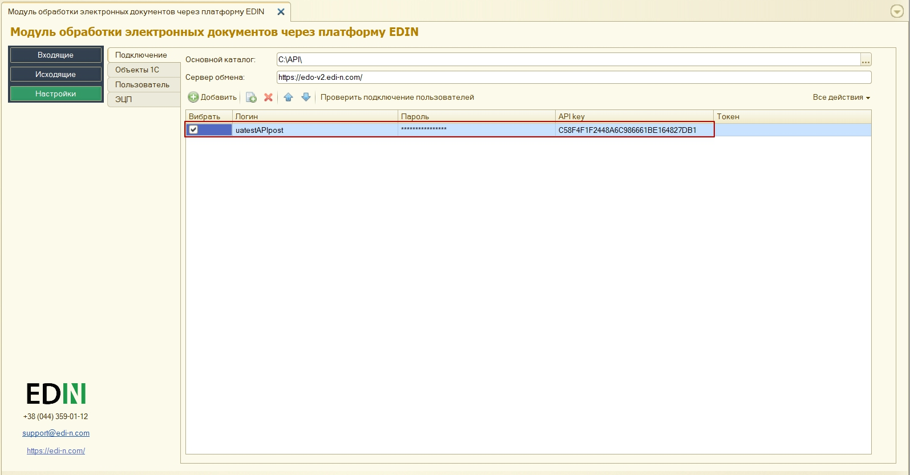
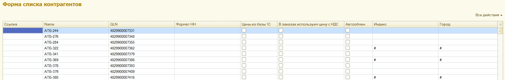

######################################################################
Инструкция оператора (пользователя). Первичная настройка
######################################################################

.. contents:: Содержание:
   :depth: 6

---------

Сокращения:

УС - учетная система

ЭЦП - электронно-цифровая подпись/печать

GLN - (Global Location Number) глобальный номер местоположения

---------

****************************************
**Первый запуск и настройка модуля**
****************************************

Разработанный компанией EDIN интеграционный модуль EDIN.API (в дальнейшем просто модуль) позволяет работать с учетными системами 1С:Предприятие 8.Х (в дальнейшем 1С) на базе ОС Windows.
Для работы с модулем  у пользователя должна быть подключена услуга для работы с API. В итоге у пользователя для работы с модулем должны быть логин, пароль и api_key:

- email - логин пользователя;
- password - пароль пользователя на платформе EDIN 2.0
- api_key - пароль доступа к API

Для запуска модуля необходимо в учетной системе 1С открыть файл запуска модуля (передается пользователю сотрудниками EDIN):

.. important:: У пользователя должны быть полные права на каталог, в котором находится файл модуля 

При подключении модуля учетная система 1С может запросить у пользователя разрешение выполнения операций со стороны модуля (защита от опасных действий).

При первом запуске (отсутствует **config.txt**) автоматически открывается раздел "Настройки" для введения всех необходимых данных (в дальнейшем при запуске открывается раздел "Входящие"). В каталоге, в котором расположен файл модуля автоматически создаются:
1) файл основных настроек **Config.txt**;
2) каталог с названием текущего пользователя 1С, в котором создается файл настроек **UserSettings.txt**

********************
**"Настройки"**
********************

.. image:: pics_operator_instruction/operator_instruction_03.jpg
   :align: center 

Раздел содержит 4 вкладки:

- **Подключение**
- **Объекты 1С**
- **Пользователь**
- **ЭЦП**

**Подключение**
================

Основной каталог - местоположение файла модуля.

Сервер обмена - адрес платформы электронного документооборота (на этот адрес направляются запросы модуля)

В этой вкладке добавляются (кнопка "Добавить") пользователи, для каждого указываются свои **Логін (email) / Пароль / api_key**. В этой вкладке также осуществляется выбор Пользователей, от имени которых будут осуществляться дальнейшие действия, например, запросы на отображение Входящих/Исходящих документов.  

Настройки пользователей сохраняются в файле **UserSettings**, который размещается в подкаталоге (наименование=<пользователь 1С>) на одном уровне с файлом запуска модуля.

После того, как данные пользователей были введены возможно осуществить проверку (кнопка "Проверить подключение пользователей") введенных данных. В результате проверки полученный токен свидетельствует о корректно заполненных данных, пройденной авторизации на платформе электронного документооборота.

**Объекты 1С**
=====================

Для дальнейшей работы с электронным документооборотом необходимо произвести синхронизацию модуля и 1С, а также осуществить настройку сохранения данных справочников и документов.

.. image:: pics_operator_instruction/operator_instruction_05.jpg
   :align: center

Вид конфигурации - поле заполняется автоматически (модуль предполагает текущую версию конфигурации УС 1С).

.. important:: Посмотреть версию своей 1С: Меню -> Справка -> О программе. В случае если учетная система 1С самописная или измененная, то необходимо выбрать типовою версию 1С на основании которой она была написана/изменена. Неправильно выбранный вид конфигурации может привести к проблемам создания документов из 1С.

.. image:: pics_operator_instruction/operator_instruction_06.jpg
   :align: center

Кнопки:
Сети - открывает окно перечня всех сетей, подключенных к провайдеру электронного документооборота. Из этого перечня необходимо выбрать сети (контрагентов) с которыми пользователь будет обмениваться документами (выбор влияет на заполнение справочника **Контрагенты**).

Коды единиц измерения - единицы измерения, которые должны быть внесены в 1С (указывать кода единиц измерения необходимо в форме, которая открывается при нажатии кнопки "Коды единиц измерения").

.. image:: pics_operator_instruction/operator_instruction_21.jpg
   :align: center

Номенклатура контрагентов - кнопка открытия объекта 1C, в котором хранятся артикулы и штрихкоды номенклатуры контрагентов. В зависимости от вида конфигурации название колонки и соответственно объект 1С могут меняться. Для всех конфигураций на обычных формах и для конфигурации "Бухгаглерия" на управляемых формах используется регистр сведений «Номенклатура контрагентов». Для других конфигураций на управляемых используется справочник «Номенклатура поставщиков».

**Настройка справочников**
---------------------------

.. important:: Настройки этого раздела рекомендовано выполнять обладая знаниями продвинутого пользователя или совместно с разработчиком 1С.

Для поставщиков доступны 3 основных типа справочников (**Организации**, **Контрагенты**, **Точки доставки**), в которые будут сохраняться собственные данные пользователя, данные контрагентов и их точки доставки соответственно в УС 1С.

.. image:: pics_operator_instruction/operator_instruction_07.jpg
   :align: center

В этом разделе для каждого справочника производится настройка "местоположения" хранения данных (**GLN** (обязательно), **Формат НН**, **Цени из базы 1С**...) внутри учетной системы 1С. Возможно заполнить все табличные настройки раздела **"Справочники"** по умолчанию (кнопка **"Заполнить по умолчанию"**) либо произвести все настройки **вручную**.

Принципы заполнения: "По умолчанию" и "Ручной"
^^^^^^^^^^^^^^^^^^^^^^^^^^^^^^^^^^^^^^^^^^^^^^^^^^^^^^^^^^^^^^^^^

При заполнении предпочтение необходимо давать принципу **По умолчанию**. Выполняется при нажатии кнопки «Заполнить по умолчанию». При заполнении автоматически выбираются типичные справочники конфигурации и только необходимые настройки. Выбор расположения ограничен двумя вариантами: «Дополнительные сведения» и «Реквизиты справочника». В зависимости от конфигурации, в которой используется интеграция, определяются доступные варианты. При доступности обоих вариантов сохранения предпочтение отдается «Дополнительным сведениям», поскольку они не вносят изменения в уже существующие справочники ОС пользователя, а позволяют хранить данные отдельно (независимо от других компонентов программы).

При **ручной** настройке в колонке «Справочник 1С» отображаются списки доступных справочников, а в полях настроек (через double-click по необходимому полю) открывается отдельная форма заполнения настроек.

.. important:: В табличной части настройки **"Справочник 1С"** и **"GLN"** являются обязательными к заполнению. 

Пример заполнения табличной части настроек раздела **"Справочники"**:

При синхронизации с платформой электронного документооборота EDIN в эти справочники (**Организации**, **Контрагенты**, **Точки доставки**) автоматически подтягиваются данные (просмотр/редактирование через double-click). **Организации** наполняется по пользовательскому логину (после успешной авторизации):

В справочнике **Контрагенты** отображаются юридические лица и точки доставки контрагентов, для которых можно проставить дополнительные настройки:

Справочник **Точки доставки** отличается от последнего наполнением колонок, в соответствии с требованиями EDI документооборота.

**Настройка документов**
---------------------------

.. important:: Настройки этого раздела рекомендовано выполнять обладая знаниями продвинутого пользователя или совместно с разработчиком 1С.

В этом разделе для каждого типа документа производится настройка "местоположения" хранения данных документов в УС 1С. Настройку также возможно производить **автоматически** (кнопка **"Заполнить по умолчанию"**) и **вручную** через double-click. `Принципы заполнения: "По умолчанию" и "Ручной`_ табличной части аналогичны настройке справочников. 

Создание документов в 1С зависит от вида конфигурации. **1С Бухгалтерия** на обычных и управляемых формах позволяет создавать **"Счет на оплату покупателя"**, **"Реализация товаров и услуг"**. Другие 1С (НЕ БУХГАЛТЕРИЯ) на обычных формах позволяют создать "Заказ покупателя", "Реализация товаров и услуг". В **1С Управление** небольшой фирмой и **Управление средним бизнесом** на управляемых формах возможно создать "Заказ клиента", "Расходная накладная". Для **1С Управление торговлей**,  **Управление предприятием**, **Управление производственным предприятием** возможно создать **"Заказ клиента"** и **"Реализация товаров услуг"**:

.. image:: pics_operator_instruction/operator_instruction_12.jpg
   :align: center

**Пользователь**
=====================

Раздел в котором пользователь может выбрать путь локального хранилища, в котором будут сохранятся входящие / исходящие ЮЗД документы, а также логи работы модуля(анализ документооборота). Поля **Склад** и **Подразделение** также заполняются для удобства пользователя.

.. image:: pics_operator_instruction/operator_instruction_13.jpg
   :align: center

**ЭЦП**
=====================

Раздел настройки электронно-цифровой подписи и печати (ЭЦП), в котором указываются сертификаты ДФС (находятся в свободном доступе) и EDIN (предоставляется сотрудником компании).

.. image:: pics_operator_instruction/operator_instruction_14.jpg
   :align: center

В таблицу вносятся (кнопка **"Добавить"**) пути к ключам бухгалтера и печати для организаций, по которым планируется выгрузка юридически значимых документов. При выгрузке юридически значимых документов пароли можно вносить или в таблице, или обработка отобразит окно для их внесения перед началом подписания. Кнопка **"Проверить ЭЦП»** позволяет проверить корректность введенных данных ключей и паролей перед началом подписания. 

Модуль позволяет хранить любое количество наборов ключей, но на момент подписания по одной организации необходимо выбрать (установить флажок в колонке "Выбрать") только одну пару ключей.

При выявлении ошибки при проверке модуль попросит повторно ввести пароль:

.. image:: pics_operator_instruction/operator_instruction_15.jpg
   :align: center

При каждой проверке ключа в окне сообщений отображается описание результата выполненной проверки.

********************
**"Входящие"**
********************

Раздел входящих документов (от контрагентов). Список документов возможно отфильтровать по полному номеру документа (поле номер). Для удобства во **Входящих** (только для документа Заказ) проставлялись отметки о отправленных ответных документах:

В разделе присутствуют кнопки обновления списка документов (обновление входящих документов с платформы электронного документооборота и догрузка созданных документов из 1С).

.. important:: Предварительно перед созданием документов необходимо обязательно убедиться, что указаны соответствия GLN со справочниками 1С.

Создавать документы в 1С можно только на основе входящего Заказ. Для создания ответного документа 1С необходимо **Выбрать** входящий документ и выбрать тип ответного документа под кнопкой **Создать**:

.. image:: pics_operator_instruction/operator_instruction_17.jpg
   :align: center

При создании документа модуль автоматически подтягивает все необходимые данные, однако если номенклатура была найдена не вся - модуль открывает окно **"Ненайденная номенклатура"** для добавления и сохранения артикула и штрих-кода контрагента в соответствующем справочнике \ регистре сведений 1С:

.. image:: pics_operator_instruction/operator_instruction_18.jpg
   :align: center

Для отправки ответного документа необходимо выбрать документ в колонке **"Документ 1С"**, сделать отметку напротив входящего документа (колонка **"Выбрать"**) и нажать **"Отправить"**

.. image:: pics_operator_instruction/operator_instruction_19.jpg
   :align: center

.. image:: pics_operator_instruction/operator_instruction_22.png
   :align: center

Все EDI документы отправляются только для входящих заказов. В зависимости от вида выгруженного документа автоматически определяются необходимые источники заполнения данных:
1) Подтверждение заказа (ORDRSP) - если не создано ни одного документа в 1С, тогда будет отправлено подтверждение в полном объеме указанном в заказе. Если соответствующие документы 1С созданы, тогда количество заполняется из них;
2) Сообщение об отгрузке (DESADV) - создается только при наличии соответствующего документа в 1С;
3) Счет (INVOICE) - создается только при наличии соответствующего документа в 1С;
Все остальные кнопки касающиеся работы с коммерческими документами.
Подписать - предназначено для подписания входящего коммерческого документа;
Расходная накладная (ком. Док) - предназначено для выгрузки коммерческого документа «Расходная накладная», который использует Розетка;
Отказ от подписания (ком.док) - предназначено для отказа от подписания входящего коммерческого документа.

********************
**Дополнительно**
********************

`Описание конфигурационного файла Config.txt модуля для интеграции с платформой EDIN 2.0 <https://wiki.edi-n.com/ru/latest/integration_2_0/1C_integration_2_0/1C_API_integration_2_0/config_description.html>`__ .

`Описание файла пользовательских настроек UserSettinsg.txt модуля для интеграции с платформой EDIN 2.0 <https://wiki.edi-n.com/ru/latest/integration_2_0/1C_integration_2_0/1C_API_integration_2_0/UserSettings_description.html>`__ .
