######################################################################
Інструкція по роботі з мережею ОККО на веб-платформі EDI-Network
######################################################################

.. role:: red

.. contents:: Зміст:
   :depth: 6

---------

****************************************
**Вступ**
****************************************

Дана інструкція описує порядок формування документів у відповідь «Підтвердження замовлення» (ORDRSP) і «Повідомлення про відвантаження» (DESADV), налаштування електронно-цифрового підпису та підписання або відмову від підписання Комерційного документа «Прибуткова Накладна» по мережі ОККО. 
Також описаний порядок роботи з  документом «Повідомлення про повернення» (RETANN), підписання або відмову від підписання Комерційного документа «Накладна на повернення» (COMDOC).

.. admonition:: Важливо!

   По причині переходу на юридично вагомий електронний документообіг, після підписання договору, де включенні зазначені пункти, паперова видаткова накладна, на стороні мережі, підписуватись не буде. Постачальник проводить в своїй обліковій системі видаткову накладну, чітко по найменуванню/кількості/сумі тощо, відповідно до електронної прибуткової накладної, на яку накладено ЕЦП (електронно цифровий підпис) обох сторін (не допускається відхилення хоча б на копійку). Вказані в прибутковій накладній видаткова накладна  (номер, дата) повинні в подальшому бути відображені в акті звірки постачальника. На основі підписаної прибутової накладної та виходячи із даних вказаних номеру та дати видаткової накладної постачальника, постачальник реєструє податкову накладну. Схема документообігу вказана нижче.

.. admonition:: Важливо!

   Зверніть увагу, що всі документи на які ЕЦП постачальники накладали більше ніж 4 кал. дні від дати фізичної доставки товару, тобто дати прибуткової накладної – для оплати початок відліку буде від дати накладання  ЕЦП постачальника.

.. admonition:: Важливо!

   Накладна на повернення формується Покупцем. Постачальник повинен в себе в обліку врахувати саме підписані обома сторонами накладні на повернення, а відповідно виходячи із їх даними скласти розрахунки коригування до податкових накладних. Ціни в накладних на повернення беруться із останніх прибуткових накладних проведених в обліковій системі Покупця на моменту формування замовлень на повернення. При тому якщо повертається кількість більша ніж є в останньому прихідному документів – то береться передаючий йому документ приходу й так далі.

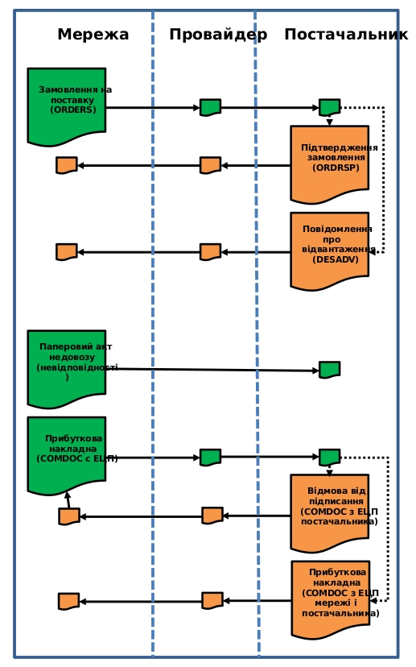

********************************************************************************
**1. Формування документа у відповідь «Підтвердження замовлення»(ORDRSP)**
********************************************************************************

.. admonition:: Важливо!

   Даний документ формується відразу, після отримання замовлення!

Для того, що б знайти ваші **Замовлення**, натисніть на папку **Вхідні**.

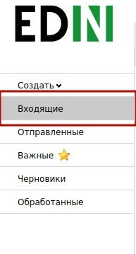

Для зручності пошуку виберіть в першому фільтрі - **Всі документи**, у другому - **ОККО-Нафтопродукт**, в третьому - тип документа **Замовлення**.

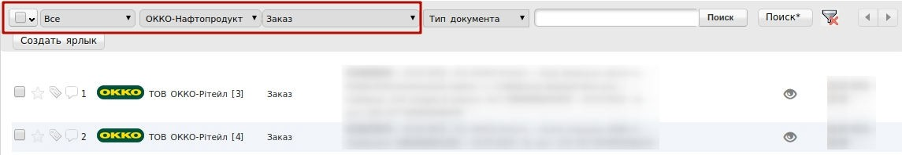

Для відкриття вхідного документа натисніть на нього.

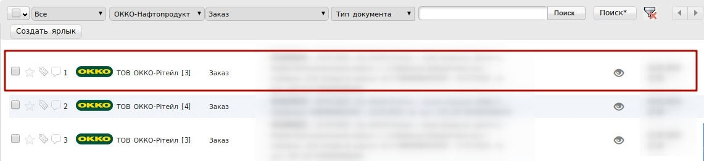

У відкритому документі виберіть **Сформувати** → **Підтвердження замовлення**.

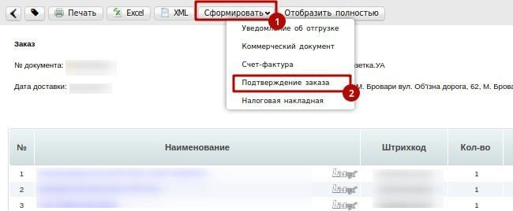

У відкритому вікні з'явиться **Форма** для заповнення необхідних реквізитів документа. Всі поля, позначені червоною зірочкою * є обов'язковими для заповнення.

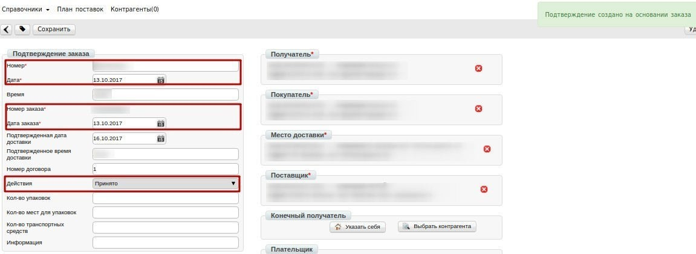

1. **Номер** - може збігатися з номером замовлення.
2. **Дата** - дата підтвердження, автоматично вказується поточна дата.
3. **Дата замовлення** автоматично переноситься з замовлення.
4. **Узгоджена дата поставки** - дата фактичного постачання товару по даному замовленню, переноситься автоматично з замовлення (в разі, якщо з мережею узгоджений перенесення на іншу дату, її потрібно змінити).
5. **Дії** - вибираються зі списку такі дії: **Буде доставлено**, **Зміна кількості**, або **Відмовлено**.

Нижче на сторінці створеного документу знаходиться перелік товарних позицій, які були замовлені, і їх кількість:

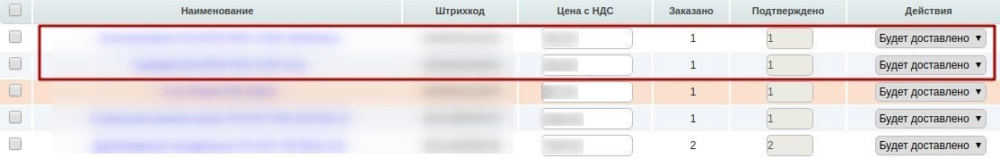

Система автоматично підставляє значення в колонку **Підтверджено** значення, аналогічне замовленому.

.. admonition:: Важливо!

   Просимо внести фактичне значення, яке планується до поставки. Якщо ціни, які вказані в замовленні, не відповідають цінам в специфікації, просимо відразу повідомити про це менеджерів, які відправляють замовлення та додатково Білецьку Анну abilecka@gng.com.ua або Бродюк Ірину IBrodiuk@gng.com.ua.

Для відправки документа натискаємо на кнопку **Зберегти**, внесені зміни вступають в силу, а потім - **Надіслати**:

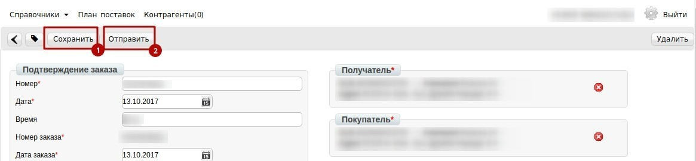

************************************************************************************
**2. Формування документу у відповідь «Повідомлення про відвантаження» (DESADV)**
************************************************************************************

.. admonition:: Важливо!

   Документ "Повідомлення про відвантаження" формується на підставі Замовлення, заздалегідь, до момента фактичної поставки товару! Без повідомлення, товар не буде прийнятий! Якщо постачальник, з будь-яких причин, фактично відвантажує більшу кількість товару, ніж вказано в замовленні чи в повідомленні про відвантаження – то він зобов‘язаний зв‘язатись з менеджером закупок покупця та отримати нове замовлення на такий «надлишок» й сформувати окреме повідомлення про відвантаження й видаткову накладну.

Для зручності пошуку виберіть в першому фільтрі – **Всі документи**, у другому - **ОККО-Нафтопродукт**, в третьому - тип документа **Замовлення**.

Для відкриття вхідного документа натисніть на нього.

У відкритому документі натисніть **Сформувати** → **Повідомлення про відвантаження**.

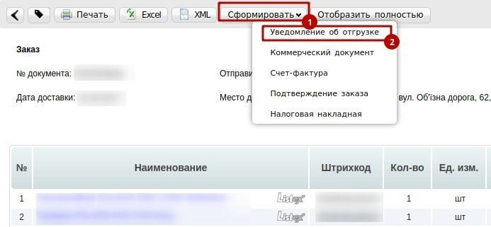

У вікні з'явиться **Форма** для заповнення необхідних реквізитів документа, а також повідомлення **«Повідомлення про відвантаження створено згідно із замовленням»**.

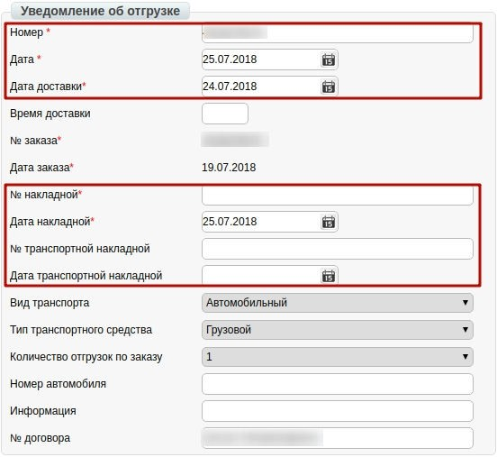

1. **Номер** - номер повідомлення про відвантаження по даному замовленню (Автоматично встановлюється номер замовлення).
2. **Дата** - дата повідомлення про відвантаження, автоматично встановлюється поточна дата.
3. **Дата доставки** - дата фактичної доставки по даному замовленню. Переноситься автоматично з замовлення. Якщо з мережею узгоджений перенесення на інший день, дату необхідно змінити.
4. **No замовлення** автоматично переноситься з замовлення.
5. **Дата замовлення** автоматично переноситься з замовлення.
6. **No накладної** - номер Видаткової Накладної по даному замовленню.

:red:`*Цей номер повинен потім буде відображений постачальником в акті звірки.*`

7. **Дата накладної** - дата Видаткової Накладної.

:red:`*Ця дата повинна потім бути відображена постачальником в акті звірки та цією датою повинні бути складені податкова накладна на отриманий Покупцем товар.*`

8. **No Транспортної накладної**.
9. **Дата Транспортної накладної**.

:red:`ПРОСИМО УВАЖНО ПЕРЕВІРЯТИ ВВЕДЕНУ ІНФОРМАЦІЮ!`

.. admonition:: Важливо!

   У разі створення декількох видаткових накладних на одне замовлення, необхідно на кожну накладну сформувати **повідомлення про відвантаження**.

.. admonition:: Важливо!

   У паперовій Транспортній накладній необхідно обов'язково вказати Номер і Дату Видаткової Накладної та номер Замовлення. Нижче на сторінці сформованого документа знаходиться перелік товарних позицій, які були замовлені, і їх кількість:

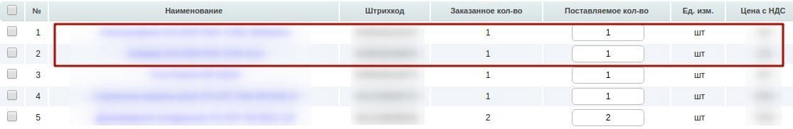

Система автоматично підставляє значення в колонку **Кількість**, яке поставляється - значення аналогічне замовленому. В даному розділі необхідно вказати **кількість тов.позицій**, яка поставляється, що відповідає тій кількості, **що у вас вказано, в певній, конкретній, видатковій накладній**, наприклад:

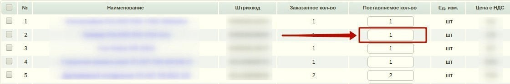

Для відправлення документа натискаємо на кнопку **Зберегти**, після чого всі внесені зміни вступають в силу, а потім - **Надіслати**:

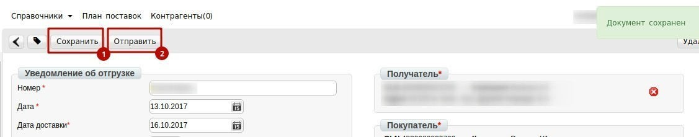

.. admonition:: Важливо!

   Різниця між вказаною кількістю товару в повідомленні про відвантаження та фактично прийнятою кількістю, зазначається в паперовому акті недовозу(невідповідності).

************************************************************************************
**3. Підписання вхідного Коммерційного документу «Прибуткова Накладна»**
************************************************************************************

Для зручності пошуку виберіть в першому фільтрі - Всі документи, у другому - ОККО-Нафтопродукт, в третьому - тип документа Комерційний документ. (Прибуткова Накладна). Документ, відзначений текстом потребує підписання.

.. admonition:: Важливо!

   Просимо підписати чи відхилити документ, не пізніше наступного дня, після отримання Прибуткової накладної! Накладна містить **фактичну** кількість прийнятого товару.

:red:`Перед підписання потрібно звірити вірність вказаних:`

:red:`- номера та дати видаткової накладної постачальника`

:red:`- кількості та номенклатури поставки`

:red:`- загальної суми накладної, а у випадку розходження – по кожному товару знайти причину невідповідності.`

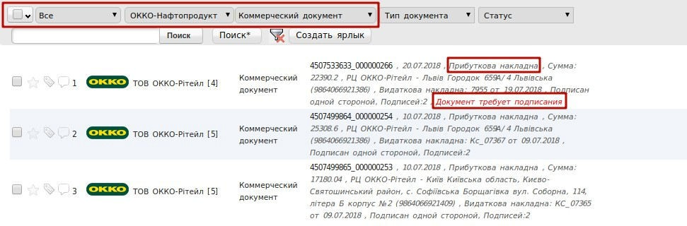

Для відкриття вхідного документа натисніть на нього.

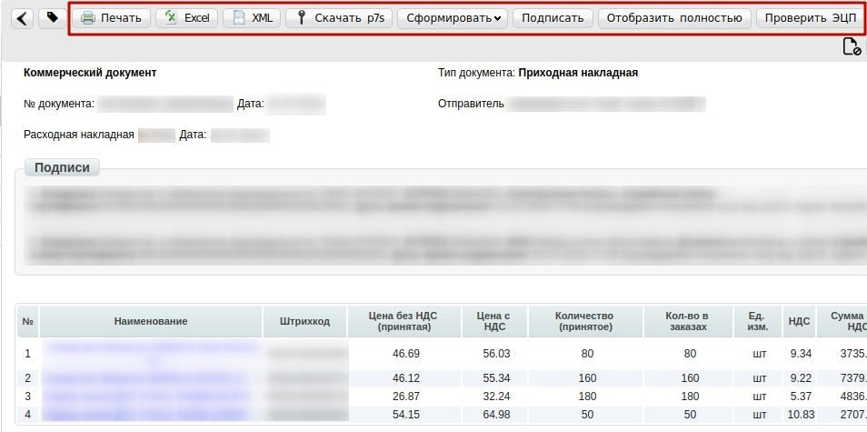

Для того, щоб перевірити відображення всіх переданих даних електронного документа, натисніть **"Показати повністю"**.

Лінією прокрутки, перевірте правильність даних в табличній частині та полі **"Підсумок"**. Для друку документа натисніть кнопку **Друк**. Якщо документ необхідно зберегти в форматі Exсel або XML натисніть кнопку **Exсel** або **XML** відповідно.

Для підписання документа натисніть кнопку **«Підписати»**.

Для первинного налаштування ЕЦП, дочекайтеся завантаження сторінки, а потім натисніть кнопку **"Зчитати ключі"**.

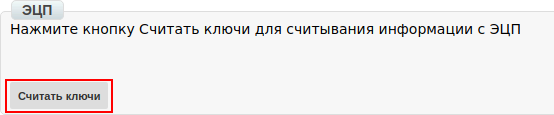

Потім, в блоці налаштування ЕЦП, натисніть на зображення ключа і виберіть з каталогу, де зберігаються Ваші секретні ключі, відповідний ключ.

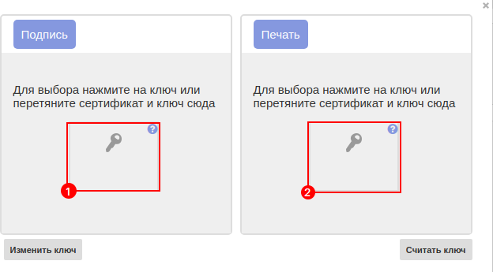

Якщо Ви використовуєте ключі від **АЦСК "Україна"**, файли підписів секретних ключів мають розширення **.ZS2** і наступні значення в іменах файлів:
Директор - **«DS»**, Бухгалтер - **«BS»**, Співробітник - **«SS»**, Печатка - **«S»**, Шифрування - **«C»**, Універсальний ключ печатки та шифрування - **«U»**.

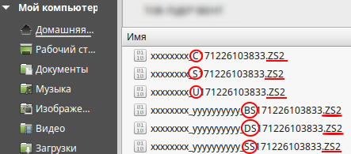

Якщо Ви використовуєте ключі від будь-яких інших АЦСК, файли підписів секретних ключів мають **найменування Key-6.dat**

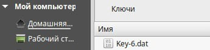

Після вибору секретних ключів, введіть паролі під кожним з них, а потім натисніть кнопку **"Зчитати ключі"**.

.. image:: pics_EDI-N_OKKO_instruction/22.png
   :align: center

При коректному зчитуванні ключів, в блоці **"ЕЦП"** з'явиться інформація про власників ключів. Після перевірки інформації натисніть кнопку **"Підписати"**.

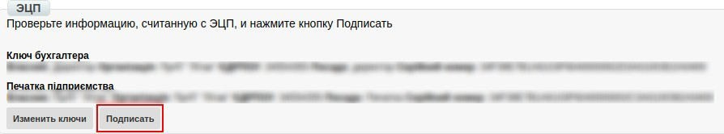

Після підписання документа, натисніть кнопку **"Відправити"**.

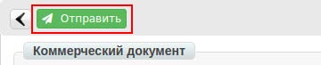

************************************************************************************
**4. Відмова від підписання Коммерційного документа «Прибуткова Накладна»**
************************************************************************************

Якщо дані в цьому комерційному документі невірні, тоді ви можете **відмовитися** від підписання даного документа. Для цього необхідно в відкритому документі справа вгорі натиснути **ярлик**:

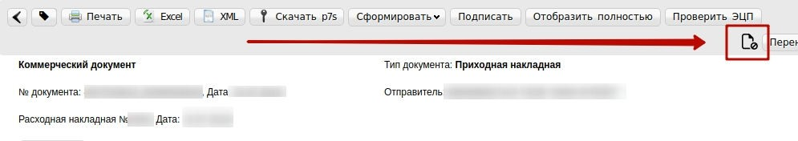

Після цього з'явиться вікно, в якому необходимо **підтвердити відмову** від Підписання.

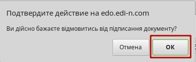

В наступному вікні потрібно ввести причину відмови від підписання і натиснути **ОК**.

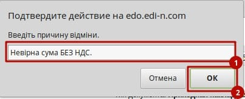

.. admonition:: Важливо!

   Просимо вказати розгорнуту причину відмови, а також правильну інформацію, яка має бути вказана в Прибутковій накладній! Не припустимо писати - «сума видаткової накладної відрізняється від суми прибуткової накладної» або «не коректна кількість прийнятого товару» тощо. З такого тексту не зрозуміло які мають бути вірні дані по загальній сумі, по загальній кількості та по конкретній позиції (кількості та/або ціні) тощо.

На наступному етапі створюється Коммерційний документ **"Повідомлення про відмову від підписання документа"** і вам необхідно натиснути кнопку **Зберегти**. Після цього з'явиться кнопка **Підписати**, і ви зможете його підписати і **Відправити**.

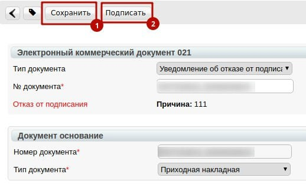

Даний документ розглядається на стороні мережі, після чого Вам висилається новий, коректний, Комерційний документ «Прибуткова Накладна».

************************************************************************************
**5. Підписання вхідного Коммерційного документу «Накладна на повернення»**
************************************************************************************

При поверненні товара мережа формує документ Повідомлення про повенення (RETANN) і відправляє його постачальнику. Потім формує Накладну на повернення (COMDOC), підписує її і відправляє постачальнику.

Для зручності пошуку виберіть в першому фільтрі — **Всі документи**, у другому — **ОККО-Нафтопродукт**, в третьому - тип документа **Комерційний документ** (Накладна на повернення). Документ, який ви прочитали, **потребує підписання**.

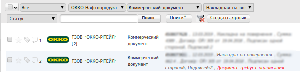

Для відкриття вхідного документа натисніть на нього.

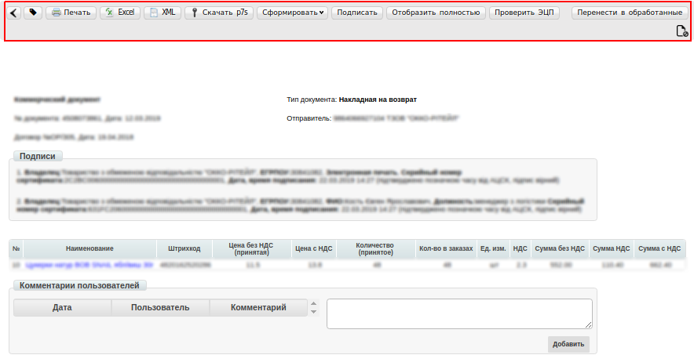

Для того, щоб перевірити відображення всіх переданих даних електронного документа, натисніть **"Показати повністю"**. Лінією прокрутки, перевірте правильність даних в табличній частині та полі "Підсумок".

Для підписання документа натисніть кнопку **"Підписати"**. Для первинного налаштування ЕЦП, дочекайтеся завантаження сторінки, а потім натисніть кнопку **"Зчитати ключі"**.

.. image:: pics_EDI-N_OKKO_instruction/31.png
   :align: center

Потім, в блоці налаштування ЕЦП, натисніть на зображення ключа і виберіть з каталогу, де зберігаються Ваші секретні ключі, відповідний ключ.

Якщо Ви використовуєте ключі від **АЦСК "Україна"**, файли підписів секретних ключів мають розширення **.ZS2** і наступні значення в іменах файлів:
Директор - **«DS»**, Бухгалтер - **«BS»**, Співробітник - **«SS»**, Печатка - **«S»**, Шифрування - **«C»**, Універсальний ключ печатки та шифрування - **«U»**.

.. image:: pics_EDI-N_OKKO_instruction/33.png
   :align: center

Якщо Ви використовуєте ключі від будь-яких інших АЦСК, файли підписів секретних ключів мають **найменування Key-6.dat**

.. image:: pics_EDI-N_OKKO_instruction/34.png
   :align: center

Після вибору секретних ключів, введіть паролі під кожним з них, а потім натисніть кнопку **"Зчитати ключі"**.

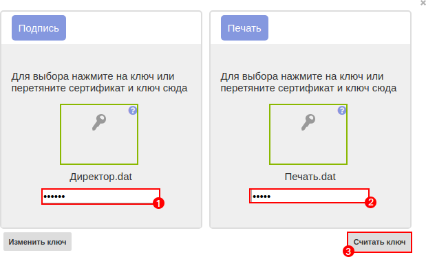

При коректному зчитуванні ключів, в блоці **"ЕЦП"** з'явиться інформація про власників ключів. Після перевірки інформації натисніть кнопку **"Підписати"**.

Після підписання документа, натисніть кнопку **"Відправити"**.

************************************************************************************
**6. Відмова від підписання Коммерційного документу «Накладна на повернення»**
************************************************************************************

Якщо дані в цьому комерційному документі невірні, тоді ви можете відмовитися від підписання даного документа. Для цього необхідно в відкритому документі справа вгорі натиснути **ярлик**:

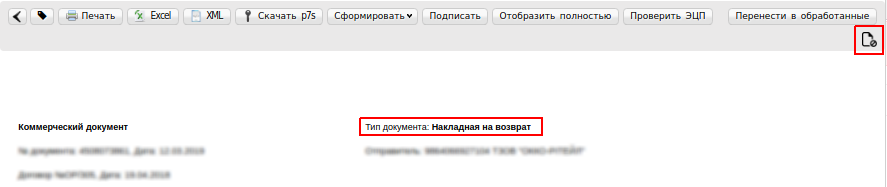

Після цього з'явиться вікно, в якому необходимо **підтвердити відмову** від Підписання:

В наступному вікні потрібно ввести причину відмови від підписання і натиснути **ОК**.

.. admonition:: Важливо!

   Окрім кількості та номенклатури, також потрібно звіряти ціни, суму документу, ставки ПДВ та суму ПДВ, тощо.

На наступному етапі створюється Коммерційний документ **"Повідомлення про відмову від підписання документа"** і вам необхідно натиснути кнопку **Зберегти**. Після цього з'явиться кнопка **Підписати**, і ви зможете його підписати і **Відправити**.

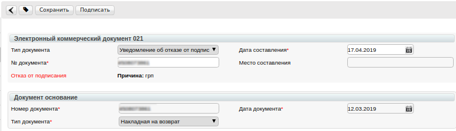

Даний документ розглядається на стороні мережі, після чого вам висилається новий, коректний, Комерційний документ **«Накладна на повернення»**.

------------------

.. include:: kontakti.rst

