Інструкція по роботі з документом "Прайс-лист" для PAMPIK (Лелека Трейд) на web-платформі 
####################################################################################################################

.. role:: red

.. contents:: Зміст:
   :depth: 6

---------

**1 Формуваня документа "Прайс-лист"**
==============================================

Для входу на web платформу EDIN необхідно перейти за посиланням: https://edo.edi-n.com

Для формування документу в основному меню натискаємо на кнопку “Створити” та обираємо документ “Прайс-лист”.

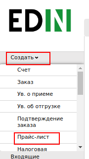

Відкриється форма документа з обов'язковими для заповнення полями:

* Номер прайс-листа — можна внести власний номер (при встановленій помітці, номер присвоюється автоматично)
* Дата прайс-листа — поточна дата
* № договору — номер договору укладений з мережею
* Валюта — Гривня за замовчуванням
* "Дата з" - дата початку дії цін
* "Дата до" - дата закінчення дії цін
* "Тип документа" (прайс-лист (полный), дополнение прайс-листа)

Всі інші поля не є обов'язковими для заповнення.

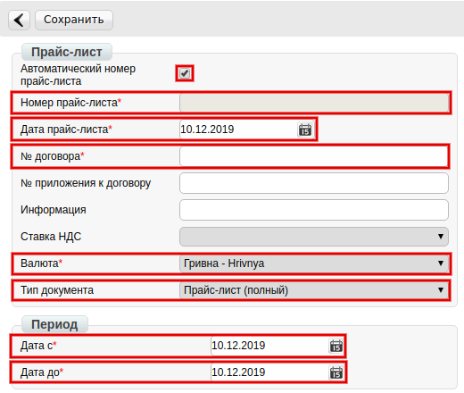

В правій частині екрану реквізити "Получатель" и "Покупатель". Завжди необхідно вказувати GLN номер головного офісу 9864066874774. Натискаємо "Выбрать контрагента":

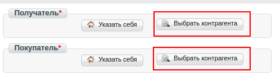

Далі обираємо "Поиск контрагента", вводимо GLN, натискаємо "Найти" и "Выбрать":

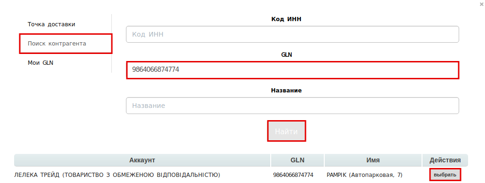

Після внесення всіх даних натискаємо "Сохранить":

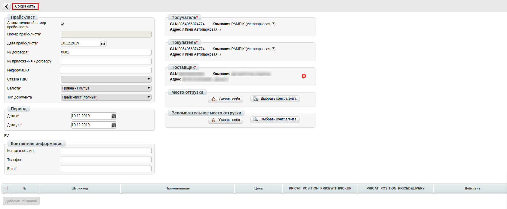

В правому верхньому куті буде відображене повідомлення:

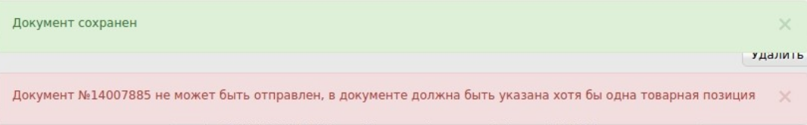

**2 Додавання товарних позицій**
==================================

2.1 Додавання товарних позицій за допомогою Шаблону
--------------------------------------------------------------------

Для додавання товарних позицій є можливість скористатись шаблоном. Для цього в нижный частині сторінки на екрані натискаємо "Скачать шаблон Excel":

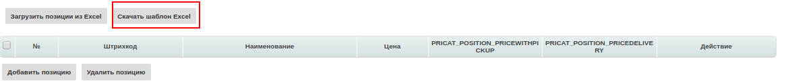

На Ваш комп'ютер буде завантажено файл з назвою **pricat_products_sample.xls**. Відкривши його, необхідно внести інформацію по товару. Обов'язкові для заповнення поля відмічені жовтим кольором.

.. important:: Ні в якому разі не змінювати формат шаблону, видаляти або додавати нові стовпці. Також недопускаєтся зміна формату комірок. 

В полі “Действие” необхідно вказувати цифрове значення:

* Додавання — 2
* Видалення — 3
* Внесення змін — 4
* Здорожчання — 5
* Здешевлення — 6 

В полі “Валюта” необхідно вказувати значення UAH, USD, EUR. В полі “Доступность”, якщо Так вказувати “1“, якщо Ні - “0“.

Після збереження заповненої інформації завантажуємо файл на веб-портал, скориставшись кнопкою "Загрузить позиции из Excel":

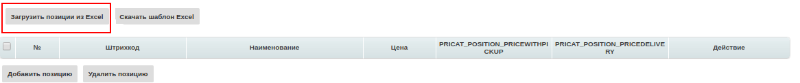

2.2 Додавання позицій з товарного довідника
--------------------------------------------------------------------

Також у користувачів є можливість додавати позиції до документу з заповненого раніше товарного довідника. Для цього необхідно натиснути “Добавить позицию”:

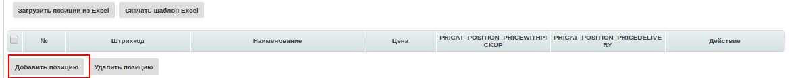

Відкриється вікно заповнення інформації, в якому необхідно внести найменування продукції. У випадку наявності даної продукції в товарному довіднику інформація буде заповнена автоматично. Якщо в товарному довіднику інформація відсутня, користувачу необхідно заповнити обов'язкові поля що позначені червоною зірочкою :red:`*`. 

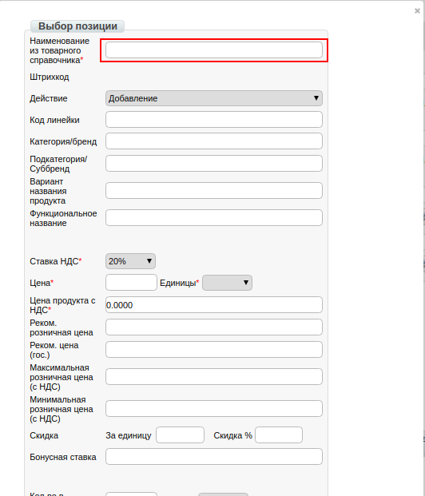

**3 Збереження та відправка документу**
================================================

При вдалому завантаженні товарні позиції будуть відображені в прайс-листі. Після чого необхідно натиснути “Сохранить” и “Отправить”. 

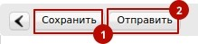

Документ буде відображений в папці “Отправленые” на веб-порталі.

.. include:: kontakti.rst
