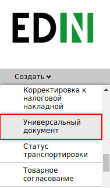
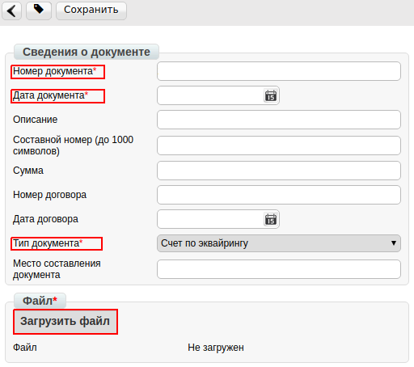
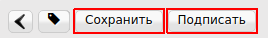
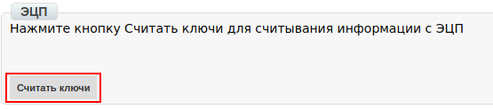
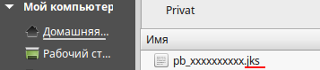
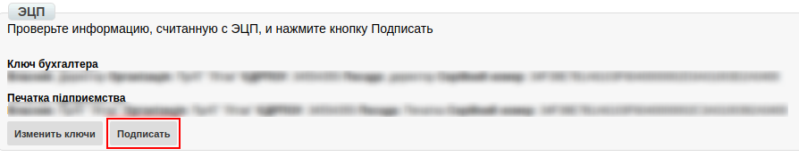
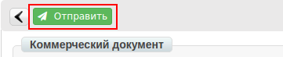

####################################################################################
Формирование документа «Универсальный документ» (CONDRA) на платформе
####################################################################################

---------

.. contents:: Содержание:
   :depth: 6

---------

Введение
=======================================
Данная инструкция описывает порядок формирования и отправки документа «**Универсальный документ**» (CONDRA).

Формирование Универсального документа
=======================================

Чтобы сформировать «**Универсальный документ**» (CONDRA) необходимо воспользоваться функционалом создания документа.

Для этого, нажмите кнопку «**Создать**» и выберете из выпадающего списка пункт «**Универсальный документ**». После чего откроется форма для заполнения данных.

В открытой форме, все поля обозначенные красной звёздочкой *** обязательны** для заполнения.

1. **Номер** — произвольный номер. присваиваемый документу.
2. **Дата** — дата документа, автоматически указана текущая дата.
3. **Тип документа** — необходимо выбрать из списка нужный тип документа.
4. **Файл** — вложение соответствующее формируемому документу.

Для добавления вложения, нажмите кнопку «**Загрузить файл**», выберете из каталога соответствующий и нажмите «**Открыть**».

После внесения всех изменений, документ необходимо сохранить и подписать ЭЦП. Для этого нажмите на соответствующие кнопки.

Подписание документа
=======================================
Для первичной настройки ЭЦП, дождитесь загрузки страницы, а затем нажмите кнопку “**Считать ключи**”

Затем, в блоке настройки ЭЦП, нажмите на изображение ключа и выберете из каталога, где хранятся Ваши секретные ключи, соответствующий файл.

.. image:: pics_Rabota_s_dokumentom_Universalnyj_dokument_CONDRA/Rabota_s_dokumentom_Universalnyj_dokument_CONDRA_05.png
   :align: center

Виды файлов электронно-цифровой подписи
=======================================
Если Вы используете ключи от **АЦСК “Украина”**, файлы подписей секретных ключей имеют расширение **.ZS2** и следующие значения в именах файлов:

- Директор «DS»,
- Бухгалтер «BS»,
- Сотрудник «SS»,
- Печать «S»,
- Шифрование «C»,
- Универсальный ключ печати и шифрования «U».

.. image:: pics_Rabota_s_dokumentom_Universalnyj_dokument_CONDRA/Rabota_s_dokumentom_Universalnyj_dokument_CONDRA_06.png
   :align: center

Если Вы используете ключи от **АЦСК “ПриватБанк”**, файлы подписей секретных ключей имеют расширение **.jks**:

Если Вы используете ключи от любых других **АЦСК**, файлы подписей секретных ключей имеют наименование **Key-6.dat**:

.. image:: pics_Rabota_s_dokumentom_Universalnyj_dokument_CONDRA/Rabota_s_dokumentom_Universalnyj_dokument_CONDRA_08.png
   :align: center

После выбора секретных ключей, введите пароли под каждым из них, а затем нажмите кнопку “**Считать ключи**”.

.. image:: pics_Rabota_s_dokumentom_Universalnyj_dokument_CONDRA/Rabota_s_dokumentom_Universalnyj_dokument_CONDRA_09.png
   :align: center

При корректном считывании ключей, в блоке “**ЭЦП**” появится информация о владельцах ключей. После проверки информации нажмите кнопку “**Подписать**”.

После подписания нажмите на кнопку “**Отправить**”.

.. include:: kontakti.rst
