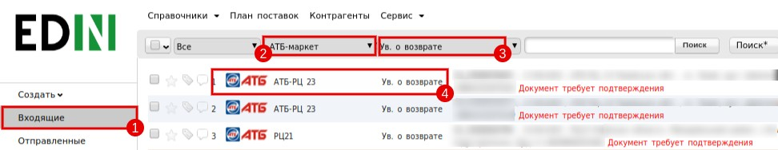
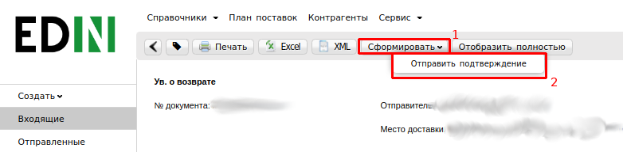
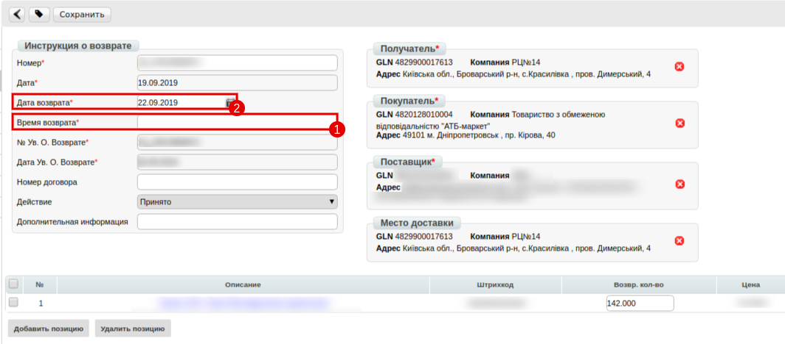
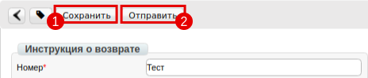

##################################################################################
Инструкция по формированию "Инструкции о возврате" (RETINS) для сети АТБ
##################################################################################

.. contents:: Содержание:
   :depth: 3

---------

Вступление
====================================

Документ "Инструкции о возврате" (RETINS) отправляется в ответ на "Уведомление о возврате" (RETANN) и используется для подтверждения или изменения даты и времени прибытия поставщика.

1 Поиск документа
=============================

Необходимо в папке «Входящие» (1) отфильтровать документы по сети и типу. Нужно выбрать сеть «АТБ-маркет» (2) и тип документа "Ув. о возврате"(3) и открыть необходимое сообщение (4).

2 Формирование инструкции
==============================

Находясь в открытом документе, необходимо нажать кнопку «Сформировать» (1) и выбрать «Отправить подтверждение» (2)

3 Заполнение полей
==============================================================

Поля **Номер**, **Дата**, **Дата возврата**, **№ Ув. о возврате**, **Дата Ув. о возврате**, **Получатель**, **Покупатель**, **Поставщик** и **Место доставки** заполняются автоматически из документа-основания.

Заполнить необходимо поле **Время возврата** (1), при необходимости скорректировать данные в поле **Дата возврата** (2)

4 Отправка документа
==============================================================

После заполнения документа необходимо нажать кнопку «Сохранить» (1), после нажать «Отправить» (2)

.. include:: kontakti.rst
