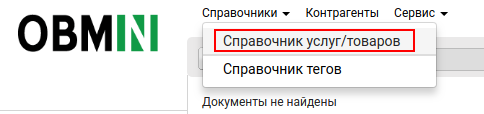
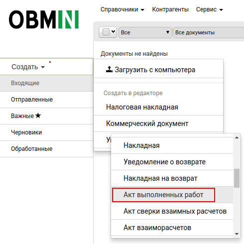
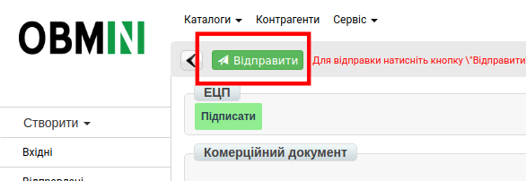

Формирование  документа «Акт выполненных работ» на платформе OBMIN
############################################################################
---------

.. contents:: Содержание:
   :depth: 6

---------

Введение
=======================

Данная инструкция описывает порядок формирования и отправки документа «**Акт выполненных работ**» (COMDOC).

В первую очередь, необходимо заполнить Товарный справочник на платформе OBMIN, в данном справочнике укажите перечень товаров и услуг передаваемых в акте.

Заполнить Товарный Справочник на Web-платформе можно несколькими способами:

**Вручную на платформе, Через шаблон .CSV, Через шаблон .XLS**.

Заполнение Товарного справочника вручную
==============================================

Для перехода к заполнению Товарного справочника, необходимо перейти в раздел «**Меню**»-> «**Справочники**»-> «**Справочник услуг/товаров**»

Для того чтобы добавить товарную позицию или услугу, нажмите на кнопку «**+**».

.. image:: pics_formirovanie_dokumenta_Akt_vypolnennyh_rabot_na_platforme_OBMIN/formirovanie_dokumenta_Akt_vypolnennyh_rabot_na_platforme_OBMIN_02.png
   :align: center

После нажатия которой у вас откроется форма «**Изменения данных товарной позиции**».

.. sidebar:: Обязательные поля

    .. image:: pics_formirovanie_dokumenta_Akt_vypolnennyh_rabot_na_platforme_OBMIN/formirovanie_dokumenta_Akt_vypolnennyh_rabot_na_platforme_OBMIN_03.png
    
**Обязательные для заполнения поля**:

1. **Наименование*** - укажите наименование товарной позиции или услуги.
2. **Штрихкод*** - укажите штрихкод позиции, если штрикода нет, укажите (1000000000000).
3. **Цена***- укажите цену без НДС.
4. **Ед.изм***- из выпадающего списка выберите единицу измерения.
5. **НДС***-Укажите ставку НДС.
6. **РС** - укажите, к каким торговым сетям будет относится данный товар. По умолчанию стоит значение “Все”.

Позиция с пометкой **РС** может быть добавлена только в случае, если эта товарная позиция уже существует в общем справочнике и Вы хотите отметить данный товар или услугу для определенной сети. Если с сетями не сотрудничаете, не заполняете данное поле.

После заполнения обязательных полей, нажмите «**Сохранить**» для внесения изменений по товарной позиции.

.. image:: pics_formirovanie_dokumenta_Akt_vypolnennyh_rabot_na_platforme_OBMIN/formirovanie_dokumenta_Akt_vypolnennyh_rabot_na_platforme_OBMIN_04.png
   :align: center

Позиция будет сохранена и отображаться в общем справочнике.

Формирование Акта выполненных работ
==============================================

Чтобы сформировать «**Акт выполненных работ**» (COMDOC) необходимо воспользоваться функционалом создания документа.

Для этого, нажмите кнопку «**Создать**» и выберете из выпадающего списка пункт Коммерческий документ «**Акт выполненных работ**». После чего откроется форма для заполнения данных.

В открытой форме, все поля обозначенные красной звёздочкой *** обязательны для заполнения**.

1. **№ документа*** — произвольный номер, присваиваемый документу.
2. **Дата составления*** - указывается текущая дата.

**В Документе основание**: 

1. **Номер документа*** — номер договора с Вашим контрагентом.
2. **Тип документа***— выбираете с выпадающего списка «Договор».
3. **Дата документа*** — указывается дата заключения Договора.

**Получатель**:

1. **Статус контрагента*** — выбираете с выпадающего списка Вашего контрагента, он является Получателем, Покупателем или Заказчиком, и т. д. в зависимости от предоставляемых Вам или Вами услуг.
2. **Организационная форма*** — Юридическое или Физическое лицо. 
3. **Название контрагента***- указываете название контрагента.
4. **Код контрагента*** — ЄДРПОУ
5. **Индивидуальный налоговый номер*** - ИНН получателя, если получатель не плательщик НДС указываете 12-ти значный номер(100000000000).
6. **GLN***- 13-ти значный Global Location Number контрагента, подтягивается автоматически.

**Отправитель** - **данные заполняются автоматически с карточки контрагента**.

**Срок действия документа**:

#. **Начало срока действия*** - дата начала действия договора с контрагентом.
#. **Окончание срока действия*** - дата окончания договора с контрагентом.

После заполнения всех обязательных полей, нажимаете кнопку сохранить, и система Вам предложит добавить товар либо услугу которую Вы предоставляете Вашему контрагенту.

Для корректного заполнения позиций, необходимо заполнить Товарный справочник.
Инстркцию по заполнению справочника вы можете найти `по ссылке <https://wiki.edi-n.com/ru/latest/general/Zapolnenie_Tovarnogo_spravochnika.html>`_.

#. **Наименование из товарного справочника** - вводите название товарной позиции или услуги.
#. **Количество(принятое)** - количество товара.
#. **Цена** - цена товара либо услуги.

После заполнения таблицы, нажимаете **Сохранить** -> **Подписать** -> **Отправить**.

Настройка ЭЦП
=============================================
Перед началом работы необходимо настроить подпись, которой Вы будете подписывать документы.
Чтобы перейти к Настройке ЭЦП, зайдите в Настройки, нажмите на "шестеренку" в верхнем правом углу.
Откроется Проводник, где необходимо будет указать каталог с секретными 
ключами и выбрать ключи.

Если ключи полученные в **АЦСК ИСД (ДФС)**, тогда необходимо выбирать: ключи **key-6.dat**

Если вы используете для подписания ключи **АЦСК «Украина»**, тогда вид ключей таков:

- Ключ директора: ЕДРПОУ_ИНН подписанта_D1111111.ZS2
- Ключ бухгалтера: ЕДРПОУ_ИНН подписанта _B1111111.ZS2
- Ключ печати: ЕДРПОУ_S1111111.ZS2 (ЕГРПОУ _U1111111.ZS2)
- Ключ шифрования: ЕДРПОУ_С1111111.ZS2 (ЕГРПОУ _U1111111.ZS2)

После того, как ключ выбран, появляется окно, в котором необходимо ввести пароль и нажать кнопку: **Считать**.

.. image:: pics_formirovanie_dokumenta_Akt_vypolnennyh_rabot_na_platforme_OBMIN/formirovanie_dokumenta_Akt_vypolnennyh_rabot_na_platforme_OBMIN_15.png
   :align: center

Когда ключи считаны, в окне ЭЦП можно будет увидеть информацию о ЭЦП:

Далее откроется окно, в котором необходимо отметить чекером типы ключей, которыми будет подписан документ.
Затем устанавливаем последовательность подписи, например:

- директор - 1
- печать - 2

.. image:: pics_formirovanie_dokumenta_Akt_vypolnennyh_rabot_na_platforme_OBMIN/formirovanie_dokumenta_Akt_vypolnennyh_rabot_na_platforme_OBMIN_17.png
   :align: center

И нажимаем кнопку **Подписать**. После процесса подписания необходимо нажать кнопку **Отправить**.

.. include:: kontakti.rst
