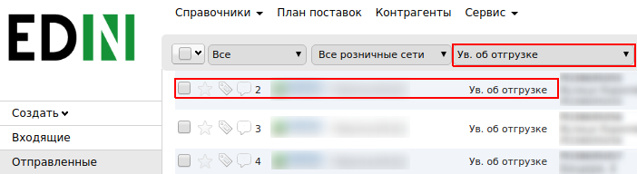
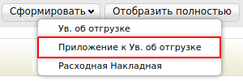
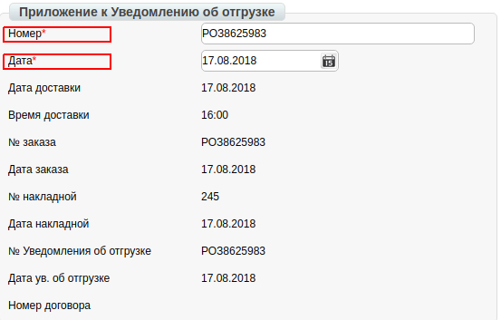
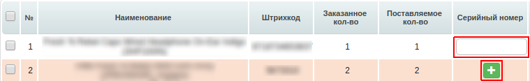
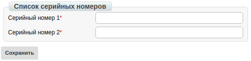
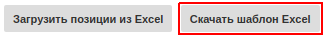
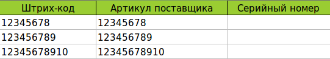
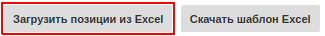
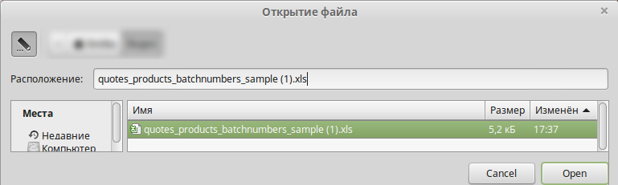
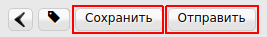

####################################################################################
Формирование документа «Приложение к уведомлению об отгрузке» (QUOTES) на платформе
####################################################################################
---------

.. contents:: Содержание:
   :depth: 6

---------

Введение
====================================
Данная инструкция описывает порядок формирования и отправки документа «Приложение к уведомлению об отгрузке» (QUOTES).

Формирование Приложения к уведомлению об отгрузке» (QUOTES)
===============================================================

Формирование документа происходит на основании «**Уведомления об отгрузке**».

Для формирования перейдите в раздел «**Отправленные**», для удобства поиска выберите в фильтре необходимую сеть и тип документа «**Уведомление об отгрузке**».

В открытом документе, нажмите кнопку «**Сформировать**» и выберете из списка документ «**Приложение к уведомлению об отгрузке**».

В окне появится Форма c данными, которые переносятся из соответствующего Уведомления об отгрузке. Все поля, обозначены красной звёздочкой ***** обязательны для заполнения.

#. **Номер документа** - переносится из соответствующего Ув.об отгрузке.
#. **Дата документа** - переносится из соответствующего Ув.об отгрузке.

Ниже на странице сформированого документа находится перечень товарных позиций, которые были заказаны, и их количество.

Добавление серийных номеров к товарным позициям.
======================================================

Внесение данных доступно несколькими способами: вручную, либо через шаблон .xls. Ниже описаны примеры обоих способов.

Добавление номеров вручную
---------------------------

Если по товарной позиции будет отгружено количество в размере одной единицы товара, то вам необходимо заполнить поле в колонке «**Серийный номер**».

Если по товарной позиции будет отгружено несколько единиц товара, то вам необходимо нажать на кнопку **«+» зеленого цвета**, и в открывшемся окне заполнить все поля.

После внесения данных необходимо нажать кнопку «**Сохранить**»

Добавление номеров через шаблон .xls
------------------------------------

Для загрузки серийных номеров через шаблон, нажмите на кнопку «**Скачать шаблон Excel**». После чего начнется скачивание файла.

Откройте пустой файл Excel, после чего нажатием на кнопку «**Файл**» -> «**Открыть**» откройте загруженный шаблон.

В открытом файле заполните колонку «**Серийный номер**», после заполнения шаблона, сохраните его на рабочий стол.

Для загрузки шаблона, вернитесь в документ, и нажмите на кнопку «Загрузить позиции из Excel».

Затем выберите созданный документ, который вы сохранили и загрузите.

Для сохранения документа нажимаем на кнопку «**Сохранить**», а затем - «**Отправить**».

.. include:: kontakti.rst
