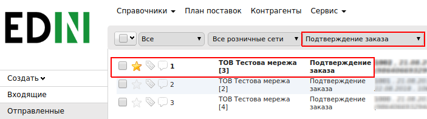
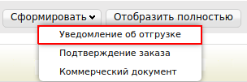
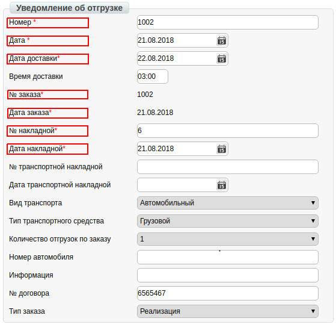
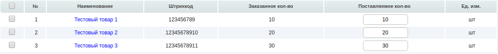
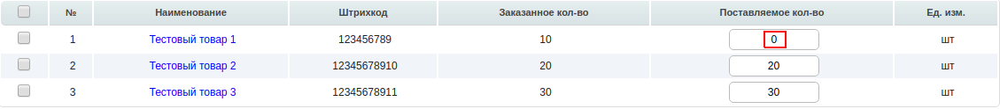
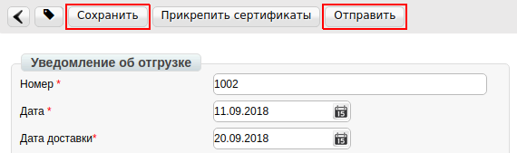

####################################################
Формирование документа «Уведомление об отгрузке» (DESADV) на платформе
####################################################

---------

.. contents:: Содержание:
   :depth: 6

---------

Введение
====================================

Данная инструкция описывает порядок формирования и отправки документа «**Уведомление об отгрузке**» (DESADV).

Формирование Уведомления об отгрузке (DESADV)
===========================================================

Формирование документа возможно как на основании «**Заказа**», так и на основании «**Подтверждения заказа**».

Рассмотрим формирование «**Уведомления об отгрузке**» на основании «**Подтверждения заказа**».

Перейдите в раздел «**Отправленные**», для удобства поиска выберите в фильтре необходимую сеть и тип документа «**Подтверждение заказа**».

В открытом документе, нажмите кнопку «**Сформировать**» и выберете из списка документ «**Уведомление об отгрузке**».

В окне появится **Форма** для заполнения необходимых реквизитов документа. Все поля, обозначены красной звёздочкой * обязательны для заполнения.

#. **Номер*** - номер уведомления об отгрузке по данному заказу (Автоматически устанавливается номер заказа.)
#. **Дата** - дата уведомления об отгрузке, автоматически устанавливается текущая дата.
#. **Дата доставки** - переносится из заказа (если с сетью согласован перенос - измените её).
#. **№ заказа** автоматически переносится из заказа.
#. **Дата заказа** автоматически переносится из заказа.
#. **№ накладной** - номер расходной накладной
#. **Дата накладной** - дата расходной накладной.

.. important:: **Внимание!** Номер накладной должен полностью совпадать с номером оригинала бумажной накладной**.

.. important:: **Внимание!** В случае создания нескольких расходных накладных на заказ, необходимо на каждую накладную сформировать уведомление об отгрузке. При этом, поле «Накладной» в документах должно отличаться.

Ниже на странице созданного документа находится перечень товарных позиций, которые были заказаны, и их количество:

Система автоматически подставляет значения в колонку «**Поставляемое количество**» из ранее отправленного документа «**Подтверждение заказа**».

Редактирование товарных позиций
=====================================================

В случае, если вам необходимо изменить количество поставляемого товара, в колонке «**Поставляемое количество**», измените количество.

.. important:: **Внимание!** Поставляемое количество товарных позиций не может превышать указанное в заказе!

Если какая-то из позиций отсутствует и поставляться не будет, в колонке «**Поставляемое количество**», укажите 0.

После внесения всех данных в документе, нажмите кнопку «**Сохранить**», затем «**Отправить**»

Отправленный документ автоматически попадает в папку «**Отправленные**» и будет находится в цепочке документов вместе с заказом и подтверждением заказа.

.. include:: kontakti.rst
