Формирование и отправка документа «Подтверждение заказа транспортировки» (IFTMBC)» на платформе
######################################################################################################
---------

.. contents:: Содержание:
   :depth: 6

---------

Введение
========================================================================

Данная инструкция описывает порядок формирования и отправки документа «Подтверждение заказа транспортировки» (IFTMBС) на WEB платформе.

Фильтры
========================================================================

Перейдите в раздел **«Входящие»**, В данной папке есть возможность использовать фильтр для быстрого отображения документов по статусу, розничной сети и типам документов. Для этого нужно воспользоваться полями, которые отображены выше над документами.

По-умолчанию новые входящие документы имеют статус **«Непрочитанные»**, после открытия документов статус меняется на **«Прочитанные»**.

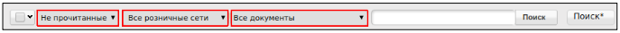

Формирование документа «Подтверждение заказа транспортировки» (IFTMBС)
========================================================================

Создание документа происходит на основании входящего документа **«Заказ транспортировки»**. Для удобства поиска, выберите нужный фильтр и откройте входящий документ.

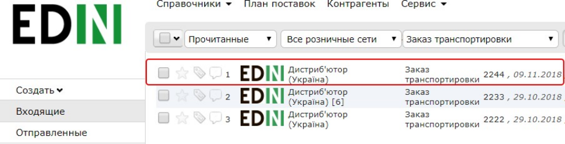

Открытый документ содержит краткую информацию, которая имеет следующие данные: 
№ документа, GLN и наименование отправителя, место доставки и место выгрузки.

Для отображения более детальной информации, нажмите кнопку **«Отобразить полностью»**:

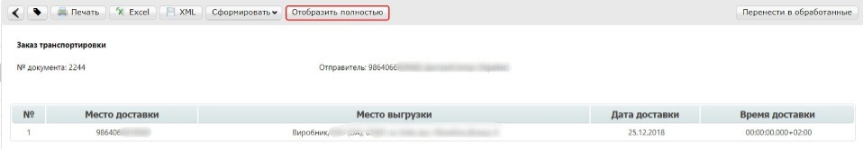

Открытый документ содержит детальную информацию по заказу, данные по грузу и транспорту, а так же данные по маршруту.

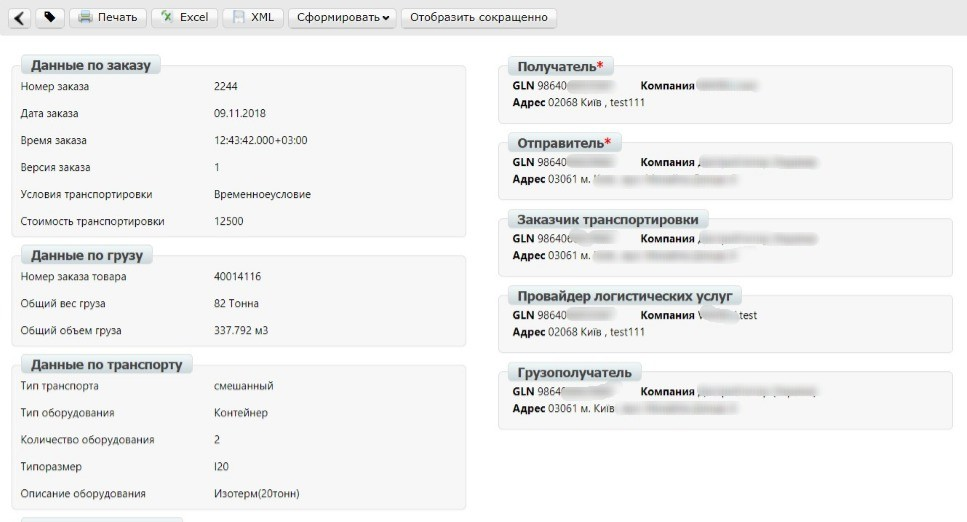

В правом блоке, содержится информация о реквизитах контрагентов, их наименования, адреса и GLN номера.

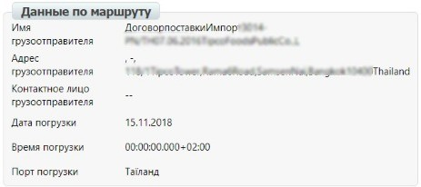

Для создания документа **IFTMBC**, в открытом документе нажмите кнопку **«Сформировать»** и выберете из выпадающего списка документ **«Подтверждение заказа транспортировки»**.

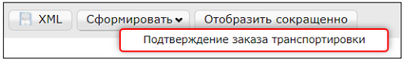

Заполнение документа (IFTMBC)
========================================================================

Заполнение документа «Подтверждение заказа транспортировки» предусматривает два способа:

- хронология событий поставки заполняется в одном документе
- хронология событий поставки заполняется в отдельном документе

Ниже описаны оба способа.

В открывшемся документе, первый блок содержит поля отмеченные красной звездочкой *****, эти данные автоматически подтягиваются из документа основания и являются обязательными к заполнению.

**Номер подтверждения заказа**: произвольный номер, присваиваемый документу, по-умолчанию подтягивается из документа основания.

**Дата подтверждения заказа**: дата, которой поставщик логистических услуг подтверждает готовность выполнения заказа

**Время подтверждения заказа**: время, которой поставщик логистических услуг подтверждает готовность выполнения заказа. Указывается в формате hh:mm

**Действие**: отказ или принятие поставщика логистических услуг выполнить заказ.

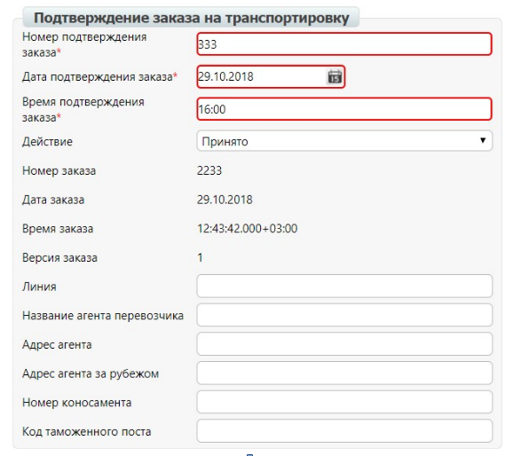

В случае отказа поставщика выполнить условия заказа, в колонке «Действия», необходимо выбрать пункт **«Отклонен»**.

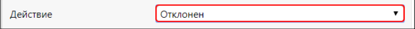

Второй блок содержит информацию о типе транспортируемого объекта, его размер, номер и краткое описание. А также информацию о транспортном средстве, номере прицепа и данные водителя.

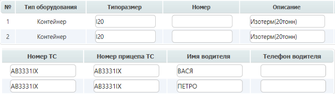

Количество строк во втором блоке как и колонки «Типоразмер» и «Описание» автоматически формируются на основании документа «Заказ транспортировки» из блока «Данные по транспорту». Остальные колонки заполняются вручную.

Добавление событий
====================================

Третий блок содержит информацию о событиях поставки. Для того, чтобы создать событие поставки, нажмите на кнопку **«Добавить позицию»**.

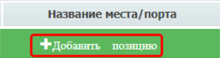

События поставки в табличной части содержат следующие колонки:

| **Тип события** — необходимо выбрать из выпадающего списка. 
| **Транспорт/судно** — необходимо выбрать из выпадающего списка. 
| **Название транспорта/судна** — заполняется вручную.
| **Название места/порта** — заполняется вручную.
| **Дата события** — необходимо указать дату в календаре.
| **Время события** — заполняется вручную.
| **Дополнительная информация** — заполняется вручную.

Для выбора события, нажмите на пустую строку в колонке **«Тип события»** и выберете из выпадающего списка нужный пункт.

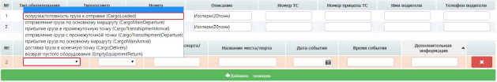

Аналогичным способ следует заполнить колонки **«Транспорт/судно»** и **«Дата события»**.

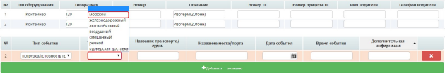

Для того, чтобы удалить событие, необходимо нажать на красную кнопку с крестиком.

Отправка документа
===================================================

После внесения в документ всех данных, необходимо сначала нажать кнопку **«Сохранить»**, а затем - **«Отправить»**.

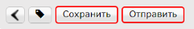

Данный документ будет отображаться в папке **«Отправленные»**.

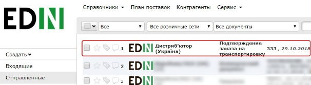

В случае, если информация заполняется данными, где хронология событий поставки заполняется в одном документе, блок событий будет выглядеть следующим образом:

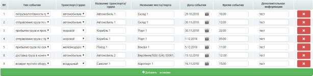

В случае, если информация заполняется данными, где хронология событий поставки заполняется в отдельном документе или документ отправляется в момент события (например, погрузка груза), то каждому отправленному документу будет присвоена следующая версия и заказчик услуги обрабатывает последнюю версию документа.

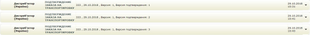

По получению всей необходимой информации, заказчик транспортировки отправляет квитанцию о закрытии заказа.

По получению файла статус документа «**заказ транспорта**» меняет статус на «**транспортировка закрыта**».

.. important:: **Внимание!** После получения статуса «**транспортировка закрыта**» над документами «Заказ транспорта» и «Подтверждение заказа транспорта» *нельзя проводить никаких действий*.

.. include:: kontakti.rst
