Инструкция по работе с документами на web-платформе для Modern-Expo
###############################################################################

.. role:: red

.. contents:: Содержание:
   :depth: 6

---------

1 Введение
====================================
Данная инструкция описывает порядок ведения полного документооборота с сетью Modern Expo.

2 Формирование Предзаказа
====================================

Что бы сформировать документ «ПредЗаказ», перейдите в раздел Создать — Заказ. В созданном документе укажите Тип документа — Предзаказ.

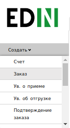

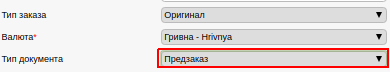

В открытой форме, все поля обозначенные красной звёздочкой :red:`*` обязательны для заполнения.

1. **Номер заказа** — указывается номер документа.
2. **Дата заказа** - дата заказа, автоматически указана текущая дата.
3. **Дата доставки** — необходимо указать желаемую дату доставки товара.
4. **№ договора** — договор основание. 
5. **Валюта** — валюта, в которой будет воспроизведен расчет.
6. **Получатель** — информация, кто является получателе документа.
7. **Покупатель** — информация, кто является покупателем товара.
8. **Место доставки** — информация, куда необходимо доставить товар.
9. **Поставщик** — выбрать контрагента, кто является поставщиком.

После того, как все обязательные поля заполнены, необходимо Сохранить документ.

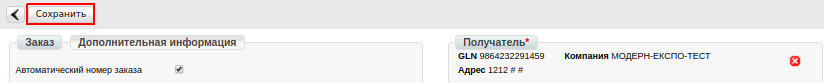

После сохранения документа, появляется возможность внизу документа добавить товарные позиции.

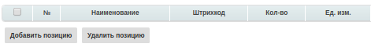

Нажмите кнопку **"Добавить позицию"**. Откроется окно **"Выбор позиции"**, который доступен с товарного справочника (необходимо, что бы он был заполнен). Для документа можно добавлять неограниченное количество товарных позиций.

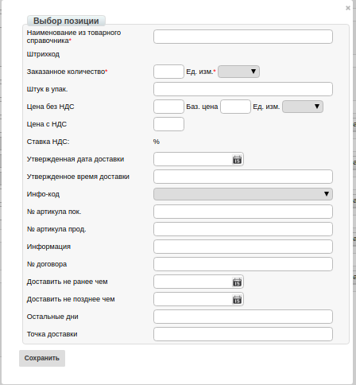

Так же присутствует возможность загрузить данные по товарным позиция с шаблона. Для этого необходимо скачать шаблон, его заполнить и загрузить в систему.

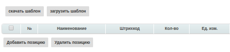

Обязательными полями в шаблоне являются поля, выделенные зеленым цветом, как на примере ниже.

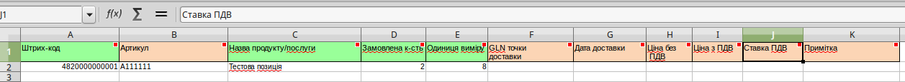

После того, как все данные в документ внесены, его необходимо **Сохранить**. После сохранения появится кнопка **Отправить**, при нажатии на которою выполняется отправка заказа контрагенту.

После того, как документ будет отправлен, он будет обработан поставщиком. В ответ на него поставщик сформирует документ:
- Подтверждение заказа - ordrsp,
- Уведомление об отгрузке — desadv.
Все полученные документы на платформе будут отображаться в одной цепочке, как на изображении ниже.

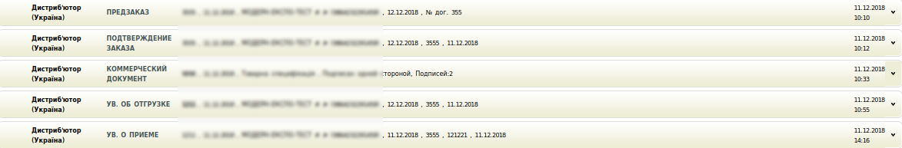

Необходимо создать, подписать и отправить Поставщику **Товарную спецификацию**. 

3 Товарная спецификация
====================================
Следующим этапом является создание и отправка коммерческого документа Товарная спецификация, для его создания зайдите в ранее отправленный документ «Подтверждение заказа». В открывшемся документе нажмите «Сформировать» - «Товарная спецификация»

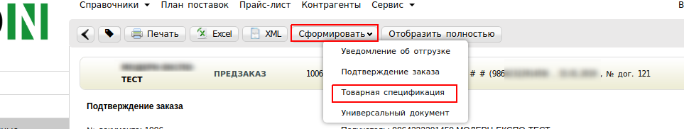

В созданном документе «Товарная спецификация» основные данные подтянутся из документа основания. Обязательные для заполнения поля будут подсвечены красной звездочкой :red:`*`.

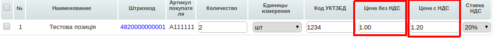

После заполнения всех обязательных полей нажмите «Сохранить». 

Обратите внимание, если какое-то обязательное поле будет незаполнено, то возле этого поля отобразится уведомление.

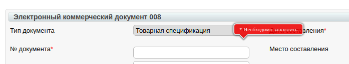

Заполните данное поле, после чего нажмите повторно «Сохранить». Так как данный документ является юридически значимым перед его отправкой на него необходимо наложить электронно цифровую подпись. Ознакомится с инструкцией по подписанию документа Вы можете по ссылке https://wiki.edi-n.com/ru/latest/general/Podpisanie_dokumentov_-CP_na_web-platofrme_EDIN.html . Далее данный документ Товарная спецификация со своей стороны должен подписать Ваш контрагент-Поставщик.

После этого на основании документа "Уведомление об отгрузке" (desadv) необходимо сформировать документ "Уведомление о приеме" (recadv). 

4 Уведомление о приеме (recadv)
====================================
Для формирования "Уведомление о приеме" (recadv) необходимо открыть документ-основание "Уведомление об отгрузке" (desadv) и нажать кнопку **Сформировать** — "Уведомление о приеме".

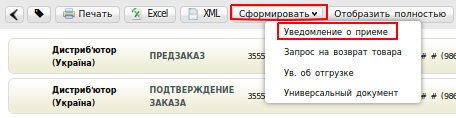

Если товар был принят не в полном объеме, Вы формируете коммерческий документ «Акт про виявлені недоліки» (документ формируется на основании Уведомления о приеме). Для этого зайдите в отправленный документ, нажмите Сформировать — Акт о выявленных недостатках. После заполнения его обязательно необходимо подписать ЭЦП и отправить на подпись поставщику. Завершающим этапом в электронном документообороте является формирование и отправка поставщиком документа Товарная накладная .

.. important:: **Внимание!** При необходимости Вы можете передать поставщику документ с вложением. Для этого зайдите в отправленный ранее документ и нажмите сформировать — Универсальный документ.

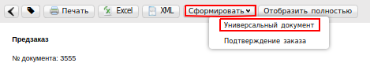

Заполните обязательные поля, отмечены красной звездочкой :red:`*`.

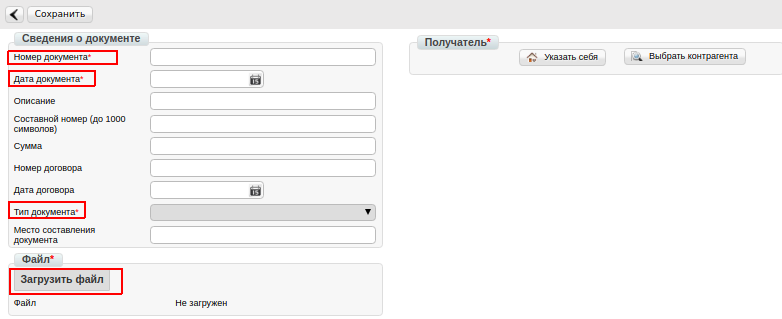

После чего загрузите необходимый файл и выполните отправку документа. Данный документ можно отправить как не подписанным, так и с наложенными ЭЦП.

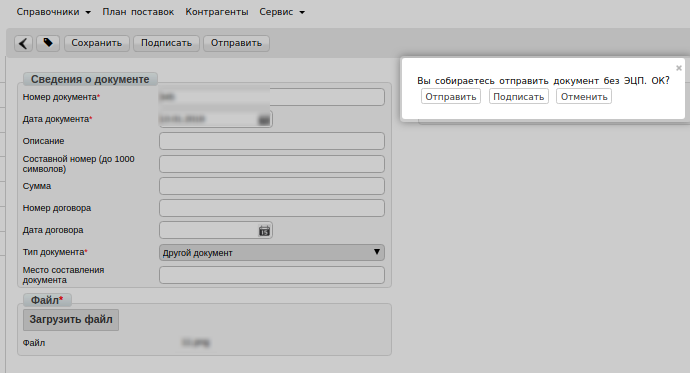

.. include:: kontakti.rst
