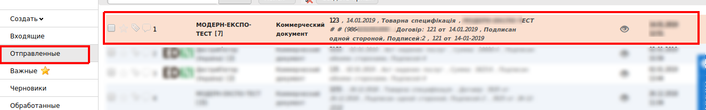

Инструкция по работе с документами на web-платформе для поставщика Modern-Expo
###############################################################################

.. role:: red

.. contents:: Содержание:
   :depth: 6

---------

1 Введение
====================================
Данная инструкция описывает порядок ведения полного документооборота с сетью Modern Expo.

2 Вход на платформу
====================================
Для входа на web-платформу перейдите по ссылке https://edo.edi-n.com/ введите Ваш Логин и пароль, после чего нажмите **Вход**.

3 Фильтры
====================================
После входа на платформу перейдите в раздел «Входящие», в данной папке есть возможность использовать фильтр для быстрого отображения документов по статусу и типу документа Для этого нужно воспользоваться полями, которые отображены выше над документами. По-умолчанию новые входящие документы имеют статус «Непрочитанные», после открытия документов статус меняется на «Прочитанные». Первым документом от клиента Modern-Expo является **«Предзаказ»**. Для выбора нового входящего документа выберите в фильтрах: **«Непрочитаные»** - Документ **«Заказ»** - Тип документа **«Предзаказ»**. 

После чего откройте входящий документ. В открытом виде у Вас будет отображаться сокращенный вид документа, в котором Вы сможете просмотреть продукцию которою заказывают, кто отправитель документа и место доставки. При необходимости нажмите «Отобразить полностью», что бы просмотреть более полную информацию по документу.

4 Подтверждение заказа (Ordrsp)
====================================
Для подтверждения входящего документа нажмите вверху «Сформировать» - «Подтверждение заказа».

У Вас создастся новый документ «Подтверждение заказа»(Ordrsp). В данный документ у Вас перенесутся основные данные. Вам необходимо будет указать будет ли у Вас доставка в полном объеме или будут изменения:
#. **Будет доставлено** — данная товарная позиция будет доставлена в полном объеме 
#. **Изменение к-ства** — данная товарная позиция будет доставлена не в полном объеме
#. **Отказано** — данная товарная позиция доставлена не будет 

.. important:: Подтверждение заказа является "ценовым" документом (цены по товарам в документе обязательны к заполнению)

После чего нажмите «Сохранить» и «Отправить»

Отправленные документы будут находится во вкладке «Отправленные», где Вы их можете просмотреть:

5 Получение "Товарной спецификации"
====================================
ТС Modern-Expo формирует и отправляет подписанный ЕЦП коммерческий документ "Товарная спецификация". Так как данный документ является юридически значимым перед его отправкой на него необходимо наложить электронно цифровую подпись.

6 Счет на оплату (invoice)
====================================
Следующим документом является **Счет на оплату** (invoice). Для его создания зайдите в входящий документ Товарная спецификация. Документ находится во вкладке "Входящие".

В открытом документе нажмите «Сформировать - «Счет-фактура».

Документ создается предзаполненным из документа "Товарная спецификация". Обязательные для заполнения поля будут подсвечены красной звездочкой :red:`*`, если какое-то обязательное поле будет незаполнено, то возле этого поля отобразится уведомление. 

После заполнения всех обязательных полей нажмите «Сохранить» и «Отправить».

7 Уведомление об отгрузке (Desadv)
====================================
Следующим документом является **"Уведомление об отгрузке"** (Desadv). Данный документ отправляется в момент отправки машины с товаром контрагенту. Для его формирования зайдите в ранее отправленный документ Подтверждение заказа(Ordrsp). Документ находится у Вас во вкладке отправленные, Вы можете отфильтровать документ используя фильтры. 

.. image:: pics_modern_expo_postavschuk_instruction/modern_expo_postavschuk_instruction_15.png
   :align: center

В открытом документе нажмите «Сформировать» - «Уведомление об отгрузке» 

В созданный документ перенесутся основные данные с документа основания. Обязательные для заполнения поля будут подсвечены красной звездочкой :red:`*`.  После заполнения документа нажмите «Сохранить» и «Отправить». После приема товара контрагент Modern-Expo отправит Вам Уведомление о приеме(Recadv). Документ будет у Вас отображаться во вкладке «Входящие».

Если приемка была по какой-то причине не выполнена в полном объеме Вам так же поступит коммерческий документ «Акт о выявленных недостатках». Документ будет у Вас отображаться во «Входящих».

.. important:: **Внимание!** «Акт о выявленных недостатках» является юридически значимым документом. Данный документ Вам необходимо будет подписать электронно цифровой подписью. 

8 Товарная накладная
====================================
Последним документом закрывающим цепочку документов является **Товарная накладная**. Для создания документа зайдите в полученное ранее "Уведомление о приеме".   

Откройте документ и нажмите «Сформировать» - «Товарная накладная»:

Документ создается предзаполненным из документа основания. Все обязательные для заполнения поля подсвечиваются красной звездочкой :red:`*`, если какое-то обязательное поле будет незаполнено, то возле этого поля отобразится уведомление. После заполнения документа нажмите «Сохранить». Так как документ является юридически значимым перед отправкой на него необходимо наложить Электронно цифровую подпись(ЭЦП). После подписания документа нажмите кнопку «Отправить».

9 Универсальный документ
====================================

.. important:: **Внимание!** При необходимости с документом отправить дополнительное вложение, например обоснование цены, спецификацию товара и т.д. Зайдите в любой отправленный ранее документ, нажмите «Сформировать» - «Универсальный документ».

У Вас создастся документ в который необходимо вложить необходимый документ, после чего нажмите «Сохранить». Для загрузки файла нажмите кнопку «Загрузить файл» и укажите к нему путь на Вашем компьютере.

На документ можно сначала наложить Электронно цифровую, для этого нажмите кнопку «Подписать» или отправить не подписанным, для этого просто нажмите кнопку «Отправить».

.. include:: kontakti.rst
