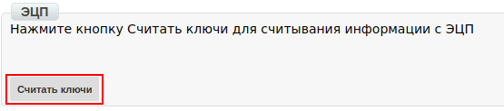
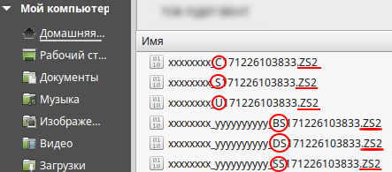
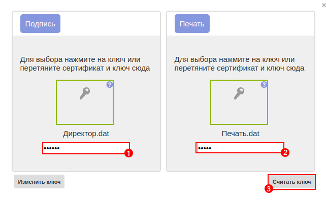

Общая инструкция по работе с Коммерческим документом COMDOC
########################################################################

---------

.. contents:: Содержание:
   :depth: 6

---------

Введение
====================================

Данная инструкция описывает порядок подписания коммерческого документа, который состоит из перечисленных ниже этапов.

Принятие коммерческого документа
=========================================

Чтобы принять коммерческий документ необходимо перейти в раздел «**Входящие**». Для удобства поиска, отфильтруйте документы по «Прочитанным», выберете необходимую сеть, тип «Коммерческий документ» и укажите нужный подтип документа.

Документы, требующие подписания, будут выделены уведомлением красного цвета: «**Документ требует подписания**»

Непрочитанные документы не подсвечиваются, их необходимо открыть или отметить как прочитанные.

Подписание коммерческого документа
=========================================

Откройте нужный документ и нажмите кнопку «**Подписать**» на верхней панели инструментов.

Для первичной настройки ЭЦП, дождитесь загрузки страницы, а затем нажмите кнопку “**Считать ключи**”

Затем, в блоке настройки ЭЦП, нажмите на изображение ключа и выберете из каталога, где хранятся Ваши секретные ключи, соответствующий файл.

.. image:: pics_rabotа_s_Kommercheskim_dokumentom_COMDOC/rabotа_s_Kommercheskim_dokumentom_COMDOC_05.png
   :align: center

Виды файлов электронно-цифровой подписи
=========================================

Если Вы используете ключи от **АЦСК “Украина”**, файлы подписей секретных ключей имеют расширение **.ZS2** и следующие значения в именах файлов:

- Директор «DS»,
- Бухгалтер «BS»,
- Сотрудник «SS»,
- Печать «S»,
- Шифрование «C»,
- Универсальный ключ печати и шифрования «U».

Если Вы используете ключи от **АЦСК “ПриватБанк”**, файлы подписей секретных ключей имеют расширение **.jks**

.. image:: pics_rabotа_s_Kommercheskim_dokumentom_COMDOC/rabotа_s_Kommercheskim_dokumentom_COMDOC_07.png
   :align: center

Если Вы используете ключи от любых других **АЦСК**, файлы подписей секретных ключей имеют наименование **Key-6.dat**

.. image:: pics_rabotа_s_Kommercheskim_dokumentom_COMDOC/rabotа_s_Kommercheskim_dokumentom_COMDOC_08.png
   :align: center

После выбора секретных ключей, введите пароли под каждым из них, а затем нажмите кнопку “**Считать ключи**”

При корректном считывании ключей, в блоке “**ЭЦП**” появится информация о владельцах ключей. После проверки информации нажмите кнопку “**Подписать**”.

.. image:: pics_rabotа_s_Kommercheskim_dokumentom_COMDOC/rabotа_s_Kommercheskim_dokumentom_COMDOC_10.png
   :align: center

После подписания нажмите на кнопку “**Отправить**”.

.. include:: kontakti.rst
