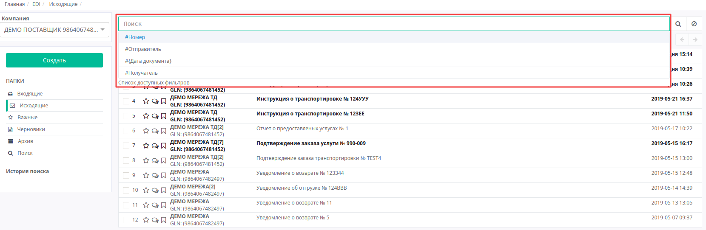
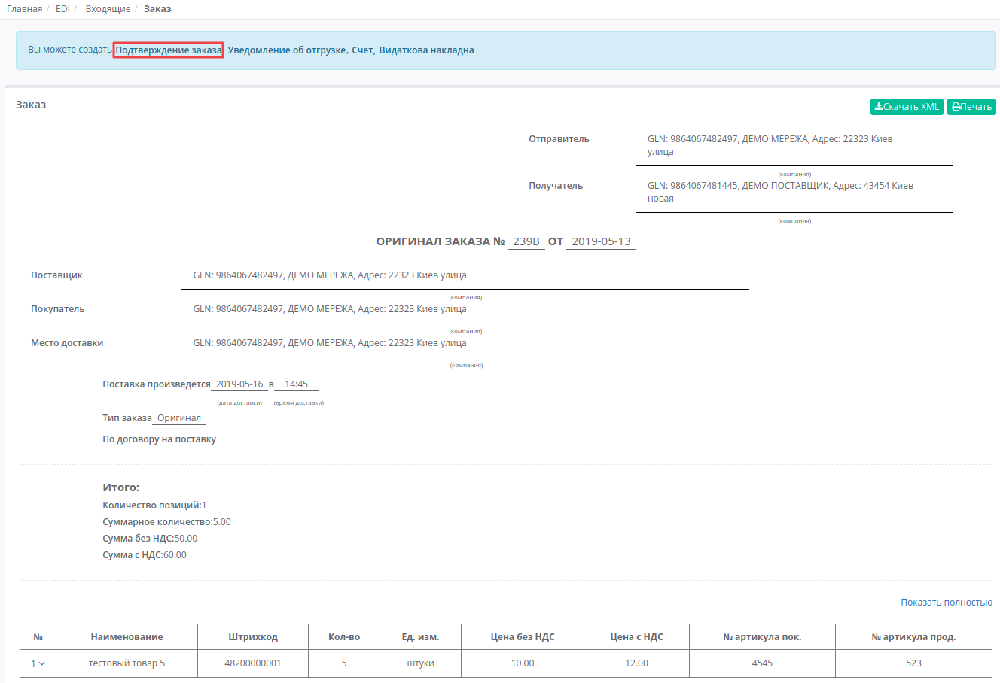
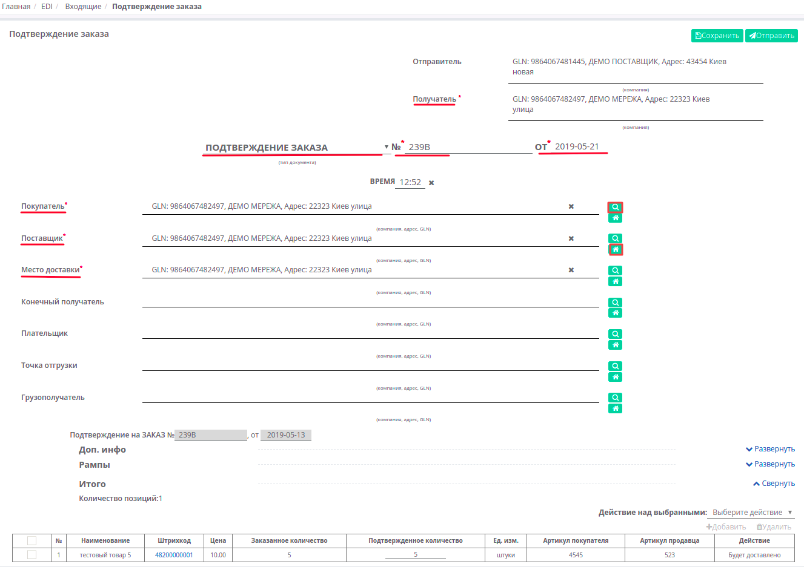
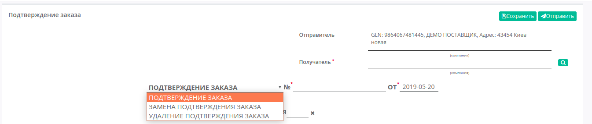
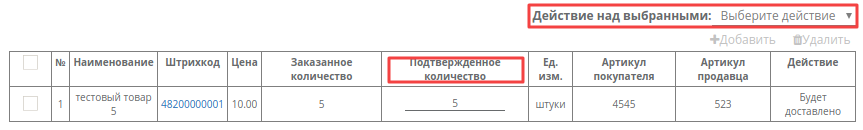
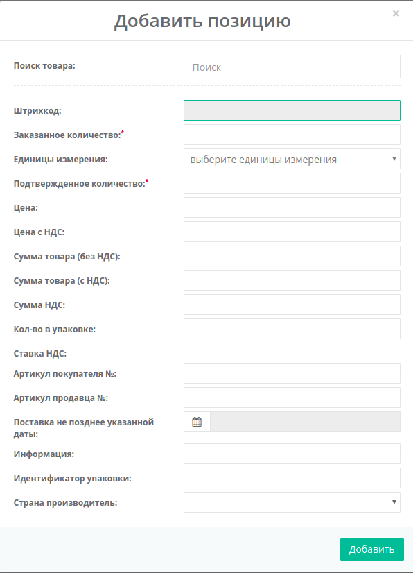
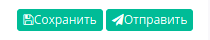
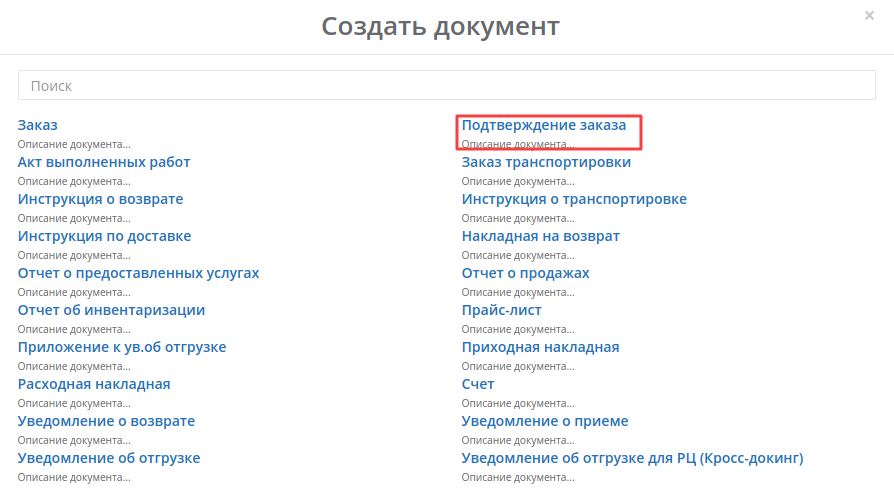
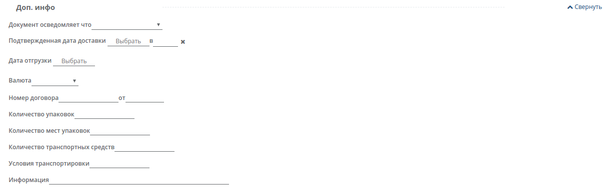
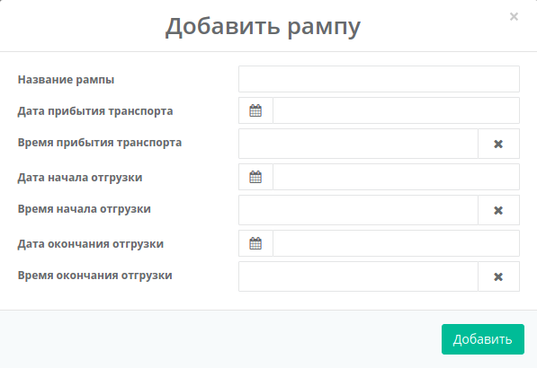

####################################################
Формирование и отправка документа «Подтверждение заказа» (ORDRSP) на платформе EDI Network 2.0
####################################################

.. role:: red

.. contents:: Содержание:
   :depth: 6

---------

Введение
====================================
Данная инструкция описывает порядок формирования и отправки документа «**Подтверждение заказа**» (**ORDRSP**).
Поставщик на основании полученного заказа формирует документ ORDRSP, в котором подтверждает или не подтверждает поставку той или иной позиции продукции. Поставщик может изменить количество поставляемого товара (например, в зависимости от кратности упаковки, остатков на складе и т.д.).

Формирование ORDRSP в ответ на входящий Заказ
==================================================================

Чтобы сформировать «**Подтверждение заказа** (**ORDRSP**)» на основании **Заказа** (ORDER), войдите в папку «**Входящие**» и выберите **заказ**, по которому нужно сделать подтверждение.

   
Для поиска достаточно ввести корректный номер документа в поле «Поиск». Документы также возможно искать по Отправителю, Дате документа и Получателю.

Для формирования ORDRSP выберите «**Подтверждение заказа**» на форме-подсказке, документ создастся автоматически.
Из Заказа заполненные поля переносяться в «**Подтверждение заказа**». Все поля, обозначены красной звёздочкой *** обязательны для заполнения**.

1. **Получатель** - данные получателя (сети),не подлежат редактированнию
2. **Подтверждение заказа** - поле «**Тип документа**»
3. **№** - номер заказа
4. **от** - дата подтверждения, по умолчанию указана текущая дата
5. **Покупатель** - заполняется автоматически, или с помощью кнопки Поиск контрагента, или с помощью кнопки Указать себя
6. **Поставщик** - автоматически, или с помощью кнопки Поиск контрагента, или с помощью кнопки Указать себя
7. **Место доставки** - автоматически, или с помощью кнопки Поиск контрагента, или с помощью кнопки Указать себя

С помощью кнопки «**Поиск контрагента**» (лупа) или же с помощью кнопки «**Указать себя**» (дом) возможно изменить данные Покупателя или Поставщика.

Поле «**Тип документа**» можно изменить нажав на название типа, и вместо Подтверждение заказа, выбрать Замена или Удаление подтверждения заказа.

Блоки **Доп инфо**, **Рампы** необязательные для заполнения, блок **Итого** расчитывается автоматически.

В блоке  **Позиции** отображается таблица-перечень заказаных **товарных позиций** и основная информация по позициям.
**Товарные позиции** переносятся с Заказа, их можно подтвердить, удалить, изменить.

:red:`Все изменения по позициям только после согласования с сетью!`

Возможны следующие «**Действие над выбранными**» позициями: **Будет доставлено** или **Отказано**.
В колонке **Действия** - отображается статус действия в выбранной позицией. Возможны следующие статусы: **Будет доставлено, Изменения количества, или Отказано**.

  
Поставщик может редактировать позиции, например, в случае когда необходимо изменить количество подтвержденного товара. Для этого внесите количество подтверждаемого товара в колонке **Подтвержденное количество**.
Если какая-то из позиций отсутствует и поставляться не будет, её необходимо отметить галочкой и удалить. 

Возможно также добавить другую позицию из Товарного справочника, заполнив форму **Добавить позицию** под кнопкой **Добавить**.

.. important:: **Внимание!** Подтвержденное количество товарных позиций не может превышать указанное в заказе!

После внесения всех данных в документе, нажмите кнопку «**Сохранить**», затем «**Отправить**».

Отправленный документ автоматически попадает в папку «**Отправленные**» и будет находится в цепочке документов вместе с заказом.

Также есть возможность сформировать документ «**Подтверждение заказа**» (**ORDRSP**) из раздела «**Входящие**», при нажатии зеленой кнопки «**Создать**», и выбрав тип документа «**Подтверждение заказа**» в появившемся окне **Создать документ**.

Вид созданного документа соответствует документу «**Подтверждение заказа**» (**ORDRSP**) созданному на основе заказа, однако все поля необходимо заполнить самостоятельно.
В новом документе, все поля обозначенные красной звёздочкой ***** **обязательны для заполнения**.

**Получатель** - необходимо заполнить с помощью кнопки «**Поиск контрагента**» (лупа) или же с помощью кнопки «**Указать себя**» (дом).
Форма **Поиск контрагента** дает возможность искать по GLN, ИНН, по названию компании или по названии сети (при выборе соответсвующего чекера).

.. image:: pics_ORDRSP_na_EDI_Network_2.0/ORDRSP_na_EDI_Network_2_08.png
   :align: center

Блок **Доп инфо** заполнять необязательно, в нем отображается дополнительная информация, вы можете открыть или скрыть этот блок нажав на кнопку **Развернуть/Свернуть**.

Блок **Рампы** заполняется информацией об условиях отгрузки и точке отгрузки.

После внесения всех данных в документе, нажмите кнопку «**Сохранить**», затем «**Отправить**».

.. include:: kontakti.rst
