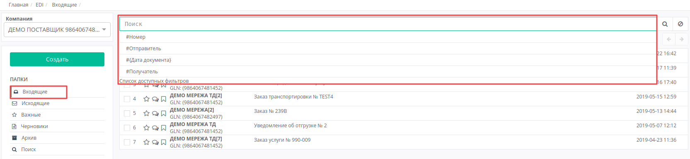
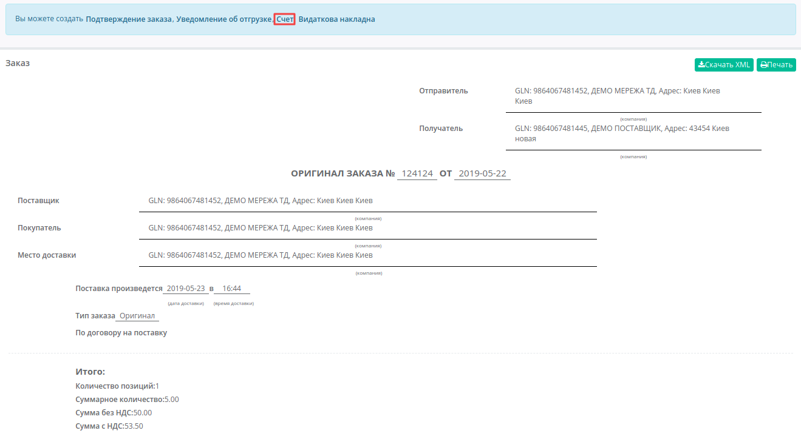
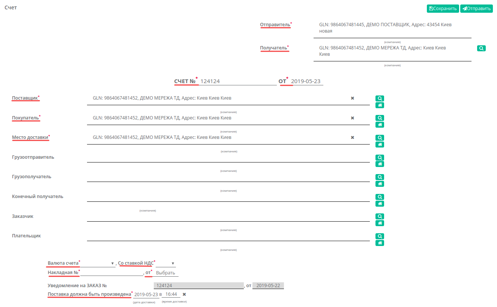
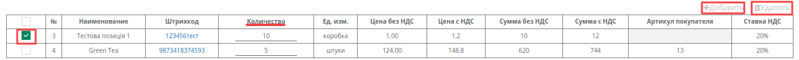
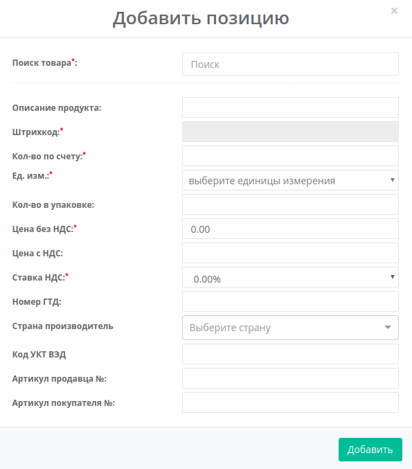
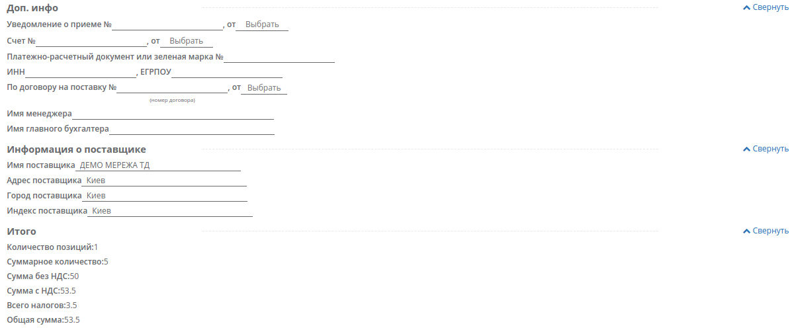

##############################################################################
Формирование и отправка документа «Счет» (INVOICE) на платформе EDI Network 2.0
##############################################################################

.. role:: red

.. contents:: Содержание:
   :depth: 6

---------

Введение
====================================
Данная инструкция описывает порядок формирования и отправки документа «**Счет**» **(INVOICE)**. 
INVOICE - счет на оплату, отправляется в розничную сеть поставщиком для окончательного согласования цен.

Формирование документа «Счет»
====================================

Формирование документа возможно как на основании «**Заказа**», так и на основании «**Подтверждения заказа**».

Рассмотрим формирование документа «**Счет**» на основании «**Заказа**».

Перейдите в раздел «**Входящие**», выберите необходимый документ основание «**Заказ**». Для удобства воспользуйтесь поиском - достаточно ввести корректный номер документа в поле «**Поиск**», или часть номера GLN. Система автоматически выполнит поиск данного номера по GLN, по Отправителю, по Получателю и Дате документа.

В открытом документе, на форме-подсказке, которая позволяет создать документ на основе Заказа, выберите из списка  «**Счет**».

Документ созданный на основе Заказа или Подтверждения заказа создастся автоматически. Данные некоторых полей пененесутся из документа основания. Все поля, обозначены красной звёздочкой *** обязательны для заполнения**.

.. important:: **Внимание!** Номер накладной должен полностью совпадать с номером оригинала бумажной накладной.

#. **Отправитель** - данные отправителя счета (поставщика)
#. **Получатель** - данные получателя (сети),компания
#. **СЧЕТ №** - номер счета 
#. **от** - дата уведомления об отгрузке, по умолчанию указана текущая дата
#. **Поставщик** - заполняется автоматически, или с помощью кнопки Поиск контрагента, или с помощью кнопки Указать себя 
#. **Покупатель** - заполняется автоматически, или с помощью кнопки Поиск контрагента, или с помощью кнопки Указать себя
#. **Место доставки** - заполняется автоматически, или с помощью кнопки Поиск контрагента, или с помощью кнопки Указать себя
#. **Валюта счета** - выбрать валюту: Гривна, Доллар США, Евро
#. **Со ставкой НДС** - выбрать ставку налога на добавленную стоимость: 0%, 7%, 20%
#. **Накладная №** - номер накладной должен полностью совпадать с номером оригинала бумажной накладной
#. **от** - дата накладной
#. **Поставка должна быть произведена** - дата и время доставки

.. important:: **Внимание!** В случае создания нескольких расходных накладных, необходимо на каждый заказ сформировать счет фактуру. При этом, поле «**По накладной №**» в документах должно отличаться.

Ниже на странице созданного документа находится необязательная для заполнения (если другое не указано в договоре) доп. инфо, информация о поставщике, а также итог по количеству и по сумме с/без НДС по позициям.

Ниже на странице созданного документа находится перечень **товарных позиций**, которые были заказаны, и их количество. Система автоматически подставит значения по позициям из документа основания «**Заказ**».

Возможно вносить изменения в количество позиций.
В случае, если вам необходимо изменить количество поставляемого товара в счете, в колонке «**Количество**» внесите необходимое значение.

:red:`Все изменения по позициям только после согласования с сетью!`

Если какая-то из позиций отсутствует и поставляться не будет, её необходимо отметить галочкой и **Удалить**. Возможно также добавить другую позицию из Товарного справочника, заполнив форму **Добавить позицию** под кнопкой **Добавить**.

.. important:: **Внимание!** Поставляемое количество товарных позиций не может превышать указанное в заказе!

После внесения всех данных в документе, нажмите кнопку «**Сохранить**», затем «**Отправить**».

.. image:: pics_INVOICE_na_EDI_Network_2.0/INVOICE_na_EDI_Network_2_06.png
   :align: center

Отправленный документ автоматически попадает в папку «**Отправленные**» и будет находится в цепочке документов вместе с заказом и подтверждением заказа.

Сформировать документ «**Счет**» также можно в главном окне, из любого раздела просмотра документов. Для этого нажмите зеленую кнопку «**Создать**» и в появившемся окне **Создать документ** выберите тип документа «**Счет**».

Вид созданного документа соответствует документу «**Счет**» (INVOICE) созданному на основе **Заказа (или Подтверждения заказа)**, однако все поля необходимо заполнить самостоятельно. В новом документе, все поля обозначенные красной звёздочкой *** обязательны для заполнения**.

Блоки Доп инфо, Информация о поставщике необязательные для заполнения, блок Итого расчитывается автоматически.

После внесения всех данных в документе, нажмите кнопку «**Сохранить**», затем «**Отправить**». 
Отправленный документ автоматически попадает в папку «**Отправленные**» и будет находится в цепочке документов вместе с заказом и подтверждением заказа.

.. include:: kontakti.rst
