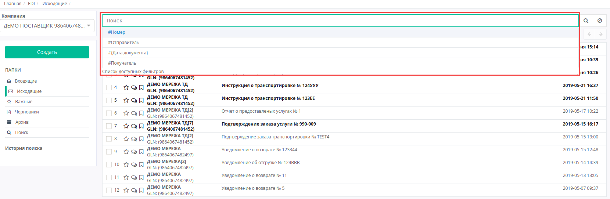
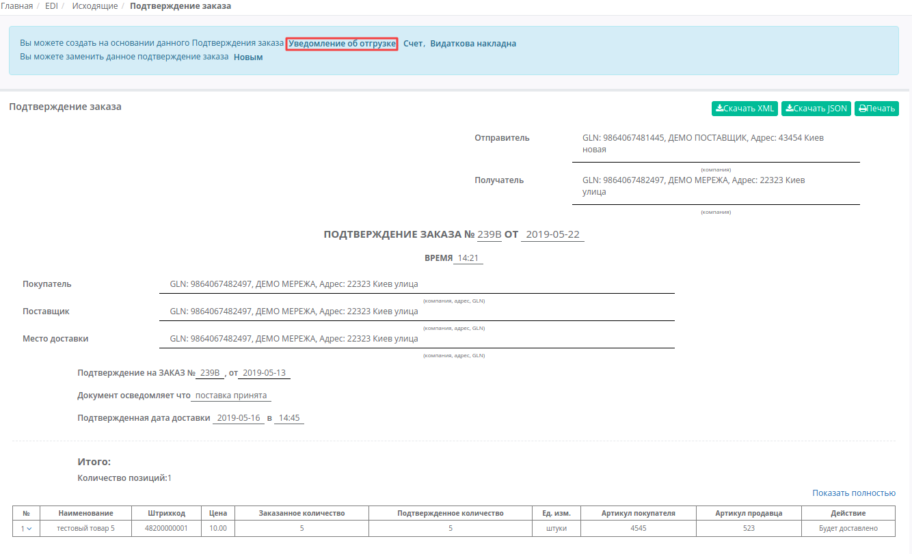
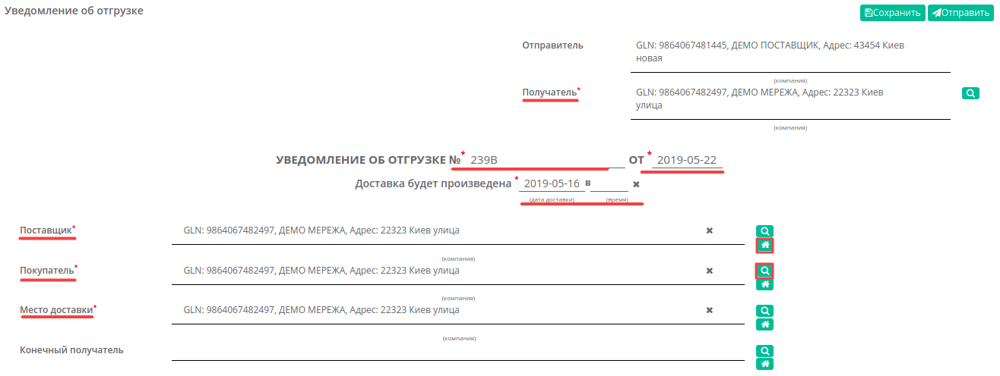
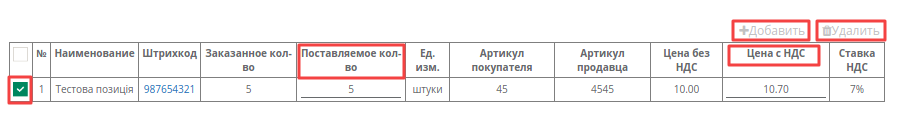
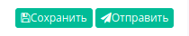
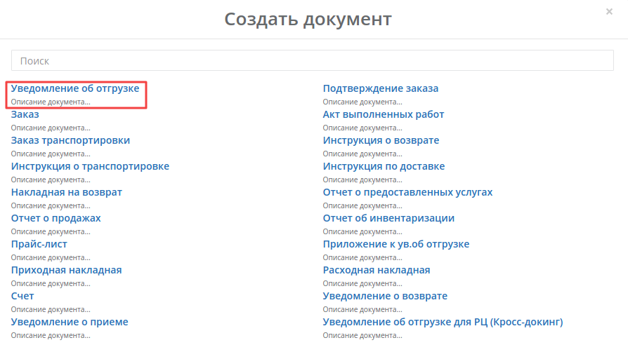
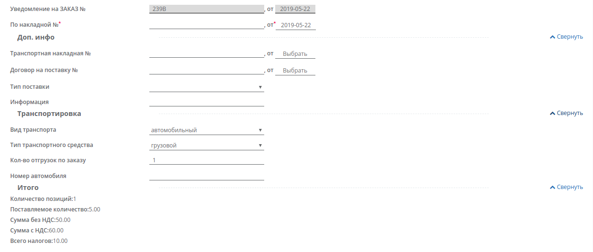

####################################################
Формирование и отправка документа «Уведомление об отгрузке» (DESADV) на платформе EDI Network 2.0
####################################################

.. role:: red

.. contents:: Содержание:
   :depth: 6

---------

Введение
====================================

Данная инструкция описывает порядок формирования и отправки документа «**Уведомление об отгрузке**» (DESADV) на платформе EDI Network 2.0.
Уведомление об отгрузке - аналог товарно-транспортной накладной. В результате розничная сеть еще до прихода машины на рампу имеет точную информацию о поставке и данная информация уже загружена в учетную систему сети. 

Формирование Уведомления об отгрузке (DESADV)
===========================================================

Формирование документа возможно как на основании «**Заказа**», так и на основании «**Подтверждения заказа**».

Рассмотрим формирование «**Уведомления об отгрузке**» на основании «**Подтверждения заказа**».

Перейдите в раздел «**Исходящие**», выберите в необходимый тип документа «**Подтверждение заказа**». Для удобства воспользуйтесь поиском - достаточно ввести корректный номер документа в поле «Поиск», или часть номера GLN. Система автоматически выполнит поиск данного номера по GLN, по Отправителю, по Получателю и Дате документа.

В открытом документе, на форме-подсказке, которая позволяет создать документ на основе **Подтверждения заказа**, выберите из списка «**Уведомление об отгрузке**».

Документ созданный на основе **Заказа** или **Подтверждения заказа** создастся автоматически. Данные некоторых полей пененесутся из документа основания. Все поля, обозначены красной звёздочкой *** обязательны для заполнения**. 

#. **Получатель** - данные получателя (сети),компания
#. **УВЕДОМЛЕНИЕ ОБ ОТГРУЗКЕ №** - номер заказа 
#. **от** - дата уведомления об отгрузке, по умолчанию указана текущая дата
#. **Доставка будет произведена** - дата и время доставки
#. **Поставщик** - заполняется автоматически, или с помощью кнопки Поиск контрагента, или с помощью кнопки Указать себя 
#. **Покупатель** - заполняется автоматически, или с помощью кнопки Поиск контрагента, или с помощью кнопки Указать себя
#. **Место доставки** - заполняется автоматически, или с помощью кнопки Поиск контрагента, или с помощью кнопки Указать себя
#. **По накладной №** - номер накладной, должен полностью совпадать с номером оригинала бумажной накладной

Ниже на странице созданного документа находится номер накладной, дополнительная информация по транспортировке, а также итог по количеству и по сумме с/без НДС по позициям:
Блоки Доп инфо, Транспортировка необязательные для заполнения, блок Итого расчитывается автоматически.

.. important:: **Внимание!** Номер накладной должен полностью совпадать с номером оригинала бумажной накладной.

А также перечень товарных позиций, которые были заказаны, и их поставляемое количество. Система автоматически заполняет значения по позициям из ранее отправленного документа «**Подтверждение заказа**», на основе которого был создан документ **DESADV**. Возможно вносить изменения в количество и цену позиций.

:red:`Все изменения по позициям только после согласования с сетью!`

.. important:: **Внимание!** В случае создания **нескольких** расходных накладных на заказ, необходимо на каждую накладную сформировать уведомление об отгрузке. При этом, поле «**По накладной №**» в документах должно отличаться.

В случае, если вам необходимо изменить количество поставляемого товара, в колонке «**Поставляемое количество**», измените количество.

.. important:: **Внимание!** Поставляемое количество товарных позиций не может превышать указанное в заказе!

Если какая-то из позиций отсутствует и поставляться не будет, её необходимо отметить галочкой и **Удалить**. Возможно также добавить другую позицию из Товарного справочника, заполнив форму Добавить позицию под кнопкой **Добавить**.

Если изменилась цена, внесите изменения в колонку «**Цена с НДС**».
Все изменения отобразятся в блоке **Итого**:

- **Количество позиций**
- **Поставляемое количество**
- **Сумма без НДС**
- **Сумма с НДС**
- **Всего налогов**

После внесения всех данных в документе, нажмите кнопку «**Сохранить**», затем «**Отправить**»

   
Отправленный документ автоматически попадает в папку «**Исходящие**» и будет находится в цепочке документов вместе с заказом и подтверждением заказа.

Сформировать документ «**Уведомление об отгрузке**» также можно в главном окне, из любого раздела просмотра документов. Для этого нажмите зеленую кнопку «**Создать**» и в появившемся окне **Создать документ** выберите тип документа «**Уведомление об отгрузке**». 

   
Вид созданного документа соответствует документу «**Уведомление об отгрузке**» (DESADV) созданному на основе **Заказа** (**Подтверждения заказа**), однако все поля необходимо заполнить самостоятельно. В новом документе, все поля обозначенные красной звёздочкой *** обязательны для заполнения**.

Блок **Доп инфо**, или **Транспортировка** заполнять необязательно, в нем отображается дополнительная информация, вы можете открыть или скрыть этот блок нажав на Развернуть/Свернуть.

 
После внесения всех данных в документе, нажмите кнопку «**Сохранить**», затем «**Отправить**».
Отправленный документ автоматически попадает в папку «**Исходящие**» и будет находится в цепочке документов вместе с заказом и подтверждением заказа.

.. include:: kontakti.rst
