Створення і відправлення прайс-листа. Інструкція для виробника
#################################################################

---------

.. contents:: Содержание:
   :depth: 6

---------

Вступ
=======================================

Інструкція описує порядок формування документа **Прайс-лист** і його відправлення покупцю для використання у вигляді бланку замовлення.

Перегляд списку покупців
=======================================
Натисніть на значок **Налаштування**, розміщений в правому верхньому куті. 
В списку доступних вам закладок, оберіть закладку **Дистриб’ютори**.

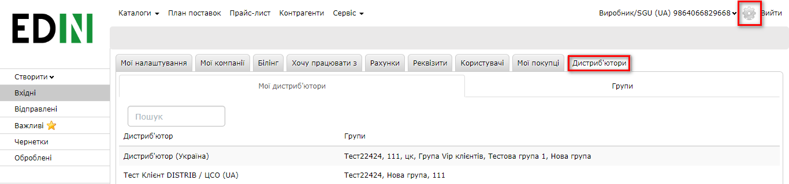

У вкладці **Мої дистриб’ютори** можна переглянути список всіх покупців, яким ви можете відправляти прайс-листи, та групи, в які вони об’єднані.

Групування покупців по видам прайс-листів
===============================================
Якщо для різних груп ваших покупців діють різні ціни чи відрізняється асортимент, ви можете спростити відбір дистриб’юторів для відправлення групових прайс-листів. Створюйте назви груп, які відповідають виду прайс-листа, діючому для кожної групи клієнтів.

Перейдіть на вкладку **Групи**. Для внесення нової назви групи призначена кнопка **Створити групу**. Для видалення якої-небудь з існуючих назв груп – кнопка видалення в колонці **Видалити**. При видаленні групи, дистриб’ютори, які входять до її складу, не видаляються.

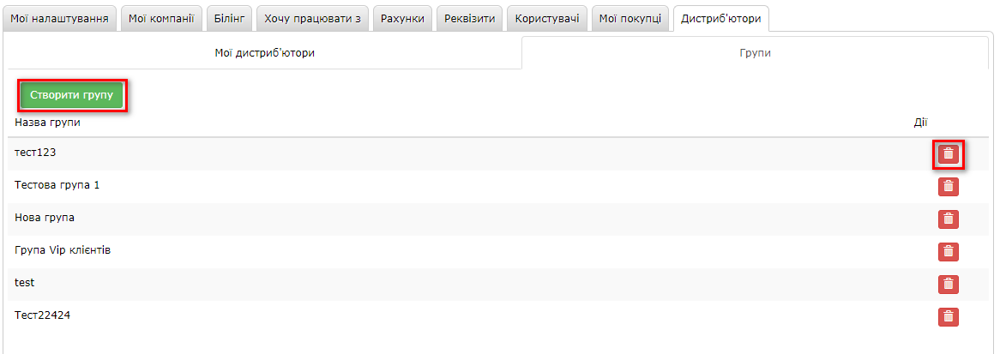

Після того, як ви створили всі необхідні назви груп, позначте покупців, яких необхідно включити туди. Натисніть на кожну назву групи, ви побачите список всіх своїх дистриб’юторів, в якому позначте приналежність до групи. Дані одразу ж будуть збережені, закрийте вікно заповненої групи та відкрийте наступну.

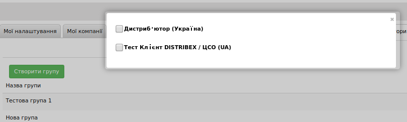

Повернувшись на вкладку **Мої дистриб’ютори**, ви можете побачити в списку покупців додані їм групи. При необхідності, ви можете відкоригувати приналежність. Для цього натисніть на назву покупця, зніміть відмітку з назви групи, з якої його необхідно прибрати, і відмітьте групу, в яку додати.

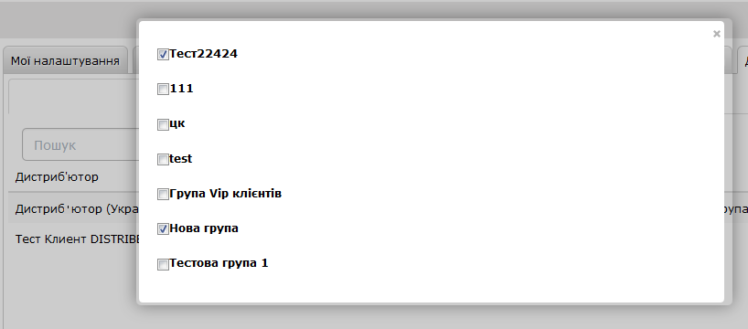

Створення прайс-листа
===============================================
Оберіть пункт меню **Прайс-лист**.

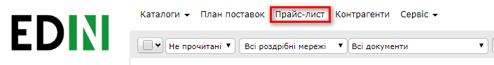

Завантажте файл з підказками по заповненню прайс-листа, натиснувши кнопку **Зберегти - Шаблон прайс-листа**.

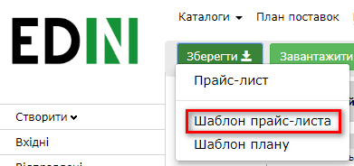

Додайте свій асортимент, ціни і логістичну інформацію для товарів в завантажену таблицю, видаливши дані приклади.

Збережіть у себе на диску цей **Excel**-файл (не змінюючи формат документу).

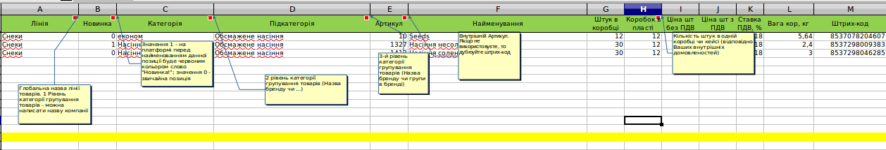

Відправлення документу Прайс-лист і обмеження для замовлень по прайсу
=================================================================================
Для відправлення прайсу на платформу EDIN-Distribution натисніть кнопку **Завантажити - Прайс-лист**.

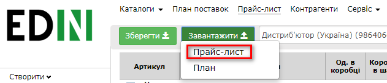

Заповніть у вікні **Меню завантаження прайсу** обов’язкову інформацію для відправлення прайс-листа:

- **Період дії**: внесіть дату початку (не раніше поточної дати) і дату закінчення.
- **Номер прайс-листа**: завантажені прайс-листи нумеруються на платформі автоматично. Якщо є потреба, введіть свій номер документа.
- **Список дистриб’юторів**: вкажіть покупців, для яких відправляєте даний прайс-лист. Можна обрати всіх, вибрати раніше створену групу чи окремих покупців.

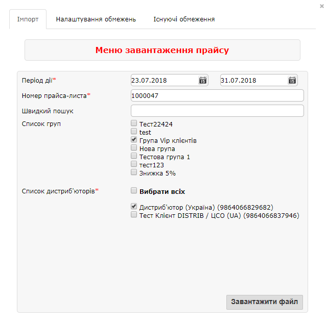

Одночасно з відправленням Прайс-листа ви можете передати покупцям обмеження по об’єму, вазі, кількості позицій або сумі одного замовлення.

Для цього перейдіть у вкладку Налаштування обмежень, встановіть відмітки біля параметрів і введіть значення (максимальну кількість палет в замовленні, максимальну вагу замовлення в кілограмах, максимальну кількість товарних позицій або мінімальну суму замовлення з ПДВ). Обмеження будуть діяти обраним покупцям.

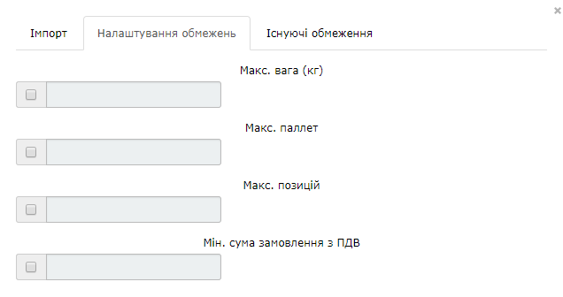

Щоб відправити Прайс-лист, поверніться на закладку **Імпорт**. Після натискання кнопки **Завантажити файл** з’явиться вікно, де ви вкажете шлях до документу і оберете створений раніше файл з Прайс-листом.

Натисніть кнопку **Відкрити (Open)**, і Прайс-лист буде відправлений обраним покупцям.

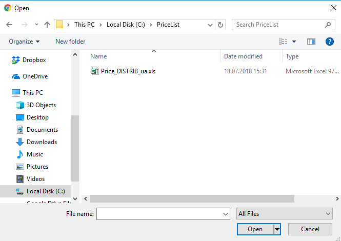

Документ буде знаходитись в папці **Відправлені**.

Перегляд і редагування прайс-листів
=========================================================================
Для перегляду і редагування Прайс-листів передбачено Меню **Прайс-лист**.

.. image:: Pics_Stvorennja_j_vidpravlennja/12.png
   :align: center 

Обирайте покупця зі списку в полі Дистриб’ютор, і період, для якого хочете переглянути асортимент і ціни для нього.

Щоб побачити актуальний для покупця Прайс-лист, необхідно ввести дату для початку та для закінчення періоду та натиснути кнопку **Застосувати фільтр** для відображення.

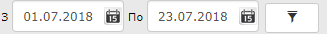

Якщо для обраного періоду не завантажений жоден прайс, буде виведено повідомлення.

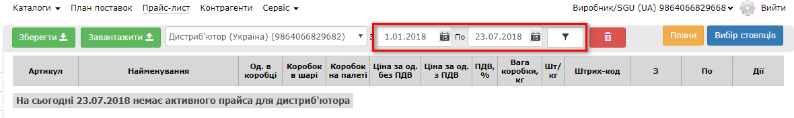

Інакше, за вибраний період відображатимуться всі товари.

В списку товару, в відповідних стовпчиках, ви можете побачити для кожної позиції дати початку і закінчення дії цін. Дистриб’ютор може замовити позицію за умовою, якщо дата завершення дії ціни не мешне за поточну дату.

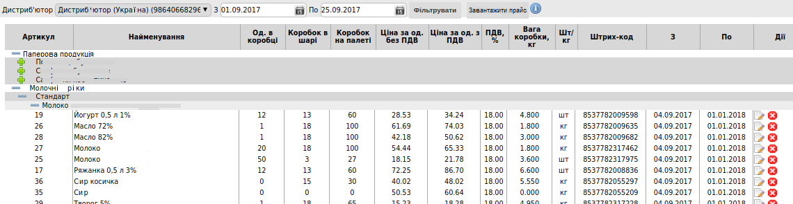

Прайс для обраного покупця, на вказаний період, вивантажується в форматі Excel кнопкою **Зберегти - Прайс-лист**.

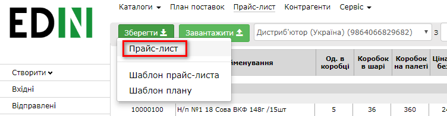

**ВАЖЛИВО**! Зміна дати на вашому ПК не змінить відтворення прайс-листів. Використовується час серверу.

Додавання Акційних цін
--------------------------
Для регулярних позицій прайс-листа можуть в певні періоди часу діяти акційні ціни. В такому випадку, для Акції можна сформувати прайс-лист в Excel, який містить тільки акційні позиції. Акційні позиції необхідно позначити в стовпці “**Акція**”. А при відправленні вказати Період дії відповідно умов Акції.

В такому випадку, коли регулярний **Прайс-лист** є на платформі EDIN-Distribution, то для деяких позицій, які входять до його складу, новим документом відправляється акційна ціна. А залишкові позиції зберігаються, які не входять у прайс, що відправляється. І якщо дата дії акційної ціни не перевищує дату дії регулярної, то по закінченню дії акційного прайс-листа, покупцям знову буде доступною початкова, регулярна ціна на позиції, які брали участь в акції.

Додавання Сезонних позицій
--------------------------
Для введення в прайс-лист сезонного асортименту, і для виведення по закінченні сезону, немає необхідності кожний раз формувати і відправляти повний список асортименту. Достатньо, у випадку діючого довготривалого прайсу, створити і відправити покупцям документ Прайс-лист, який містить тільки **Сезонні позиції**.

Для цього вкажіть в **Меню завантаження прайсу** період їх доступності до відвантажень. Позиції, які є в регулярному прайсі, залишаться без змін. Сезонний асортимент автоматично перестане відображатися покупцям, по закінченню періоду дії сезонного прайс-листа.

Додавання зображень і файлів до товарних позицій
----------------------------------------------------
До кожної позиції прайс-листа (після відправлення) можна прикріпити декілька файлів форматів *jpg, png, doc, docx, xls, xlsx*. Дистриб’ютор побачить ці файли, зможе переглянути і завантажити.

Натисніть на найменування позиції в прайсі, і у вікні редагування на кнопку **Завантажити файл**. З’явиться стандартне вікно відкриття файлу, де оберіть шлях і файл і натисніть (**Open**). Щоб прикріплені файли збереглись на платформі EDIN-Distribution, натисніть кнопку **Зберегти**.

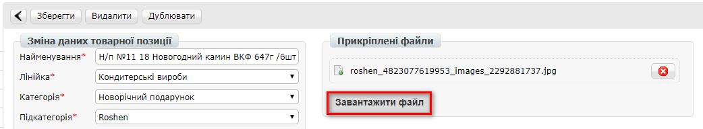
 
Виділення Новинок
--------------------------
Нові позиції в асортименті ви можете виділяти надписом “**Новинка!**”. Покупці побачать її в Прайс-листі і в бланку Замовлення по прайс-листу.

Якщо спочатку при імпорті прайс-листа з файлу, новинки НЕ були відмічені в відповідному стовпці, то їх можна відмітити (чи зняти відмітку) вручну, для кожного з покупців, відповідно в завантаженому прайс-листі.

Натисніть на найменування позиції, у вікні редагування встановіть відмітку **Новинка**. Натисніть кнопку **Зберегти** та поверніться в прайс-лист.

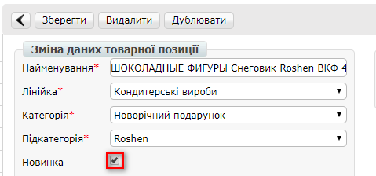

Новинка буде позначена в прайс-листі.

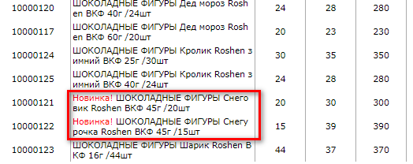

Виділення Акційних товарів
--------------------------
Акційні позиції в асортименті ви можете виділяти надписом “**Акція!**”. Покупці побачать її в Прайс-листі і в бланку Замовлення по прайс-листу.

Якщо спочатку при імпорті прайс-листа з файлу, акційні товари НЕ були відмічені в відповідному стовпці, то їх можна відмітити (чи зняти відмітку) вручну, для кожного з покупців, відповідно в завантаженому прайс-листі.

Натисніть на найменування позиції, у вікні редагування встановіть відмітку **Акція**. Натисніть кнопку **Зберегти** та поверніться в прайс-лист.

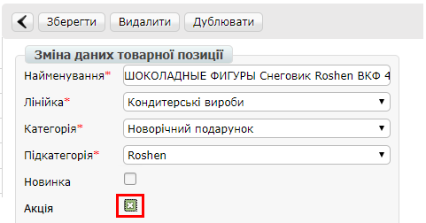

Акція буде позначена в прайс-листі.

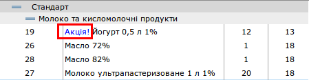

Видалення прайсів
=========================================================================
При видаленні прайс-листа проводиться очищення всієї історії асортименту і цін. Після видалення покупець не зможе користуватися бланком замовлення по прайсу.

Видалити прайс-лист для тільки одного з дистриб’юторів можна обравши його прайс для перегляду і натиснувши кнопку **Очистити каталог**.

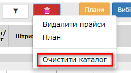
 
Якщо є потреба видалити прайс-лист для групи покупців, скористайтесь кнопкою **Видалити прайси**.

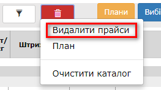

У вікні **Видалення прайсу** можна обрати покупців, для яких будуть видалені всі дані, які були завантажені в прайс-лист. Після вибору натисніть кнопку **Видалити**.
 
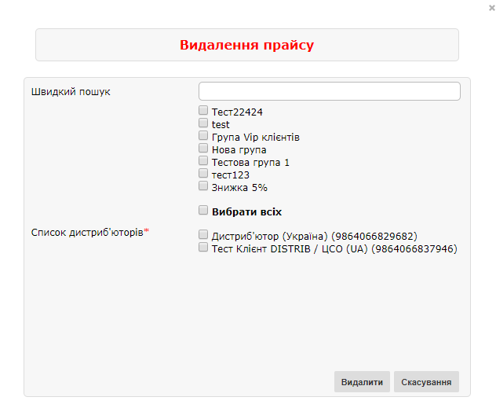

Внесення змін в обмеження для замовлень по прайсу
=========================================================================
На закладці **Існуючі обмеження** в Меню завантаження прайс-листу (викликається кнопкою **Завантажити - Прайс-лист**) ви побачите список всіх покупців з встановленими на даний момент для їх замовлень обмеженнями.

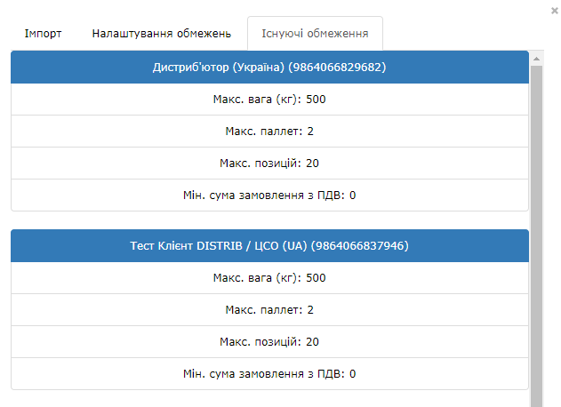

Для відправлення дистриб’юторам змін в значеннях обмежень необхідно виконати відправлення прайс-листів. Діючий для покупця прайс можно вивантажити, видалити два останні стовпця з датами дії цін, і зберегти. Далі виконати дії по відправленню прайсів і обмежень відповідно до розділу .

Додавання покупців
======================================================================
Щоб додати нового покупця, зверніться до вашого менеджера в компанії АТС.

У випадку ротації дистриб’юторів і покупців, звертайтесь до вашого менеджера в компанії АТС.

Відправлення прайс-листів дистриб’юторам з облікової системи
======================================================================
В компанії АТС розроблена специфікація XML. Щоб налаштувати відправлення прайсів безпосередньо з вашої облікової системи дистриб’юторам, зверніться до вашого менеджера в компанії АТС.
