Согласование цен на web-платформе EDIN-Price. Инструкция для розничной сети
#############################################################################
---------

.. contents:: Содержание:
   :depth: 2

---------

Введение
******************************************

Выгрузка товарного справочника для Поставщика. Схема работы
****************************************************************

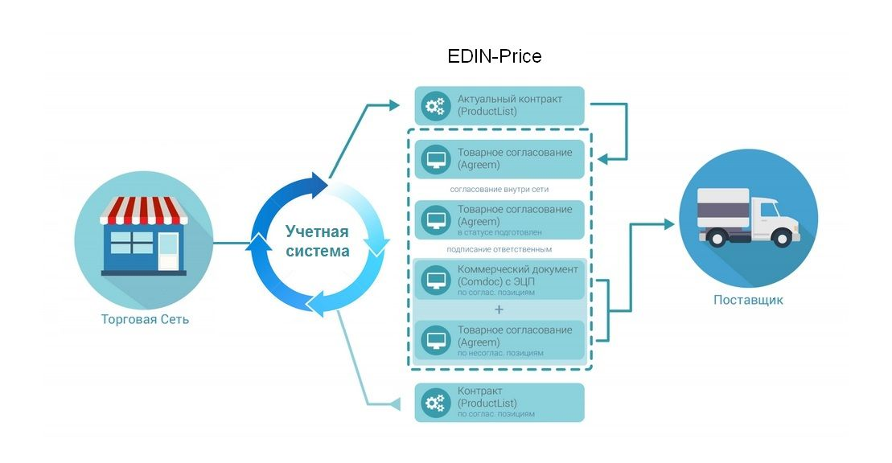

Розничная сеть из своей учетной системы выгружает на **FTP** актуальный товарный справочник (контракт, спецификации) в формате **XML** (PRODUCTLIST.XML). После обработки данного файла на платформе EDIN, у поставщика, в меню **Сервис** - **EDIN-Price**, отобразится перечень действующих контрактов с сетью. 
Поставщик на основании согласованного товарного справочника формирует предложение по изменению цен и направляет его в торговую сеть. 

Торговая сеть проводит согласование данного предложения, в случае успешного решения, подписывает со своей стороны коммерческий документ и направляет его поставщику. 
Поставщик со своей стороны подписывает коммерческий документ и отправляет Торговой сети. После получения подписанного с обеих сторон коммерческого документа, на FTP Торговой сети выкладывается новый согласованный PRODUCTLIST.XML, на основании которого обновляются данные в учетной системе. После этих изменений сеть повторно выгружает уже обновленный товарный справочник (контракт, спецификацию) на FTP.

.. note::  В случае каких-либо изменений данных, согласованных не через систему EDI, PRODUCTLIST.XML выгружается повторно. 

Обработка Товарного согласования
****************************************************************

Примечание! При наличии в бизнес процессе дополнительных департаментов (руководитель отдела закупки, служба безопасности, экономическая безопасность, финансовый аналитик, логистика) статусы могут меняться. 

Ниже представлен список возможных статусов:

1. **На согласовании** – получен сетью, без внесения изменений
2. **Подготовлен** – обработан Категорийным менеджером сети
Промежуточные статусы обработки документов для регулирования бизнес процессов согласования:

- *Подтвержден*
- *Проверен*
- *Готов к подписанию*
- *Согласован*
3.**Подписан** – обработан финальным подписантом и наложена ЭЦП со стороны сети

1 этап. Обработка товарного согласования категорийным менеджером
====================================================================
Документ Товарное согласование, отправленный Поставщиком, находиться в разделе Входящие.
Отобрать документы для обработки можно с помощью фильтра. Для этого необходимо выбрать тип документа «Товарное согласование» и соответствующий статус:

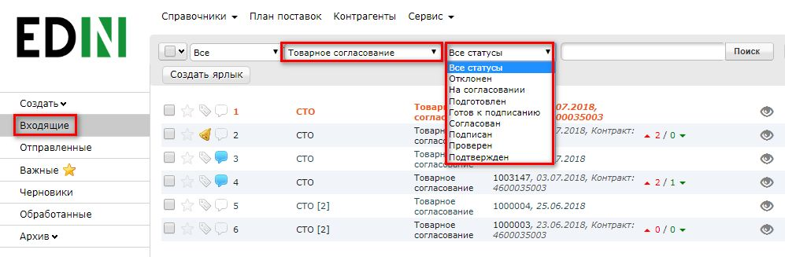

Для быстрого доступа к документам, требующим обработки, можно создать ярлык «**Необходимо согласование**»:

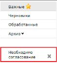

Для открытия входящего документа нажмите на него:

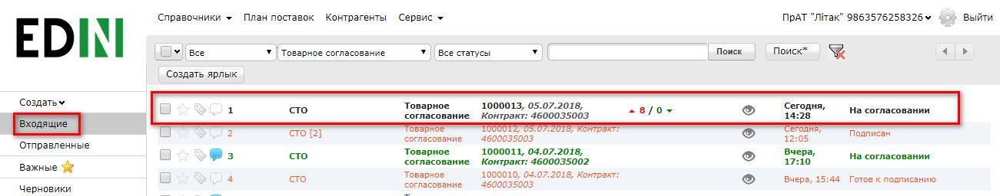

В открывшемся документе можно увидеть основную информацию, которая зависит от типа документа, а при нажатии на кнопку **Отобразить полностью** можно посмотреть дополнительное содержимое документа. В документе на изменение регулярной/промо цены Вам необходимо проверить цены в каждой из позиций и указать статус – Принято/Не принято, по необходимости изменить период для новой цены, а затем изменить общий статус документа – На согласовании/Подготовлен.

Возле наименования товарной позиции размещена иконка "инфо". После ее нажатия, в дополнительном окне открываются пиктограммы *Listex* и *Ucat*. Нажав на них происходит переход на сайт каталогов.
Если по товару поставщик загрузил сертификат, то возле штрих-кода будет иконка "галочка", свидетельствующая о том, что к штрих-коду прикреплен сертификат. После ее нажатия в дополнительном окне отобразится основная информация по сертификату:

.. image:: pics_Soglasovanie_cen_Instrukcija_dlja_seti/pics_Soglasovanie_cen_Instrukcija_dlja_seti_05.png
   :align: center

С помощью кнопок «**Действие**» возможно: 

- скачать сертификат со всеми приложениями (архив с файлами)
- просмотреть скан-копию сертификата
- получить прямую ссылку на скан-копию сертификата
- скачать основной бланк сертификата (титульная страница)

Дополнительно для пере-согласования регулярной цены, если указанный период документа имеет общие даты с ранее согласованными промо ценами, то возле даты последнего изменения будет размещена иконка "проценты". После ее нажатия, в дополнительном окне открывается ранее согласованная дополнительная информация по промо: период и цена с НДС:

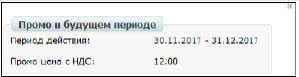

После изменения статуса, Вам необходимо подтвердить действие, для этого нажмите «**Закончить**»:

.. image:: pics_Soglasovanie_cen_Instrukcija_dlja_seti/pics_Soglasovanie_cen_Instrukcija_dlja_seti_07.png
   :align: center

В окне «**Связь с продавцом**» у Вас есть возможность читать комментарии поставщика и оставлять свои, для этого введите текст сообщения в пустое поле и нажмите кнопку **Отправить**:

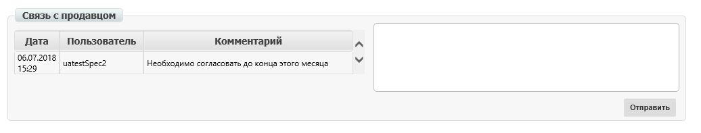

2 этап. Обработка Товарного согласования Руководителем отдела закупок
=======================================================================
Документ Товарное согласование, согласованный Категорийным менеджером находится в разделе **Входящие** со статусом Подготовлен. Аналогично как и для категорийного менеджера можно воспользоваться фильтрами или перейти по ярлыку «**Необходимо согласование**» для отображения нужного списка документов.
Для открытия входящего документа нажмите на него:

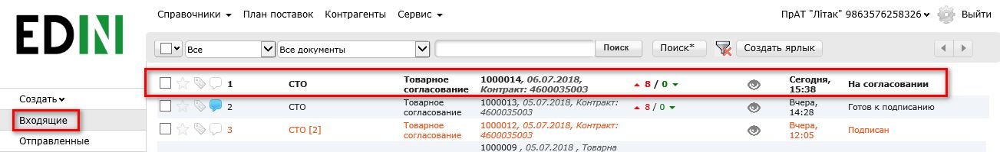

В открывшейся форме документа Вам необходимо проверить цены в каждой из позиций, указать статус – Принято/Не принято, а затем изменить общий статус документа – Готов к подписанию/Отклонен.

Также ниже в форме документа у Вас есть возможность связаться с поставщиком и оставить ему комментарий. Для этого введите текст сообщения в пустое поле и нажмите кнопку **Отправить**.

После изменения статуса, Вам необходимо подтвердить действие, для этого нажмите «**Закончить**»:

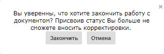

3 этап. Обработка и подписание Товарного согласования Коммерческим директором
================================================================================
Документ Товарное согласование, согласованный Руководителем отдела закупок находится в разделе Входящие со статусом Готов к подписанию. Как и для предыдущих ролей, документы можно отфильтровать по статусу либо перейти по ярлыку «**Необходимо согласование**».

Примечание! Есть возможность массового подписания. Этот процесс описан в разделе Дополнительных возможностях и функциях.

В случае единичного подписания необходимо открыть входящий документ Товарное согласование, нажав на него:

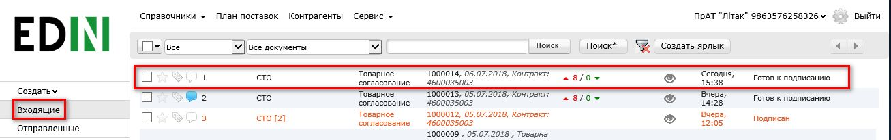

В открывшейся форме документа Вам необходимо проверить цены в каждой из позиций, указать статус – Принято/Не принято, затем изменить общий статус документа – Согласован/Отклонен. После изменения статуса нажмите кнопку **Подписать**.

После первичной настройки ЭЦП и ввода ключей нажмите кнопку **Считать ключи**:

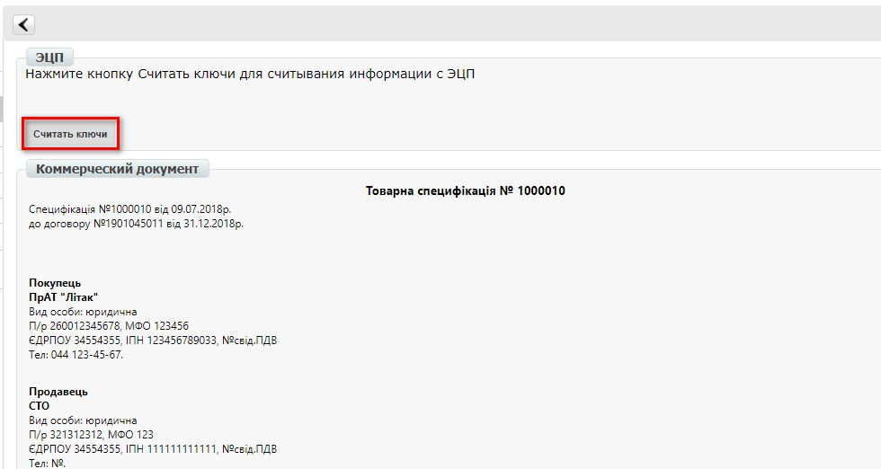

Выберите необходимые ключи для подписания и нажмите **Считать ключ**:

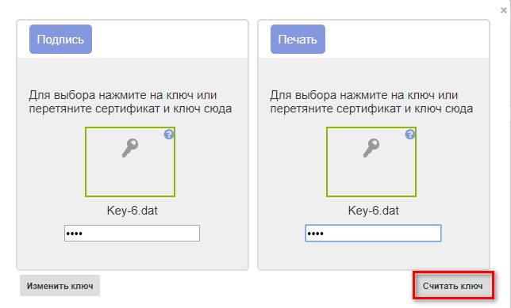

Затем нажмите **Подписать**:

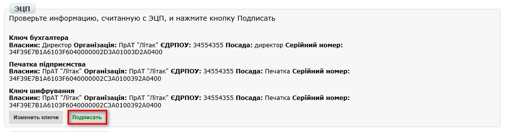

После успешного подписания, нажмите кнопку **Отправить**:

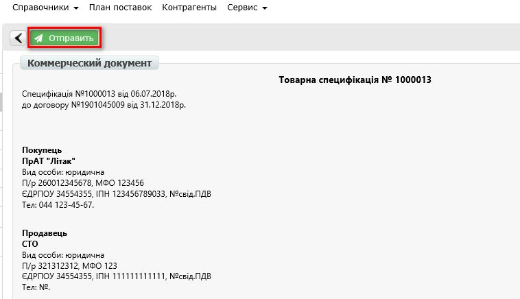

Создание Товарного согласования
****************************************************************
Просмотр актуального согласованного справочника
================================================================================
Для просмотра и дальнейшей работы с согласованным справочником необходимо навести указатель мыши на треугольник возле меню «**Сервис**» и в выпадающем списке выбрать **EDIN-Price**:

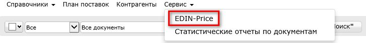

При этом откроется страница с актуальными товарными справочниками, сгруппированными по названию поставщика:

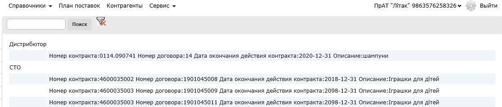

Фильтр «**поиск**» ищет по наименованию компании, товарной позиции, ЕГРПОУ, номеру договора, номеру контракта, штрих-коду, артикулу. Для просмотра содержимого справочника необходимо провалиться в соответствующий документ путем нажатия левой кнопки мыши.
Будет открыта детальная форма справочника.

.. note:: Все данные, указанные на форме – фиктивные, используются только в качестве примера 

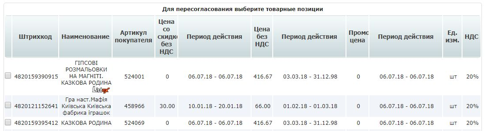

Создание предложения
========================================================
Для инициирования процесса пересогласования регулярной цены необходимо создать документ «**Товарное согласование**». Создание документа для пересогласования промо цен возможно в 2-х режимах.

Создание Товарного согласования для пересогласования промо цены вручную
---------------------------------------------------------------------------
Для создания товарного согласования зайдите в необходимый согласованный справочник. В открывшейся форме выберите позиции для пересогласования, и нажмите кнопку **Пересогласовать**:

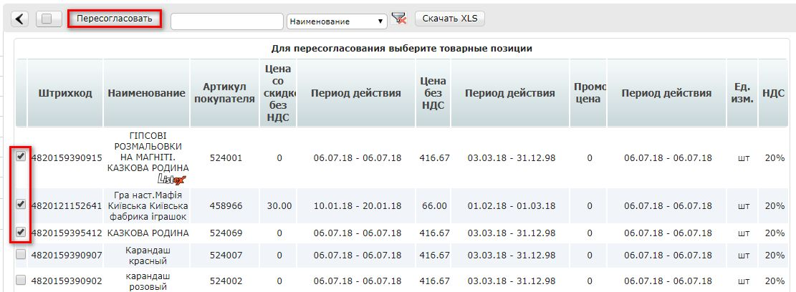

Во всплывающем окне выберите «**Изменить промо цену**» и нажмите «**ОК**»:

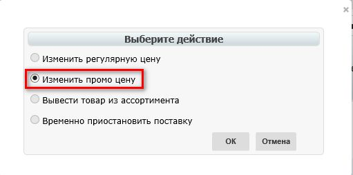

В открывшимся окне установите новые цены в соответствующих колонках (Новая цена без НДС/Новая цена с НДС – по условиям договора с сетью). Затем укажите Дату начала действия и Дату окончания действия новой цены. Дата начала действия новой цены должна превышать согласованное кол-во дней от даты создания документа Товарное согласование.

При необходимости перечень позиций можно расширить или сократить с помощью кнопок «Добавить позицию» и «Удалить позицию». Возле наименования товарной позиции размещена иконка . После ее нажатия, в дополнительном окне открываются пиктограммы *Listex* и *Ucat*. Нажав на них происходит переход на сайт каталогов.

Существует возможность добавить обоснование изменения цены или другие документы, которые могут ускорить согласование. Для этого нажмите кнопку «**Добавить обоснование**»:

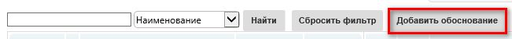
 
В открывшемся окне можно добавить необходимые файлы:

.. image:: pics_Soglasovanie_cen_Instrukcija_dlja_seti/pics_Soglasovanie_cen_Instrukcija_dlja_seti_23.png
   :align: center

Для добавления файлов используется кнопка «**Добавить файл**», для удаления лишних файлов – кнопка возле имени файла.

После того, как все файлы были добавлены – необходимо нажать на кнопку «**Создать обоснование**», в результате файлы будут сохранены в отдельный архив и подгружены к товарному согласованию. После нажатия кнопки «Создать обоснование» изменение архива будет невозможным. В случае если необходимо добавить и/или удалить какие-то файлы – всю процедуру следует повторить сначала. После сохранения внесенных изменений нажмите кнопку **отправить**.

Обратите внимание! Доступ к полю Количество регулируется (заполняется/не заполняется). Дату начала действия новой цены и дату окончания действия новой цены поставщик не меняет.

В разделе **Отправленные** находятся отправленные на пересогласование поставщику документы:

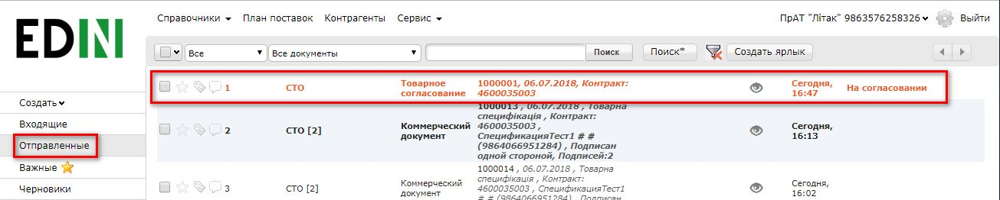

Жирным курсивом выделен еще не прочитанный Поставщиком документ.

Товарное согласование имеет несколько этапов согласования документа на стороне поставщика, которые у Вас отображаются в виде статуса документа:

- **На согласовании** – получен поставщиком
- **Отклонен** – отклонен поставщиком
- **Согласован** – согласован, но коммерческий документ не подписан
- **Подписан** – наложена ЭЦП со стороны поставщика.

Для просмотра отправленного документа «**Товарное согласование**» нажмите на него. В открывшемся документе можно увидеть основную информацию по документу.
Для связи с поставщиком введите текст сообщения в окно **Связь с продавцом** и нажмите кнопку **Отправить**:

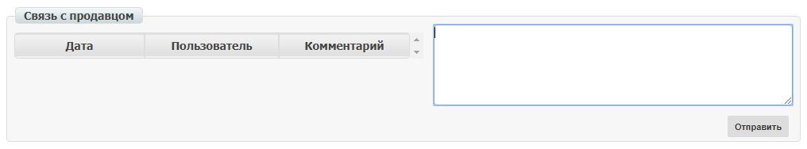

Создание Товарного согласования для пересогласования промо цены с помощью загрузки из Excel
----------------------------------------------------------------------------------------------------
Выберите раздел **Согласованный справочник**, откройте необходимую запись товарного справочника и нажмите кнопку **Скачать шаблон**:

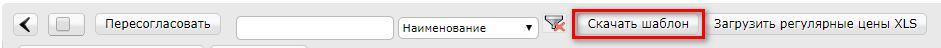

После нажатия на кнопку откроется форма сохранения шаблона. Сохраните файл на компьютер, откройте его для заполнения. В шаблоне заполните поля по позициям для пересогласования:

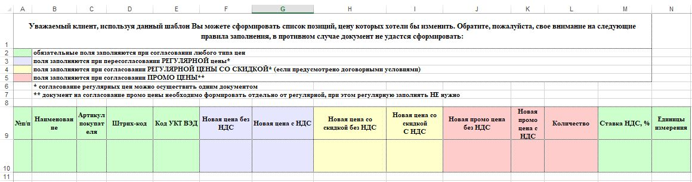

Важно! Не меняйте расширение файла шаблона. Оно должно быть только xls. Не меняйте структуру файла и последовательность колонок, не удаляйте верхние строки.

Сохраните заполненный файл шаблона, а затем нажмите кнопку **Загрузить Промо цены XLS** – для загрузки шаблона с заполненными промо ценами. После нажатия на кнопку загрузки откроется стандартная форма для загрузки файла.

Выберите сохраненный вами шаблон.
На основании загруженного файла сформируется документ Товарное согласование. Проверьте правильность заполнения данных, укажите период начала и окончания действия новой цены, заполните количество, а затем нажмите кнопку Сохранить и после сохранения документа кнопку **Отправить**.

Важно! В документ Товарное согласование попадают только те товарные позиции, которые есть в выбранной спецификации на платформе. Сверка производится по артикулу и по штрих-коду.

Дополнительные возможности и функции
****************************************************************

Интерфейс
===============================================
Для удобства определения типа Товарного согласования, документы выделены разными цветами: 
 
- черные - предложения по изменению регулярной цены
- оранжевые - предложения по изменению промо цены
- зеленые - предложение по выводу товара из ассортимента и временной приостановки товара

Статус документа вынесен последней колонкой. Есть счетчик позиций с повышением и понижением регулярной цены, красным выводится количество позиций на повышение цены, а зеленым – понижение. По необходимости документ можно выделять как важный, ставить метки, а также прочитывать всю историю переписки не заходя в документ.

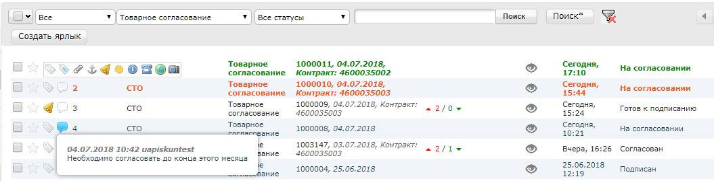

История изменений
===============================================
При обработке товарного согласования есть возможность просмотреть историю изменений как по всему документу, так и по отдельной позиции. Для просмотра истории изменений по всему документу в товарном согласовании нажмите кнопку «**История изменений**»:

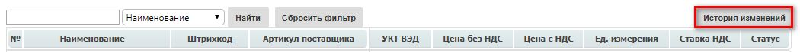

Откроется окно с историей изменений по документу.

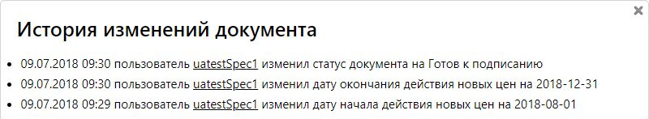

Для просмотра истории изменений по конкретной позиции необходимо нажать на Наименование, Штрих-код или Артикул. В результате будет открыто окно с историей изменения позиции.

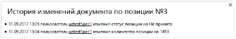

Обоснование
===============================================
В случае если поставщик добавлял обоснование изменения цены либо вложил какие-то другие файлы, то в разделе Входящие документы с обоснованием будут помечены скрепкой возле статуса:

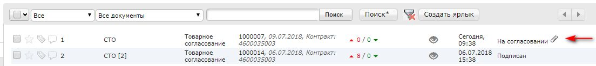

Загрузить и ознакомиться с вложением можно зайдя в товарное согласование и нажав на кнопку «**Загрузить обоснование**»:

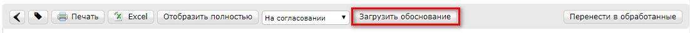

Массовое подписание
===============================================

1. В журнале выберите чекбоксами документы и нажмите "**Подписать**"

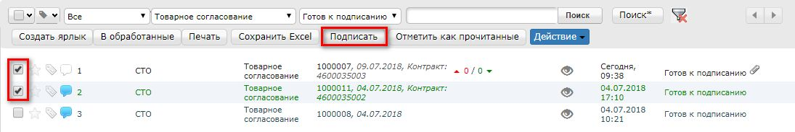

2. Откроется окно Подписания с кнопкой «**Зчитати ключі**». Нажмите на эту кнопку.

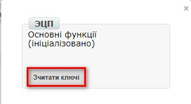

3. По нажатию на «Зчитати ключі» открывается окно Считывания ключей, в которое подтяните ЭЦП, введите пароль и кликните на «**Считать ключ**».

.. image:: pics_Soglasovanie_cen_Instrukcija_dlja_seti/pics_Soglasovanie_cen_Instrukcija_dlja_seti_36.png
   :align: center

4. После успешного считывания откроется окно Подписания. Нажмите на «**Підписати**». Все выбранные документы успешно подпишутся и отправятся.

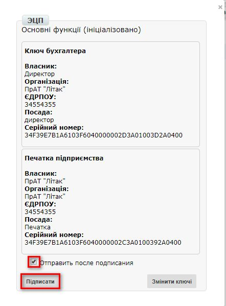

В случае, если ключи уже подтягивались ранее и данные о них были сохранены в кеше браузера, то повторно подтягивать ЭЦП нет необходимости, только введите пароль, активируйте чекбокс «Отправить после подписания» и нажмите на кнопку «**Считать ключ**».

