Согласование цен на платформе EDIN-Price. Инструкция для поставщика
########################################################################
---------

.. contents:: Содержание:
   :depth: 2

---------

Введение
************************************
Инструкция описывает порядок согласования цены и подписания документа на стороне Поставщика на веб-платформе EDIN-Price. Описанный функционал не предусматривает ввод новых товарных позиций! 
 
Схема работы
************************************

.. image:: pics_Soglasovanie_cen_web_EDIN-Price_dlja_postavshhika/pics_Soglasovanie_cen_web_EDIN-Price_dlja_postavshhika_01.png
   :align: center 

Розничная сеть из своей учетной системы выгружает на FTP товарный справочник (контракт, спецификацию) в формате XML (PRODUCTLIST.XML), который актуален на данный момент. После обработки данного файла на платформе, у поставщика, в меню **Сервис - EDIN-Price**, отобразится перечень действующих контрактов с сетью. Поставщик на основании согласованного товарного справочника формирует предложение по изменению цен и направляет его в Торговую сеть. 

Торговая сеть проводит согласование данного предложения. В случае успешного решения подписывает со своей стороны коммерческий документ и направляет его поставщику. Поставщик со своей стороны подписывает коммерческий документ и отправляет Торговой сети. После получения подписанного с обеих сторон коммерческого документа, на FTP Торговой сети выкладывается новый согласованный PRODUCTLIST.XML, на основании которого обновляются данные в учетной системе. После этих изменений сеть повторно выгружает уже обновленный товарный справочник (контракт, спецификацию) на FTP. 

.. note:: Примечание! В случае каких-либо изменений данных, согласованных не через систему EDI, PRODUCTLIST.XML выгружается повторно. 

Обработка Товарного согласования 
************************************

Просмотр актуального согласованного товарного справочника 
===============================================================

Для просмотра и дальнейшей работы с согласованным справочником необходимо выполнить вход в систему с помощью предоставленных логина и пароля. Далее навести указатель мышки на треугольник возле меню «Сервис» и в выпадающем списке выбрать **EDIN-Price**

.. image:: pics_Soglasovanie_cen_web_EDIN-Price_dlja_postavshhika/pics_Soglasovanie_cen_web_EDIN-Price_dlja_postavshhika_02.png
   :align: center

При этом откроется страница с актуальными товарными справочниками, сгруппированными по названию торговой сети 

.. image:: pics_Soglasovanie_cen_web_EDIN-Price_dlja_postavshhika/pics_Soglasovanie_cen_web_EDIN-Price_dlja_postavshhika_03.png
   :align: center

Для просмотра содержимого справочника необходимо перейти к содержимому соответствующего документа кликнув левой кнопкой мыши по документу. Будет открыта детальная форма справочника. 

.. note:: Все данные, указанные на форме – фиктивные, используются только в качестве примера 

.. image:: pics_Soglasovanie_cen_web_EDIN-Price_dlja_postavshhika/pics_Soglasovanie_cen_web_EDIN-Price_dlja_postavshhika_04.png
   :align: center

Создание предложения 
===============================================================

Процесс инициации доступен только на WEB-платформе. Для инициирования процесса пересогласования регулярной/промо цены, вывода товара из ассортимента, временной приостановки поставки необходимо создать документ «Товарное согласование». Создание документа для пересогласования регулярной и промо цен возможно в 2-х режимах. 

Создание Товарного согласования для пересогласования регулярной/промо цены вручную 
------------------------------------------------------------------------------------

Для создания товарного согласования зайдите в необходимый согласованный справочник. В открывшейся форме выберите необходимые позиции для пересогласования, и нажмите кнопку **Пересогласовать**: 

.. image:: pics_Soglasovanie_cen_web_EDIN-Price_dlja_postavshhika/pics_Soglasovanie_cen_web_EDIN-Price_dlja_postavshhika_05.png
   :align: center

Во всплывающем окне выберите тип цены для согласования - Регулярная или Промо и нажмите «**ОК**»:

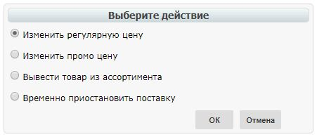

В открывшимся окне установите новые цены в соответствующих колонках (Новая цена без НДС либо Новая цена с НДС – по условиям договора с сетью), а также код УКТ ВЭД, если он ранее не был заполнен в Товарном справочнике. Затем укажите Дату начала действия и Дату окончания действия новой цены. Дата начала действия новой цены должна превышать согласованное с сетью кол-во дней от даты создания документа Товарное согласование. При необходимости перечень позиций можно расширить или сократить с помощью кнопок «Добавить позицию» и «Удалить позицию». 

Возле наименования товарной позиции размещена иконка "инфо". После ее нажатия, в 
дополнительном окне открываются пиктограммы Listex и Ucat. Нажав на них происходит переход на сайт каталогов. Дополнительно для пересогласования регулярной цены, если указанный период документа имеет общие даты с ранее согласованными промо ценами, то возле даты последнего изменения будет размещена иконка "проценты". После ее нажатия, в дополнительном окне открывается ранее согласованная дополнительная информация по промо - период действия и цена с НДС: 

.. image:: pics_Soglasovanie_cen_web_EDIN-Price_dlja_postavshhika/pics_Soglasovanie_cen_web_EDIN-Price_dlja_postavshhika_07.png
   :align: center

Существует возможность добавить обоснование изменения цены или другие документы, которые могут ускорить согласование. Для этого нажмите кнопку «Добавить обоснование»:

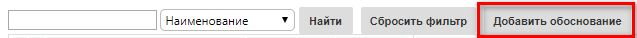
 
В открывшемся окне можно добавить необходимые файлы: 

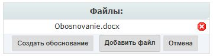

Для добавления файлов используется кнопка «Добавить файл», для удаления лишних файлов – кнопка "удалить" возле имени файла. 
После того, как все файлы были добавлены – необходимо нажать кнопку «Создать обоснование», в результате чего они будут сохранены в отдельный архив и подгружены к товарному согласованию. После нажатия кнопки «Создать обоснование» изменение архива будет невозможным. В случае если необходимо добавить или удалить какие-то файлы – всю процедуру следует повторить сначала. После сохранения внесенных изменений появляется кнопка «Прикрепить сертификаты». При нажатии на кнопку «Прикрепить сертификат» возле каждого штрих-кода отображаться иконка "галочка", свидетельствующая о том, что к товару прикреплен сертификат. 

.. note:: Если сертификаты не были привязаны к штрих-коду в сервисе EDIN-Certificate, в Товарном согласовании иконка возле штрих-кода отображаться не будет. Для возможности передачи сертификатов в документе Товарное согласование необходимо наличие тарифного пакета сервиса EDIN-Certificate. 

Нажав на иконку "галочка", в дополнительном окне появится перечень всех сертификатов, 
которые привязаны к штрих-коду товара. Сертификаты, которые нужно передать, необходимо отметить галочкой. 

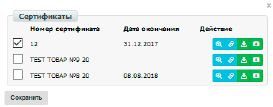

С помощью кнопок «**Действие**» возможно: 

- скачать сертификат со всеми приложениями (архив с файлами)
- просмотреть скан-копию сертификата
- получить прямую ссылку на скан-копию сертификата
- скачать основной бланк сертификата (титульная страница)

Для отправки документа необходимо нажать на кнопку «**Отправить**». 

.. image:: pics_Soglasovanie_cen_web_EDIN-Price_dlja_postavshhika/pics_Soglasovanie_cen_web_EDIN-Price_dlja_postavshhika_11.png
   :align: center

Все неотправленные документы находятся в разделе Черновики. 

.. note:: Обратите внимание! Промо цена изменяется только в отдельном документе Товарное согласование для Промо цены. 

.. important:: Важно! Сеть имеет право изменить предложенные/указанные Поставщиком даты перед подписанием документа. 

В разделе Отправленные находятся отправленные на пересогласование в Сеть документы: 

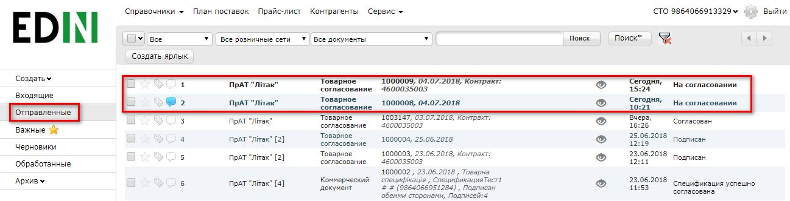

Жирным курсивом выделен еще не прочитанный Сетью документ. Товарное согласование имеет несколько этапов согласования документа на стороне сети, которые у Вас отображаются в виде статуса документа:

1. На согласовании - получен сетью, без внесения изменений
2. Подготовлен - обработан Категорийным менеджером сети Промежуточные статусы обработки документов для регулирования бизнес процессов согласования (руководитель отдела закупки, служба безопасности, экономическая безопасность, финансовый аналитик, логистика):

- Подтвержден 
- Проверен 
- Готов к подписанию 
- Согласован 

3. Подписан – обработан финальным подписантом и наложена ЭЦП со стороны сети. Для просмотра отправленного документа «Товарное согласование» нажмите на него. В открывшемся документе можно увидеть основную информацию по документу.

Для связи с Сетью введите текст сообщения в окно Связь с покупателем и нажмите кнопку **Отправить**: 

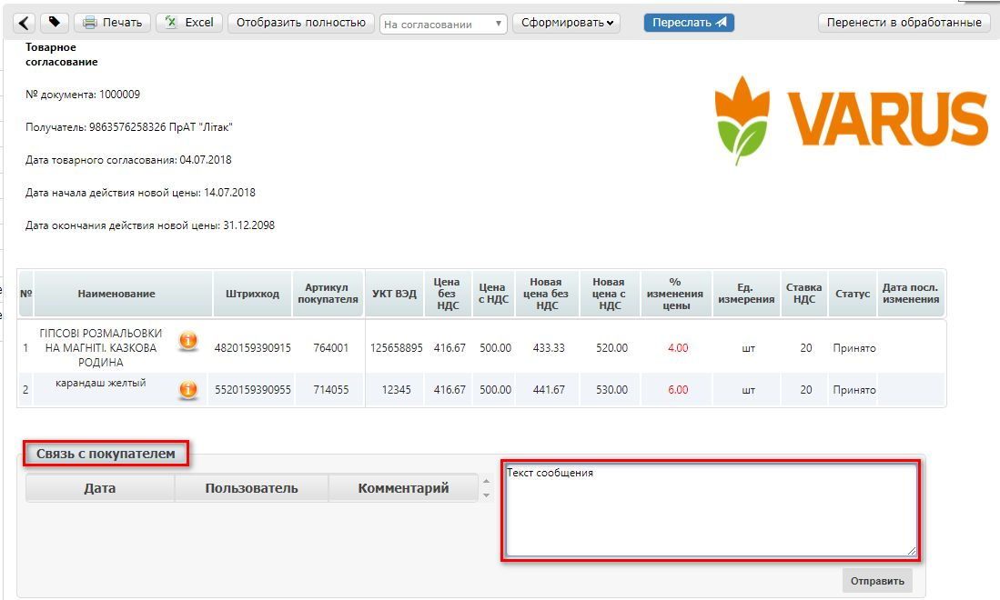

Документ, содержащий комментарий, в списке будет отображаться с отметкой "комментарий": 

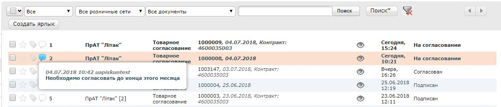

У документов на согласование промо-цены текст выделен оранжевым. 

.. image:: pics_Soglasovanie_cen_web_EDIN-Price_dlja_postavshhika/pics_Soglasovanie_cen_web_EDIN-Price_dlja_postavshhika_15.png
   :align: center

Создание Товарного согласования для пересогласования регулярной/промо цены с помощью загрузки из Excel
--------------------------------------------------------------------------------------------------------------------

Выберите раздел Согласованный справочник, откройте необходимую запись товарного справочника и нажмите кнопку Скачать шаблон: 

.. image:: pics_Soglasovanie_cen_web_EDIN-Price_dlja_postavshhika/pics_Soglasovanie_cen_web_EDIN-Price_dlja_postavshhika_16.png
   :align: center

После нажатия на кнопку откроется форма сохранения шаблона. Сохраните файл на компьютер, откройте его для заполнения. В шаблоне заполните поля по позициям для пересогласования: 

.. image:: pics_Soglasovanie_cen_web_EDIN-Price_dlja_postavshhika/pics_Soglasovanie_cen_web_EDIN-Price_dlja_postavshhika_17.png
   :align: center

.. important:: Важно! Не меняйте расширение файла шаблона. Оно должно быть только xls. Не меняйте структуру файла и последовательность колонок, не удаляйте верхние строки. 

Сохраните заполненный файл шаблона, а затем нажмите кнопку **Загрузить Регулярные цены XLS** – для загрузки шаблона с заполненными регулярными ценами, **Загрузить Промо цены XLS** – для загрузки шаблона с заполненными промо ценами. После нажатия на кнопку загрузки откроется стандартная форма для загрузки файла. Выберите сохраненный вами шаблон. 

На основании загруженного файла будет сформирован документ Товарное согласование. Проверьте правильность заполнения данных, укажите период начала и окончания действия новой цены, затем нажмите кнопку Сохранить и после сохранения документа кнопку **Отправить**: 

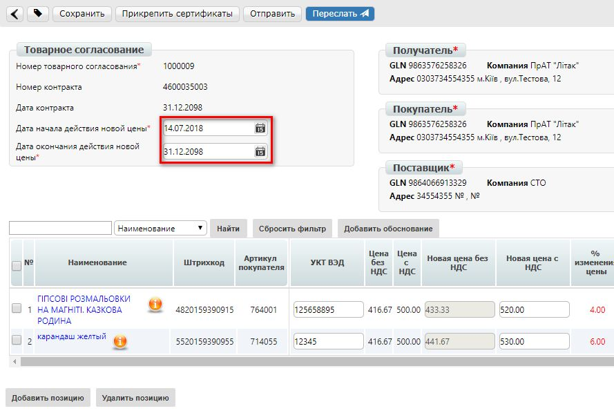

.. important:: Важно! В документ Товарное согласование попадают только те товарные позиции, которые есть в выбранной спецификации на платформе. Сверка производится по артикулу и по штрих-коду. 

Создание Товарного согласования для вывода товара из ассортимента/временной приостановки поставки
------------------------------------------------------------------------------------------------------------------------

Во всплывающем окне **Выберите действие** – Вывести товар из ассортимента или Временно приостановить поставку: 

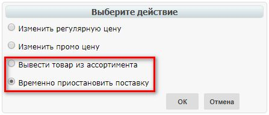

В открывшимся окне укажите причину вывода/приостановки поставки товара. Затем для приостановки поставки товара укажите дату начала приостановки поставки товара и дату окончания приостановки поставки, а для вывода товара из ассортимента – дату вывода товара из ассортимента. 
Дата начала приостановки поставки/дата вывода товара из ассортимента должна превышать согласованное с сетью кол-во дней от даты создания документа Товарное согласование.

При необходимости перечень позиций можно расширить или сократить с помощью кнопок «**Добавить позицию**» и «**Удалить позицию**».
Существует возможность добавить обоснование вывода/приостановки поставки товара или другие документы. Для этого нажмите кнопку «Добавить обоснование». Сохраните внесенные изменения, при необходимости прикрепите сертификаты и отправьте документ. Все неотправленные документы находятся в разделе Черновики. 

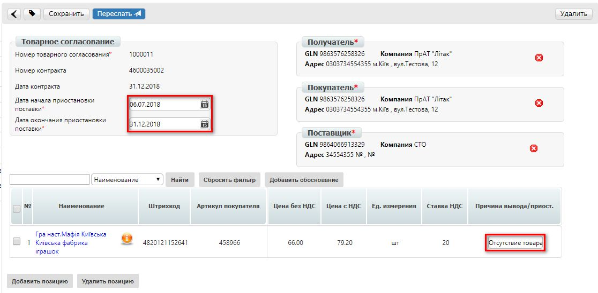

.. note:: Обратите внимание! Вывод товара из ассортимента согласовывается только в отдельном документе Товарное согласование. 

.. important:: Важно! Сеть имеет право изменить предложенные/указанные Поставщиком даты перед подписанием документа. 
Для просмотра отправленного документа «Товарное согласование» нажмите на него. В открывшемся документе можно увидеть основную информацию по документу. В разделе Отправленные находятся отправленные на пересогласование в Сеть документы: 

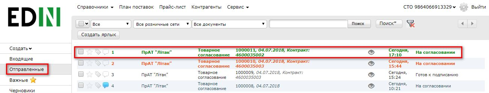

Жирным курсивом выделен еще не прочитанный Сетью документ. Для связи с Сетью введите текст сообщения в окно Связь с покупателем и нажмите кнопку Отправить: 

.. image:: pics_Soglasovanie_cen_web_EDIN-Price_dlja_postavshhika/pics_Soglasovanie_cen_web_EDIN-Price_dlja_postavshhika_22.png
   :align: center

Документ, содержащий комментарий, в списке будет отображаться с отметкой "комментарий": 

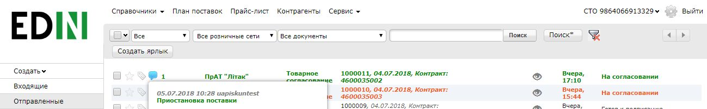

У документов на согласование вывода товара из ассортимента и временной приостановки поставки товара, текст выделен зеленым. 

Просмотр и обработка входящего документа от Сети (инициация поставщика) 
======================================================================

По подтвержденным позициям Вы получите Коммерческий документ, подписанный со стороны сети. Находится он в разделе Входящие. Для открытия входящего документа нажмите на него: 

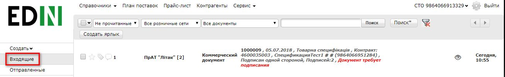

В открывшемся документе можно увидеть основную информацию по документу (подписи от Сети, перечень принятых позиций, комментарии от Сети). Нажмите кнопку Подписать чтобы подписать документ: 

.. image:: pics_Soglasovanie_cen_web_EDIN-Price_dlja_postavshhika/pics_Soglasovanie_cen_web_EDIN-Price_dlja_postavshhika_25.png
   :align: center

После первичной настройки ЭЦП и ввода ключей нажмите кнопку «Считать ключи»: 

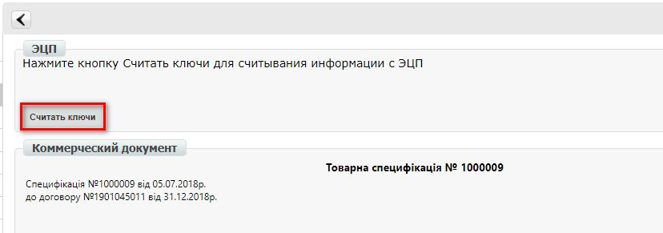

Выберите необходимые ключи для подписания и нажмите «Считать ключ»: 

.. image:: pics_Soglasovanie_cen_web_EDIN-Price_dlja_postavshhika/pics_Soglasovanie_cen_web_EDIN-Price_dlja_postavshhika_27.png
   :align: center

Затем нажмите **Підписати**: 

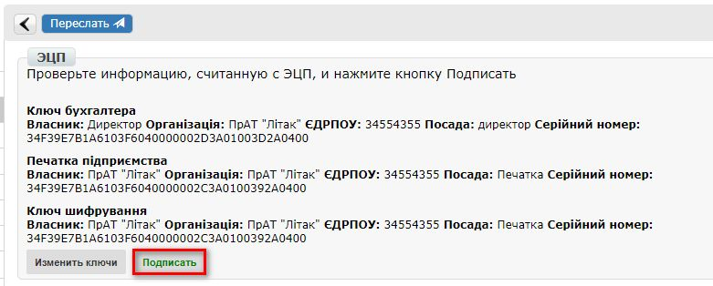

После успешного подписания, нажмите кнопку **Отправить**: 

.. image:: pics_Soglasovanie_cen_web_EDIN-Price_dlja_postavshhika/pics_Soglasovanie_cen_web_EDIN-Price_dlja_postavshhika_29.png
   :align: center

Подписанный и отправленный коммерческий документ Товарная спецификация находятся в разделе Отправленные.

В случае отклонения части предложенных цен, Вы получите Коммерческий документ по принятым ценам (необходимо подписать ЭЦП) и документ Товарное согласование со списком не принятых позиций, которые Вы можете пересогласовать еще раз посредством отправки нового документа для согласования.
 
Просмотр и обработка входящего документа от Сети (инициация ТС) 
======================================================================

Документ Товарное согласование, отправленный Сетью для согласования промо цены, находится в разделе Входящие и выделен оранжевым цветом.

Отобрать документы для обработки можно с помощью фильтра. Для этого необходимо выбрать тип документа «Товарное согласование» и статус «На согласовании». Все не прочитанные документы выделены жирным шрифтом. Для открытия входящего документа нажмите на него.
В открывшемся документе необходимо ознакомиться с количеством товара, промо ценами и периодом их действия. Также есть возможность связаться с сетью оставив сообщение в окне Связь с покупателем. 
Доступно две кнопки Отклонить и Подписать. После нажатия на Отклонить Вам необходимо подтвердить действие, нажав Закончить, или отклонить, нажав Отмена. 

Если подтвердить отклонение документа, то изменить решение Вы не сможете и спецификация будет не согласованной.
Нажмите кнопку подписать для создания коммерческого документа. Откроется печатная форма документа. Необходимо выполнить процедуру подписания и отправить документ в Сеть. В свою очередь Сеть подпишет документ со своей стороны и коммерческому документу будет присвоен статус «**Спецификация согласована**». 
