####################################################
Інструкція з авторизації
####################################################

Дана інструкція описує порядок реєстрації та авторизації на web-платформі EDIN-DOCflow, процедуру відновлення та зміни пароля, порядок зміни Email.  

1 Реєстрація користувача
-------------------------
Для реєстрації в сервісі перейдіть за посиланням http://doc.edi-n.com. У формі авторизації натисніть «Зареєструватися»:

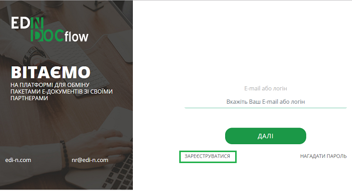

Наступним кроком заповніть форму реєстрації, що містить наступні поля: 

 - Email – обов’язкове для заповнення поле. На вказану адресу буде надіслано листа для підтвердження реєстрації. Вказаний Email в подальшому буде використовуватись як логін користувача. Якщо дане поле не заповнене, система повідомить про помилку. 

 - ПІБ (Прізвище, Ім’я, По-батькові) – не обов’язкове для заповнення поле. Внесена інформація зберігається в особистому профілі користувача. 

 - Номер телефону – не обов’язкове для заповнення поле. Внесена інформація зберігається в особистому профілі користувача. Номер телефону користувача заповнюється у форматі +380 (00) 000-00-00.

Після заповнення форми реєстрації натисніть «Реєстрація»:

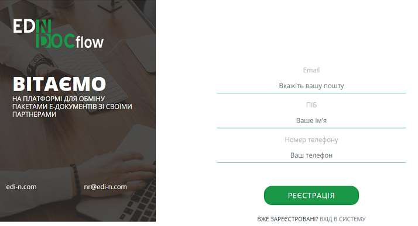

Система повідомить про відправку реєстраційного листа на вказану в полі Email  адресу: 

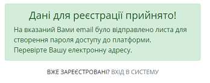

Для підтвердження реєстрації перейдіть за посиланням у реєстраційному листі. Відправник листа -  noreply@edi-n.com,  тема – «EDIN-DOCFLOW Підтвердження реєстрації».  

.. image:: pics_instruktsia-avtorizatsia/instruktsia_avtorizatsia_4.png
   :align: center

У формі продовження реєстрації вкажіть пароль (двічі). Мінімальна кількість символів – шість. Для створення безпечного пароля рекомендується  уникати повторення того ж самого символу (для прикладу – аааааа, 11111); уникати послідовностей літер або цифр (для прикладу 123456); не використовувати особисту інформацію (для прикладу – ім’я, прізвище, рік народження); не використовувати паролі до інших інтернет-сервісів. 

.. admonition:: Зверніть увагу!
   Email  використовується платформою як  унікальний  логін  користувача (один Email можна використати лише одноразово).

У разі введення  вже зареєстрованого Email система повідомить про помилку. 

2 Авторизація
--------------
Для авторизації на платформі перейдіть за посиланням http://doc.edi-n.com/auth,  введіть свій  логін = Email та натисніть «Далі»: 

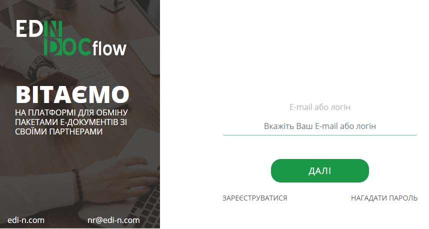

Наступним кроком встановіть відмітку «Я не робот»,  вкажіть пароль та натисніть кнопку «Увійти»:

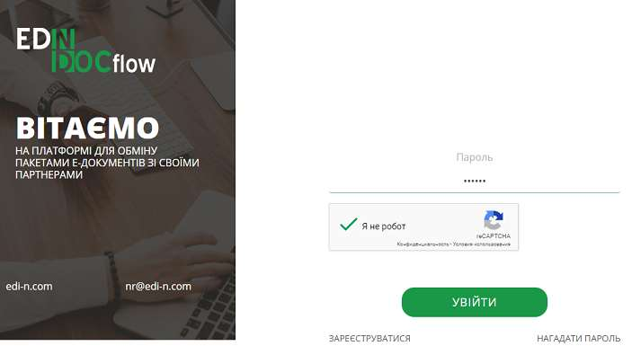

Якщо логін або пароль вказаний невірно, система повідомить про помилку.

.. admonition:: Зверніть увагу!
   Відповідно до політики безпеки максимальна кількість спроб авторизації – три. Якщо  логін або пароль тричі вказаний невірно, система заблокує користувача на 5 хвилин.
 
У сервісі також реалізована можливість встановити інший строк блокування користувача (мінімальне значення – 3 хвилини, максимальне – 24 години) у межах  налаштування параметрів парольної політики. Детальніше про налаштування парольної політики в `«Інструкції адміністратора користувачів»`_.

.. _«Інструкції адміністратора користувачів»: https://wiki.edi-n.com/ru/latest/services/EDIN_DOCflow/edin_docflow/instruktsia-administratora-polzovatelei.html

3 Відновлення пароля 
---------------------
Для відновлення пароля натисніть на сторінці авторизації «Нагадати пароль»:

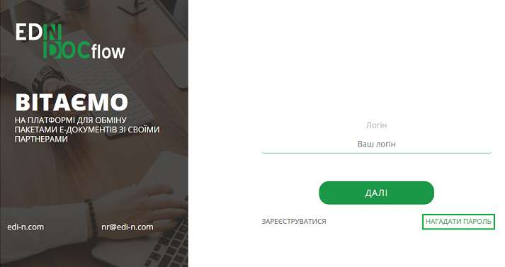
             
Далі вкажіть Email (логін користувача), встановіть відмітку «Я не робот» і натисніть «Відновити»:

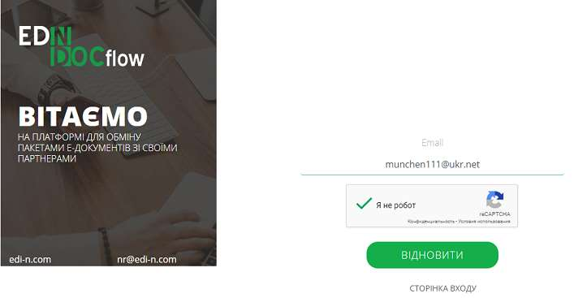

Система повідомить про успішну відправку листа на вказану адресу Email.

.. admonition:: Зверніть увагу!
   Для відновлення пароля необхідно ввести Email (=логін), вказаний при реєстрації користувача.

У разі використання незареєстрованого Email система повідомить про помилку. 

Наступним кроком перейдіть за посиланням у листі, отриманому на вказану адресу.  
Відправник листа -  noreply@edi-n.com, тема – «EDIN-DOCFLOW  Відновлення пароля". 

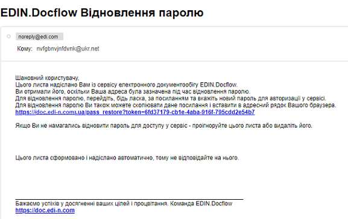

Система відобразить вікно створення пароля. На формі двічі вкажіть новий пароль і натисніть «Зберегти»:

.. image:: pics_instruktsia-avtorizatsia/instruktsia_avtorizatsia_10.png
   :align: center

4 Зміна пароля 
---------------
Для зміни пароля натисніть на логін користувача у верхньому правому куті інтерфейсу та натисніть кнопку «Скинути пароль»:

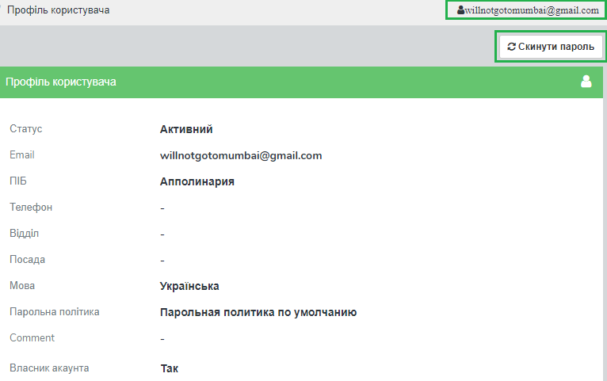
 
Система повідомить про успішне скасування пароля  та  відправить  листа  для генерації нового пароля на Email користувача.

Для зміни пароля перейдіть за посиланням у листі та вкажіть новий пароль (двічі):

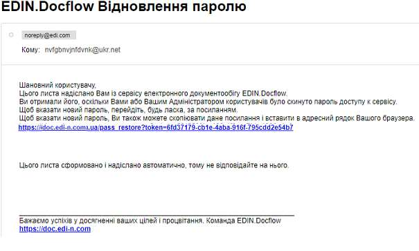

Відправник: -  noreply@edi-n.com. Тема листа:  «EDIN-DOCFLOW  Відновлення пароля».

.. admonition:: Зверніть увагу!
   В цілях безпеки система блокує введення раніше використаних паролів у відповідності до налаштувань складності пароля.

У разі введення пароля, що був використаний раніше, система повідомить про помилку. 

5 Зміна Email 
--------------
Для зміни Email перейдіть на форму редагування облікового запису користувача (меню «Керування доступом» - «Користувачі») і натисніть «Редагувати».

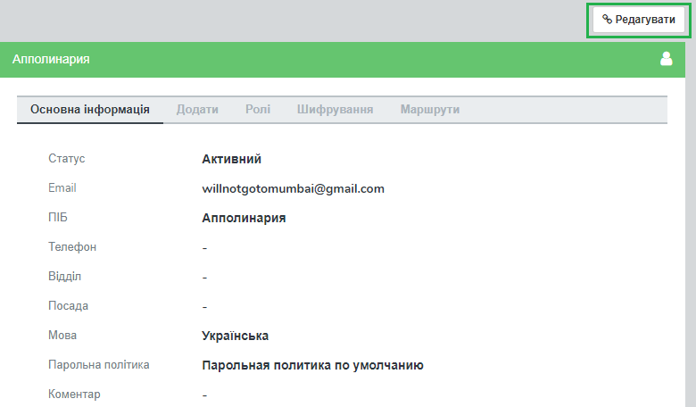

У формі, що відкриється, вкажіть новий Email у полі «Email» та натисніть «Зберегти». Система повідомить про успішне збереження нових даних. 

.. admonition:: Зверніть увагу!
   Після збереження змін доступ до сервісу під старим Email буде заблокований.
 
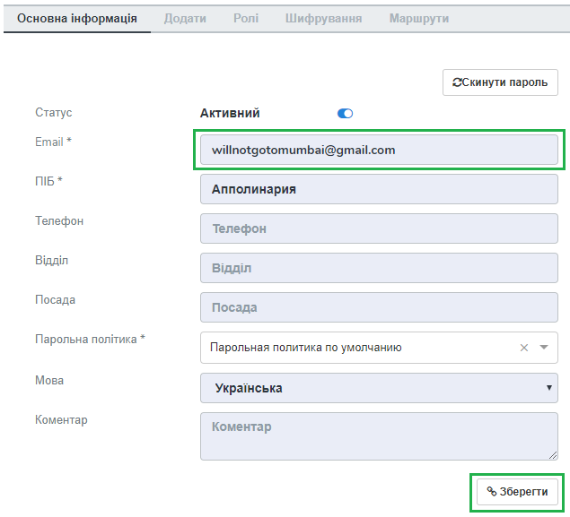

На нову адресу надійде лист з посиланням для підтвердження зміни Email та генерації пароля. 

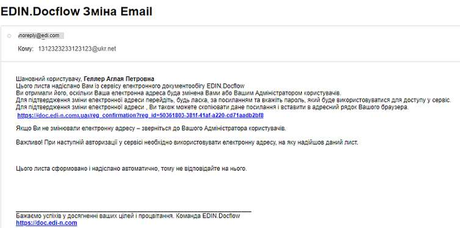

Для завершення процедури зміни Email перейдіть за посиланням у листі та вкажіть новий пароль у формі генерації пароля.  

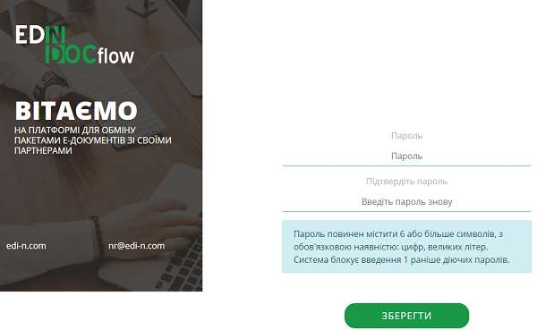

На стару адресу Email надійде інформаційне повідомлення про зміну електронної адреси. Відправник: - noreply@edi-n.com, тема листа: «EDIN-DOCFLOW. Відновлення пароля".
