#########################################
Інструкція користувача з обміну пакетами
#########################################

Дана інструкція описує порядок дій користувача на платформі DOCflow з підготовки до обміну пакетами, створення та відправлення пакета документів.

-------------------------

.. |иконка-ручка| image:: pics_instruktsia_korystuvacha_obminy_paketami/instruktsia_korystuvacha_obminy_paketami_3_pen.png

.. |иконка-значок| image:: pics_instruktsia_korystuvacha_obminy_paketami/instruktsia_korystuvacha_obminy_paketami_5_znak.png

.. |иконка-отклонен| image:: pics_instruktsia_korystuvacha_obminy_paketami/instruktsia_korystuvacha_obminy_paketami_7_status_declined.png

1 Терміни та визначення
------------------------

 - Компанія – юридична чи фізична особа, яка використовує систему для виконання своїх процесів. До одного акаунта можливо прив’язати декілька компаній. Документи, довідники, типи пакетів, контракти, маршрути, налаштування узгодження створюються в межах компанії і закріплюються за нею.

 - Тип документа – спеціальний системний довідник, що містить дані за типами документів, якими виконуватиметься обмін між сторонами.

 - Тип пакета – налаштування та параметри пакета документів для обміну.

 - Контракт – форма налаштування зв’язку між контрагентами, у відповідності до якої відбувається обмін пакетами документів.

 - Маршрут – операція визначення працівників отримувача, які будуть отримувати та обробляти пакети документів. Маршрут будується на основі переліку доступних користувачеві контрактів і типів пакета.

 - Електронний цифровий підпис (ЕЦП/КЕП) — електронний цифровий підпис уповноважених осіб та окремий електронний цифровий підпис, що виконує функцію печатки (у разі наявності), з посиленим сертифікатом ключа, наданим акредитованими центрами сертифікації ключів (далі – АЦСК).

2 Авторизація
--------------
Для авторизації на платформі перейдіть за посиланням https://doc.edi-n.com/auth та введіть свої логін = email і пароль на формі авторизації. Детальна інформація з авторизації міститься в  `«Інструкції з авторизації»`_.

.. _«Інструкції з авторизації»: https://wiki.edi-n.com/ru/latest/services/EDIN_DOCflow/edin_docflow/instruktsia-avtorizatsia.html

3 Передумови обміну пакетами
-----------------------------
Налаштування, які є передумовами обміну пакетами, детально викладені в «Інструкції бізнес-адміністратора», «Інструкції з налаштування ЕЦП/КЕП», «Інструкції з налаштування шифрування». Деталі процедури створення та налаштування облікових записів користувачів та їх ролей описані в «Інструкції адміністратора користувачів».

4 Створення та відправка пакета
---------------------------------  
Для створення пакета перейдіть до розділу меню «Пакети» і натисніть «Створити пакет»:

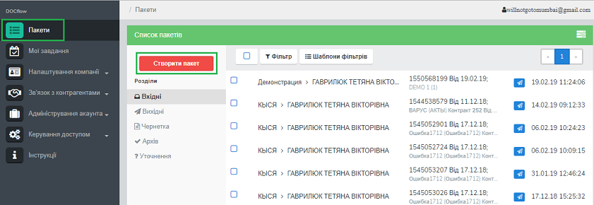

У формі створення пакета виберіть компанію, яка відправлятиме пакет документів, із випадаючого списку: 

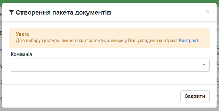
 
Після вибору компанії стане доступним поле для вибору контракту. Поле містить  перелік активних (діючих) контрактів за обраною компанією, що відображаються випадаючим списком.

Після вибору контракту система відобразить перелік доступних пакетів за обраним контрактом:

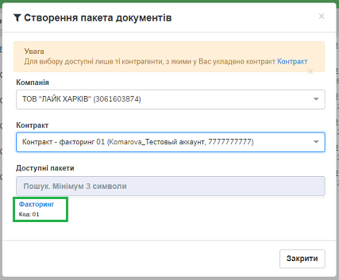

Для вибору типу пакета натисніть на його назву. Після цього автоматично відкриється форма для заповнення обраного типу пакета.

.. admonition:: Зверніть увагу! 

   Якщо у формі контракту не налаштований перелік типів пакетів, система повідомить про їх відсутність.

У такому випадку слід виконати налаштування переліку вихідних типів пакетів відповідно до пункту 5.1.2 даної інструкції (для вихідних контрактів) або узгодити відповідні налаштування на стороні контрагента (для вхідних контрактів).

**4.1 Заповнення пакета**

При створенні чи редагуванні пакета відкриється форма обробки пакета, що містить наступні вкладки:

 - Основна інформація – містить загальну інформацію про пакет (дані про Відправника та Отримувача, дані про контракт, дані про пакет, статус пакета)
 
 - Документи – основний розділ для обробки документів.

 - Довідники – використовується для керування довідниками, що пов’язані з пакетом.

 - Користувацькі поля – використовується для керування користувацькими полями, що пов’язані з пакетом.

 - Журнал – містить інформацію щодо змін і коментарів до документів та пакета.
 
 .. image:: pics_instruktsia_korystuvacha_obminy_paketami/instruktsia_korystuvacha_obminy_paketami_4.png
    :align: center

*4.1.1 Введення довідників*

Вкладка «Довідники» містить перелік довідників, які потребують заповнення  відповідно до налаштувань типу пакета. Для заповнення довідника виберіть значення з випадаючого списку (обов’язкові для заповнення поля виділені червоним):

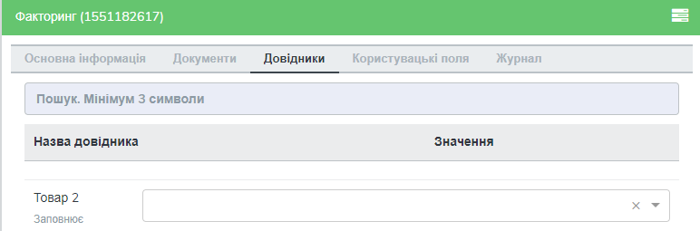

Після введення значень відбувається автоматичне збереження внесених даних і з’являється відповідне повідомлення.

*4.1.2 Введення користувацьких полів*

Вкладка «Поля» містить перелік користувацьких полів, які потребують заповнення. Для заповнення поля введіть у нього необхідні дані. Обов’язкові для заповнення поля виділені червоним. 
 
Для отримання підказки щодо заповнення користувацького поля наведіть курсор миші на іконку «Інформація»:

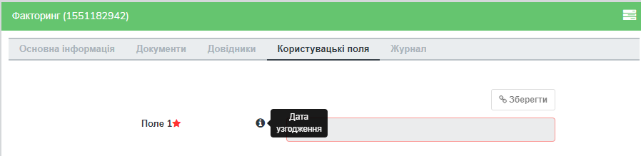

Після введення значень натисніть «Зберегти». У разі успішного збереження з’явиться відповідне повідомлення.

*4.1.3 Введення документів*

Вкладка «Документи» містить перелік обов’язкових та не обов’язкових документів для даного пакета. Обов’язкові для конкретного пакета документи позначаються відміткою |иконка-звезда|. Документи, що потребують шифрування, позначаються відміткою |иконка-щит|.

Для завантаження документа натисніть «Додати»:

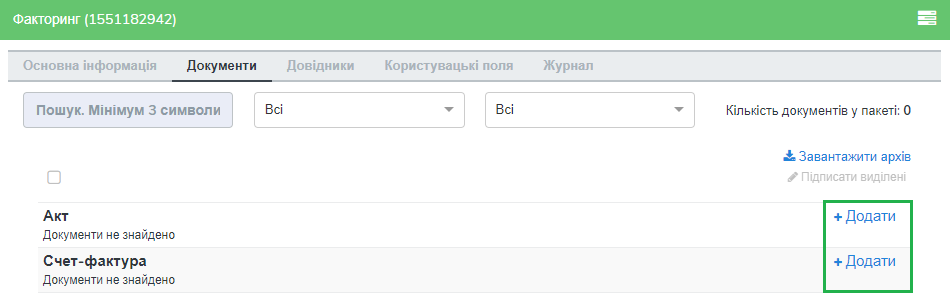

Після цього з’явиться можливість завантажити файли документів. Для завантаження файлу або файлів натисніть кнопку «Завантажити» та виберіть необхідні файли (обмеження до 10МБ для одного файлу).

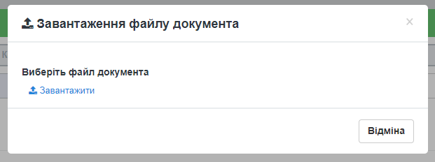

Якщо для даного типу документа встановлено обмеження кількості документів, система повідомить про помилку (обмеження кількості документів встановлюється у налаштуваннях типу пакета): 

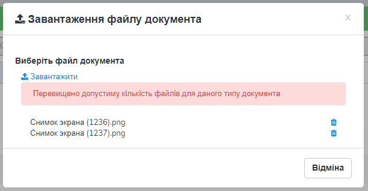

Якщо для документа встановлено ознаку шифрування, перед початком завантаження файлу необхідно вибрати ЕЦП/КЕП, який буде використано для шифрування. При цьому сертифікати для шифрування повинні бути завантажені як на стороні відправника, так і отримувача.

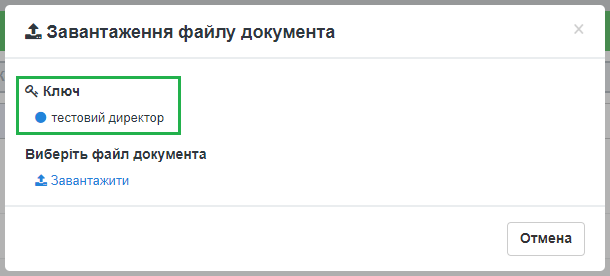

Після завантаження файлу з’явиться можливість ввести обов’язкові та необов’язкові поля для документа. Для цього необхідно натиснути на кнопку «Додаткова інформація по документу»: 

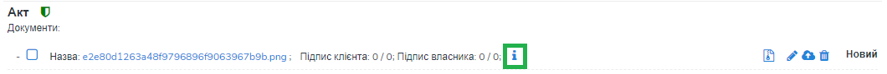

У формі, що відкриється, потрібно натиснути кнопку «Редагувати»: 

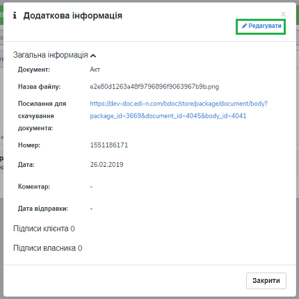

Після чого відкриється форма для редагування: 

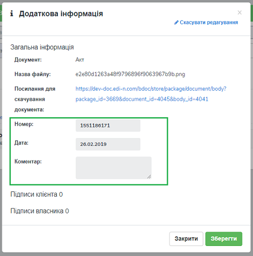

.. admonition:: Зверніть увагу! 

   Для документів, які відповідно до налаштувань типу пакета повинні бути завантажені на стороні контрагента (довкладення), відсутня  кнопка «Додати». 

*4.1.4 Додання раніше підписаного документа*

Якщо завантажений документ був підписаний раніше із використанням зовнішнього підписання (тобто накладення підпису), необхідно завантажити файли підписів. Для цього натисніть кнопку «Завантажити підписи» та виберіть файли підписів.

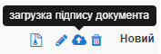
   
Якщо для документа встановлено ознаку шифрування, перед завантаженням файлів підписів документ необхідно розшифрувати. Для цього на формі виберіть ключ для розшифрування:

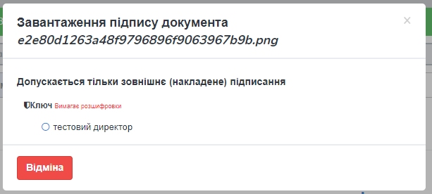

Після цього натисніть «Завантажити». При завантаженні система перевіряє валідність підпису. Файли підписів, що пройшли перевірку, можливо зберегти. У разі помилки верифікації підпису з’явиться відповідне повідомлення. Завантажені підписи додаються до загальної кількості підписів на документі.

*4.1.5 Підписання документа(ів)*

Для підписання одиничного документа натисніть на кнопку підпису |иконка-ручка| в необхідному рядку:

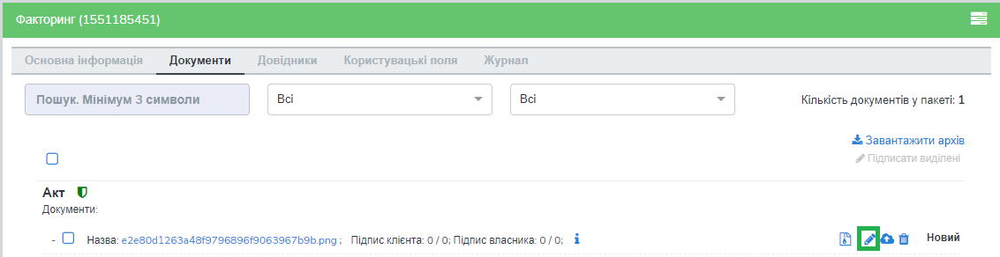

Якщо для документа встановлено ознаку шифрування, перед підписанням його необхідно розшифрувати. Для цього виберіть ЕЦП/КЕП для розшифрування.  Успішно розшифрований документ можливо буде підписати. У разі виникнення помилки розшифрування з’явиться відповідне повідомлення, і подальше підписання буде неможливим:

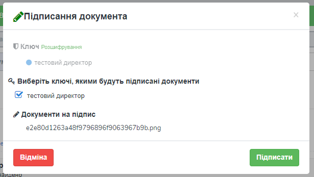

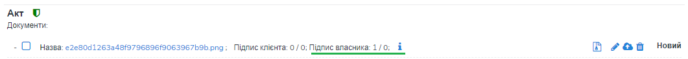

У разі використання MobileID користувачеві буде надіслано sms-запит на номер телефону, зв’язаний із ЕЦП/КЕП. Для підтвердження підписання введіть код підтвердження.

Для масового підписання виберіть у списку потрібні документи та натисніть кнопку «Підписання виділених». При цьому відкриється форма підписання з переліком вибраних файлів. Якщо серед вибраних документів є такі, що потребують шифрування, їх потрібно розшифрувати.

.. admonition:: Зверніть увагу! 

   Підписати документ тим самим підписом декілька разів неможливо.

*4.1.6 Видалення документа*

Для видалення документа натисніть відповідну кнопку |иконка-ведерко|. Підтвердження дії призведе до видалення контенту та підписів, що були накладені чи завантажені окремо:

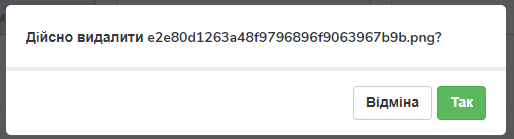

*4.1.7 Перегляд детальної інформації*

Для отримання детальної інформації  за документом та накладеними на нього підписами або для переходу до редагування даних документа натисніть на іконку |иконка-информация| «Додаткова інформація за документом»:

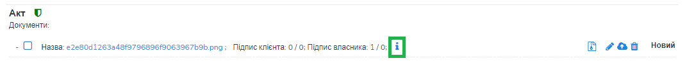

На формі, що відкриється, будуть відображені наступні дані: назва типу документа, ім’я файлу, № та дата документа, коментар, дата/час відправки, кількість підписів, а також детальна інформація щодо накладених підписів з позначкою часу, додаткові користувацькі поля, посилання для скачування документу, тощо.

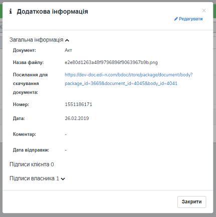

Для редагування даних документа натисніть «Редагувати» і внесіть необхідні зміни. Для збереження внесених даних натисніть «Зберегти документ».

**4.2 Відправлення пакета**

Для відправки пакета натисніть кнопку «Відправити» на формі пакета:

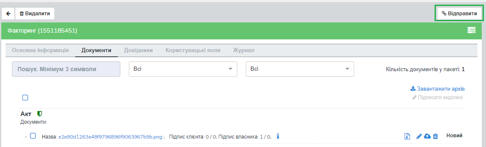

У разі, якщо в пакеті не заповнені обов’язкові  довідники чи користувацькі поля, обов’язкові документи не містять файлів або не дотримано вимоги щодо мінімальної кількісті ЕЦП/КЕП, кнопка «Відправити» буде заблокована. Для отримання повідомлення-підказки наведіть курсор на неактивну кнопку:

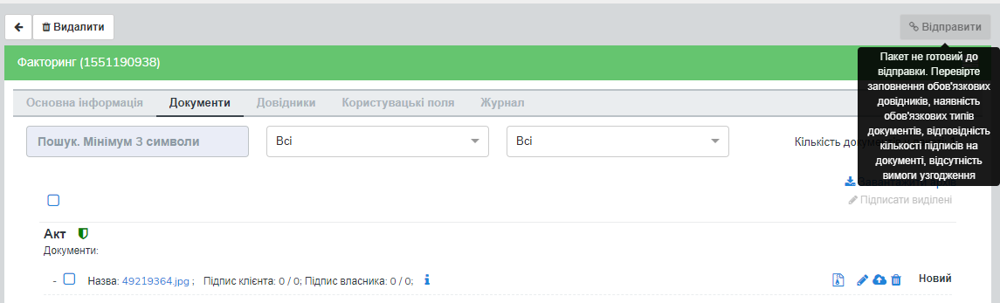

У разі, якщо до складу пакета входять документи, що потребують узгодження, замість кнопки «Відправити» відображатиметься кнопка «Надіслати на узгодження»:

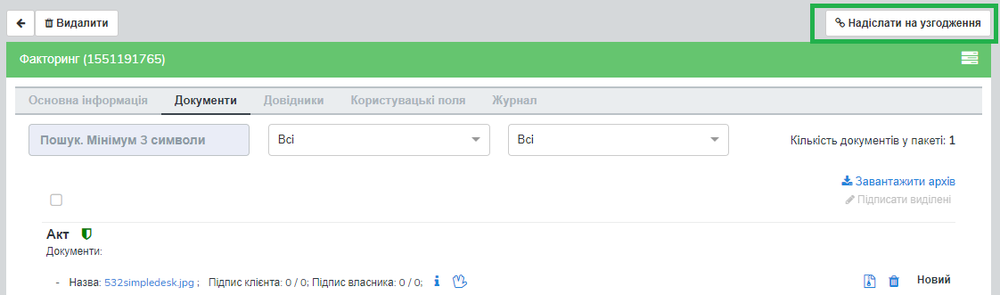

Відправити контрагенту пакет із документами, для яких процес узгодження не завершено, неможливо. Для запуску процедури узгодження натисніть кнопку «Надіслати на узгодження». Документу буде надано статус «На узгодженні».

Для перегляду статусу узгодження документа натисніть на іконку |иконка-информация| «Додаткова інформація по документу»: 

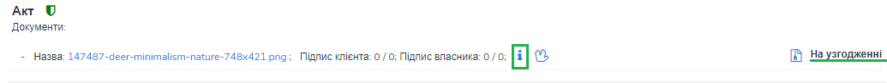

У блоці «Журнал узгодження» міститься інформація щодо статусів узгодження, дати та часу виконання завдання (погодити, підписати або переглянути документ), коментар у разі відхилення документа в процесі узгодження: 

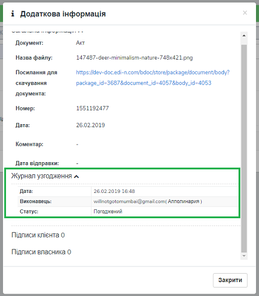

Після надання документу фінального статусу узгодження активується кнопка «Відправити»: 

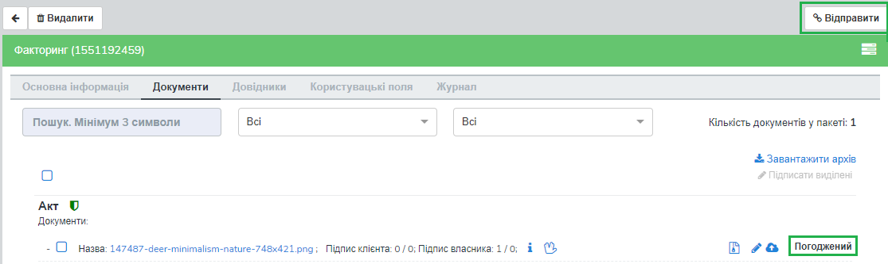

Для масової відправки / видалення пакетів із папки «Чернетки» виділіть необхідні пакети і натисніть кнопку «Надіслати» / «Видалити»:

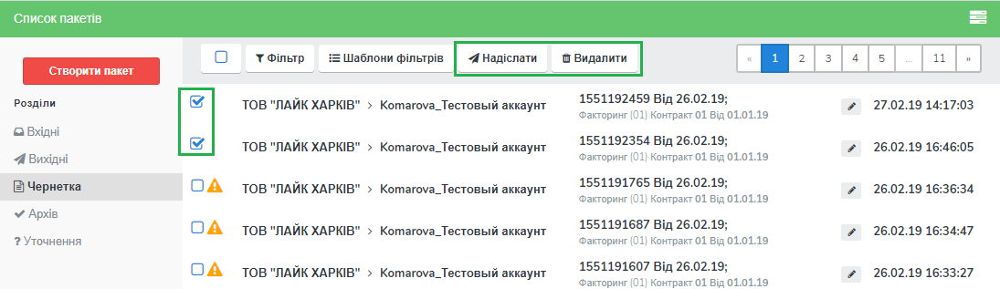

Незаповнені пакети не підлягають відправці і позначаються іконкою |иконка-значок|. При масовій відправці такі пакети не будуть відправлені.

5 Редагування пакета та відстеження статусу
---------------------------------------------
Для роботи з пакетами перейдіть до розділу «Пакети» на навігаційній панелі. Розділ містить наступні папки:

 - Вхідні – для отриманих пакетів документів

 - Вихідні – для відправлених пакетів

 - Чернетки – для зберігання пакетів на стадії обробки

 - Архів – для відображення отриманих та відправлених пакетів, які були оброблені і переведені в архів

 - Уточнення – для пакетів, що потребують уточнення.

Для кожної папки відображається список пакетів.

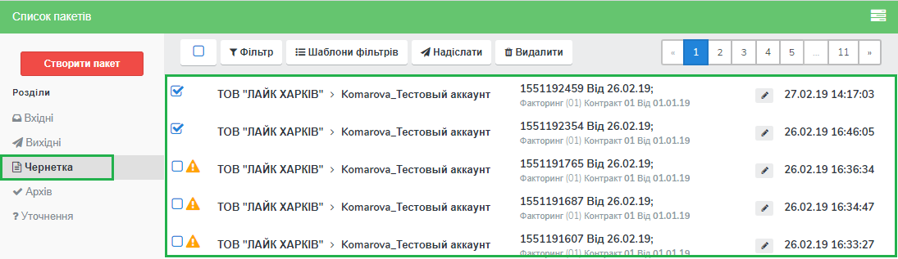

Необроблені та нерозглянуті на стороні контрагента пакети відображаються зі статусом «Прийнятий» («Надісланий») та виділяються жирним шрифтом. Пакети відображаються за датою / часом зміни у порядку зменшення.

Для редагування пакета натисніть на рядок із потрібним пакетом, після чого  відкриється форма редагування.

**5.1 Контроль статусу пакета**

Статус пакета відображається у списку пакетів у вигляді відповідної іконки, а також на формі редагування пакета у вкладці «Загальна інформація»:

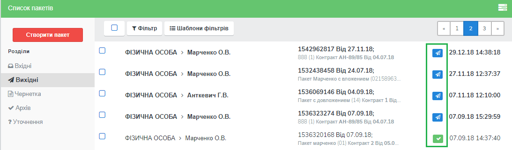

Статуси пакета: |иконка-получен| Отриманий;	|иконка-отправлен| Надісланий; |иконка-отказ| Відмова; |иконка-отклонен| Відхилений; |иконка-черновик| Оброблений / Чернетка; |иконка-уточнение| Запит на уточнення						         	 						          						                                         
Для перегляду інформації щодо зміни статусів документів,  пакетів та коментарів за  даними змінами (причини відхилення документа / пакета, коментар до уточнення) перейдіть до розділу «Журнал» форми обробки пакета. 

Статуси документів відображаються напроти кожного конкретного документа безпосередньо у формі обробки пакета:

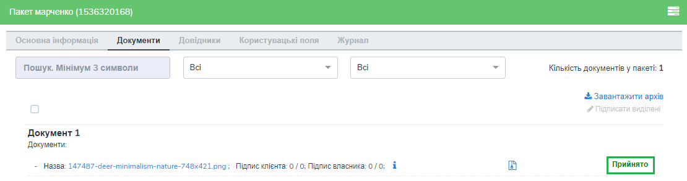

Історія зміни статусів зберігається у розділі «Журнал» форми обробки:  

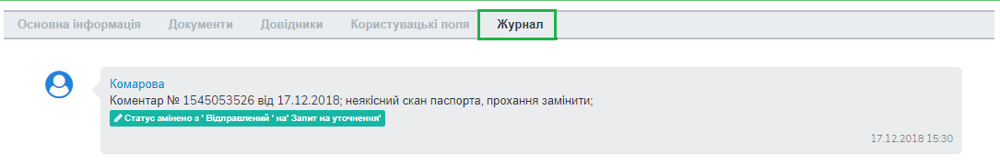

**5.2 Фільтр (пошук пакета)**

Для пошуку потрібного пакета натисніть «Фільтр»:

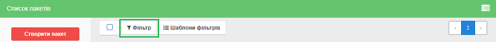

Пошук виконується за наступними атрибутами:

 - Номер (для пошуку вкажіть три або більше символів номера пакета)

 - Статус (поле містить системний перелік статусів у відповідності до обраного розділу)

 - Відправник (ЄДРПОУ, назва)

 - Отримувач (ЄДРПОУ, назва)

 - Тип пакета (для фільтрування за типом пакета необхідно обрати отримувача у відповідному полі фільтра)

 - Дата (вказується в діапазоні від _  до)

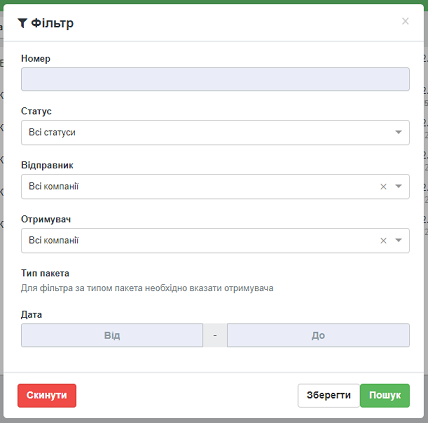

Для одночасного видалення внесених у налаштування фільтра значень натисніть «Скинути».

**5.3 Шаблони фільтрів**

Для спрощення фільтрації пакетів реалізована можливість зберегти потрібні параметри фільтра. Для цього у формі налаштувань заповніть необхідні атрибути і натисніть кнопку «Зберегти»:

.. image:: pics_instruktsia_korystuvacha_obminy_paketami/instruktsia_korystuvacha_obminy_paketami_35.png
   :align: center

Задані фільтри будуть збережені у папці «Шаблони фільтрів»:

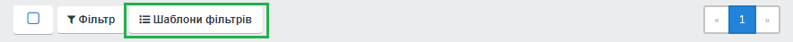

У переліку збережених фільтрів є можливість переглянути та видалити значення фільтрів за допомогою відповідних кнопок:

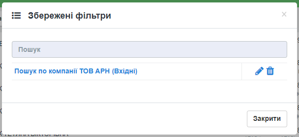

**5.4 Уточнення до пакета з боку відправника**

До пакета в статусі «Відправлено» чи «Уточнення» можливо довкласти (додати, завантажити) файли на стороні відправника.

Пакети в статусі «Уточнення» відображаються в папці «Уточнення». Також для таких пакетів у журналі відображені коментарі, зроблені власником контракту (отримувачем).

Для додання файлу зайдіть в пакет, натисніть кнопку «Редагувати» та додайте файл. Підпишіть додані файли (якщо вони потребують підпису) та відправте пакет з новими файлами.

6 Обробка вхідних пакетів документів
-------------------------------------
Для обробки пакетів,  що надійшли від контрагентів, перейдіть до розділу «Пакети» на навігаційній панелі меню, папка «Вхідні», та натисніть на рядок із потрібним пакетом.

**6.1 Керування довідниками**

Для перегляду чи редагування довідника, прикріпленого до пакета, перейдіть на вкладку «Довідники». На вкладці відображені довідники пакета з заповненими значеннями, що вказав відправник при формуванні пакета:

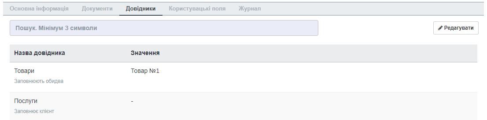

Для редагування довідника на стороні отримувача натисніть «Редагувати». При цьому будуть відображені лише ті довідники, які дозволено редагувати користувачеві. Після введення значень виконується їх автоматичне збереження.

**6.2 Фільтр та пошук документа у пакеті**

Для пошуку документа за назвою у формі обробки введіть три або більше символів у відповідне поле на  панелі пошуку:

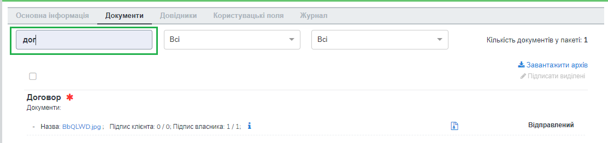

Для фільтрування документів за ознаками «обов’язковий» / «необов’язковий» виберіть відповідне значення на панелі пошуку:

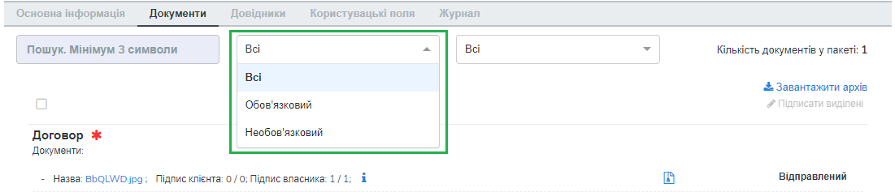

Для фільтрування типів документів за ознаками «з документами» / «без документів» виберіть відповідне значення на панелі пошуку:

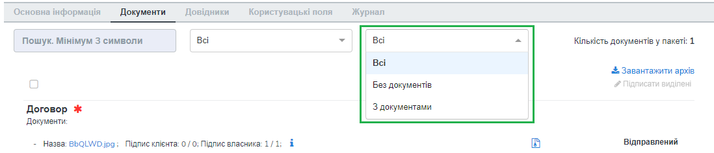

**6.3 Обробка документа**

Для обробки надісланих контрагентами документів перейдіть до вкладки «Документи» у формі обробки пакета. На вкладці буде відображений список типів документів з завантаженими файлами, панель для пошуку та фільтрації списку, інформація щодо кількості вкладених файлів.

Обов’язкові для конкретного пакета документи позначаються відміткою |иконка-звезда|. Зашифровані документи позначаються відміткою |иконка-щит|. У списку документів відображається назва файлу та кількість накладених підписів.

Для отримання детальної  інформації за документом та накладеними на нього підписами натисніть на іконку |иконка-информация| «Додаткова інформація про документ»:

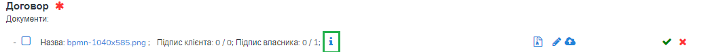

Форма детальної інформації містить наступні дані: назва типу документа, ім’я файлу, посилання для скачування документа, № та дата документа, коментар, дата/час відправки, кількість підписів та інформація про них із позначкою часу,  тощо.

Під обробкою документа слід розуміти надання статусу «Прийнято» чи «Відхилено». Для цього натисніть на відповідну кнопку:

.. image:: pics_instruktsia_korystuvacha_obminy_paketami/instruktsia_korystuvacha_obminy_paketami_43.png
   :align: center

При відхиленні документа необхідно вказати причину відхилення у відповідному вікні:

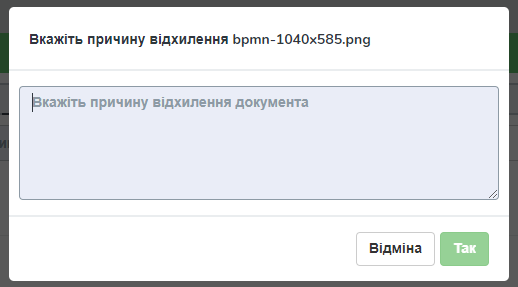

Встановлення статусу записується в журнал дії за пакетом.

**6.4 Підписання документа отримувачем**

Для підписання документа натисніть на іконку підпису |иконка-ручка|:

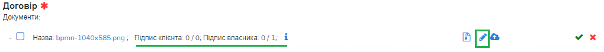

Якщо для документа встановлено ознаку шифрування, перед підписанням його необхідно розшифрувати. Для цього виберіть ЕЦП/КЕП для розшифрування. Успішно розшифрований документ можливо буде підписати. У разі виникнення помилки розшифрування з’явиться відповідне повідомлення, і подальше підписання буде неможливим.

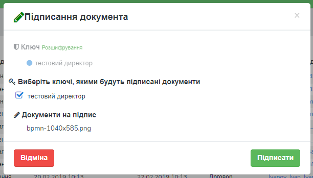

Після розшифрування виберіть потрібні ЕЦП/КЕП з переліку зчитаних, якими буде виконане підписання документа, і натисніть «Підписати». Кількість накладених ЕЦП/КЕП буде відображена в списку документів:

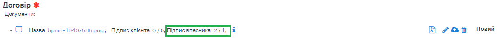

Для масового підписання виберіть у списку потрібні документи та натисніть кнопку «Підписати виділені». При цьому відкриється форма підписання з переліком вибраних файлів. Якщо серед вибраних документів є такі, що потребують шифрування, їх потрібно розшифрувати. Слід мати на увазі, що підписати документ тим самим підписом декілька разів неможливо.

.. admonition:: Зверніть увагу! 

   Підписаний отримувачем документ автоматично набуває статусу «Прийнятий».

**6.5 Скачування документа та архіву**

Для перегляду (ознайомлення) з документом натисніть на його назву або на кнопку «Скачати архів»:

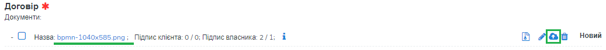

В залежності від налаштувань методу розшифрування будуть завантажені відповідні дані.

.. admonition:: Зверніть увагу! 

   Параметри скачування (каталог для зберігання, відображення після скачування тощо) залежать від налаштувань браузера.

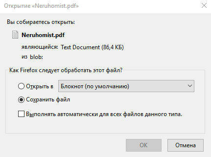

*6.5.1 Незашифрований документ або розшифрування на WEB*

Якщо для типу документа, який скачується, вказано «Нешифрований», або в налаштуваннях шифрування для користувача, який скачує, вказано «Розшифрування на WEB», то при натисканні на ім’я файлу буде скачаний оригінальний файл, а при натисканні на кнопку «Скачати архів» — оригінальний файл та архів підписів. В архіві підписів містяться файли ЕЦП/КЕП, що були накладені, та файл із візуалізацією ЕЦП/КЕП у форматі PDF.

Якщо для типу документа встановлено ознаку шифрування, перед скачуванням файлу необхідно вибрати ЕЦП/КЕП з переліку зчитаних, за допомогою якого буде виконуватись розшифрування контенту.

У разі помилки розшифрування з’явиться відповідне повідомлення і скачування файлу не відбудеться.

*6.5.2 Cryptex*

Якщо в налаштуваннях розшифрування користувача вказано «Розшифрування Cryptex», то при натисканні на назву файлу чи на кнопку «Скачати архів» буде скачаний архів документів, який містить оригінальний файл, файли підписів, якими підписано документ, файл з візуалізацією ЕЦП/КЕП та друкований макет з «водяними знаками» (тільки якщо оригінальний файл у форматі PDF).

**6.6 Довкладення документа в пакет**

Під довкладенням  мається на увазі можливість додати (завантажити) документ на стороні отримувача пакета.  Довкладення можливе лише для документа з ознакою «Довкладення отримувача» (встановлюється в налаштуваннях типу пакета, детальніше про порядок налаштування в «Інструкції бізнес-адміністратора»).

Для завантаження документа перейдіть у форму обробки пакета, вкладка «Документи», і натисніть «Додати»:

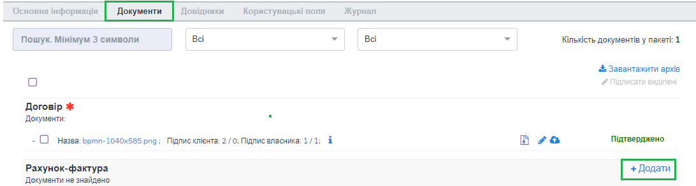

Після цього з’явиться можливість завантажити файли документів. Для завантаження файлу натисніть на кнопку «Завантажити»:

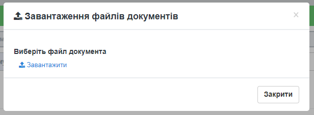

Якщо для документа встановлено ознаку шифрування, перед початком завантаження файлу необхідно вибрати ЕЦП/КЕП, який буде використано для шифрування. При цьому сертифікати для шифрування повинні бути завантажені як на стороні відправника, так і на стороні отримувача:

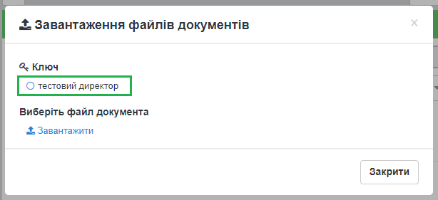

Завантажені файли будуть відображені у списку зі статусом «Новий»:

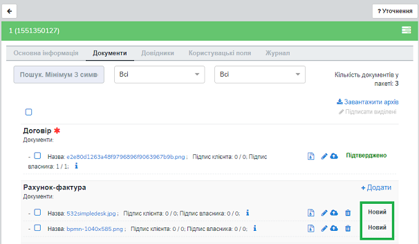

Для передачі довкладення на розгляд відправникові пакета натисніть кнопку «Уточнення». У вікні, що відкриється, зазначте причину відхилення (коментар щодо довкладення). Поле є обов’язковим для заповнення:

.. image:: pics_instruktsia_korystuvacha_obminy_paketami/instruktsia_korystuvacha_obminy_paketami_54.png
   :align: center

Після внесення коментаря, для передачі даних відправникові пакета натисніть «Так». Довкладенню буде наданий статус «Надісланий», пакет набуде статусу «Запит на уточнення», і відповідно буде перенесений до папки «Уточнення», підпапка «Вхідні». У свою чергу, відправник пакета отримає можливість перегляду та обробки довкладення у папці «Уточнення»,  підпапка «Вихідні». 

**6.7 Обробка пакета**

Під обробкою слід розуміти надання пакету відповідного статусу. Статус можливо встановити лише за умови, що всі документи в пакеті оброблені. Для встановлення потрібного статусу натисніть відповідну кнопку: «Прийняти», «Відхилити», «Уточнення»:

.. image:: pics_instruktsia_korystuvacha_obminy_paketami/instruktsia_korystuvacha_obminy_paketami_55.png
   :align: center

При встановленні статусу «Відмова», «Відхилено» або «Уточнення» необхідно вказати причину відхилення / уточнення у відповідному вікні. 

Пакети у статусі «Оброблено», «Відмова», «Відхилено» відображатимуться в папці «Архів». Пакети в статусі «Уточнення» відображатимуться в папці «Уточнення».

*6.7.1 Керування користувацькими полями*

Для перегляду чи редагування користувацького поля перейдіть до вкладки «Поля». В розділі відображаються користувацькі поля з заповненими значеннями, що вказав відправник при формуванні пакета.

Для редагування поля на стороні обробника (отримувача) натисніть «Редагувати». При цьому будуть відображені лише ті поля, які може редагувати користувач:

Після внесення змін натисніть «Зберегти».

**6.8 Журнал**

Для перегляду інформації про зміну статусів документів чи пакета та коментарів по даних змінах (причини відхилення документа / пакета, коментар до уточнення) перейдіть до розділу «Журнал»:

Записи в журналі відображаються в зворотному хронологічному порядку.

7 Мої завдання
----------------
Для документів, що входять у пакет, може бути налаштований процес узгодження (детальніше в «Інструкції  бізнес-адміністратора», п. 13). У такому випадку користувачеві, який входить до групи виконавців, необхідно виконати потрібну дію за документом.

Для перегляду завдань для виконання перейдіть до розділу «Мої завдання» навігаційної панелі сервісу, де у вигляді таблиці будуть відображені всі завдання користувача:

Таблиця складається з наступних колонок: 
 
 - Компанія – назва та код ЄДРПОУ компанії, у межах якої виконується узгодження

 - Тип завдання - узгодження, підписання, повідомлення

 - Дата створення завдання – дата і час створення завдання

 - Термін виконання – кінцева дата і час виконання

 - Тип документа – тип документа, що підлягає узгодженню

 - Назва файлу документа – містить посилання на документ, що підлягає узгодженню

 - Напрямок – напрямок руху документа, вхідний чи вихідний

 - Статус завдання – містить наступні значення: «до виконання» - надається новому завданню; «виконано» - надається завданню, за яким виконана потрібна дія; «відхилено» - фінальний статус, при наданні якого документ вибуває з процесу узгодження, а завдання автоматично анулюється; статуси відображаються за допомогою іконок, при наведенні курсору на які спливає підказка.

Під виконанням завдання мається на увазі надання документу відповідного статусу за допомогою кнопок:  узгодження - «Погодити» або «Відхилити», підписання - «Підписати» та «Завантажити підпис», повідомлення -  «Переглянути». Кнопки відображаються в залежності від типу завдання, зазначеного в налаштуваннях. Для типу завдання підписання необхідно підписати документ, вибравши з переліку зчитаних потрібний ЕЦП/КЕП.

Для перегляду форми задачі натисніть на назву компанії (перша колонка в таблиці):

.. image:: pics_instruktsia_korystuvacha_obminy_paketami/instruktsia_korystuvacha_obminy_paketami_60.png
   :align: center

Форма містить загальні дані щодо завдання, а також інформацію по документу із можливістю виконати потрібну дію або перейти в пакет (у вигляді посилання):

При переході за посиланням відкривається форма перегляду пакета, що містить документ:

Дії узгодження за документом відображаються у «Журналі узгодження» на формі перегляду додаткової інформації про документ (розділ «Пакети», форма редагування, вкладка «Документи»):

