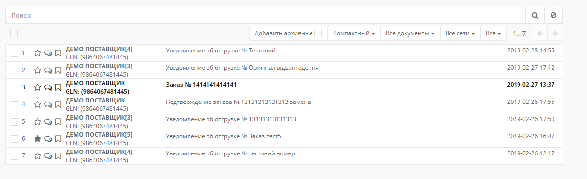
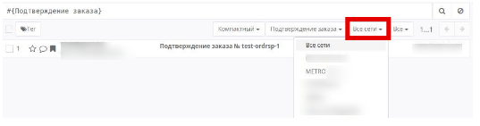
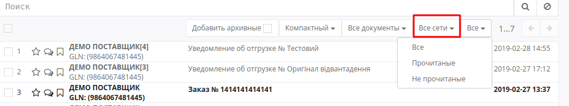
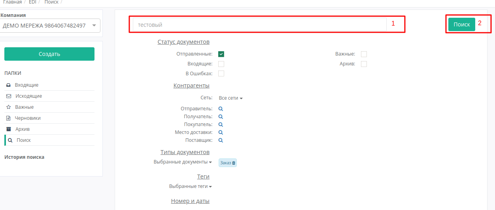

Работа с Платформой 2.0
#######################

---------

.. contents:: Содержание:
   :depth: 6

---------

**Вход на платформу**
================================================
Для входа на платформу необходимо перейти по ссылке https://demo-oed.edi-n.com/auth

При переходе по заданной ссылке откроется окно авторизации. Необходимо ввести Ваш логин и пароль пользователя и нажать «**Вход**», как это указано на скриншоте ниже:

.. image:: pics_rabota_s_platformoj_EDIN_2.0/rabota_s_platformoj_EDIN_2.0_01.png
   :align: center

В случае успешной авторизации откроется платформа:

.. image:: pics_rabota_s_platformoj_EDIN_2.0/rabota_s_platformoj_EDIN_2.0_02.png
   :align: center

**Общий вид платформы**.
================================================

Платформа состоит из двух частей:

1. Функционал перехода по каталогам папок:

.. image:: pics_rabota_s_platformoj_EDIN_2.0/rabota_s_platformoj_EDIN_2.0_03.png
   :align: center

2. Функционал просмотра и поиска документов:

**Сервисы платформы**
================================================

EDI и Товары. На платформе отдельно разделены отображения товарного справочника и каталог обработки документов.

По умолчанию, при входе у Вас будет отображаться каталог **EDI-документов**. Он будет выделен, как на скриншоте ниже:

.. image:: pics_rabota_s_platformoj_EDIN_2.0/rabota_s_platformoj_EDIN_2.0_05.png
   :align: center

Чтобы перейти в Товарный справочник необходимо нажать на “**Товары**”. После нажатия на кнопку выполнится переход на страницу редактирования справочника.

**Выбор номера GLN организации**
================================================

Если пользователю доступны номера GLN нескольких организаций. Для открытия информации по нужной Вам компании, необходимо выбрать соответствующий номер GLN из списка - “**Компания**”:

.. image:: pics_rabota_s_platformoj_EDIN_2.0/rabota_s_platformoj_EDIN_2.0_06.png
   :align: center

В строке поиска есть возможность внести название, или часть номера **GLN**. Система автоматически выполнить поиск данного номера по названию или часть GLN-номера:

.. image:: pics_rabota_s_platformoj_EDIN_2.0/rabota_s_platformoj_EDIN_2.0_07.png
   :align: center

**Просмотр каталогов платформы**
================================================

При первичном входе на платформу будет выполнен вход в каталог документов - “**Входящие**”.

Информация о каталоге будет отображаться как в двух местах:

- В самом верху web-страницы
- В общем списке каталогов будет выделен открытый в данный момент каталог

.. image:: pics_rabota_s_platformoj_EDIN_2.0/rabota_s_platformoj_EDIN_2.0_08.png
   :align: center

Для перехода в нужный Вам каталог необходимо его выбрать:

#. Каталог “Входящие”. В данном каталоге будут размещены все входящие документы для организации от контрагента.
#. Каталог “Исходящие”. В данном каталоге будут размещены все отправленные документы для организации к контрагенту.
#. Каталог “Важные”. В данном каталоге будут размещены все отмеченные документы как важные.
#. Каталог “Черновики”. В данном каталоге будут размещены все документы которые были созданы, но не отправлены. 
#. Каталог “Архив”. В данном каталоге будут размещены все обработанные и архивные документы которые перенесены в архив.
#. Каталог “Поиск”. В данном поле можно задать критерии поиска документов. Результат поиска будет отображаться в сохранённом каталоге, который будет размещён в поле - “История поиска”.

**Создание документа**
================================================

Для создания документа на платформе необходимо нажать кнопку - "**Создать**"

.. image:: pics_rabota_s_platformoj_EDIN_2.0/rabota_s_platformoj_EDIN_2.0_09.png
   :align: center

После этого нужно выбрать тип создаваемого документа:

.. image:: pics_rabota_s_platformoj_EDIN_2.0/rabota_s_platformoj_EDIN_2.0_10.png
   :align: center

**Просмотр документов на платформе**
================================================

Для просмотра документов необходимо перейти в нужный каталог платформы. 
У Вас есть возможность выбрать **вид документов**:

1. Компактный. Данный вид будет установлен по умолчанию.

.. image:: pics_rabota_s_platformoj_EDIN_2.0/rabota_s_platformoj_EDIN_2.0_11.png
   :align: center

2. Подробный. При данном выборе, на платформе будет отображаться вся дополнительная информация с документа.

.. image:: pics_rabota_s_platformoj_EDIN_2.0/rabota_s_platformoj_EDIN_2.0_12.png
   :align: center

3. Дерево. Дополнительно будут отображаться все документы в цепочке.

.. image:: pics_rabota_s_platformoj_EDIN_2.0/rabota_s_platformoj_EDIN_2.0_13.png
   :align: center

В следующей строке выбора есть возможность выполнить фильтр в зависимости от типа документов.

.. image:: pics_rabota_s_platformoj_EDIN_2.0/rabota_s_platformoj_EDIN_2.0_14.png
   :align: center

Также добавлены фильтры по **Розничным сетям**, и **статусу прочтения** документа: все, прочитанный или не прочитанный.

В строке поиска есть возможность добавлять дополнительные критерии поиска.
Для этого в строке вводим символ "**#**". После это система выдаст возможные критерии поиска:

.. image:: pics_rabota_s_platformoj_EDIN_2.0/rabota_s_platformoj_EDIN_2.0_17.png
   :align: center

Необходимо выбрать нужный Вам критерий. Если Вам уже известен нужный критерий, то можно вводить его название, что сократит круг поиска.

Если критерий поиска требует дополнительной информации, то вводимое значение нужно ввести после двоеточия. 
Например, при поиске по номеру документа вводим следующее:

.. image:: pics_rabota_s_platformoj_EDIN_2.0/rabota_s_platformoj_EDIN_2.0_18.png
   :align: center

Вместо “**Номер Документа**” указываем нужный Вам номер.

Также в строке поиска можно внести несколько критериев, например **Тип документа** и **GLN** места доставки:

.. image:: pics_rabota_s_platformoj_EDIN_2.0/rabota_s_platformoj_EDIN_2.0_19.png
   :align: center

3. В журнале документов есть возможность отметить документы как “**Важные**”. Посмотреть комментарии в документе, а также поставить метки.

.. image:: pics_rabota_s_platformoj_EDIN_2.0/rabota_s_platformoj_EDIN_2.0_20.png
   :align: center

**Действия с документом**
================================================

Для открытия документа необходимо его выбрать. После чего откроется документ

.. image:: pics_rabota_s_platformoj_EDIN_2.0/rabota_s_platformoj_EDIN_2.0_21.jpg
   :align: center

#. Тип документа.
#. Указывается информация в каком каталоге открыт данный документ.
#. Выбираются типы документов, которые можно создать на основании открытого. Для формирования нужного документа достаточно нажать на тип формируемого документа.
#. Серым выделены типы документов в цепочке. При нажатии на документ выполняется его открытие.
#. При нажатии на кнопку “Архивировать” документ и цепочка к нему переносится в “Архив”.
#. При нажатии на кнопку “Печать” документ можно распечатать.
#. В поле “номер 7” можно посмотреть данные по отправителю/получателю.
#. Табличная часть документа с товарами.
#. Дополнительная информация по документу.
#. При нажатии на кнопку “Оставить комментарий” можно ввести комментарий по документу и сохранить его .
#. Выбирается тег для документа в случае необходимости.

.. image:: pics_rabota_s_platformoj_EDIN_2.0/rabota_s_platformoj_EDIN_2.0_22.png
   :align: center

Если нужно добавить новый тег, то достаточно в строке поиска вести его, после чего система автоматически предложит его создать.

12. Информация о времени получения документа на платформе и времени прочтения.
13. При нажатии на документ сформируется новый документ на основании открытого. В случае если можно сформировать несколько документов, будет несколько доступных для выбора.

**Расширенный поиск документов**
================================================

Для того чтобы выполнить расширенный поиск документов на платформе перейдите в подменю каталогов под названием “**Поиск**”. 

Затем введите название и выберите параметры.
После этого нажмите - “**Поиск**”

В истории поиска появится новый каталог, при выборе которого будет отображаться список найденных документов:

.. image:: pics_rabota_s_platformoj_EDIN_2.0/rabota_s_platformoj_EDIN_2.0_24.png
   :align: center

Для изменения параметров поиска нужно нажать на иконку-карандаш. Для удаления на иконку-крестик.

**Работа с товарным справочником**
================================================

Для добавления товара в справочник необходимо нажать кнопку - **Добавить товар**.

.. image:: pics_rabota_s_platformoj_EDIN_2.0/rabota_s_platformoj_EDIN_2.0_25.png
   :align: center

Затем нужно заполнить обязательные поля в документе:

- Наименование.
- Штрихкод.
- Цена(без НДС).
- Единица измерения товара.
- Ставка НДС.
- После заполнения нажать кнопку - “**Добавить товар** ”

.. image:: pics_rabota_s_platformoj_EDIN_2.0/rabota_s_platformoj_EDIN_2.0_26.png
   :align: center

После добавления товара он будет доступным в общем списке справочника.

.. image:: pics_rabota_s_platformoj_EDIN_2.0/rabota_s_platformoj_EDIN_2.0_27.png
   :align: center

Чтобы найти нужный товар в строке поиска нужно ввести название или штрихкод, или артикул товара.

Для открытия редактирования товара нужно нажать на его штрихкод.

После внесения изменений нужно **сохранить изменения**.

.. image:: pics_rabota_s_platformoj_EDIN_2.0/rabota_s_platformoj_EDIN_2.0_28.png
   :align: center
