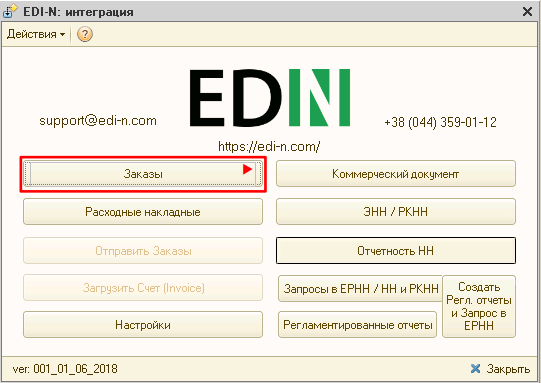
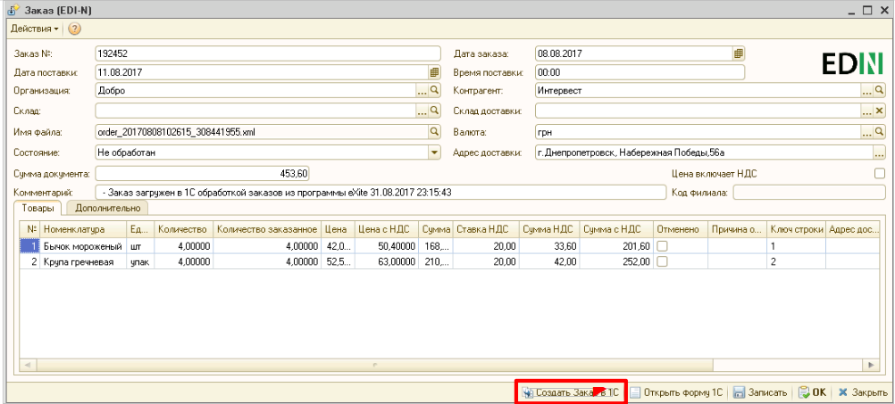
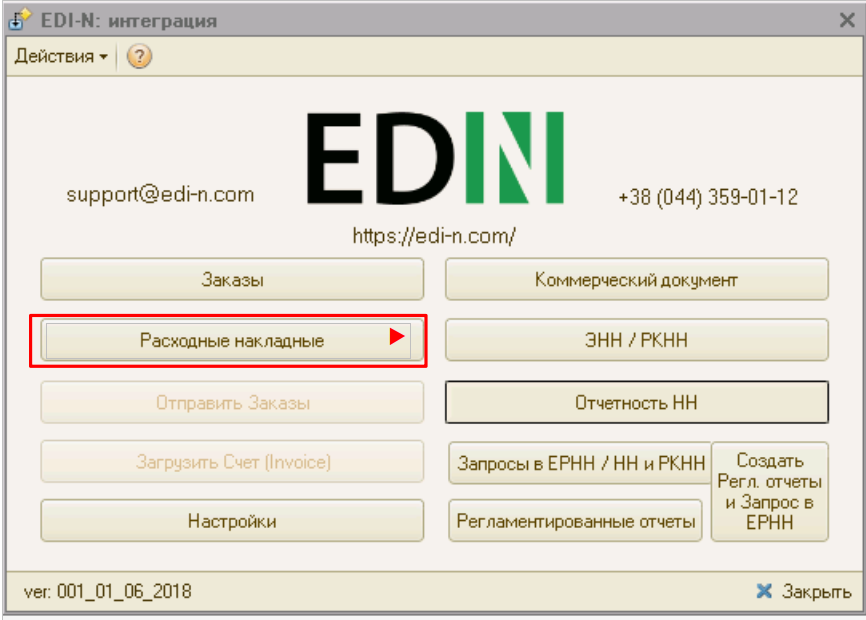
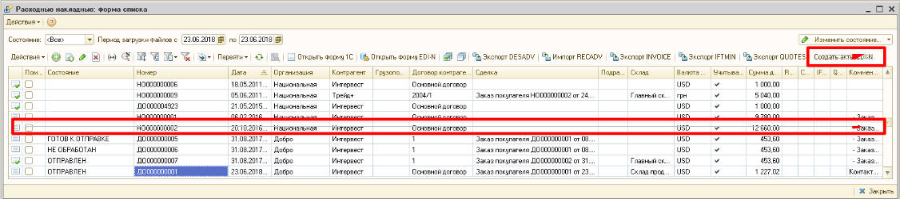
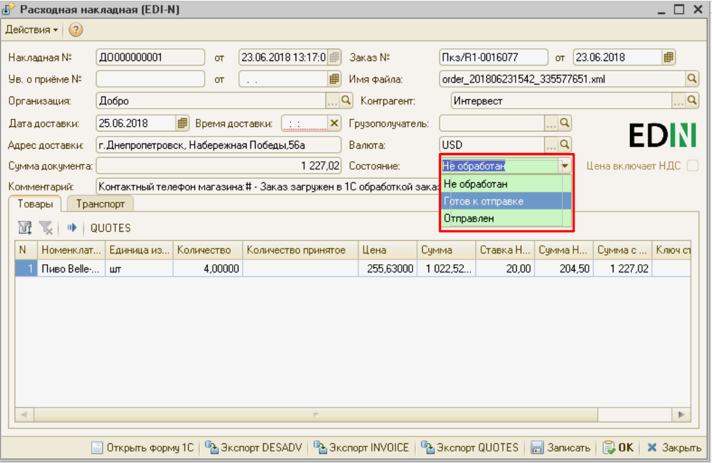
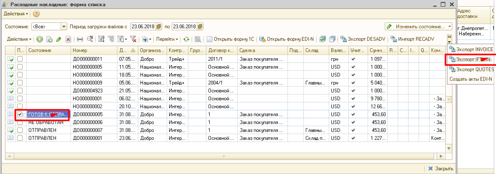

1C FTP Руководство пользователя
##################################
---------

.. contents:: Содержание:
   :depth: 6

---------

Работа с модулем
********************
Загрузка Заказов
================================================

Для получения и обработки заказов в главном окне нажмите кнопку **Заказы**.

В появившемся окне отображается журнал заказов.

.. image:: pics_user_1C_FTP_integration/user_1C_FTP_integration_02.png
   :align: center

Для загрузки новых заказов нажмите на кнопку **Импорт ORDERS**.

.. image:: pics_user_1C_FTP_integration/user_1C_FTP_integration_03.png
   :align: center

После чего появятся новые записи в журнале заказов.

Загруженные заказы не создаются сразу в 1С, а загружаются в базу данных модуля интеграции. Если на основании загруженного заказа были созданы в 1С документы **Заказ покупателя** и/или **Реализация товаров и услуг**, то ссылки на созданные документы можно увидеть в колонках **Заказ 1С** и **Расх.накл. 1С**.

.. image:: pics_user_1C_FTP_integration/user_1C_FTP_integration_04.png
   :align: center

Описание процедуры создания данных документов в п.2.3, 2.4.

Отправка подтверждения заказов (ORDRSP)
--------------------------------------------------

Загруженный заказ можно просмотреть, дважды кликну мышью на элементе списка, и, при необходимости, отредактировать его. Можно редактировать подтверждённое количество в столбце «Количество». Таким образом сеть получит Подтверждение заказа с количеством отличным от заказанного.

В случае, если на данном этапе по каким-то причинам невозможно указать подтверждённое количество (например если необходим запрос на склады по остаткам, что возможно после создания Реализации в 1С), есть возможность количество подтверждённое брать из Реализации созданной на основании загруженного заказа. Для этого необходимо предварительно установить соответствующую галочку в «**Настройки» – «Общие настройки интеграции**»:

.. image:: pics_user_1C_FTP_integration/user_1C_FTP_integration_05.png
   :align: center

После окончания редактирования установите состояние заказа в **Готов к отправке** и нажмите кнопку Записать (для сохранения изменений) или ОК (для сохранения и закрытия окна).

.. image:: pics_user_1C_FTP_integration/user_1C_FTP_integration_06.png
   :align: center

Для отправки подтверждения заказа отметьте в списке заказы, готовые к отправке, и нажмите кнопку **Экспорт ORDRSP**.

.. image:: pics_user_1C_FTP_integration/user_1C_FTP_integration_07.png
   :align: center

Изменить состояние документа (или нескольких) можно не открывая документ. Для этого необходимо выделить документ (или несколько) проставив галочки, а затем в правом верхнем углу изменить состояние на «**Готов к отправке**».

.. image:: pics_user_1C_FTP_integration/user_1C_FTP_integration_08.png
   :align: center

Если отправка прошла успешно, то состояние заказа изменится на **Отправлен**. После произведения действий с заказами изменяются состояния флагов: **ORDRSP выгружен**, **DESADV выгружен**, **RECADV загружен**.

.. image:: pics_user_1C_FTP_integration/user_1C_FTP_integration_09.png
   :align: center

Создание заказов в 1С
--------------------------------------------------

Для создания записи в журнале заказов 1С выберете заказ и нажмите кнопку **Создать Заказ в 1С**.

.. image:: pics_user_1C_FTP_integration/user_1C_FTP_integration_10.png
   :align: center

Или в окне заказа нажмите кнопку **Создать Заказ в 1С**.

В результате отобразится окно с созданным заказом (*если одновременно создаются несколько заказов, то окно не появится*).

.. image:: pics_user_1C_FTP_integration/user_1C_FTP_integration_12.png
   :align: center

В форме списка заказов заполнится поле **Заказ 1С** номером заказа в 1С.

.. image:: pics_user_1C_FTP_integration/user_1C_FTP_integration_13.png
   :align: center

Для просмотра заказа в 1С выберите заказ в списке (флажок можно не устанавливать) и нажмите кнопку **Открыть Заказ 1С**.

.. important:: На основании загруженного в базу модуля интеграции заказа возможно создать лишь один заказ в 1С.

Создание расходной накладной
--------------------------------------------------

Для создания записи в журнале расходных накладных 1С выберете заказ и нажмите кнопку **Создать Расх. накл**.

.. image:: pics_user_1C_FTP_integration/user_1C_FTP_integration_14.png
   :align: center

В результате отобразится окно с созданной расходной накладной (если одновременно создаются несколько расходных накладных, то окно не появится).

.. image:: pics_user_1C_FTP_integration/user_1C_FTP_integration_15.png
   :align: center

В форме списка заказов напротив заказа заполнится поле **Ссылки на Расх. накл**. номером документа **Реализация товаров и услуг** в 1С.

.. image:: pics_user_1C_FTP_integration/user_1C_FTP_integration_16.png
   :align: center

Для просмотра документа 1С **Реализация товаров и услуг** в журнале заказов дважды кликните на поле **Расх. накл. 1С**, а для просмотра формы расходных накладных — нажмите кнопку **Открыть Расх. накл. 1С** –> **Реализация товаров и услуг №XXXXXXXXX от DD.MM.YYYY hh:mm:ss**.

.. important:: На основании загруженного в EDI заказа возможно создать несколько реализаций в 1С.

Расходные накладные
--------------------------------------------------

Для работы с расходными накладными в главном окне нажмите кнопку **Расходные накладные**.

В появившемся окне отображается журнал расходных накладных.

.. image:: pics_user_1C_FTP_integration/user_1C_FTP_integration_18.png
   :align: center

**Важно**! В случае, если Расходная накладная была создана **Вводом на основании из Заказа 1С** (который в свою очередь был создан обработкой на основании загруженного заказа EDI(!) ), а не через обработку как описано в п. 2.4, то необходимо установить связь с заказом EDI вручную. Для этого в **форме списка Расходные накладные** необходимо установить галочки на необходимых документах и нажать кнопку Создать Акты EDI-N:

После чего, если заказ по этой Реализации был загружен обработкой, в столбце **Состояние** отобразиться статус по этой Реализации «*НЕ ОБРАБОТАН*». Это означает, что связь с заказом установлена и по такому заказу возможна отправка Уведомления об отгрузке.

Отправка уведомлений об отгрузке (DESADV)
--------------------------------------------------

Для отправки уведомлений об отгрузке выберете расходную накладную из списка и дважды кликните на ней. В появившемся окне установите состояние **Готов к отправке**.

Из расходной накладной можно отправить уведомление об отгрузке розничной сети, нажав кнопку **Экспорт DESADV**. Также можно отправить одно или несколько уведомлений из списка расходных накладных.

.. image:: pics_user_1C_FTP_integration/user_1C_FTP_integration_21.png
   :align: center

После отправки Состояние сменится с «*ГОТОВ К ОТПРАВКЕ*» на «*ОТПРАВЛЕН*».

Получение уведомлений о приеме (RECADV)
--------------------------------------------------

Для загрузки уведомлений о приеме нажмите на кнопку **Импорт RECADV**.

.. image:: pics_user_1C_FTP_integration/user_1C_FTP_integration_22.png
   :align: center

В расходной накладной после успешной загрузки **RECADV** изменится **Количество принятое**.

.. image:: pics_user_1C_FTP_integration/user_1C_FTP_integration_23.png
   :align: center

Экспорт приложения к Уведомлению об отгрузке QUOTES для сети Розетка.
-----------------------------------------------------------------------------------------------

В форме списка **Расходные накладные** зайти в нужную Реализацию и в форме реализации нажать кнопку **QUOTES**.

.. image:: pics_user_1C_FTP_integration/user_1C_FTP_integration_24.png
   :align: center

В открывшейся форме справа нажать кнопку «**+**» и ввести серийные номера по позициям. Количество серийных номеров по каждой из товарных позиций должно быть равно количеству единиц этой товарной позиции в **Реализации**.

.. image:: pics_user_1C_FTP_integration/user_1C_FTP_integration_25.png
   :align: center

Отправка **QUOTES** происходит аналогично отправке DESADV, только по нажатию кнопки **Экспорт QUOTES**:

.. image:: pics_user_1C_FTP_integration/user_1C_FTP_integration_26.png
   :align: center

Отправка инструкции по транспортировке IFTMIN
--------------------------------------------------

В форме списка **Расходные накладные** зайти в нужную Реализацию и в форме реализации перейти на вкладку **Транспорт** и в открывшейся форме заполнить соответствующую информацию:

.. image:: pics_user_1C_FTP_integration/user_1C_FTP_integration_27.png
   :align: center

Отправка **IFTMIN** происходит аналогично отправке DESADV, только по нажатию кнопки **Экспорт IFTMIN**:

