######################################################################
Инструкция оператора (пользователя). Первичная настройка
######################################################################

.. contents:: Содержание:
   :depth: 6

---------

Сокращения:

УС - учетная система
ЭЦП - электронно-цифровая подпись/печать
GLN - (Global Location Number) глобальный номер местоположения

---------

****************************************
**Первый запуск и настройка модуля**
****************************************

Разработанный компанией EDIN интеграционный модуль EDIN.API (в дальнейшем просто модуль) позволяет работать с учетными системами 1С:Предприятие 8.Х (в дальнейшем 1С) на базе ОС Windows.
Для работы с модулем  у пользователя должна быть подключена услуга для работы с API. В итоге у пользователя для работы с модулем должны быть логин, пароль и api_key:

- email - логин пользователя;
- password - пароль пользователя на платформе EDIN 2.0
- api_key - пароль доступа к API

Для запуска модуля необходимо в учетной системе 1С открыть файл запуска модуля (передается пользователю сотрудниками EDIN):

.. image:: pics_operator_instruction/operator_instruction_01.jpg
   :align: center

.. important:: У пользователя должны быть полные права на каталог, в котором находится файл модуля 

При подключении модуля учетная система 1С может запросить у пользователя разрешение выполнения операций со стороны модуля (защита от опасных действий).

.. image:: pics_operator_instruction/operator_instruction_02.jpg
   :align: center

При первом запуске (отсутствует config.txt) автоматически открывается раздел "Настройки" для введения всех необходимых данных (в дальнейшем при запуске открывается раздел "Входящие"). В каталоге, в котором расположен файл модуля автоматически создается файл введенные данные сохраняются 

********************
**"Настройки"**
********************

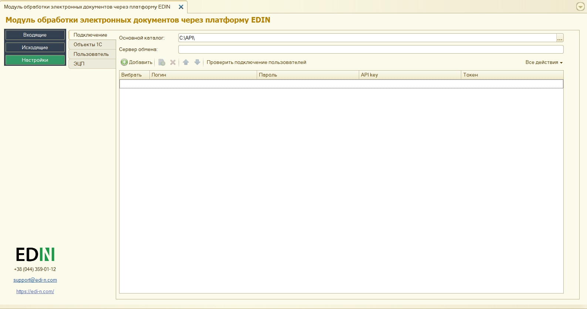

Раздел содержит 4 вкладки:

- **Подключение**
- **Объекты 1С**
- **Пользователь**
- **ЭЦП**

**Подключение**
================

Основной каталог - местоположение файла модуля???????

Сервер обмена - адрес платформы электронного документооборота (на этот адрес направляются запросы модуля)

В этой вкладке добавляются (кнопка "Добавить") пользователи, для каждого указываются свои email / password / api_key. В этой вкладке также осуществляется выбор Пользователей, от имени которых будут осуществляться дальнейшие действия, например, запросы на отображение Входящих/Исходящих документов.  

.. image:: pics_operator_instruction/operator_instruction_04.jpg
   :align: center

Настройки пользователей сохраняются в файле UserSettings, который размещается в подкаталоге (наименование=<пользователь 1С>) на одном уровне с файлом запуска модуля.

После того, как данные пользователей были введены возможно осуществить проверку (кнопка "Проверить подключение пользователей") введенных данных. В результате проверки полученный токен свидетельствует о корректно заполненных данных, пройденной авторизации на платформе электронного документооборота.

**Объекты 1С**
=====================

Для дальнейшей работы с электронным документооборотом необходимо произвести синхронизацию модуля и 1С, а также осуществить настройку сохранения данных справочников и документов.

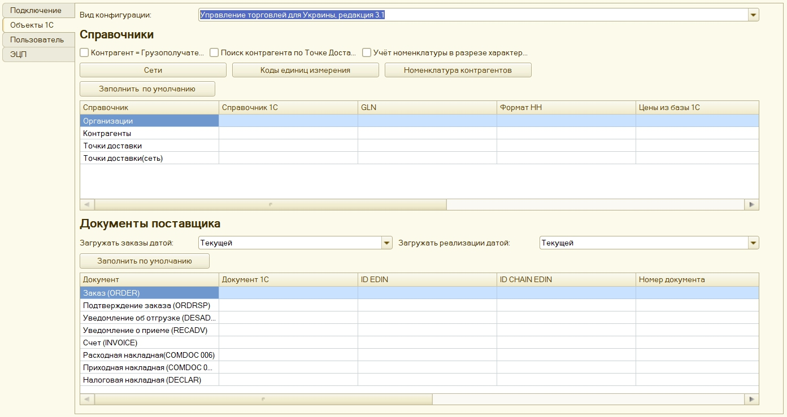

Вид конфигурации - поле заполняется автоматически (модуль предполагает текущую версию конфигурации УС 1С).

.. important:: Посмотреть версию своей 1С: Меню -> Справка -> О программе. В случае если учетная система 1С самописная или измененная, то необходимо выбрать типовою версию 1С на основании которой она была написана/изменена. Неправильно выбранный вид конфигурации может привести к проблемам создания документов из 1С.

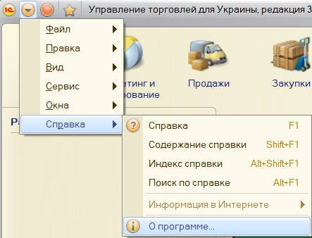

Кнопки:
Сети - открывает окно перечня всех сетей, подключенных к провайдеру электронного документооборота. Из этого перечня необходимо выбрать сети (контрагентов) с которыми пользователь будет обмениваться документами (выбор влияет на заполнение справочника **Контрагенты**).

Коды единиц измерения - единицы измерения, которые должны быть внесены в 1С (указывать кода единиц измерения необходимо в форме, которая открывается при нажатии кнопки "Коды единиц измерения").

.. image:: pics_operator_instruction/operator_instruction_20.jpg
   :align: center

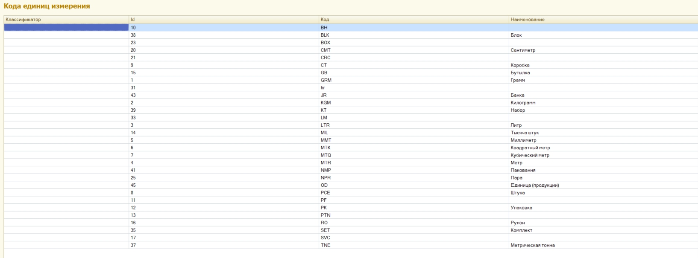

Номенклатура контрагентов - регистр сведений товаров контрагентов на справочник Номенклатура поставщиков.

**Настройка справочников**
---------------------------

.. important:: Настройки этого раздела рекомендовано выполнять обладая знаниями продвинутого пользователя или совместно с разработчиком 1С.

Для поставщиков доступны 3 основных типа справочников (**Организации**, **Контрагенты**, **Точки доставки**), в которые будут сохраняться собственные данные пользователя, данные контрагентов и их точки доставки соответственно в УС 1С.

.. image:: pics_operator_instruction/operator_instruction_09.jpg
   :align: center

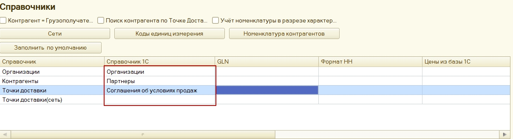

В этом разделе для каждого справочника производится настройка "местоположения" хранения данных (**GLN** (обязательно), **Формат НН**, **Цени из базы 1С**...) внутри учетной системы 1С. Возможно заполнить все табличные настройки раздела **"Справочники"** по умолчанию (кнопка **"Заполнить по умолчанию"**) либо произвести все настройки **вручную**.

_`Принцип **ручного** и **автоматического** заполнения`

При **ручной** настройке (через double-click по необходимому полю) открывается список справочников для выбора.

При **автоматической** настройке выбор местоположение сохранения данных справочников условно сводится к выбору **"реквизитов справочника"** 1С или **"дополнительных сведений"**. При этом более приоритетным (если позволяет УС) являются **"дополнительные сведения"**, так как они не вносят изменения в уже существующие справочники УС пользователя, а позволяют хранить данные отдельно (независимо от других компонентов программы).

.. important:: В табличной части настройки **"Справочник 1С"** и **"GLN"** являются обязательными к заполнению. 

Пример заполнения табличной части настроек раздела **"Справочники"**:

.. image:: pics_operator_instruction/operator_instruction_08.jpg
   :align: center

При синхронизации с платформой электронного документооборота EDIN в эти справочники (**Организации**, **Контрагенты**, **Точки доставки**) автоматически подтягиваются данные (просмотр/редактирование через double-click). **Организации** наполняется по пользовательскому логину (после успешной авторизации):

.. image:: pics_operator_instruction/operator_instruction_10.jpg
   :align: center

В справочнике **Контрагенты** отображаются юридические лица и точки доставки контрагентов, для которых можно проставить дополнительные настройки:

.. image:: pics_operator_instruction/operator_instruction_11.jpg
   :align: center

Справочник **Точки доставки** отличается от последнего наполнением колонок, в соответствии с требованиями EDI документооборота.

**Настройка документов**
---------------------------

.. important:: Настройки этого раздела рекомендовано выполнять обладая знаниями продвинутого пользователя или совместно с разработчиком 1С.

В этом разделе для каждого типа документа производится настройка "местоположения" хранения данных документов в УС 1С. Настройку также возможно производить **автоматически** (кнопка **"Заполнить по умолчанию"**) и **вручную** через double-click. `Принцип **ручного** и **автоматического** заполнения`_ табличной части аналогичен настройке справочников. 

Создание документов в 1С зависит от вида конфигурации. **1С Бухгалтерия** на обычных и управляемых формах позволяет создавать **"Счет на оплату покупателя"**, **"Реализация товаров и услуг"**. Другие 1С (НЕ БУХГАЛТЕРИЯ) на обычных формах позволяют создать "Заказ покупателя", "Реализация товаров и услуг". В **1С Управление** небольшой фирмой и **Управление средним бизнесом** на управляемых формах возможно создать "Заказ клиента", "Расходная накладная". Для **1С Управление торговлей**,  **Управление предприятием**, **Управление производственным предприятием** возможно создать **"Заказ клиента"** и **"Реализация товаров услуг"**:

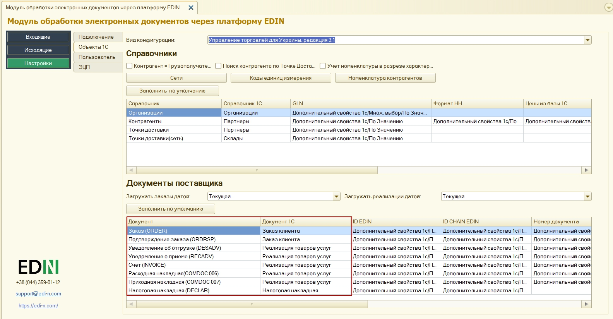

**Пользователь**
=====================

Раздел в котором пользователь может выбрать путь локального хранилища, в котором будут сохранятся входящие / исходящие ЮЗД документы, а также логи работы модуля(анализ документооборота). Поля **Склад** и **Подразделение** также заполняются для удобства пользователя.

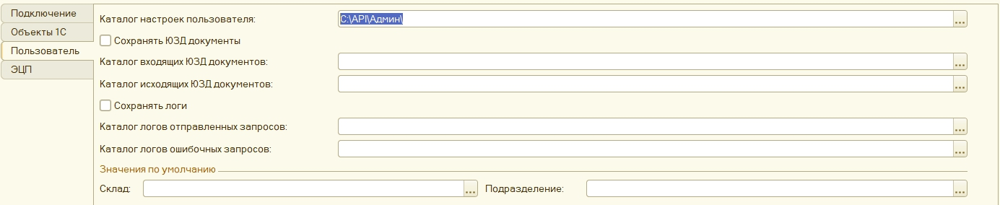

**ЭЦП**
=====================

Раздел настройки электронно-цифровой подписи и печати (ЭЦП), в котором указываются сертификаты ДФС (находятся в свободном доступе) и EDIN (предоставляется сотрудником компании).

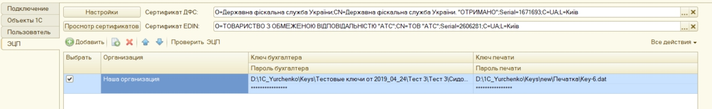

В таблицу вносятся (кнопка **"Добавить"**) пути к ключам бухгалтера и печати для каждого пользователя (должна быть подключена услуга для работы с API). Под каждым ключем необходимо ввести пароль. Кнопка **"Проверить ЭЦП"** позволяет проверить корректность введенных данных. 

Модуль позволяет хранить любое количество наборов ключей, но на момент подписания по одной организации необходимо выбрать (установить флажок в колонке "Выбрать") только одну пару ключей.

При выявлении ошибки при проверке модуль попросит повторно ввести пароль:

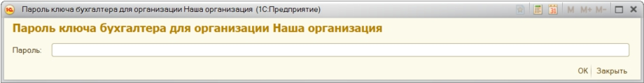

При каждой проверке ключа в окне сообщений отображается описание результата выполненной проверки.

********************
**"Входящие"**
********************

Раздел входящих документов (от контрагентов). Список документов возможно отфильтровать по полному номеру документа (поле номер). Для удобства во **Входящих** (только для документа Заказ) проставлялись отметки о отправленных ответных документах:

.. image:: pics_operator_instruction/operator_instruction_16.jpg
   :align: center

В разделе присутствуют кнопки обновления списка документов (обновление входящих документов с платформы электронного документооборота и догрузка созданных документов из 1С).

.. important:: Предварительно перед созданием документов необходимо обязательно убедиться, что указаны соответствия GLN со справочниками 1С.

Для создания ответного документа 1С необходимо **Выбрать** входящий документ и выбрать тип ответного документа под кнопкой **Создать**:

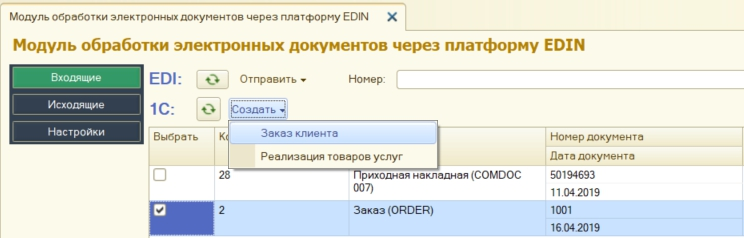

При создании документа модуль автоматически подтягивает все необходимые данные, однако если номенклатура была найдена не вся - модуль открывает окно **"Ненайденная номенклатура"** для добавления и сохранения номенклатуры в справочнике:

.. image:: pics_operator_instruction/operator_instruction_18.jpg
   :align: center

Для отправки ответного документа необходимо выбрать документ в колонке **"Документ 1С"**, сделать отметку напротив входящего документа (колонка **"Выбрать"**) и нажать **"Отправить"**

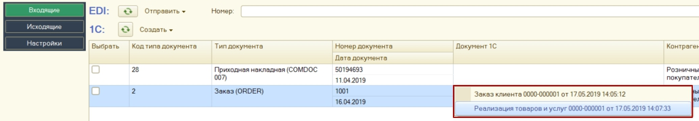

 
