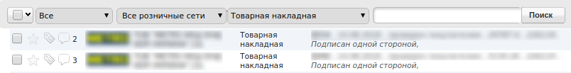
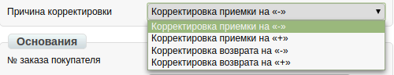
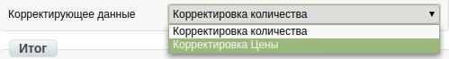
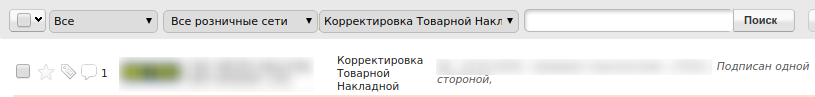
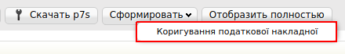

Формирование Корректировочных Товарной и Налоговой накладной (РКТН и РКНН)
############################################################################
---------

.. contents:: Содержание:
   :depth: 6

---------

Введение
=======================
Данная инструкция описывает порядок формирования документов

Корректировочной товарной (**РКТН**) и Корректировочной налоговой накладной (**РКНН**) на web-платформе..

.. important:: **Внимание!**  Для корректного формирования документов, необходимо заполнить Товарный справочник. Вы можете посмотреть  `Инструкцию по заполнению справочника <https://wiki.edi-n.com/ru/latest/general/Zapolnenie_Tovarnogo_spravochnika.html>`_.

Корректировочная товарная накладная
=============================================

Перед началом работы с данными документами необходимо заполнить все реквизиты компании и ФИО подписанта.

.. important:: **Внимание!** Завершенной цепочкой документооборота с сетью, является отправленная Корректировочная товарная накладная, с корректным статусом, плюс созданная на основании РКТН и зарегистрированная РКНН.

Заполнение реквизитов компании
----------------------------------------------------
Далее, перейдите в раздел “**Настройки**” (в правом верхнем углу”):

.. image:: pics_Formirovanie_Korrektirovochnyh_Tovarnoj_i_Nalogovoj_nakladnoj/Formirovanie_Korrektirovochnyh_Tovarnoj_i_Nalogovoj_nakladnoj_01.png
   :align: center

Нажмите на закладку "**Мои компании**" и выберете GLN, с которого будет происходить отправка документов.

.. image:: pics_Formirovanie_Korrektirovochnyh_Tovarnoj_i_Nalogovoj_nakladnoj/Formirovanie_Korrektirovochnyh_Tovarnoj_i_Nalogovoj_nakladnoj_02.png
   :align: center

В открывшейся форме заполните поля обязательные для заполнения (отмечены красной звездочкой *****).

.. important:: **Обратите внимание!** Реквизиты заполняются на украинском языке и должны соответствовать информации в регистрационных документах компании.

.. image:: pics_Formirovanie_Korrektirovochnyh_Tovarnoj_i_Nalogovoj_nakladnoj/Formirovanie_Korrektirovochnyh_Tovarnoj_i_Nalogovoj_nakladnoj_03.png
   :align: center

После заполнения всех данных, сохраните изменение, нажав на соответствующую кнопку «Сохранить».

Методы создания Корректировочной товарной накладной
----------------------------------------------------

Создать РКТН возможно двумя способами:

1. Через меню «Создать» выбрав Корректировочную товарную накладную
2. На основании Товарной накладной

*Рекомендуется формировать Корректировочную товарную накладную на основании Товарной накладной.*

Ниже приведен пример формирования Корректировочной товарной накладной на основании Товарной накладной.

Для формирования документа комплекта документов, необходимо перейти в раздел «**Отправленные**».

Для удобства, отфильтруйте документы по нужной сети и укажите тип документа «**Товарная накладная**».

Откройте документ «**Товарная накладная**» и нажмите кнопку «**Сформировать**», затем выберите из выпадающего списка документ «**Корректировочная товарная накладная**»

.. image:: pics_Formirovanie_Korrektirovochnyh_Tovarnoj_i_Nalogovoj_nakladnoj/Formirovanie_Korrektirovochnyh_Tovarnoj_i_Nalogovoj_nakladnoj_05.png
   :align: center

Заполнение Корректировочной товарной накладной
----------------------------------------------------
В открывшемся документе, необходимо заполнить обязательные данные, отмеченные красной звездочкой *****, в каждом из блоков.

.. image:: pics_Formirovanie_Korrektirovochnyh_Tovarnoj_i_Nalogovoj_nakladnoj/Formirovanie_Korrektirovochnyh_Tovarnoj_i_Nalogovoj_nakladnoj_06.png
   :align: center

Обязательными к заполнению в документе, является блок «**Причина корректировки**». Укажите нужный вариант.

Так же, необходимо выбрать необходимый пункт в блоке «**Корректирующие данные**»

Есть несколько причин корректировки:

1. **Корректировка приемки на "-"** - в блоке товарных позиций в поле "Количество товара по накладной (корректировочной)", либо в Цена товара по накладной (корректировочной) указываем значение со знаком "-". Поля Заказанное количество и Цена без НДС должны оставаться неизменными.

2. **Корректировка приемки на "+"** - в блоке товарных позиций в поле "Количество товара по накладной (корректировочной)", либо в Цена товара по накладной (корректировочной) указываем значение без знаков. Поля Заказанное количество и Цена без НДС должны оставаться неизменными.

3. **Корректировка возврата на "-"** - в блоке товарных позиций в поле "Количество товара по накладной (корректировочной)", либо в Цена товара по накладной (корректировочной) указываем значение со знаком "-". Поля Заказанное количество и Цена без НДС должны оставаться неизменными.

4. **Корректировка возврата на "+"** - в блоке товарных позиций в поле "Количество товара по накладной (корректировочной)", либо в Цена товара по накладной (корректировочной) указываем значение без знаков. Поля Заказанное количество и Цена без НДС должны оставаться неизменными.

Щелкнув по наименованию товарной позиции, Вы сможете внести дополнительные изменения, кроме полей "**Количество**" и "**Цена без НДС**".

.. image:: pics_Formirovanie_Korrektirovochnyh_Tovarnoj_i_Nalogovoj_nakladnoj/Formirovanie_Korrektirovochnyh_Tovarnoj_i_Nalogovoj_nakladnoj_09.png
   :align: center

При проверке внесенных данных по товарным позициям необходимо удостоверится, что обязательно заполнено поле «**код УКТ ВЭД**».

В случае, если поле не заполнено или заполнено не корректно, при сохранении документа будет выведено сообщение, как на изображении ниже:

.. image:: pics_Formirovanie_Korrektirovochnyh_Tovarnoj_i_Nalogovoj_nakladnoj/Formirovanie_Korrektirovochnyh_Tovarnoj_i_Nalogovoj_nakladnoj_10.png
   :align: center

Для того, что бы поле с кодом **УКТ ВЭД** при добавлении товарной позиции заполнялось автоматически, необходимо проверить, что бы данные были заполнены в Товарном справочнике.

После внесения всех данных по товарной позиции, нажмите кнопку «**Сохранить**».

Завершив редактирование документа «**Корректировочная товарная накладная**», его необходимо сохранить, подписать ЭЦП и отправить в сеть.

Подписание документа Корректировочная Товарная Накладная
---------------------------------------------------------
После сохранения документа, его необходимо подписать Электронно-Цифровой подписью (ЭЦП).

.. image:: pics_Formirovanie_Korrektirovochnyh_Tovarnoj_i_Nalogovoj_nakladnoj/Formirovanie_Korrektirovochnyh_Tovarnoj_i_Nalogovoj_nakladnoj_11.png
   :align: center

Для первичной настройки ЭЦП, дождитесь загрузки страницы, а затем нажмите кнопку “**Считать ключи**”

.. image:: pics_Formirovanie_Korrektirovochnyh_Tovarnoj_i_Nalogovoj_nakladnoj/Formirovanie_Korrektirovochnyh_Tovarnoj_i_Nalogovoj_nakladnoj_12.png
   :align: center

Затем, в блоке настройки ЭЦП, нажмите на изображение ключа и выберете из каталога, где хранятся Ваши секретные ключи, соответствующий файл.

.. image:: pics_Formirovanie_Korrektirovochnyh_Tovarnoj_i_Nalogovoj_nakladnoj/Formirovanie_Korrektirovochnyh_Tovarnoj_i_Nalogovoj_nakladnoj_13.png
   :align: center

Виды файлов электронно-цифровой подписи
----------------------------------------------------
Если Вы используете ключи от **АЦСК “Украина”**, файлы подписей секретных ключей имеют расширение **.ZS2** и следующие значения в именах файлов:

- Директор «DS»,
- Бухгалтер «BS»,
- Сотрудник «SS»,
- Печать «S»,
- Шифрование «C»,
- Универсальный ключ печати и шифрования «U».

.. image:: pics_Formirovanie_Korrektirovochnyh_Tovarnoj_i_Nalogovoj_nakladnoj/Formirovanie_Korrektirovochnyh_Tovarnoj_i_Nalogovoj_nakladnoj_14.png
   :align: center

Если Вы используете ключи от **АЦСК “ПриватБанк”**, файлы подписей секретных ключей имеют расширение **.jks**

.. image:: pics_Formirovanie_Korrektirovochnyh_Tovarnoj_i_Nalogovoj_nakladnoj/Formirovanie_Korrektirovochnyh_Tovarnoj_i_Nalogovoj_nakladnoj_15.png
   :align: center

Если Вы используете ключи от любых других **АЦСК**, файлы подписей секретных ключей имеют наименование **Key-6.dat**

.. image:: pics_Formirovanie_Korrektirovochnyh_Tovarnoj_i_Nalogovoj_nakladnoj/Formirovanie_Korrektirovochnyh_Tovarnoj_i_Nalogovoj_nakladnoj_16.png
   :align: center

После выбора секретных ключей, введите пароли под каждым из них, а затем нажмите кнопку “**Считать ключи**”

.. image:: pics_Formirovanie_Korrektirovochnyh_Tovarnoj_i_Nalogovoj_nakladnoj/Formirovanie_Korrektirovochnyh_Tovarnoj_i_Nalogovoj_nakladnoj_17.png
   :align: center

При корректном считывании ключей, в блоке “**ЭЦП**” появится информация о владельцах ключей. После проверки информации нажмите кнопку “**Подписать**”.

.. image:: pics_Formirovanie_Korrektirovochnyh_Tovarnoj_i_Nalogovoj_nakladnoj/Formirovanie_Korrektirovochnyh_Tovarnoj_i_Nalogovoj_nakladnoj_18.png
   :align: center

После подписания нажмите на кнопку “**Отправить**”.

Статусы по Корректировочной товарной накладной
----------------------------------------------------

После отправки ответных документов, торговая сеть обрабатывает их и присваивает им статусы. Статусы отображаются в разделе “**Отправленные**”, напротив каждого документа.

Пример корректного статуса:

.. image:: pics_Formirovanie_Korrektirovochnyh_Tovarnoj_i_Nalogovoj_nakladnoj/Formirovanie_Korrektirovochnyh_Tovarnoj_i_Nalogovoj_nakladnoj_19.png
   :align: center

Пример некорректного статуса:

.. image:: pics_Formirovanie_Korrektirovochnyh_Tovarnoj_i_Nalogovoj_nakladnoj/Formirovanie_Korrektirovochnyh_Tovarnoj_i_Nalogovoj_nakladnoj_20.png
   :align: center

- «**Документ передан партнеру**» - товарная накладная корректная.
- «**Документ передан на ящик партнера**» - товарная накладная корректная.
- «**Правильный канал не найден. Нет соединения с партнером**» - в товарной накладной указан некорректный GLN получателя и покупателя.

«Ошибка конвертации на выходящий формат» - есть ошибка в форме заполнения товарной накладной. Некоторые поля были не заполнены или заполнены некорректно.

В случае возникновения подобной ошибки просьба обратится по адресу эл. почты support@edi-n.com

Корректировочная Налоговая накладная
==========================================================

Корректировочная Налоговая накладная, формируется на основании ранее отправленной Корректировочной товарной накладной.

Для формирования документа РКНН, перейдите в раздел «**Отправленные**», отфильтруйте документы по нужной розничной сети и типу «**Корректировочная товарная накладная**».

Откройте документ «**Корректировочная товарная накладная**» и нажмите кнопку «**Сформировать**», затем выберете из выпадающего списка документ «**Корректировочная налоговая накладная**»

В сформированном документе «**Корректировочная налоговая накладная**», данные автоматически подтянутся из Корректировочной товарной накладной - их необходимо сверить, после этого приступить к внесению корректируемых данных.

.. image:: pics_Formirovanie_Korrektirovochnyh_Tovarnoj_i_Nalogovoj_nakladnoj/Formirovanie_Korrektirovochnyh_Tovarnoj_i_Nalogovoj_nakladnoj_23.png
   :align: center

Внизу документа находится перечень товарных позиций, которые переносятся из документа «Корректировка к Товарной Накладной»

Все остальные поля вы заполняете самостоятельно согласно действующего налогового законодательства Украины.

.. image:: pics_Formirovanie_Korrektirovochnyh_Tovarnoj_i_Nalogovoj_nakladnoj/Formirovanie_Korrektirovochnyh_Tovarnoj_i_Nalogovoj_nakladnoj_24.png
   :align: center

После заполнения всех данных, документ необходимо сохранить,подписать ЭЦП и отправить аналогично Корректировочной Товарной накладной.

Документ будет доставлен покупателю для дальнейшей регистрации на сервере ЕРНН.

Статусы по Корректировочной налоговой накладной
----------------------------------------------------

После проверки документа органом Государственной Налоговой Инспекции, ему будет присвоен статус.

На корректный документ поступит статус «**Зарегистрировано в ЕРНН и отправлено покупателю**».

На не некорректный документ поступит статус «**Ошибка при регистрации в ЕРНН**».

В случае получения статуса «**Ошибка при регистрации в ЕРНН**» просьба обратится по адресу эл. почты support@edi-n.com.

Формирование РКТН и РКНН, через функционал «Создать документ»
==============================================================

В случае, если документ «**Товарная накладная**» не отправлялся, Корректирующую товарную накладную, необходимо сформировать самостоятельно через меню «**Создать**».

.. image:: pics_Formirovanie_Korrektirovochnyh_Tovarnoj_i_Nalogovoj_nakladnoj/Formirovanie_Korrektirovochnyh_Tovarnoj_i_Nalogovoj_nakladnoj_25.png
   :align: center

Добавление товарных позиций
----------------------------------------------------
Из выпадающего списка, выберете документ «**Корректировка товарной накладной**».

В сформированном документе все реквизиты необходимо ввести вручную, на основании бумажных документов.

После заполнения реквизитов в документ, требуется ввести товарные позиции. Для этого нажмите кнопку «**Добавить позицию**».

.. image:: pics_Formirovanie_Korrektirovochnyh_Tovarnoj_i_Nalogovoj_nakladnoj/Formirovanie_Korrektirovochnyh_Tovarnoj_i_Nalogovoj_nakladnoj_26.png
   :align: center

В появившейся форме, заполните все обязательные поля, отмеченные красной звездочкой *****, после этого сохраните изменения.

.. image:: pics_Formirovanie_Korrektirovochnyh_Tovarnoj_i_Nalogovoj_nakladnoj/Formirovanie_Korrektirovochnyh_Tovarnoj_i_Nalogovoj_nakladnoj_27.png
   :align: center

Обратите внимание, что для того, что бы поле «**код УКТ ВЭД**» при выборе товарной позиции заполнялось автоматически, данные необходимо заполнить в Товарном справочнике.

Заполнение данных документа происходит аналогично пунктам 5 и 6 этой инструкции.

После добавления всех товарных позиций, документ необходимо сохранить, подписать ЭЦП и отправить в торговую сеть.

Эта процедура, аналогичная пунктам 8 и 9 данной инструкции.

Формирование Корректировочной налоговой накладной
----------------------------------------------------

Перейдите в раздел «**Отправленные**», найдите и откройте ранее отправленную Товарную накладную.

.. image:: pics_Formirovanie_Korrektirovochnyh_Tovarnoj_i_Nalogovoj_nakladnoj/Formirovanie_Korrektirovochnyh_Tovarnoj_i_Nalogovoj_nakladnoj_28.png
   :align: center

В открывшемся документе нажмите кнопку «Сформировать», затем выберите из выпадающего списка документ «**Налоговая накладная**».

Данные в документе будут заполнены автоматически, на основании Товарной накладной. В Налоговой накладной необходимо заполнить порядковый номер.

После заполнения всех данных, документ необходимо сохранить, подписать ЭЦП и отправить в торговую сеть.

Эта процедура, аналогичная пунктам 6 и 7 данной инструкции.

Дальнейшее формирование и отправка документа Корректирующая налоговая накладная происходит аналогично пунктам 12 и 13 данной инструкции.

.. include:: kontakti.rst
