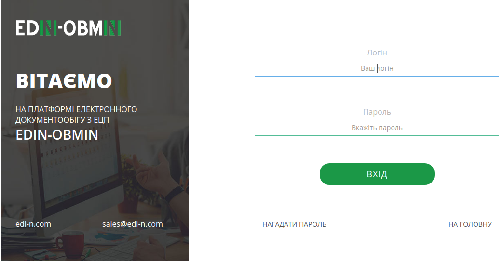
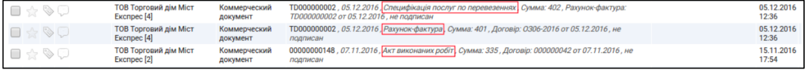
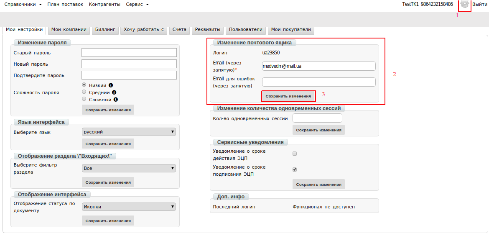

Обмен э-документами с почтово-логистическим оператором Meest-Express
############################################################################
---------

.. contents:: Содержание:
   :depth: 6

---------

Введение
=======================

Данная инструкция описывает порядок работы с документами:

- Счет
- Акт выполненных работ
- Спецификация, которые отправляет компания Meest-Express.

Документы Вам будут поступать в виде Коммерческого документа с соответствующим типом.

*Акт выполненных работ* требует согласования: принятие/подписание либо отклонение.
*Счет* и *Спецификация* является информационным документом без каких-либо требований.

Вход на платформу
=======================
Для входа на платформу необходимо перейти по ссылке https://obmin.edi-n.com/. На открывшейся странице, введите логин и пароль для доступа в систему.

Настройка ЭЦП
=======================
Перед началом работы необходимо настроить подпись, которой Вы будете подписывать документы.
Чтобы перейти к Настройке ЭЦП, зайдите в Настройки, нажав на "**шестеренку**" в верхнем правом углу.
Откроется Проводник, где необходимо будет указать каталог с секретными ключами и выбрать ключи.

.. image:: pics_Obmin_e_dokumentami_s_Meest_Express/Obmen_e-dokumentami_s_Meest-Express_02.png
   :align: center

Если ключи полученные в **АЦСК ИСД (ДФС)**, тогда необходимо выбирать: ключи **key-6.dat**

Если вы используете для подписания ключи **АЦСК «Украина»**, тогда вид ключей таков:

- Ключ директора: ЕДРПОУ_ИНН подписанта_D1111111.ZS2
- Ключ бухгалтера: ЕДРПОУ_ИНН подписанта _B1111111.ZS2
- Ключ печати: ЕДРПОУ_S1111111.ZS2 (ЕГРПОУ _U1111111.ZS2)
- Ключ шифрования: ЕДРПОУ_С1111111.ZS2 (ЕГРПОУ _U1111111.ZS2)

После того, как ключ выбран, появляется окно, в котором необходимо ввести пароль и нажать кнопку: **Считать**.

Когда ключи считаны, в окне ЭЦП можно будет увидеть информацию о ЭЦП:

.. image:: pics_Obmin_e_dokumentami_s_Meest_Express/Obmen_e-dokumentami_s_Meest-Express_03.png
   :align: center

.. image:: pics_Obmin_e_dokumentami_s_Meest_Express/Obmen_e-dokumentami_s_Meest-Express_04.png
   :align: center

Подписание документов
===================================

Для того, чтобы подписать документ ЭЦП, необходимо нажать кнопку **Подписать**.

.. image:: pics_Obmin_e_dokumentami_s_Meest_Express/Obmen_e-dokumentami_s_Meest-Express_05.png
   :align: center

Откроется окно для подписания, в котором необходимо нажать кнопку **Подписать**.

.. image:: pics_Obmin_e_dokumentami_s_Meest_Express/Obmen_e-dokumentami_s_Meest-Express_06.png
   :align: center

Далее откроется окно, в котором необходимо отметить чекером типы ключей, которыми будет подписан документ.
Затем устанавливаем последовательность подписи, например:

- директор - 1
- печать - 2

.. image:: pics_Obmin_e_dokumentami_s_Meest_Express/Obmen_e-dokumentami_s_Meest-Express_07.png
   :align: center

И нажимаем кнопку **Подписать**. После процесса подписания необходимо нажать кнопку **Отправить**.

.. image:: pics_Obmin_e_dokumentami_s_Meest_Express/Obmen_e-dokumentami_s_Meest-Express_08.png
   :align: center

Работа с документами
===================================

При получении документа, он отображается на платформе в папке **Входящие**.

**Обратите внимание**! Тип документа отображается в кратком описании документа.

Для выбора необходимого документа является возможность воспользоваться фильтрами, которые отражаются над документами:

- Первый фильтр отражает **все**, прочитанные и непрочитанные документы;
- Второй фильтр позволяет выбрать конкретный **тип** документа.

.. image:: pics_Obmin_e_dokumentami_s_Meest_Express/Obmen_e-dokumentami_s_Meest-Express_10.png
   :align: center

**Все документы, которые отправляет компания Meest-Express передаются в формате Коммерческого документа (comdoc).**

После выбора этого документа во втором фильтре, появляется два дополнительных:

- по типу документа 
- по статусу.

Также можно воспользоваться строкой поиска, указав правильный номер документа.

.. image:: pics_Obmin_e_dokumentami_s_Meest_Express/Obmen_e-dokumentami_s_Meest-Express_11.png
   :align: center
При необходимости есть возможность использовать расширенный поиск. Для этого нужно нажать на соответствующую кнопку — **Поиск***.

.. image:: pics_Obmin_e_dokumentami_s_Meest_Express/Obmen_e-dokumentami_s_Meest-Express_12.png
   :align: center

В появившемся окне необходимо ввести параметры поиска и нажать кнопку **Найти**.

.. image:: pics_Obmin_e_dokumentami_s_Meest_Express/Obmen_e-dokumentami_s_Meest-Express_13.png
   :align: center

Счет-фактура
------------------
Документ передает информацию о стоимости предоставляемых услуг компанией Meest-Express. Информация о подписании документа отображается в блоке «**Подписи**». В открытом документе вверху есть несколько кнопок, которые позволят Вам:         

- распечатать документ;                
- скачать документ в формате .xls;           
- скачать документ в формате .xml;         
- отобразить более подробную информацию по документу;
- скачать документ с ЭЦП;

.. image:: pics_Obmin_e_dokumentami_s_Meest_Express/Obmen_e-dokumentami_s_Meest-Express_14.png
   :align: center

Спецификация услуг по перевозкам
------------------------------------
Документ расшифровывает счета, выставленные в электронном документе «Счет-фактура».

.. image:: pics_Obmin_e_dokumentami_s_Meest_Express/Obmen_e-dokumentami_s_Meest-Express_15.png
   :align: center

Акт выполненных работ
---------------------------
Данный документ обязательно **требует проверки** и подтверждения или отклонения.

.. image:: pics_Obmin_e_dokumentami_s_Meest_Express/Obmen_e-dokumentami_s_Meest-Express_16.png
   :align: center

Для подтверждения Акта необходимо нажать на кнопку **Подписать**, и в блоке «ЭЦП» ввести пароли для подписания документа.

.. image:: pics_Obmin_e_dokumentami_s_Meest_Express/Obmen_e-dokumentami_s_Meest-Express_17.png
   :align: center

В случае если ЭЦП не настроен, вернитесь к шагу 2, данной инструкции.

Дополнительные сервисы 
===================================

Портал сертификатов
---------------------------
Портал сертификатов EDIN-Certificate - это онлайн сервис по хранению, обработке, поиску и совместном использования сертификатов в единой среде для всех участников.

Для работы с отчетностью нужно выбрать Сервис -> Сертификаты:

.. image:: pics_Obmin_e_dokumentami_s_Meest_Express/Obmen_e-dokumentami_s_Meest-Express_18.png
   :align: center

Основные возможности сервиса - Портал Сертификатов:

- Быстрый поиск сертификата (2 сек.);
- Удобный обмен между участниками;
- Защита от потери сертификата (облачное хранение);
- Прямая ссылка для быстрого просмотра / скачивания ;
- Загрузка и печать сертификата в среде сервиса;
- Поиск сертификата по разным признакам (№, артикул,штрих-код и т.д.)

Добавление и изменения email в настройках пользователя
-------------------------------------------------------

Для редактирования (изменения, удаления или добавления) адреса 
e-mail необходимо:

1. В правом верхнем углу на платформе перейти в «**Настройки**».
2. В разделе «**Изменение почтового ящика**» скорректировать существующий адрес почты.   

.. hint::
   Так же через «,» возможно добавить несколько e-mail. Пример: test@mail.ua,test2@mail.ua,test3@mail.ua

3. После внесения всех необходимых изменений сохранить их нажатием кнопки «**Сохранить изменения**».

.. include:: kontakti.rst
