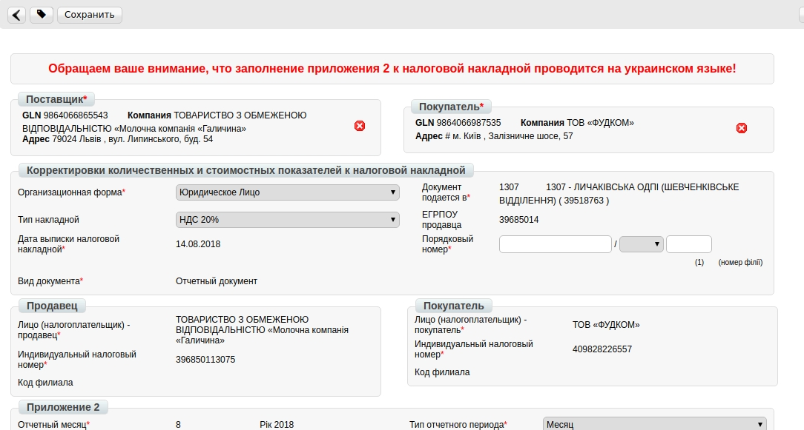

Формирование Корректировочной НН на основании Возвратной накладной
############################################################################
---------

.. contents:: Содержание:
   :depth: 6

---------

Предварительные настройки
====================================
Для начала работы с электронной налоговой накладной необходимо:
1.1. Подготовить действующую электронную цифровую подпись
лица (лиц), с помощью которой будет осуществляться подписание электронной
налоговой накладной (declar).
1.2. Если ключи не на внешних носителях (диск, флеш-накопитель), нужно
узнать путь к ключам в файловой системе.
1.3. Зайти на портал: http://edo.edi-n.com и ввести логин и пароль.

.. image:: pics_formirovanie_Korrektirovochnoj_NN_na_osnovanii_Vozvratnoj_nakladnoj/formirovanie_Korrektirovochnoj_NN_na_osnovanii_Vozvratnoj_nakladnoj_01.png
   :align: center

1.4. Перед началом работы с корректировочной налоговой накладной необходимо единоразово заполнить все реквизиты, которые будут отображаться в налоговой со стороны поставщика.

.. image:: pics_formirovanie_Korrektirovochnoj_NN_na_osnovanii_Vozvratnoj_nakladnoj/formirovanie_Korrektirovochnoj_NN_na_osnovanii_Vozvratnoj_nakladnoj_02.png
   :align: center

1.5. Перейти в раздел «**Настройки**» (в правом верхнем углу):

.. image:: pics_formirovanie_Korrektirovochnoj_NN_na_osnovanii_Vozvratnoj_nakladnoj/formirovanie_Korrektirovochnoj_NN_na_osnovanii_Vozvratnoj_nakladnoj_03.png
   :align: center

1.6. Перейти в закладку "**Мои компании**" и выбрать GLN, с которого
будет происходить отправка накладных:

.. image:: pics_formirovanie_Korrektirovochnoj_NN_na_osnovanii_Vozvratnoj_nakladnoj/formirovanie_Korrektirovochnoj_NN_na_osnovanii_Vozvratnoj_nakladnoj_04.png
   :align: center

**Необходимо указать**:

- Код ЕДРПОУ
- Код ИНН
- Правильное название компании
- № свидетельства плательщика НДС
- Улицу и дом (юр. адрес)
- Индекс (юр. адрес)
- Город (юр. адрес)
- Страну (выбирайте из списка Украину)
- Область (выбирайте из списка)
- ГНИ (выбирайте из списка налоговую, в которую подаете отчетность)
- Менеджер (можно указать «-»)
- Бухгалтер (Ф.И.О. главного бухгалтера)
- Директор (Ф.И.О. директора)
- Должность (должность директора: генеральный, исполнительный, директор)
- Подписант (Ф.И.О. и ИНН подписанта)
- Телефон
- Форма собственности (юр. или физ. лицо)

.. image:: pics_formirovanie_Korrektirovochnoj_NN_na_osnovanii_Vozvratnoj_nakladnoj/formirovanie_Korrektirovochnoj_NN_na_osnovanii_Vozvratnoj_nakladnoj_05.png
   :align: center

После заполнения нажмите кнопку «**Сохранить**».

Формирование документа “Корректировка к Налоговой накладной(DECLAR_J12)»
====================================================================================
Данный документ формируется на основании **Коммерческого документа (СOMDOC) “Накладная на возврат”**.

Для удобства поиска выберите в первом фильтре - **Все** документы, во втором — **торговую сеть**, в третьем - тип документа **Коммерческий документ**, и в четвертом — **Накладная на возврат**.

.. image:: pics_formirovanie_Korrektirovochnoj_NN_na_osnovanii_Vozvratnoj_nakladnoj/formirovanie_Korrektirovochnoj_NN_na_osnovanii_Vozvratnoj_nakladnoj_06.png
   :align: center

*Перед отправкой корректировки необходимо подписать и отправить Коммерческий документ “Накладная на возврат”.*

Для того, что бы сформировать документ “**Корректировка к Налоговой накладной**”, необходимо зайти в **Коммерческий документ** “**Накладная на возврат**”.

Далее необходимо нажать на кнопку **Сформировать** —> **Коригування податкової накладної**.

.. image:: pics_formirovanie_Korrektirovochnoj_NN_na_osnovanii_Vozvratnoj_nakladnoj/formirovanie_Korrektirovochnoj_NN_na_osnovanii_Vozvratnoj_nakladnoj_07.png
   :align: center

Заполнение документа “Корректировка к Налоговой накладной(DECLAR_J12)”
========================================================================

Все необходимые поля для заполнению обозначены красными звёздочками *****.

В выпадающем списке **Причина коригування*** обязательно необходимо выбрать соответствующий параметр.

.. image:: pics_formirovanie_Korrektirovochnoj_NN_na_osnovanii_Vozvratnoj_nakladnoj/formirovanie_Korrektirovochnoj_NN_na_osnovanii_Vozvratnoj_nakladnoj_09.png
   :align: center

**Раздел А** рассчитывается автоматически при условии наличия соответствующией галочки в чекбоксе.

.. image:: pics_formirovanie_Korrektirovochnoj_NN_na_osnovanii_Vozvratnoj_nakladnoj/formirovanie_Korrektirovochnoj_NN_na_osnovanii_Vozvratnoj_nakladnoj_10.png
   :align: center

Ниже вы можете увидеть перечень товарных позиций, которые переносятся из документа “**Накладная на возврат**”.

.. image:: pics_formirovanie_Korrektirovochnoj_NN_na_osnovanii_Vozvratnoj_nakladnoj/formirovanie_Korrektirovochnoj_NN_na_osnovanii_Vozvratnoj_nakladnoj_11.png
   :align: center
   
.. image:: pics_formirovanie_Korrektirovochnoj_NN_na_osnovanii_Vozvratnoj_nakladnoj/formirovanie_Korrektirovochnoj_NN_na_osnovanii_Vozvratnoj_nakladnoj_12.png
   :align: center

Все остальные поля вы заполняете самостоятельно согласно действующего налогового законодательства Украины.

После внесения всех данных необходимо нажать кнопку «**Сохранить**». Если часть необходимых реквизитов не заполнена, появятся подсказки, какие поля нужно заполнить.

.. image:: pics_formirovanie_Korrektirovochnoj_NN_na_osnovanii_Vozvratnoj_nakladnoj/formirovanie_Korrektirovochnoj_NN_na_osnovanii_Vozvratnoj_nakladnoj_13.png
   :align: center

После сохранения налоговой накладной для нанесения подписей необходим нажать кнопку «**Подписать**».

.. image:: pics_formirovanie_Korrektirovochnoj_NN_na_osnovanii_Vozvratnoj_nakladnoj/formirovanie_Korrektirovochnoj_NN_na_osnovanii_Vozvratnoj_nakladnoj_14.png
   :align: center

После нажатия кнопки "**Отправить**" накладная отправляется на регистрацию в Единый реестр налоговых накладных.

.. image:: pics_formirovanie_Korrektirovochnoj_NN_na_osnovanii_Vozvratnoj_nakladnoj/formirovanie_Korrektirovochnoj_NN_na_osnovanii_Vozvratnoj_nakladnoj_15.png
   :align: center

Получение статуса о регистрации
=======================================================================

В зависимости от того, была ли зарегистрирована накладная или нет, вам обязательно поступит соответствующий статус:

1. **Зарегистрировано в ЕРНН**

Свидетельствует о том, что Корректировочная налоговая накладная была успешно зарегистрирована в ЕРНН вашим контрагентом.

.. image:: pics_formirovanie_Korrektirovochnoj_NN_na_osnovanii_Vozvratnoj_nakladnoj/formirovanie_Korrektirovochnoj_NN_na_osnovanii_Vozvratnoj_nakladnoj_16.png
   :align: center

2. **Ошибка при регистрации в ЕРНН**

Свидетельствует о том, что Корректировочная налоговая накладная была отклонена вашим контрагентом.

.. image:: pics_formirovanie_Korrektirovochnoj_NN_na_osnovanii_Vozvratnoj_nakladnoj/formirovanie_Korrektirovochnoj_NN_na_osnovanii_Vozvratnoj_nakladnoj_17.png
   :align: center

Также ошибку регистрации(квитанцию) можно посмотреть, зайдя в документ.

.. image:: pics_formirovanie_Korrektirovochnoj_NN_na_osnovanii_Vozvratnoj_nakladnoj/formirovanie_Korrektirovochnoj_NN_na_osnovanii_Vozvratnoj_nakladnoj_18.png
   :align: center

3. **Отправлен на проверку в торговую сеть**

Документ проверяется на стороне торговой сети перед отправкой на регистрацию.

.. include:: kontakti.rst
