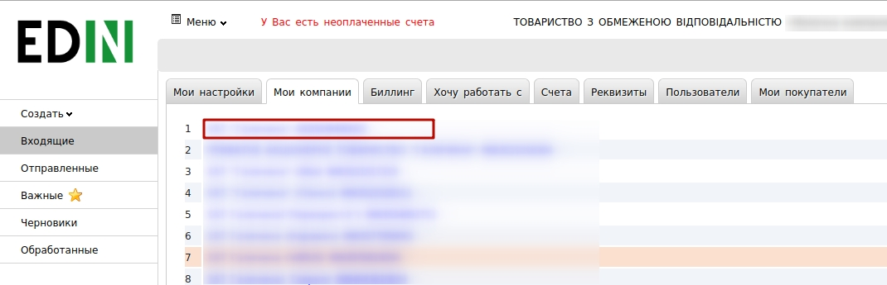
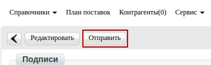
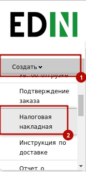
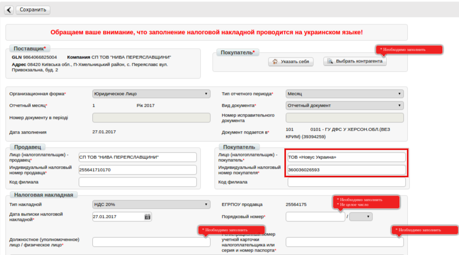

Формирование Налоговой Накладной на основании Приходной накладной(COMDOC_007)
###############################################################################
---------

.. contents:: Содержание:
   :depth: 6

---------

Предварительные настройки
====================================
Для начала работы с электронной налоговой накладной необходимо:

1.1. Подготовить действующую электронную цифровую подпись
лица (лиц), с помощью которой будет осуществлятся подписание электронной
налоговой накладной (**declar**).

1.2. Если ключи не на внешних носителях (диск, флеш-накопитель), нужно
узнать путь к ключам в файловой системе.

1.3. Зайти на портал: http://edo.edi-n.com и ввести логин и пароль:

1.4. Перед началом работы с налоговой накладной необходимо единоразово
заполнить все реквизиты, которые будут отображаться в налоговой со
стороны поставщика.

.. image:: pics_formirovanie_Nalogovoj_Nakladnoj_na_osnovanii_Prihodnoj_nakladnoj/formirovanie_Nalogovoj_Nakladnoj_na_osnovanii_Prihodnoj_nakladnoj_02.png
   :align: center

1.5. Перейти в раздел «**Настройки**» (в правом верхнем углу):

.. image:: pics_formirovanie_Nalogovoj_Nakladnoj_na_osnovanii_Prihodnoj_nakladnoj/formirovanie_Nalogovoj_Nakladnoj_na_osnovanii_Prihodnoj_nakladnoj_03.png
   :align: center

1.6. Перейти в закладку "**Мои компании**" и выбрать GLN, с которого
будет происходить отправка накладных:
- 

.. important:: **Внимание!** Внимание! Обратите внимание, что реквизиты заполняются на украинском языке и должны соответствовать информации в регистрационных документах компании.

.. image:: pics_formirovanie_Nalogovoj_Nakladnoj_na_osnovanii_Prihodnoj_nakladnoj/formirovanie_Nalogovoj_Nakladnoj_na_osnovanii_Prihodnoj_nakladnoj_05.png
   :align: center

**Необходимо указать**:

- Код ЕДРПОУ
- Код ИНН
- Правильное название компании
- № свидетельства плательщика НДС
- Улицу и дом (юр. адрес)
- Индекс (юр. адрес)
- Город (юр. адрес)
- Страну (выбирайте из списка Украину)
- Область (выбирайте из списка)
- ГНИ (выбирайте из списка налоговую, в которую подаете отчетность)
- Менеджер (можно указать «-»)
- Бухгалтер (Ф.И.О. главного бухгалтера)
- Директор (Ф.И.О. директора)
- Должность (должность директора: генеральный, исполнительный, директор)
- Подписант (Ф.И.О. и ИНН подписанта)
- Телефон
- Форма собственности (юр. или физ. лицо)

После заполнения нажмите кнопку «**Сохранить**».

Создание налоговой накладной
====================================
Перед созданием налоговой накладной рекомендуется проверить товарный справочник, так как информация по позициям подтягивается именно из него. Он находится в правом верхнем углу:

.. image:: pics_formirovanie_Nalogovoj_Nakladnoj_na_osnovanii_Prihodnoj_nakladnoj/formirovanie_Nalogovoj_Nakladnoj_na_osnovanii_Prihodnoj_nakladnoj_06.png
   :align: center

2.1. Перейдите в пункт меню «**Отправленные**»:

.. image:: pics_formirovanie_Nalogovoj_Nakladnoj_na_osnovanii_Prihodnoj_nakladnoj/formirovanie_Nalogovoj_Nakladnoj_na_osnovanii_Prihodnoj_nakladnoj_07.png
   :align: center

2.2. Выберите *подписанный и уже отправленный* «Коммерческий документ»
(Приходная накладная), на основании которого будете формировать и
отправлять электронную налоговую накладную.

.. image:: pics_formirovanie_Nalogovoj_Nakladnoj_na_osnovanii_Prihodnoj_nakladnoj/formirovanie_Nalogovoj_Nakladnoj_na_osnovanii_Prihodnoj_nakladnoj_08.png
   :align: center

2.3. В открытом документе «**Коммерческий документ**» выберите пункт
меню «**Сформировать**» -> «**Налоговая накладная**».

.. image:: pics_formirovanie_Nalogovoj_Nakladnoj_na_osnovanii_Prihodnoj_nakladnoj/formirovanie_Nalogovoj_Nakladnoj_na_osnovanii_Prihodnoj_nakladnoj_09.png
   :align: center

2.4. Заполните все поля, которые отмеченные красной звездочкой *****.
А так же важно попозиционно вносить код УКТ ВЭД:

.. image:: pics_formirovanie_Nalogovoj_Nakladnoj_na_osnovanii_Prihodnoj_nakladnoj/formirovanie_Nalogovoj_Nakladnoj_na_osnovanii_Prihodnoj_nakladnoj_10.png
   :align: center

2.5. После внесения всех данных необходимо нажать кнопку «**Сохранить**». Если часть необходимых реквизитов не заполнена, появятся подсказки, какие поля нужно заполнить.

.. image:: pics_formirovanie_Nalogovoj_Nakladnoj_na_osnovanii_Prihodnoj_nakladnoj/formirovanie_Nalogovoj_Nakladnoj_na_osnovanii_Prihodnoj_nakladnoj_11.png
   :align: center

2.6. После сохранения налоговой накладной для нанесения подписей необходимо нажать кнопку «**Подписать**».

.. image:: pics_formirovanie_Nalogovoj_Nakladnoj_na_osnovanii_Prihodnoj_nakladnoj/formirovanie_Nalogovoj_Nakladnoj_na_osnovanii_Prihodnoj_nakladnoj_12.png
   :align: center

2.7. После нажатия кнопки "**Отправить**" ЭНН отправляется на регистрацию
в Единый реестр налоговых накладных.

Получение квитанции о регистрации
====================================
3.1. После отправки налоговой накладной необходимо дождаться получения Квитанции №1 из ЕРНН. 
Существует два статуса: "**Зарегистрировано в ЕРНН и отправлено покупателю**" и "**Ошибка при регистрации в ЕРНН**".

3.2. Для прочтения квитанции необходимо войти в папку «**Отправленные**», зайти в соответствующий документ «**Налоговая накладная**".

.. image:: pics_formirovanie_Nalogovoj_Nakladnoj_na_osnovanii_Prihodnoj_nakladnoj/formirovanie_Nalogovoj_Nakladnoj_na_osnovanii_Prihodnoj_nakladnoj_14.png
   :align: center

3.3. Нажать кнопку «**Прочитать**» под надписью «Квитанция №1».

.. image:: pics_formirovanie_Nalogovoj_Nakladnoj_na_osnovanii_Prihodnoj_nakladnoj/formirovanie_Nalogovoj_Nakladnoj_na_osnovanii_Prihodnoj_nakladnoj_15.png
   :align: center

3.4. После расшифровки текст квитанции станет доступен для чтения. Ее можно выгрузить в формате ***.rpl** (возможна загрузка в M.E.Doc), ***.pdf**, а так же распечатать.

.. image:: pics_formirovanie_Nalogovoj_Nakladnoj_na_osnovanii_Prihodnoj_nakladnoj/formirovanie_Nalogovoj_Nakladnoj_na_osnovanii_Prihodnoj_nakladnoj_16.png
   :align: center

Создание налоговой накладной при отсутствии коммерческого документа
========================================================================

Для формирования документа необходимо нажать "**Создать**" и выбрать "**Налоговая накладная**":

Далее будет отображена форма для заполнения. При нажатии кнопки "**Сохранить**" уведомления укажут на необходимые поля для заполнения.

Чтобы выбрать покупателя, нажмите на "**Выбрать контрагента**" -
"**Поиск контрагента**" и в поле GLN введите 9863577638028 и нажмите "**Найти**",
а потом "**Выбрать**":

.. image:: pics_formirovanie_Nalogovoj_Nakladnoj_na_osnovanii_Prihodnoj_nakladnoj/formirovanie_Nalogovoj_Nakladnoj_na_osnovanii_Prihodnoj_nakladnoj_19.png
   :align: center

После внесения всех реквизитов, нажав кнопку "**Сохранить**", появится
возможность добавить товарные позиции.Внизу страницы кнопка "**Добавить позицию**".

.. image:: pics_formirovanie_Nalogovoj_Nakladnoj_na_osnovanii_Prihodnoj_nakladnoj/formirovanie_Nalogovoj_Nakladnoj_na_osnovanii_Prihodnoj_nakladnoj_20.png
   :align: center

После нажатия данной кнопки отобразится окно с возможностью внесения
информации по товару:

.. image:: pics_formirovanie_Nalogovoj_Nakladnoj_na_osnovanii_Prihodnoj_nakladnoj/formirovanie_Nalogovoj_Nakladnoj_na_osnovanii_Prihodnoj_nakladnoj_21.png
   :align: center

Так как предварительно данные по товарным позициям заполнены в Вашем товарном справочнике, достаточно в поле "**Наименование из товарного справочника**" начать писать название или штрих-код и с выпадающего списка выбрать нужную позицию:

.. image:: pics_formirovanie_Nalogovoj_Nakladnoj_na_osnovanii_Prihodnoj_nakladnoj/formirovanie_Nalogovoj_Nakladnoj_na_osnovanii_Prihodnoj_nakladnoj_22.png
   :align: center

После внесения информации нажмите "Сохранить".

.. image:: pics_formirovanie_Nalogovoj_Nakladnoj_na_osnovanii_Prihodnoj_nakladnoj/formirovanie_Nalogovoj_Nakladnoj_na_osnovanii_Prihodnoj_nakladnoj_23.png
   :align: center

После добавления всех товарных позиций используйте кнопки "**Сохранить**", "**Подписать**", "**Отправить**".

.. include:: kontakti.rst
