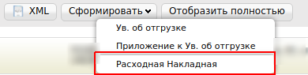
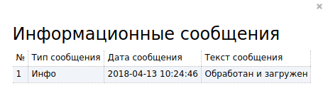

Формирование Коммерческого документа “Расходная накладная” (COMDOC_006)
###########################################################################
---------

.. contents:: Содержание:
   :depth: 6

---------

Введение
====================================
Данная инструкция описывает порядок формирования, подписания и отправки Коммерческого документа “Расходная Накладная”.

.. important:: **Внимание!**  Для корректного формирования документа **Расходная накладная (Comdoc)**, необходимо заполнить Товарный справочник. Вы можете посмотреть  `Инструкцию по заполнению справочника <https://wiki.edi-n.com/ru/latest/general/Zapolnenie_Tovarnogo_spravochnika.html>`_.

Расходная накладная (Comdoc)
============================================

Перед началом работы с расходной накладной необходимо заполнить все реквизиты, которые будут отображаться в документе со стороны поставщика.

Далее, перейдите в раздел “**Настройки**” (в правом верхнем углу):

.. image:: pics_formirovanie_Rashodnoj_nakladnoj/formirovanie_Rashodnoj_nakladnoj_01.png
   :align: center

Нажмите на закладку "**Мои компании**" и выберете GLN, с которого будет происходить отправка документов.

.. image:: pics_formirovanie_Rashodnoj_nakladnoj/formirovanie_Rashodnoj_nakladnoj_02.png
   :align: center

В открывшейся форме заполните поля обязательные для заполнения (отмечены красной звездочкой *****).

.. important:: **Внимание!** Обратите внимание, что реквизиты заполняются на украинском языке и должны соответствовать информации в регистрационных документах компании.

.. image:: pics_formirovanie_Rashodnoj_nakladnoj/formirovanie_Rashodnoj_nakladnoj_03.png
   :align: center

Формирование документа Расходная накладная
====================================================

Создать расходную накладную возможно тремя способами:

1. На основании Заказа (ORDERS)
2. На основании Уведомления об отгрузке (DESADV)
3. На основании Уведомления о приеме (RECADV)

***Рекомендуется формировать документ Расходная накладная (COMDOC) на основании Уведомления об отгрузке (DESADV).***

Ниже приведен пример формирования Расходной накладной на основании отправленного документа, Уведомление об отгрузке (DESADV).

Для формирования документа Расходная накладная, необходимо перейти в раздел “**Отправленные**”.

.. image:: pics_formirovanie_Rashodnoj_nakladnoj/formirovanie_Rashodnoj_nakladnoj_04.png
   :align: center

Открыть документ “**Уведомление об отгрузке**” и нажать кнопку “**Сформировать**”, затем выбрать из выпадающего списка документ “**Расходная накладная**”

Заполнение документа Расходная накладная
====================================================

В открывшемся документе, необходимо заполнить обязательные данные, отмеченные красной звездочкой *****, в каждом из блоков.

Первый блок содержит информацию о номере Коммерческого документа, дате его составления и деталей договора.

.. image:: pics_formirovanie_Rashodnoj_nakladnoj/formirovanie_Rashodnoj_nakladnoj_06.png
   :align: center

Второй блок содержит информацию о типе документа свидетельствующем про сотрудничество (договор), дате составления и его номере.

.. image:: pics_formirovanie_Rashodnoj_nakladnoj/formirovanie_Rashodnoj_nakladnoj_07.png
   :align: center

Третий блок содержит информацию о получателе Коммерческого документа, данные заполняются автоматически из документа основания.

.. image:: pics_formirovanie_Rashodnoj_nakladnoj/formirovanie_Rashodnoj_nakladnoj_08.png
   :align: center

Четвертый блок содержит информацию об отправителе Коммерческого документа, данные заполняются автоматически на основании данных компании в настройках.

.. image:: pics_formirovanie_Rashodnoj_nakladnoj/formirovanie_Rashodnoj_nakladnoj_09.png
   :align: center

Девятый блок содержит информацию о товарных позициях, которые поставляются.

.. image:: pics_formirovanie_Rashodnoj_nakladnoj/formirovanie_Rashodnoj_nakladnoj_10.png
   :align: center

**Данный блок содержит следующие колонки:**

* **Наименование** – данные заполняются автоматически из документа основания
* **Штрихкод** - данные заполняются автоматически из документа основания
* **Код УКТВЭД** - данные заполняются автоматически из товарного справочника
* **Количество** - данные заполняются автоматически из документа основания
* **Ед. Измерения** - данные заполняются автоматически из товарного справочника
* **Цена без НДС** - данные заполняются автоматически из документа основания
* **Цена с НДС** - данные заполняются автоматически из документа основания
* **Артикул покупателя** - данные заполняются автоматически из документа основания
* **Артикул продавца**- данные заполняются автоматически из товарного справочника

После внесения всех данных в документ, убедитесь в их корректности и нажмите кнопку “**Сохранить**”

.. image:: pics_formirovanie_Rashodnoj_nakladnoj/formirovanie_Rashodnoj_nakladnoj_11.png
   :align: center

Подписание документа Расходная Накладная
====================================================
После cохранения документа, его необходимо подписать Электронно-Цифровой подписью (ЭЦП).

.. image:: pics_formirovanie_Rashodnoj_nakladnoj/formirovanie_Rashodnoj_nakladnoj_12.png
   :align: center

Для первичной настройки ЭЦП, дождитесь загрузки страницы, а затем нажмите кнопку “**Считать ключи**”

.. image:: pics_formirovanie_Rashodnoj_nakladnoj/formirovanie_Rashodnoj_nakladnoj_13.png
   :align: center

Затем, в блоке настройки ЭЦП, нажмите на изображение ключа и выберете из каталога, где хранятся Ваши секретные ключи, соответствующий файл.

.. image:: pics_formirovanie_Rashodnoj_nakladnoj/formirovanie_Rashodnoj_nakladnoj_14.png
   :align: center

Виды файлов электронно-цифровой подписи
====================================================

Если Вы используете ключи от **АЦСК “Украина”**, файлы подписей секретных ключей имеют расширение **.ZS2** и следующие значения в именах файлов:

- Директор «DS»,
- Бухгалтер «BS»,
- Сотрудник «SS»,
- Печать «S»,
- Шифрование «C»,
- Универсальный ключ печати и шифрования «U».

.. image:: pics_formirovanie_Rashodnoj_nakladnoj/formirovanie_Rashodnoj_nakladnoj_15.png
   :align: center

Если Вы используете ключи от **АЦСК “ПриватБанк”**, файлы подписей секретных ключей имеют расширение **.jks**

.. image:: pics_formirovanie_Rashodnoj_nakladnoj/formirovanie_Rashodnoj_nakladnoj_16.png
   :align: center

Если Вы используете ключи от любых других **АЦСК**, файлы подписей секретных ключей имеют наименование **Key-6.dat**

.. image:: pics_formirovanie_Rashodnoj_nakladnoj/formirovanie_Rashodnoj_nakladnoj_17.png
   :align: center

После выбора секретных ключей, введите пароли под каждым из них, а затем нажмите кнопку “**Считать ключи**”

.. image:: pics_formirovanie_Rashodnoj_nakladnoj/formirovanie_Rashodnoj_nakladnoj_18.png
   :align: center

При корректном считывании ключей, в блоке “**ЭЦП**” появится информация о владельцах ключей. После проверки информации нажмите кнопку “**Подписать**”.

.. image:: pics_formirovanie_Rashodnoj_nakladnoj/formirovanie_Rashodnoj_nakladnoj_19.png
   :align: center

После подписания нажмите на кнопку “**Отправить**”.

.. image:: pics_formirovanie_Rashodnoj_nakladnoj/formirovanie_Rashodnoj_nakladnoj_20.png
   :align: center

Статусы отправленных документов
====================================================

После отправки ответных документов, торговая сеть обрабатывает их и присваивает им статусы.
Статусы отображаются в разделе “Отправленные”, напротив каждого документа.

.. image:: pics_formirovanie_Rashodnoj_nakladnoj/formirovanie_Rashodnoj_nakladnoj_21.png
   :align: center
   
.. image:: pics_formirovanie_Rashodnoj_nakladnoj/formirovanie_Rashodnoj_nakladnoj_22.png
   :align: center

Если документ корректный, напротив него, будет изображен статус в виде иконки |иконка-инфо| (знак инфо).

Если в документе были допущены ошибки, напротив него будет изображен статус в виде иконки |иконка-статус-1| (иконка восклицательный знак).

Детальную информацию о статусе документа, можно узнать, кликнув по иконке, после чего, появится информационное окно с текстом статуса.

Пример корректного статуса:

Пример некорректного статуса:

.. image:: pics_formirovanie_Rashodnoj_nakladnoj/formirovanie_Rashodnoj_nakladnoj_24.png
   :align: center

Получив такой статус, необходимо исправить ошибки, указанные в сообщении и отправить документ повторно.

.. |иконка-статус-1| image:: pics_formirovanie_Rashodnoj_nakladnoj/formirovanie_Rashodnoj_nakladnoj_icon_2.png

.. include:: kontakti.rst
