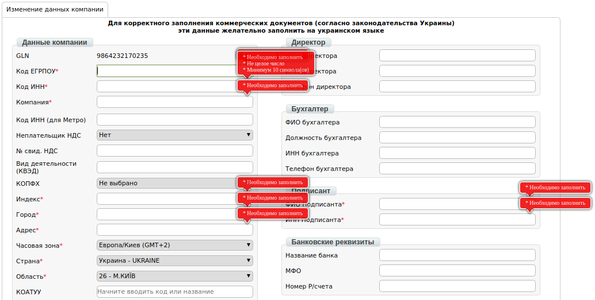
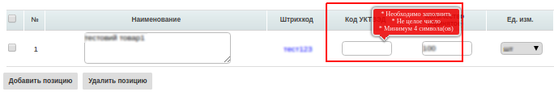
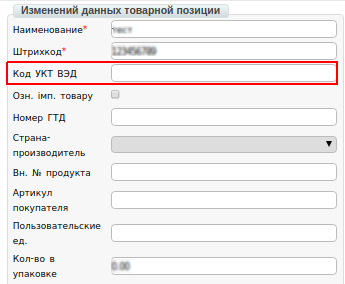
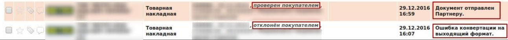
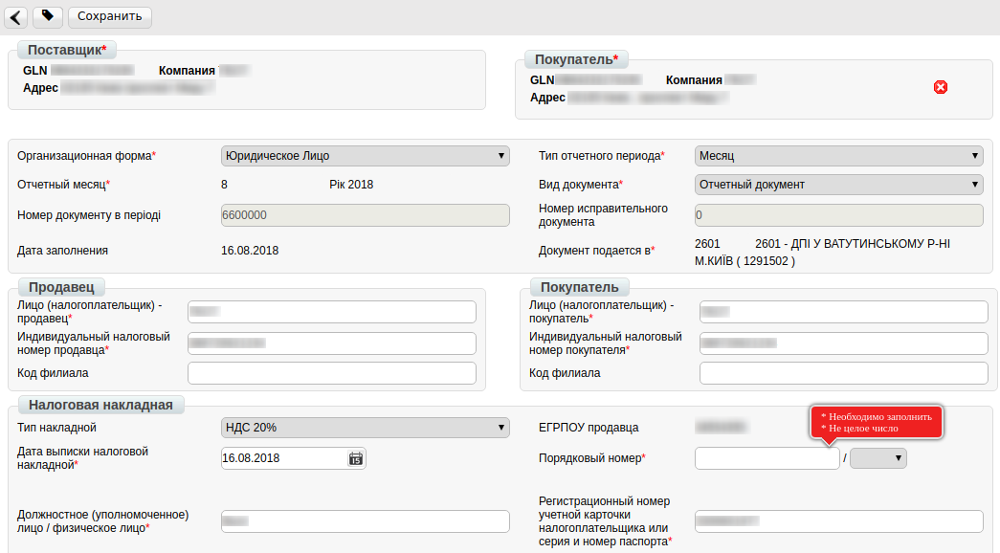
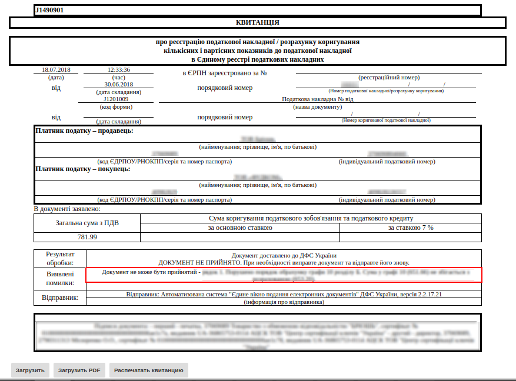
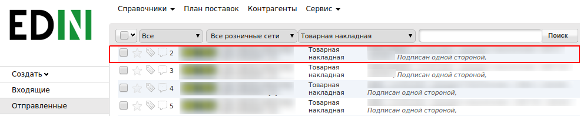

Формирование Товарной и Налоговой Накладной
###############################################################################
---------

.. contents:: Содержание:
   :depth: 6

---------

Введение
====================================
Данная инструкция описывает порядок формирования документов Товарной и Налоговой накладной web-платформе.

.. important:: **Внимание!**  Для корректного формирования документа **Расходная накладная (Comdoc)**, необходимо заполнить Товарный справочник. Вы можете посмотреть  `Инструкцию по заполнению справочника <https://wiki.edi-n.com/ru/latest/general/Zapolnenie_Tovarnogo_spravochnika.html>`_.

.. important:: **Внимание!** Завершенной цепочкой документооборота с сетью, является отправленная Товарная накладная, с корректным статусом, плюс созданная на основании Товарной накладной и зарегистрированная Налоговая накладная.

Товарная накладная
====================================

Перед началом работы с Товарной накладной и Налоговой накладной необходимо заполнить все реквизиты, ФИО подписанта и также данные по ГНИ, в которую буду отправляться Налоговые Накладные.

Заполнение реквизитов компании
----------------------------------------------------
Далее, перейдите в раздел “**Настройки**” (в правом верхнем углу”):

.. image:: pics_formirovanie_Tovarnoj_i_Nalogovoj_nakladnoj/formirovanie_Tovarnoj_i_Nalogovoj_nakladnoj_01.png
   :align: center

Нажмите на закладку "**Мои компании**" и выберете GLN, с которого будет происходить отправка документов.

.. image:: pics_formirovanie_Tovarnoj_i_Nalogovoj_nakladnoj/formirovanie_Tovarnoj_i_Nalogovoj_nakladnoj_02.png
   :align: center

В открывшейся форме заполните поля обязательные для заполнения (отмечены красной звездочкой *****).

.. important:: **Обратите внимание!** Реквизиты заполняются на украинском языке и должны соответствовать информации в регистрационных документах компании.

Методы создания Товарной накладной
----------------------------------------------------

Создать Товарную накладную возможно тремя способами:

1. Через меню «Создать» выбрав Товарную накладную
2. На основании Заказа (ORDER)
3. На основании Уведомления о приеме (RECADV)

*Рекомендуется формировать документ комплект документов Товарная накладная + Налоговая накладная, на основании Уведомления об приёме (RECADV).*

Ниже приведен пример формирования Товарной накладной на основании Уведомления об приёме (RECADV).

Для формирования документа комплекта документов, необходимо перейти в раздел “**Входящие**”.

Для удобства, отфильтруйте документы по «**прочитанным**», выберете нужную сеть в и укажите типа документа «**Уведомление о приёме**».

.. image:: pics_formirovanie_Tovarnoj_i_Nalogovoj_nakladnoj/formirovanie_Tovarnoj_i_Nalogovoj_nakladnoj_04.png
   :align: center

Открыть документ “**Уведомление об приёме**” и нажать кнопку “**Сформировать**”, затем выбрать из выпадающего списка документ “**Товарная накладная + Налоговая накладная**”.

.. image:: pics_formirovanie_Tovarnoj_i_Nalogovoj_nakladnoj/formirovanie_Tovarnoj_i_Nalogovoj_nakladnoj_05.png
   :align: center

Заполнение документа Товарная накладная
----------------------------------------------------

Первым сформированным документом будет Товарная накладная. В открывшемся документе, необходимо заполнить обязательные данные, отмеченные красной звездочкой *****, в каждом из блоков.

.. image:: pics_formirovanie_Tovarnoj_i_Nalogovoj_nakladnoj/formirovanie_Tovarnoj_i_Nalogovoj_nakladnoj_06.png
   :align: center

При проверке внесенных данных по товарным позициям необходимо удостоверится, что обязательно заполнено поле **код УКТ ВЭД**. 
В случае, если поле не заполнено или заполнено не корректно, при сохранении документа будет выведено сообщение, как на изображении ниже:

Для того, что бы поле с кодом **УКТ ВЭД** по товарным позициям при формировании документа Товарная Накладная заполнялось автоматически, необходимо проверить корректность заполнения данных в Товарном справочнике.

Подписание документа Товарная Накладная
----------------------------------------------------
После сохранения документа, его необходимо подписать Электронно-Цифровой подписью (ЭЦП).

.. image:: pics_formirovanie_Tovarnoj_i_Nalogovoj_nakladnoj/formirovanie_Tovarnoj_i_Nalogovoj_nakladnoj_09.png
   :align: center

Для первичной настройки ЭЦП, дождитесь загрузки страницы, а затем нажмите кнопку “**Считать ключи**”

.. image:: pics_formirovanie_Tovarnoj_i_Nalogovoj_nakladnoj/formirovanie_Tovarnoj_i_Nalogovoj_nakladnoj_10.png
   :align: center

Затем, в блоке настройки ЭЦП, нажмите на изображение ключа и выберете из каталога, где хранятся Ваши секретные ключи, соответствующий файл.

.. image:: pics_formirovanie_Tovarnoj_i_Nalogovoj_nakladnoj/formirovanie_Tovarnoj_i_Nalogovoj_nakladnoj_11.png
   :align: center

Виды файлов электронно-цифровой подписи
----------------------------------------------------

Если Вы используете ключи от **АЦСК “Украина”**, файлы подписей секретных ключей имеют расширение **.ZS2** и следующие значения в именах файлов:

- Директор «DS»,
- Бухгалтер «BS»,
- Сотрудник «SS»,
- Печать «S»,
- Шифрование «C»,
- Универсальный ключ печати и шифрования «U».

.. image:: pics_formirovanie_Tovarnoj_i_Nalogovoj_nakladnoj/formirovanie_Tovarnoj_i_Nalogovoj_nakladnoj_12.png
   :align: center

Если Вы используете ключи от **АЦСК “ПриватБанк”**, файлы подписей секретных ключей имеют расширение **.jks**

.. image:: pics_formirovanie_Tovarnoj_i_Nalogovoj_nakladnoj/formirovanie_Tovarnoj_i_Nalogovoj_nakladnoj_13.png
   :align: center

Если Вы используете ключи от любых других **АЦСК**, файлы подписей секретных ключей имеют наименование **Key-6.dat**

.. image:: pics_formirovanie_Tovarnoj_i_Nalogovoj_nakladnoj/formirovanie_Tovarnoj_i_Nalogovoj_nakladnoj_14.png
   :align: center

После выбора секретных ключей, введите пароли под каждым из них, а затем нажмите кнопку “**Считать ключи**”

.. image:: pics_formirovanie_Tovarnoj_i_Nalogovoj_nakladnoj/formirovanie_Tovarnoj_i_Nalogovoj_nakladnoj_15.png
   :align: center

При корректном считывании ключей, в блоке “**ЭЦП**” появится информация о владельцах ключей. После проверки информации нажмите кнопку “**Подписать**”.

.. image:: pics_formirovanie_Tovarnoj_i_Nalogovoj_nakladnoj/formirovanie_Tovarnoj_i_Nalogovoj_nakladnoj_16.png
   :align: center

После подписания нажмите на кнопку “**Отправить**”.

Статусы по товарной накладной
----------------------------------------------------

После отправки ответных документов, торговая сеть обрабатывает их и присваивает им статусы.
Статусы отображаются в разделе “**Отправленные**”, напротив каждого документа.

- «**Документ передан партнеру**» - товарная накладная корректная.
- «**Документ передан на ящик партнера**» - товарная накладная корректная.
- «**Правильный канал не найден. Нет соединения с партнером**» - в товарной накладной указан некорректный GLN получателя и покупателя.
- «**Ошибка конвертации на выходящий формат**» - есть ошибка в форме заполнения товарной накладной. Некоторые поля были не заполнены или заполнены некорректно.

В случае возникновения подобной ошибки просьба обратится по адресу эл. почты support@edi-n.com

Пример корректного статуса:

.. image:: pics_formirovanie_Tovarnoj_i_Nalogovoj_nakladnoj/formirovanie_Tovarnoj_i_Nalogovoj_nakladnoj_18.png
   :align: center

Пример некорректного статуса:

.. image:: pics_formirovanie_Tovarnoj_i_Nalogovoj_nakladnoj/formirovanie_Tovarnoj_i_Nalogovoj_nakladnoj_19.png
   :align: center

Налоговая накладная
====================================

После формирования и отправки Товарной накладной, форма Налоговой накладной откроется автоматически.

Данные в документе будут заполнены автоматически, на основании Товарной накладной. В Налоговой накладной необходимо заполнить порядковый номер.

После заполнения всех данных, документ необходимо сохранить,подписать ЭЦП и отправить аналогично Товарной накладной.

Документ будет доставлен на сервер ЕРНН и проверен органом Государственной Налоговой Инспекции.

.. image:: pics_formirovanie_Tovarnoj_i_Nalogovoj_nakladnoj/formirovanie_Tovarnoj_i_Nalogovoj_nakladnoj_21.png
   :align: center

Статус регистрации Налоговой накладной
----------------------------------------------------
После проверки документа органом Государственной Налоговой Инспекции, ему будет присвоен статус.

На корректный документ поступит статус «**Зарегистрировано в ЕРНН и отправлено покупателю**».

Не некорректный документ поступит статус «**Ошибка при регистрации в ЕРНН**».

.. image:: pics_formirovanie_Tovarnoj_i_Nalogovoj_nakladnoj/formirovanie_Tovarnoj_i_Nalogovoj_nakladnoj_22.png
   :align: center

Чтобы проверить причину отказа в регистрации Налоговой накладной, необходимо зайти в отправленный документ и расшифровать **квитанцию №1** отправленную органом ГНИ.

Для этого дождитесь загрузки данных в блоке «**Квитанция №1**» и нажмите кнопку «**Прочитать**».

.. image:: pics_formirovanie_Tovarnoj_i_Nalogovoj_nakladnoj/formirovanie_Tovarnoj_i_Nalogovoj_nakladnoj_23.png
   :align: center

Если прежде, ключи ЭЦП не были настроены, для расшифровки квитанции необходимо настроить ключ «**Шифрования**».

Расшифрованный документ можно сохранить в формате **.PDF**, загрузить в формате **.RPL** или отобразить на платформе. Текст причины отказа в регистрации Налоговой накладной указан в блоке «**Виявлені помилки**»

После анализа ошибок, сформируйте документ повторно и отправьте еще раз.

Формирование Товарной и Налоговой накладной, через функционал «Создать документ»
===================================================================================
В случае, если от торговой сети отсутствует документ «**Уведомление о приёме**», Товарную накладную, необходимо сформировать самостоятельно через меню «**Создать**».

.. image:: pics_formirovanie_Tovarnoj_i_Nalogovoj_nakladnoj/formirovanie_Tovarnoj_i_Nalogovoj_nakladnoj_25.png
   :align: center

Добавление товарных позиций
-------------------------------------------
Из выпадающего списка, выберете документ «**Товарная накладная**». 
В сформированном документе все реквизиты необходимо ввести вручную, на основании бумажных документов.

После заполнения реквизитов в документ, требуется ввести товарные позиции. Для этого нажмите кнопку «**Добавить позицию**».

.. image:: pics_formirovanie_Tovarnoj_i_Nalogovoj_nakladnoj/formirovanie_Tovarnoj_i_Nalogovoj_nakladnoj_26.png
   :align: center

В появившейся форме, заполните все обязательные поля, отмеченные красной звездочкой «*», после этого сохраните изменение.

.. image:: pics_formirovanie_Tovarnoj_i_Nalogovoj_nakladnoj/formirovanie_Tovarnoj_i_Nalogovoj_nakladnoj_27.png
   :align: center

Обратите внимание, что для того, что бы поле «**код УКТ ВЭД**» при добавлении позиции заполнялось автоматически, данные так же необходимо заполнить в Товарном справочнике.

После добавления всех товарных позиций, документ необходимо сохранить, подписать ЭЦП и отправить в торговую сеть.

Эта процедура, аналогичная пункту *"Подписание документа Товарная Накладная"* данной инструкции.

Формирование Налоговой накладной

----------------------------------------------------

Перейдите в раздел «**Отправленные**», найти и откройте ранее отправленную Товарную накладную.

В открывшемся документе нажать кнопку «**Сформировать**», затем выбрать из выпадающего списка документ «**Налоговая накладная**».

Данные в документе будут заполнены автоматически, на основании Товарной накладной. В Налоговой накладной необходимо заполнить порядковый номер.

После заполнения всех данных, документ необходимо сохранить, подписать ЭЦП и отправить в торговую сеть.

Эта процедура, аналогичная пункту *"Подписание документа Товарная Накладная"* данной инструкции.

.. include:: kontakti.rst
