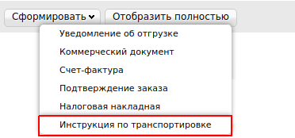
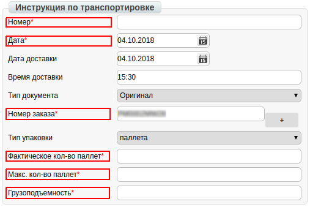

####################################################################################
Формирование документа «Инструкция по транспортировке» (IFTMIN) на платформе
####################################################################################
---------

.. contents:: Содержание:
   :depth: 6

---------

Введение
====================================
Данная инструкция описывает порядок формирования и отправки документа «**Инструкция по транспортировке**» (IFTMIN).

Формирование документа «Инструкция по транспортировке» (IFTMIN)
=====================================================================
Создание документа происходит на основании «**Заказа**».

Перейдите в раздел «**Входящие**», для удобства поиска выберите в фильтре необходимую сеть и тип документа «**Заказ**».

.. image:: pics_formirovanie_dokumenta_Instrukcija_po_transportirovke_IFTMIN_na_platforme/formirovanie_dokumenta_Instrukcija_po_transportirovke_IFTMIN_na_platforme_01.png
   :align: center

В открытом документе, нажмите кнопку «**Сформировать**» и выберете из списка документ «**Инструкция по транспортировке**».

   
В окне появится **Форма** для заполнения необходимых реквизитов документа. Все поля, обозначены красной звёздочкой ***** обязательны для заполнения.

Заполнение документа (IFTMIN)
========================================================
#. **Номер** документа должен быть следующего формата **X_Y**, где:

- **Х - это порядковый номер машины, которая едет по заказу**
- **Y - это общее количество машин, которое поедет по заказу**

Минимальное к-во 1, максимальное - 99. 
Х должен быть меньше или равно Y. *Например: 2_5*

2. **Дата** — фактическая дата отправки поставки
#. **Номер заказа** — подтягивается автоматически из заказа
#. **Фактическое кол-во паллет** — отгружаемое кол-во паллет в грузовой транспорт
#. **Максимальное кол-во паллет** — максимальная вместимость паллет в грузовой транспорт
#. **Грузоподъемность** — масса груза, на перевозку которого рассчитано транспортное средство

   
После внесения всех данных в документе, нажмите кнопку «**Сохранить**», затем «**Отправить**».

Отправленный документ автоматически попадает в папку «**Отправленные**» и будет находится в цепочке документов вместе с заказом и подтверждением заказа.

.. include:: kontakti.rst
