####################################################
Інструкція бізнес-адміністратора
####################################################

Дана інструкція описує порядок дій користувача, що виконує роль бізнес-адміністратора, на платформі DOCflow для виконання налаштувань, які є передумовою обміну пакетами документів.

1 Терміни та визначення
-------------------------
 - Компанія – юридична чи фізична особа, яка використовує систему для виконання своїх процесів. До одного акаунта можливо прив’язати декілька компаній. Документи, довідники, типи пакетів, контракти, маршрути, налаштування узгодження створюються в межах компанії і закріплюються за нею. 

 - Контракт – форма налаштування зв’язку між контрагентами, у відповідності до якої відбувається обмін пакетами документів.

 - Власник (ініціатор) контракту – організація, яка виступає ініціатором процесу обміну пакетами та відправником контракту.

 - Клієнт – організація-контрагент, яка виступає отримувачем контракту.

 - Тип пакета – налаштування та параметри пакета документів для обміну (являє собою перелік обов’язкових та необов’язкових типів документів для обміну в рамках пакета, визначає необхідність шифрування, кількість підписів власника та клієнта).

 - Маршрут – операція визначення працівників отримувача, які будуть отримувати та обробляти пакети документів. Маршрут будується на основі переліку контрактів та типів пакетів, до яких буде надано доступ користувачеві.

 - Довідник – прикладний об’єкт системи, який дозволяє зберігати дані, що мають однакову структуру та обліковий характер. Довідниками можуть бути, наприклад, типи операцій, регіони, види бізнесу тощо.

 - Тип документа – спеціальний системний довідник, що містить дані за типами документів, якими виконуватиметься обмін між сторонами.

2 Авторизація
--------------
Для авторизації на платформі перейдіть за посиланням https://doc.edi-n.com/auth та введіть свої логін = email і пароль на формі авторизації. Детальна інформація з авторизації міститься в  `«Інструкції з авторизації»`_.

.. _«Інструкції з авторизації»: https://wiki.edi-n.com/ru/latest/services/EDIN_DOCflow/edin_docflow/instruktsia-avtorizatsia.html

3 Створення / редагування компанії
---------------------------------
Для створення чи редагування даних компанії перейдіть до розділу «Налаштування компанії» - «Мої компанії». В списку будуть відображені вже існуючі компанії.

**3.1 Створення компанії**

Для створення компанії натисніть кнопку «Створити компанію» (якщо жодна компанія ще не створена) або «Створити» (якщо потрібно додати нову компанію до переліку раніше створених):

.. image:: pics_instruktsia-biznes-administratora/foto0.png
   :align: center

.. image:: pics_instruktsia-biznes-administratora/foto1.png
   :align: center

Після цього відкриється форма вибору типу створення компанії. «Звичайний» тип створення передбачає заповнення користувачем реєстраційних даних компанії вручну. Тип створення «З ЕЦП/КЕП» виконує автоматичне заповнення основних реєстраційних даних компанії із зчитаного електронного цифрового
підпису компанії:

.. image:: pics_instruktsia-biznes-administratora/foto2.png
   :align: center

Оберіть потрібний тип створення і натисніть «Створити». Після цього відкриється форма налаштування компанії:

.. image:: pics_instruktsia-biznes-administratora/foto3.png
   :align: center

У разі вибору «Звичайного» типу створення заповніть поля, що виділені червоним (обов’язкові параметри). При заповненні поля «ЄДРПОУ» слід дотримуватись наступних правил:

1. Для фізичних осіб в поле «ЄДРПОУ» вводиться ІПН (10 цифр)

2. Для юридичних осіб в поле «ЄДРПОУ» вводиться 8 цифр

3. Для нерезидентів в поле «ЄДРПОУ» можливо ввести 10 символів

Після внесення необхідних даних натисніть «Зберегти».

Для створення компанії «З ЕЦП/КЕП» попередньо завантажте і налаштуйте електронний цифровий підпис (детальніше в «Інструкції з налаштування ЕЦП»). Далі оберіть ЕЦП/КЕП з переліку зчитаних і натисніть «Створити»:

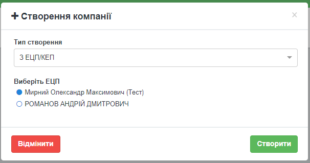

При цьому відкриється форма налаштування компанії, заповнена даними з ЕЦП/КЕП. Зі зчитаного ключа береться наступна інформація: форма власності компанії, назва компанії, код ЄДРПОУ. 

.. admonition:: Зверніть увагу!

   Інформація з ЕЦП/КЕП підтягується автоматично і не підлягає редагуванню.

**3.2 Підтвердження даних компанії з ЕЦП/КЕП**

Якщо на момент створення компанії у користувача були відсутні ЕЦП/КЕП і компанія була створена звичайним способом, система дозволяє підтвердити внесені дані з ЕЦП/КЕП (автоматично оновити дані, внесені в форму, реєстраційними даними компанії, що містяться в електронному цифровому підписі).

Для підтвердження даних із ЕЦП/КЕП перейдіть в розділ меню «Налаштування компанії» – «Мої компанії» навігаційної панелі сервісу та оберіть потрібну компанію зі списку, натиснувши на її назву. Далі перейдіть до вкладки «Основна інформація» та натисніть кнопку «Підтвердити з ЕЦП/КЕП»:

.. image:: pics_instruktsia-biznes-administratora/foto5.png
   :align: center

У формі вибору ЕЦП/КЕП, що відкриється, оберіть потрібний електронний цифровий підпис і натисніть «Створити». 

.. admonition:: Зверніть увагу!

   Код ЄДРПОУ підпису повинен відповідати коду ЄДРПОУ, вказаному у формі редагування компанії.

У разі успішного виконання підтвердження користувачеві буде відображене відповідне інформаційне повідомлення: «Компанія підтверджена успішно».

.. admonition:: Зверніть увагу!

   Кнопка «Підтвердити з ЕЦП/КЕП» наявна лише для компаній, створених звичайним способом.

**3.3 Редагування та блокування компанії**

Для редагування даних компанії перейдіть у розділ меню «Налаштування компанії» – «Мої компанії» та оберіть потрібну компанію зі списку, натиснувши на її назву. У формі, що відкриється, натисніть «Редагувати». Після чого дані за компанією будуть доступні для редагування. Для блокування компанії натисніть кнопку «Деактивувати» та підтвердіть дію у відповідному запиті системи:

.. image:: pics_instruktsia-biznes-administratora/foto6.png
   :align: center

.. image:: pics_instruktsia-biznes-administratora/foto7.png
   :align: center

Для активації компанії натисніть кнопку «Активувати» та підтвердіть дію у відповідному запиті системи.

**3.4 Договір**

З метою забезпечення юридичного супроводу реалізована можливість укласти договір з компанією-постачальником послуг електронного документообігу. Для цього перейдіть на вкладку «Договір» у формі створення / редагування компанії, розділ меню «Налаштування компанії» - «Мої компанії».

Для ознайомлення з текстом договору натисніть на відповідне посилання:

.. image:: pics_instruktsia-biznes-administratora/foto8.png
   :align: center

Файл договору у форматі pdf буде збережено в обраний каталог на жорсткому диску ПК чи змінному носії. Для підписання договору натисніть «Підписати договір», оберіть ЕЦП/КЕП із попередньо завантажених і натисніть «Підписати договір»:

.. image:: pics_instruktsia-biznes-administratora/foto9.png
   :align: center

.. image:: pics_instruktsia-biznes-administratora/foto9.5.png
   :align: center

Якщо на момент підписання ЕЦП/КЕП не встановлено, система повідомить про помилку: «Ключі не знайдені. Встановіть ключі та спробуйте ще раз».

Для компаній із підписаним договором у вкладці «Договір» відображатимуться дані про накладені підписи. Для повторного перегляду тексту договору натисніть на посилання «Договір підписано». Кнопка «Завантажити архів» дозволяє скачати архів, що містить pdf-файл договору і файли накладених підписів у форматі .p7s

.. image:: pics_instruktsia-biznes-administratora/foto10.png
   :align: center

**3.5 Надання компанії статусу «Акаунт»**

Акаунтом є головна компанія із групи компаній облікового запису, по якій здійснюватимуться платежі. У випадку, якщо жодну з компаній не обрано акаунтом, система автоматично призначить акаунтом компанію, що створена з ЕЦП, за умови підписаного договору з компанією-провайдером.

Для надання компанії статусу «акаунт» перейдіть в розділ меню «Адміністрування акаунта» – «Акаунт» – «Основна інформація», оберіть компанію з переліку у полі «Компанія» і натисніть «Зберегти». 

.. admonition:: Зверніть увагу!

   У переліку будуть відображені лише компанії з типом створення «З ЕЦП/КЕП» та підписаним договором.

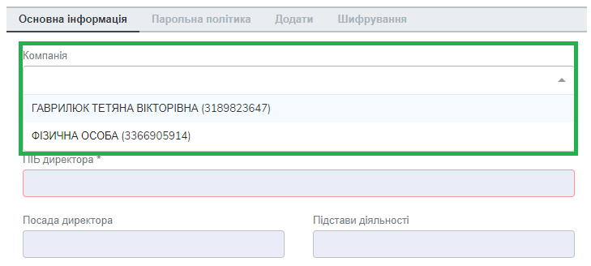

Форма «Акаунт» складається з двох блоків даних:

 - Контактна інформація – заповнюється користувачем і містить дані для зв’язку з представником компанії. Обов’язкові для заповнення поля позначені зірочкою. Мітка «Індивідуальний договір» проставляється для клієнтів, що працюють із провайдером електронного документообігу на індивідуальних умовах;

 - Реєстраційні дані – заповнюється автоматично даними компанії, що обрана акаунтом. Поля, заповнені з ЕЦП («Назва», «ЄДРПОУ», «Тип», «Юр. адреса») не підлягають редагуванню; поля «Фіз. адреса», «Свідоцтво платника ПДВ», «Дод.інформація» можна змінити у формі редагування компанії, меню «Налаштування компанії» – «Мої компанії».

**3.6 Зміна компанії-акаунта**

Для зміни компанії-акаунта перейдіть в меню «Адміністрування акаунта» – «Акаунт» – «Основна інформація», оберіть компанію з переліку у полі «Компанія» і натисніть «Зберегти».

.. admonition:: Зверніть увагу!

   Заблокувати компанію-акаунт неможливо. У переліку компаній (меню «Налаштування компанії» – «Мої компанії») напроти компанії із статусом «Акаунт» відсутній перемикач «активувати – деактивувати».

.. image:: pics_instruktsia-biznes-administratora/foto12.png
   :align: center

4 Налаштування довідників компанії
-----------------------------------
Для керування довідниками оберіть компанію зі списку в розділі «Налаштування компанії» - «Мої компанії». У формі редагування компанії перейдіть до вкладки «Довідники», де у формі списку будуть відображені довідники, вже закріплені за компанією. Для пошуку необхідного довідника введіть у поле пошуку 3 чи більше символів. Пошук виконується за назвою та кодом довідника.

.. image:: pics_instruktsia-biznes-administratora/foto13.png
   :align: center

**4.1 Створення нового довідника**

Для створення нового довідника натисніть кнопку «Додати». У формі створення довідника вкажіть назву та код довідника (може бути використаний для інтеграції з іншими системами). Для збереження внесених даних натисніть «Зберегти»:

.. image:: pics_instruktsia-biznes-administratora/foto14.png
   :align: center

Після цього можна буде вводити значення довідника. Для додання нових значень натисніть «Додати» і заповніть поля форми, що відкриється:

.. image:: pics_instruktsia-biznes-administratora/foto15.png
   :align: center

.. admonition:: Зверніть увагу!

   Код значення має бути унікальним у межах довідника. При введенні неунікального значення система повідомить про помилку: «Код значення довідника вже використовується».

Для збереження значення довідника натисніть Enter чи кнопку «Зберегти».

**4.2 Редагування довідника**

Для редагування довідника виберіть зі списку довідників потрібний і натисніть на його назву. Для редагування назви чи коду довідника натисніть «Редагувати».

Для редагування назви значення довідника натисніть на назву значення і введіть нове значення.

Для блокування чи розблокування значення довідника переведіть у відповідне положення перемикач блокування:

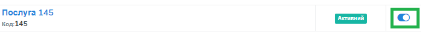

*4.2.1 Завантаження / вивантаження в Excel значень довідників*

Для спрощення процесу введення значень довідника передбачена можливість завантажити / вивантажити значення довідника з таблиці Excel:

.. image:: pics_instruktsia-biznes-administratora/foto17.png
   :align: center

Для експорту значень довідника натисніть «Вивантажити в Excel» та оберіть каталог на жорсткому диску ПК або змінному носії для збереження файлу. Для імпорту значень довідника скористайтеся кнопкою «Завантажити із Excel». Для зручності формування Excel-файлу є можливість скористатися готовим шаблоном «Завантажити шаблон».

**4.3 Налаштування типів документів компанії**

Для налаштування типів документів оберіть компанію зі списку в розділі «Налаштування компанії» - «Мої компанії» і перейдіть до вкладки «Документи». На вкладці у вигляді списку будуть відображені вже існуючі типи документів, що закріплені за компанією. Для пошуку необхідного документа введіть у поле пошуку 3 чи більше символів. Пошук виконується за назвою та кодом типу документа:

**4.4 Створення типу документа**

Для створення нового типу документа натисніть «Додати». У формі створення документа вкажіть назву,код і оберіть тип документа (неструктурований, якщо не задано інакше). Код типу документа може бути використаний для інтеграції з іншими системами. Для збереження внесених даних натисніть «Зберегти»:

.. image:: pics_instruktsia-biznes-administratora/foto19.png
   :align: center

**4.5 Завантаження / вивантаження типів документів в Excel**

Для спрощення процесу налаштування типів документів у сервісі реалізована можливість завантаження та вивантаження їх переліку в форматі Excel:

.. image:: pics_instruktsia-biznes-administratora/foto20.png
   :align: center

Для вивантаження переліку типів документів натисніть «В Excel» та оберіть каталог на жорсткому диску ПК чи змінному носії для збереження файлу.

Для завантаження переліку типів документів з таблиці Excel натисніть «З Excel» та оберіть підготовлений файл. 

.. admonition:: Зверніть увагу!

   Для успішного завантаження у файлі має бути щонайменше дві колонки (назва типу документа та код типу документа), файл не повинен містити формули, формат клітинок – загальний, перший рядок використовується як заголовок.

**4.6 Редагування типу документа**

Для редагування типу документа оберіть потрібний тип документа, натиснувши на його назву. Внесіть потрібні правки у формі редагування і натисніть «Зберегти».

Для блокування чи активації типу документа в списку типів документів переведіть перемикач у відповідне положення:

Для присвоєння користувацьких полів натисніть на кнопку «Поля документа»:

У формі, що відкриється, будуть відображені вже присвоєні поля. Для додання поля із списку виберіть потрібне поле і натисніть «Додати поле». Для видалення зв’язку з полем натисніть «Кошик»:

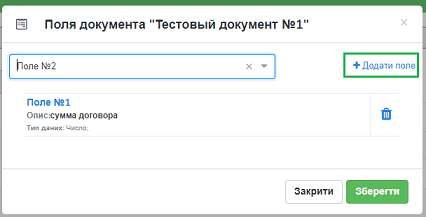

5 Налаштування користувацьких полів
-------------------------------------
Для налаштування користувацьких полів оберіть компанію зі списку в розділі «Налаштування компанії» - «Мої компанії». На формі редагування перейдіть до вкладки «Користувацькі поля», де будуть відображені вже існуючі поля. Для пошуку необхідного поля введіть у поле пошуку 3 чи більше символів. Пошук виконується за назвою та описом поля:

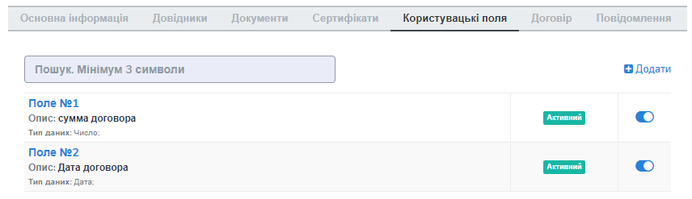

**5.1 Створення користувацького поля**

Для створення нового поля натисніть «Додати». На формі створення вкажіть назву поля, оберіть формат введення даних та введіть опис поля. Всі поля обов’язкові до заповнення. Для збереження внесених даних натисніть «Зберегти»:

.. image:: pics_instruktsia-biznes-administratora/foto25.png
   :align: center

**5.2 Редагування користувацького поля**

Для редагування поля оберіть потрібне поле в списку полів і натисніть на його назву. Внесіть необхідні правки у формі редагування і натисніть «Зберегти».

Для блокування чи активації поля переведіть перемикач у відповідне положення:

.. image:: pics_instruktsia-biznes-administratora/foto26.png
   :align: center

6 Налаштування маршруту
------------------------
Маршрут визначає перелік контрактів і пакетів, до яких буде надано доступ користувачеві. Маршрут є прикріпленим до компанії.

Для налаштування маршруту перейдіть у розділ «Керування доступом» – «Маршрути». У розділі відображаються всі створені маршрути. Для зручності реалізовано фільтр пошуку маршруту за компанією, до якої прикріплений маршрут, за статусом (активний / заблокований), за назвою маршруту:

.. image:: pics_instruktsia-biznes-administratora/foto27.png
   :align: center

.. admonition:: Зверніть увагу!

   Для користувача без ознаки «Власник акаунта» налаштування маршруту є обов’язковою передумовою початку роботи.

**6.1 Створення маршруту**

Для створення нового маршруту натисніть «Створити». У формі створення вкажіть назву і код маршруту (обов’язкові поля), оберіть зі списку компанію, до якої буде прикріплений даний маршрут, і визначте його напрямок (вхідний або вихідний) відносно типу пакета. Для збереження внесених даних натисніть «Зберегти»:

.. image:: pics_instruktsia-biznes-administratora/foto28.png
   :align: center

Після збереження даних з’явиться можливість працювати з вкладками «Користувачі», «Контракти» та «Пакети» для остаточного налаштування маршруту:

.. image:: pics_instruktsia-biznes-administratora/foto29.png
   :align: center

*6.1.1 Налаштування зв’язку з користувачем*

Для створення зв’язку маршрут — користувач перейдіть до вкладки «Користувачі» форми редагування маршруту, оберіть користувача з випадаючого списку і натисніть «Додати користувача». Кількість користувачів не обмежується:

.. image:: pics_instruktsia-biznes-administratora/foto30.png
   :align: center

Для розірвання зв’язку маршрут — користувач натисніть кнопку «Кошик».

*6.1.2 Налаштування доступу до контракту*

Для додання контракту в маршрут користувача перейдіть до вкладки «Контракти» форми редагування маршруту і натисніть «Додати»:

.. image:: pics_instruktsia-biznes-administratora/foto31.png
   :align: center

У формі, що відкриється, оберіть потрібний контракт із списку і натисніть «Підтвердити». У полі вибору контракту реалізовано пошук за назвою контракту:

.. image:: pics_instruktsia-biznes-administratora/foto32.png
   :align: center

Для зручності реалізована можливість обрати всі контракти. Для цього встановіть відмітку «Всі контракти» та підтвердіть дію у відповідному запиті системи:

.. image:: pics_instruktsia-biznes-administratora/foto33.png
   :align: center

Користувачеві буде надано доступ до всіх контрактів, наявних на момент налаштування маршруту, та всіх нових контрактів по мірі їх укладення.

Для обмеження доступу користувача до контракту встановіть відмітку напроти потрібного контракту і натисніть «Видалити».

Для обмеження доступу до всіх контрактів зніміть відмітку «Всі контракти» та підтвердіть дію у відповідному запиті системи.

*6.1.3 Налаштування доступу до типів пакетів*

Для додання типів пакетів у маршрут користувача перейдіть до вкладки «Типи пакетів» на формі редагування маршруту і натисніть «Додати»:

.. image:: pics_instruktsia-biznes-administratora/foto34.png
   :align: center

У вікні, що відкриється, оберіть у відповідному полі компанію з випадаючого списку:

.. image:: pics_instruktsia-biznes-administratora/foto35.png
   :align: center

Після вибору компанії стане доступним поле для вибору типу пакета за обраною компанією та активується кнопка «Додати».

Також для зручності реалізована можливість відкрити користувачеві доступ до всіх типів пакетів, встановивши відмітку «Всі пакети»:

.. image:: pics_instruktsia-biznes-administratora/foto36.png
   :align: center

Підтвердіть дію у відповідному запиті системи, натиснувши «Так». Користувачеві буде надано доступ до всіх типів пакетів.

Для обмеження доступу користувача до типу пакета відмітьте потрібний тип у списку і натисніть «Видалити».

Для видалення доступу до всіх типів пакетів зніміть відмітку «Всі типи пакетів» і підтвердіть дію у відповідному запиті системи:

.. image:: pics_instruktsia-biznes-administratora/foto37.png
   :align: center

**6.2 Блокування маршруту**

Для блокування маршруту переведіть перемикач у відповідну позицію напроти потрібного маршруту в списку «Керування доступом» – «Маршрути». Маршруту буде надано статус «Заблокований»:

.. image:: pics_instruktsia-biznes-administratora/foto38.png
   :align: center

7 Налаштування типу пакета
---------------------------

Для налаштування типу пакета перейдіть до розділу «Налаштування компанії» - «Типи пакетів». У розділі будуть відображені вже існуючі типи пакетів. Система фільтрів дозволяє здійснювати пошук типу пакета за його назвою, за компанією, до якої прикріплений пакет, за статусом типу пакета:

.. image:: pics_instruktsia-biznes-administratora/foto39.png
   :align: center

**7.1 Створення типу пакета**

Для створення типу пакета натисніть «Створити». У формі створення введіть назву та код типу пакета, а також оберіть компанію, до якої буде прикріплений тип пакета. Всі поля є обов’язковими для заповнення. Для збереження внесених даних натисніть «Зберегти»:

.. image:: pics_instruktsia-biznes-administratora/foto40.png
   :align: center

Після цього з’явиться можливість налаштувати для типу пакета документи, довідники і користувацькі поля у відповідних вкладках:

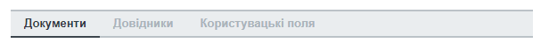

Після збереження типу пакета буде надано статусу «Чернетка». 

.. admonition:: Зверніть увагу!

   Типи пакета у статусі «Чернетка» не відображаються у списку доступних при створенні пакета. Для того, щоб тип пакета став доступним для вибору, його потрібно активувати.

.. admonition:: Зверніть увагу!

   Активувати можна лише той тип пакета, що містить хоча б один доданий тип документа (вкладка «Документи»).

**7.2 Редагування типу пакета**

Для редагування типу пакета оберіть потрібний пакет у списку і натисніть на його назву. Далі натисніть кнопку «Редагувати» і внесіть необхідні зміни. При редагуванні є можливість змінити назву та код типу пакета, додати чи видалити зв’язки с типами документів, довідниками, користувацькими полями.

Для збереження внесених даних натисніть «Зберегти».

При редагуванні автоматично створюється нова версія типу пакета в статусі «Чернетка». Для активації нової відредагованої версії натисніть «Активувати»:

.. image:: pics_instruktsia-biznes-administratora/foto42.png
   :align: center

При цьому попередня активна версія типу пакета набуде статусу «Архів».

Для перегляду всіх версій типу пакета натисніть кнопку «Показати всі версії» у формі редагування / перегляду типу пакета:

.. image:: pics_instruktsia-biznes-administratora/foto44.png
   :align: center

Відкриється перелік усіх версій типу пакета:

.. image:: pics_instruktsia-biznes-administratora/foto45.png
   :align: center

Для блокування чи активації типу пакета в списку переведіть перемикач у відповідне положення.

**7.3 Керування зв’язком із довідниками**

Для керування зв’язком із довідниками перейдіть до вкладки «Довідники» на формі редагування типу пакета. На вкладці будуть відображені вже прикріплені довідники із вказаними параметрами:

.. image:: pics_instruktsia-biznes-administratora/foto46.png
   :align: center

Для редагування даних натисніть кнопку «Олівець». У формі, що відкриється, є можливість вибрати новий довідник, змінити тип заповнення та встановити чи зняти ознаку обов’язковості. Для збереження внесених змін натисніть «Зберегти». 

.. admonition:: Зверніть увагу!

   Зміна назви довідника при редагуванні призведе до створення нового зв’язку. 

Для розірвання зв’язку з довідником натисніть кнопку «Кошик».

Для створення нового зв’язку натисніть «Додати зв’язок». На формі редагування виберіть довідник зі списку, вкажіть тип заповнення («Заповнює клієнт», «Заповнює ініціатор», «Заповнюють обидва») та визначте ознаку обов’язковості:

.. image:: pics_instruktsia-biznes-administratora/foto47.png
   :align: center

**7.4 Керування зв’язком з типами документів**

Для керування зв’язком з типами документів перейдіть до вкладки «Документи» на формі редагування типу пакета. На вкладці будуть відображені вже прикріплені типи документів з вказаними параметрами:

.. image:: pics_instruktsia-biznes-administratora/foto48.png
   :align: center

Для створення нового зв’язку натисніть кнопку «Додати зв’язок». На формі редагування виберіть тип документа, визначте кількість необхідних ЕЦП з боку ініціатора та клієнта, встановіть ознаки обов’язковості та шифрування, за необхідності встановіть відмітку «Довкладення отримувача» та вкажіть допустиму кількість файлів (максимальне значення 10).

.. admonition:: Зверніть увагу!

   Якщо «Довкладення отримувача» позначене як обов’язкове, документ має бути завантажений на стороні отримувача пакета.

.. image:: pics_instruktsia-biznes-administratora/foto49.png
   :align: center

Для редагування даних натисніть кнопку «Олівець» напроти потрібного типу документа та внесіть необхідні зміни на формі редагування. 

.. admonition:: Зверніть увагу!

   Зміна назви документа при редагуванні призведе до створення нового зв’язку.

Для збереження внесених даних натисніть «Зберегти».

Для розірвання зв’язку з типом документа натисніть кнопку «Кошик».

**7.5 Керування зв’язком з користувацьким полем**

Для керування зв’язком з користувацькими полями перейдіть до вкладки «Поля» на формі редагування типу пакета. На формі будуть відображені вже прикріплені поля з вказаними параметрами:

.. image:: pics_instruktsia-biznes-administratora/foto50.png
   :align: center

Для створення нового зв’язку натисніть «Додати зв’язок». На формі редагування виберіть поле, визначте тип заповнення поля («Заповнює ініціатор», «Заповнює клієнт», «Заповнюють обидва»), встановіть ознаку обов’язковості. Для збереження внесених даних натисніть «Зберегти».

Для редагування даних натисніть кнопку «Олівець» напроти потрібного поля у списку. У формі, що відкриється, внесіть необхідні зміни і натисніть «Зберегти». 

.. admonition:: Зверніть увагу! 

   Зміна назви поля при редагуванні призведе до створення нового зв’язку. 

Для розірвання зв’язку з полем натисніть кнопку «Кошик».

8 Налаштування зв’язку з контрагентами (контракт)
--------------------------------------------------

 - Контракт – форма зв’язку між контрагентами, у відповідності до якої відбувається обмін пакетами документів

 - Власник контракту – організація (юридична особа), що ініціює процес обміну пакетами та є відправником контракту

 - Клієнт – організація-контрагент, що є отримувачем контракту

 - Тип пакета – налаштування та параметри пакета документів для обміну (перелік обов’язкових та необов’язкових типів документів у рамках пакета, ознака шифрування, кількість підписів відправника пакета та отримувача).

На рівні контракту визначається перелік вхідних та вихідних (по відношенню до власника контракту) типів пакетів. Контракти зберігаються у розділі «Зв’язок з контрагентами» - «Контракти» меню навігаційної панелі сервісу. Розділ складається з папок:

 - Вхідні з переліком отриманих від контрагентів контрактів

 - Вихідні з переліком відправлених контрагентам контрактів

 - Чернетки з переліком створених контрактів на етапі їх заповнення / налаштування (до моменту відправки)

Для швидкого пошуку необхідного контракту у розділі реалізовано фільтр.

.. image:: pics_instruktsia-biznes-administratora/foto51.png
   :align: center

Пошук виконується за наступними атрибутами:

 - Назва та номер (для пошуку вкажіть хоча б один символ із назви / номера контракту)

 - Клієнт (пошук можливий за кодом ЄДРПОУ і назвою)

 - Ініціатор (пошук можливий за кодом ЄДРПОУ і назвою)

 - Статус (поле містить системний перелік статусів у відповідності до обраної папки)

 - Термін дії із можливістю вибрати дату дії контракту:

.. image:: pics_instruktsia-biznes-administratora/foto52.png
   :align: center

Для одночасного видалення всіх внесених в налаштування фільтра значень скористайтеся кнопкою «Скинути».

**8.1 Налаштування шаблона контракту**

Для налаштування шаблона контракту перейдіть до розділу «Зв’язок з контрагентами» - «Шаблони контрактів» навігаційної панелі сервісу. У розділі будуть відображені всі створені шаблони. Система фільтрів дозволяє виконувати пошук за назвою шаблона та назвою компанії-власника контракту (у вигляді випадаючого списку):

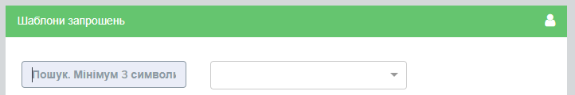

Для видалення шаблона поставте відмітку напроти потрібного шаблона і натисніть кнопку «Кошик». Також реалізована можливість масового видалення шаблонів. Для масового видалення необхідно відмітити потрібний шаблон та натиснути кнопку «Видалити».

Для створення нового шаблона натисніть «Створити»:

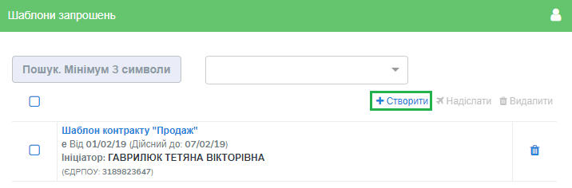

У формі, що відкриється, заповніть поля і натисніть «Створити»:

.. image:: pics_instruktsia-biznes-administratora/foto55.png
   :align: center

Порядок заповнення полів:

 - Назва – обов’язкове поле, допускається внесення літер, цифр та спеціальних символів; призначене для заповнення назви шаблона; якщо не задано інакше, внесене значення використовуватиметься як назва контракту, створеного на основі даного шаблона

 - Номер – поле, призначене для внесення номеру шаблона, допускається внесення літер, цифр та спеціальних символів; якщо не задано інакше, внесене значення використовуватиметься як номер контракту

 - Дата укладання - поле, що містить дату підписання контракту

 - Дата закінчення дії – поле, що містить дату закінчення дії контракту

 - Ініціатор – поле містить випадаючий список компаній, доступних користувачеві відповідно до налаштувань ролі

 - Дод. інформація – поле, не обов’язкове до заповнення.

Форма налаштування шаблона відкривається з автоматично заповненими полями «Назва», «Номер», «Дата укладання» та «Дата закінчення» контракту із додатковими вкладками для налаштування зв'язку з довідниками і типами пакетів.

У разі необхідності змінити автоматично заповнені дані натисніть «Редагувати», внесіть потрібні правки і натисніть «Зберегти».

Для налаштування зв’язку з довідниками перейдіть до вкладки «Довідники», де зберігається перелік прикріплених до шаблона довідників та їх значень.

Для видалення зв’язку встановіть відмітку напроти потрібного запису і натисніть кнопку «Кошик».

Для формування нового зв’язку натисніть «Додати»:

.. image:: pics_instruktsia-biznes-administratora/foto56.png
   :align: center

При цьому відкриється форма із переліком доступних активних довідників, що пов’язані з компанією-власником контракту (перелік довідників заповнюється у розділі «Налаштування компанії» – «Мої компанії» – «Довідники»).

Після вибору довідника виберіть значення довідника і натисніть «Зберегти» для збереження внесених даних.

Для зміни значення необхідно спочатку видалити зв’язок з довідником, а потім додати новий із новим значенням.

Для пошуку довідника чи значення довідника введіть декілька початкових символів у пошукове поле.

Для налаштування переліку вхідних та вихідних (по відношенню до власника) типів пакетів перейдіть до вкладки «Типи пакетів». Вкладка містить два розділи:

 - Вихідні із переліком типів пакетів, доступних для відправлення власнику (ініціатору) контракту

 - Вхідні із переліком типів пакетів, доступних для відправлення клієнту

Для видалення типу пакета з переліку натисніть кнопку «Кошик».

Для додання типу пакета до переліку доступних (вхідних або вихідних) натисніть «Додати». При цьому відкриється форма зі списком доступних типів пакетів, що прикріплені до компанії-власника контракту (перелік типів пакетів налаштовується у розділі «Налаштування компанії» – «Типи пакетів»):

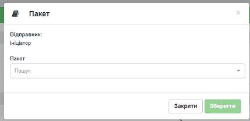

Після вибору типу пакета для збереження внесених даних натисніть «Зберегти».

Для зручності реалізована можливість додати в шаблон всі типи пакетів, прикріплені до компанії-власника контракту, шляхом встановлення відмітки «Всі пакети». Після встановлення відмітки «Всі пакети» в обраному розділі («Вхідні» або «Вихідні») підтвердіть дію у відповідному запиті системи.

**8.2 Створення та відправка контракту**

Для створення контракту перейдіть до розділу «Зв’язок з контрагентами» - «Контракти» та натисніть кнопку «Створити»:

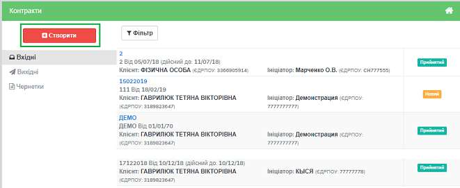

При цьому відкриється форма створення / редагування контракту з переліком обов’язкових для заповнення полів:

 - Назва та номер (допускається внесення літер, цифр та спеціальних символів)

 - Дата укладання та дата закінчення дії (поля містять календар для зручності внесення дат)

 - Контрагент (поле для вибору компанії-контрагента, якій буде відправлено контракт на розгляд). В межах поля реалізований пошук за кодом ЄДРПОУ та назвою (для старту пошуку введіть будь-який символ)

 - Мої компанії (поле для вибору однієї з компаній користувача, від імені якої буде відправлений контракт). В межах поля реалізований пошук за кодом ЄДРПОУ та назвою (для старту пошуку введіть будь-який символ)

.. image:: pics_instruktsia-biznes-administratora/foto59.png
   :align: center

Після заповнення обов’язкових полів натисніть «Створити». Контракт буде збережений у статусі «Чернетка» і відкриються додаткові вкладки («Довідники», «Типи пакетів») для остаточного налаштування контракту:

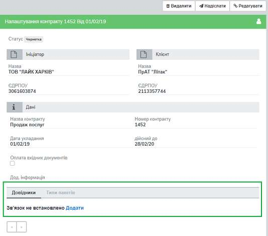

*8.2.1 Налаштування зв’язку з довідниками*

Для налаштування зв’язку з довідниками перейдіть до вкладки «Довідники», де зберігається перелік прикріплених до контракту довідників та їх значень. Всі закріплені за контрактом значення довідників будуть автоматично перенесені до пакета документів, створеного на основі даного контракту. У пакеті значення відображатимуться у розділі «Довідники» і будуть доступні тільки для перегляду.

Для розірвання зв’язку контракт-довідник оберіть потрібні записи, встановивши відмітки напроти, і натисніть «Видалити», або на кнопку «Кошик» для одиничного видалення. Для додання зв’язку натисніть «Додати»:

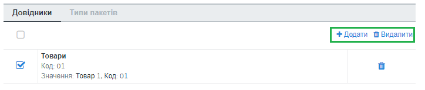
 
При цьому буде відкрито поле зі списком доступних активних довідників, що пов’язані з компанією-власником контракту (перелік довідників заповнюється у розділі «Адміністрування» – «Мої компанії» – «Довідники»):

.. image:: pics_instruktsia-biznes-administratora/foto62.png
   :align: center

Після вибору довідника з’явиться можливість вибрати значення довідника. Для збереження даних необхідно натиснути кнопку «Зберегти».

Для зміни значення необхідно спочатку видалити зв’язок з довідником, а потім додати новий з новим значенням.

Можливість видалити або додати нове значення довідника доступна на всіх етапах обробки контракту (від створення до розірвання).

Для пошуку довідника чи значення довідника в списку введіть початкові символи назви в пошуковий рядок.

*8.2.2 Налаштування переліку доступних типів пакетів*

Для налаштування вхідних та вихідних (відносно власника контракту) типів пакетів перейдіть до вкладки «Типи пакетів». Вкладка містить два розділи:

 - Вихідні із переліком типів пакетів, доступних для відправлення власнику (ініціатору) контракту

 - Вхідні із переліком типів пакетів, доступних для відправлення клієнту:

.. image:: pics_instruktsia-biznes-administratora/foto63.png
   :align: center

Для видалення типу пакета з переліку натисніть кнопку «Кошик».

Для додання типу пакета до переліку доступних (вхідних або вихідних) натисніть «Додати». У формі, що відкриється, оберіть потрібний тип пакета зі списку. У списку будуть відображені всі доступні типи пакетів, прикріплені до компанії-власника контракту (перелік типів пакетів налаштовується у розділі «Налаштування компанії» – «Типи пакетів»):

.. image:: pics_instruktsia-biznes-administratora/foto64.png
   :align: center

Після вибору типу пакета для збереження внесених даних натисніть «Зберегти».

Для зручності реалізована можливість додати у контракт всі типи пакетів, прикріплені до компанії-власника контракту, шляхом встановлення відмітки «Всі пакети»:

.. image:: pics_instruktsia-biznes-administratora/foto65.png
   :align: center

Після встановлення відмітки «Всі пакети» в обраному розділі («Вхідні» або «Вихідні») підтвердіть дію у відповідному запиті системи.

*8.2.3 Відправлення контракту (шаблону контракту)*

Для відправлення контракту перейдіть до папки «Чернетки» розділу «Контракти», оберіть потрібний контракт зі списку, натиснувши на його назву, і натисніть «Надіслати» у формі редагування контракту:

.. image:: pics_instruktsia-biznes-administratora/foto66.png
   :align: center

Для масової відправки контрактів встановіть відмітки напроти потрібних контрактів і натисніть «Надіслати»:

.. image:: pics_instruktsia-biznes-administratora/foto67.png
   :align: center

Для відправки шаблону контракту перейдіть до меню «Зв'язок з контрагентами» - «Шаблони контрактів», оберіть потрібний шаблон та натисніть кнопку «Надіслати»:

.. image:: pics_instruktsia-biznes-administratora/foto68.png
   :align: center

Наступним кроком необхідно обрати контрагентів-отримувачів та натиснути кнопку «Надіслати»:

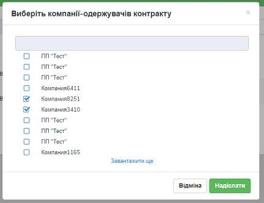

Після обробки контракту контрагентом йому буде надано статусу «Прийнятий» чи «Відхилений». Прийнятий контракт можливо розірвати за допомогою відповідної кнопки:

.. image:: pics_instruktsia-biznes-administratora/foto70.png
   :align: center

9 Обробка вхідних контрактів
------------------------------
Під обробкою мається на увазі надання контракту статусу «Прийнятий» або «Відхилений». Для обробки контракту, що надійшов від контрагента, перейдіть до розділу «Зв’язок з контрагентами» - «Контракти» та зайдіть у папку «Вхідні». В папці списком будуть відображені всі контракти, надіслані контрагентами. Необроблені контракти будуть відображені зі статусом «Новий».

Для пошуку необхідного контракту у розділі реалізовано фільтр із можливістю пошуку за назвою і номером контракту, за назвою і кодом ЄДРПОУ компанії-ініціатора і клієнта, за статусом і терміном дії контракту:

.. image:: pics_instruktsia-biznes-administratora/foto71.png
   :align: center

Для обробки обраного контракту натисніть на його назву, після чого відкриється форма обробки:

.. image:: pics_instruktsia-biznes-administratora/foto72.png
   :align: center

На вкладці «Типи пакетів» відображається перелік вихідних та вхідних (підпапки «Вихідні» та «Вхідні» відповідно) типів пакетів, налаштованих власником (ініціатором) контракту для обміну в межах даного контракту:

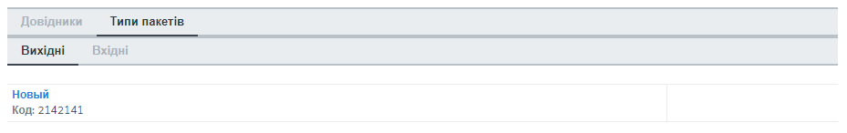

Натиснувши на назву типу пакета, можна переглянути правила роботи с документами для даного типу пакета:

.. image:: pics_instruktsia-biznes-administratora/foto74.png
   :align: center

Відображення розділу «Типи пакетів» у випадку, якщо власник встановив відмітку «Всі пакети»:

.. image:: pics_instruktsia-biznes-administratora/foto75.png
   :align: center

При обробці нового контракту реалізована можливість налаштувати зв'язок з довідниками. Для цього перейдіть на вкладку «Довідники» і натисніть «Додати». У формі, що відкриється, оберіть з випадаючого списку довідник і значення і натисніть «Зберегти». У списку для вибору будуть доступні довідники, додані в розділі «Налаштування компанії» - «Мої компанії» - «Довідники». 

.. admonition:: Зверніть увагу!

   На відміну від довідників, що закріплюються за типом пакета, довідники у контракті відображаються лише для того    користувача, який їх додав.

10 Білінг
----------
Для перегляду інформації по транзакціях, що відбулися за компаніями акаунта, перейдіть до розділу «Адміністрування акаунта» - «Білінг»:

.. image:: pics_instruktsia-biznes-administratora/foto76.png
   :align: center

Транзакції відображаються списком із виведенням наступної інформації:

 - Відправник — назва і код ЄДРПОУ компанії-відправника

 - Отримувач — назва і код ЄДРПОУ компанії-отримувача

 - Дата транзакції

 - Тип транзакції — відправлення документа чи довкладення отримувача

 - Напрямок — вхідна / вихідна

 - Ознака тарифікації

 - Номер пакета — у вигляді посилання із можливістю перейти до перегляду пакета

Система фільтрів дозволяє здійснювати пошук транзакцій за наступними параметрами:

 - Компанія — вибір із випадаючого списку, де відображені всі компанії акаунта

 - Тип транзакції — відправлення документа чи довкладення отримувача

 - Період — обирається помісячно

Також реалізована можливість відфільтрувати транзакції за ознакою вхідна / вихідна / тарифікована. До тарифікованих транзакцій належать відправлення документа і довкладення отримувача. Тарифікація транзакцій відбувається згідно обраного тарифного плану (налаштування в розділі «Адміністрування акаунта» - «Рахунки»).

11 Рахунки
-----------
Для перегляду інформації по рахунках перейдіть до розділу «Адміністрування акаунта» - «Рахунки». У розділі у вигляді таблиці будуть відображені всі рахунки по компаніях акаунта із виведенням наступної інформації:

 - Номер рахунку

 - Дата здійснення рахунку

 - Сума рахунку

 - Період оплати

При цьому несплачені рахунки будуть розміщені на початку списку і підсвічені червоним, сплачені підсвічуватимуться зеленим.

У таблиці напроти рахунку реалізована можливість скачати рахунок і акт (за наявності).

Система фільтрів дозволяє здійснювати пошук за наступними атрибутами:

 - Номер рахунку

 - Статус (сплачений / несплачений)

 - Дата рахунку

 - Дата оплати

 - Дата акту

 - Наявність акту

 - Узгодження

12 Узгодження
---------------
Застосовується до документів у вихідних пакетах. Для кожного типу документа процес узгодження налаштовується окремо.

Для налаштування правил і послідовності процесу узгодження перейдіть до розділу «Керування доступом» - «Узгодження». В розділі у вигляді списку будуть відображені вже створені процеси узгодження по всіх компаніях, доступних користувачеві за маршрутом і роллю.

Для додання нового процесу узгодження натисніть «Створити».

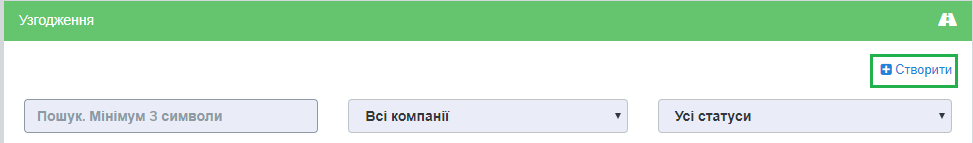

У формі, що відкриється, введіть назву процесу узгодження і оберіть компанію, в межах якої налаштовується узгодження. Після збереження даних (кнопка «Зберегти») для роботи стануть доступні вкладки «Крок» і «Тип документа»:

.. image:: pics_instruktsia-biznes-administratora/foto78.png
   :align: center

Для створення кроку узгодження натисніть «Додати крок узгодження» і заповніть форму налаштувань.

.. image:: pics_instruktsia-biznes-administratora/foto79.png
   :align: center

 - Номер кроку узгодження — заповнюється автоматично

 - Пріоритет — виставляється користувачем і визначає черговість виконання кроків; чим більше значення, тим вищий пріоритет

 - Група виконавців — визначає групу осіб, що виконуватимуть завдання; в полі реалізований вибір із випадаючого списку; список груп налаштовується в розділі «Керування доступом» - «Групи», обмеження на додання груп - 5

 - Завдання — визначає тип завдання для виконання: узгодження (надання статусу «Погоджено» або «Відхилено»), підписання, повідомлення (надання статусу «Ознайомлений»)

 - Тип виконання — визначає кількість задіяних користувачів, варіанти вибору «до виконання всією групою» (кожен із учасників групи має виконати дію, визначену в полі «Завдання»), «до виконання одним із групи» (достатньо, аби дію виконав один із учасників групи). При наданні типу документа статусу «Відхилено» кимось із учасників групи документ вибуває з процесу узгодження, а завдання автоматично анулюється. При цьому обов’язково зазначається причина відхилення.

 - Термін виконання — визначає термін виконання у днях.

Для редагування існуючого кроку узгодження натисніть кнопку «Олівець», внесіть необхідні зміни у форму налаштувань і натисніть «Зберегти». Для видалення кроку натисніть кнопку «Кошик».

Для додання типів документів до процесу узгодження перейдіть до вкладки «Тип документа». На вкладці у вигляді списку будуть відображені типи документів для узгодження за обраною компанією.

Для додання типів документів до процесу узгодження натисніть «Додати».

.. image:: pics_instruktsia-biznes-administratora/foto80.png
   :align: center

Відкриється форма з автоматично заповненим полем «Компанія» (відповідно до назви компанії, вказаної при створенні узгодження) і можливістю вибрати тип документа. 

.. admonition:: Зверніть увагу!

   У списку будуть відображені всі типи документів, закріплені за обраною компанією.

.. image:: pics_instruktsia-biznes-administratora/foto81.png
   :align: center

На етапі відправлення пакета із документами, що потребують узгодження, замість кнопки «Відправити» відображатиметься кнопка «Відправити на узгодження»:

.. image:: pics_instruktsia-biznes-administratora/foto82.png
   :align: center

Відправити пакет із документами, для яких процес узгодження не завершено, неможливо.

13 Групи
---------
Групи користувачів необхідні для налаштування процесу узгодження. Інформація за групами користувачів доступна в розділі «Керування доступом» - «Групи», де відображаються всі створені групи із можливістю фільтрації за компанією.

Для створення нової групи натисніть «Створити»:

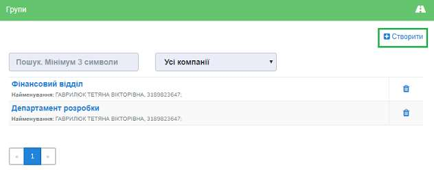

У формі, що відкриється, введіть назву групи, оберіть з випадаючого списку компанію, у межах якої створено групу, за потреби додайте коментар:

.. image:: pics_instruktsia-biznes-administratora/foto84.png
   :align: center

Для збереження внесених даних натисніть «Зберегти».

Після збереження даних з’явиться можливість додати в групу користувачів. Для додання користувача у групу натисніть «Додати», оберіть зі списку потрібний контакт і знов натисніть «Додати»:

.. image:: pics_instruktsia-biznes-administratora/foto85.png
   :align: center

У списку для вибору будуть доступні всі користувачі, що закріплені за компанією. Для видалення користувача із групи натисніть кнопку «Кошик».

Для редагування даних групи оберіть потрібну групу в переліку відображених у розділі і натисніть на її назву. У формі, що відкриється, натисніть «Редагувати», внесіть необхідні зміни і натисніть «Зберегти».

Для видалення групи натисніть кнопку «Кошик».

