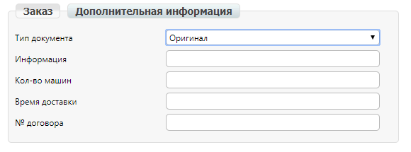
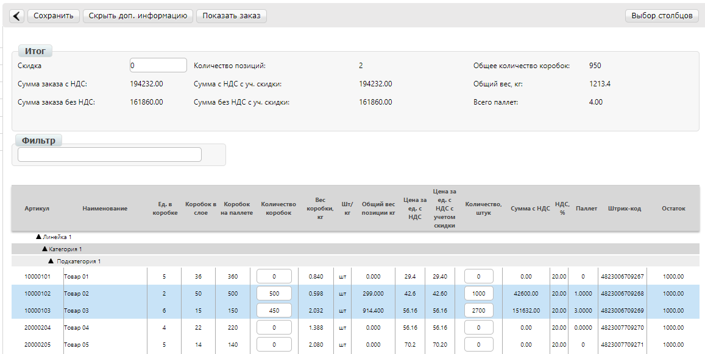

Создание заказа по прайс-листу. Инструкция для дистрибьютора
#########################################################
---------

.. contents:: Содержание:
   :depth: 6

---------

Введение
=======================================

Данная инструкция описывает порядок формирования документа **«Заказ по прайсу» (ORDERS)** и обязательные для заполнения поля.
Заказ производится в бланке, основанном на ценовых и логистических данных для перечня товарных позиций, переданных поставщиком в документе **Прайс-лист**.
Кроме того, поставщиком могут быть установлены ограничения по максимальному весу, максимальному объему, максимальному количеству позиций и минимальной сумме заказываемой партии.

Создание Заказа по прайсу
=======================================
Нажмите на кнопку Заказ по прайсу:

.. image:: pics_Sozdanie_zakaza_po_prajs_listu_Instrukcija_dlja_distributora/Sozdanie_zakaza_po_prajs_listu_Instrukcija_dlja_distributora_01.png
   :align: center

В открывшемся окне появится бланк заказа. Он состоит из трех блоков: Реквизиты, Итог, Блок товарных позиций.

Заполнение блока реквизитов
=======================================
В окне бланка заказа по прайсу вверху отображается блок реквизитов. После заполнения обязательных полей его можно скрыть кнопкой **Скрыть доп. информацию**.

.. image:: pics_Sozdanie_zakaza_po_prajs_listu_Instrukcija_dlja_distributora/Sozdanie_zakaza_po_prajs_listu_Instrukcija_dlja_distributora_02.png
   :align: center

**Обязательные поля**:

- **Номер заказа** (заполнено). Заказы на платформе нумеруются автоматически, если установлена галочка *Автоматический номер заказа*. Ее снятие позволяет вводить номера, соответствующие номерам заказов в вашей учетной системе.
- **Дата заказа** (заполнено). Дата создания документа Заказ по прайсу.
- **Дата доставки**. Планируемая дата поставки товара по данному заказу.
- **Валюта** (заполнено) - валюта заказа.
- **Условия отгрузки** (заполнено) - доступны к выбору варианты Доставка транспортом поставщика и Самовывоз.
- **Тип заказа** (заполнено). По умолчанию отображается Реализация. Доступны к выбору варианты: Склад ответственного хранения (СОХ), Снятие с СОХ (Реализация), Снятие с СОХ (Оптовая торговля), Оптовая торговля.

Галочка Цены в прайсе с НДС влияет на то, как заполняется колонка с суммой заказа в блоке товарных позиций. По умолчанию галочка установлена, и это позволяет видеть сумму заказа по позиции, включая НДС. Если эту галочку снять, колонка с суммой изменится на Сумма без НДС. На отображение итогов по заказу данная опция не влияет. 
Другие, относящиеся к реквизитам заказа, поля находятся на вкладке **Дополнительная информация**. Здесь предусмотрена возможность передачи в заказе поставщику:

- тип документа;
- текстовой информации к заказу;
- количество машин;
- времени доставки;
- номера договора поставки.

Поля заполняются вручную.

Заполнение блока товарных позиций
=======================================
Каталог продукции в бланке заказа по прайс-листу группируется в три уровня. Можно скрывать отдельные группы товаров, нажав на названия группы. Повторное нажатие на название группы приводит к отображению содержимого группы.
Для поиска нужной товарной позиции в бланке заказа используется **Фильтр**. Необходимо ввести в поле поиска символы, и в списке продукции останутся только те позиции, у которых найдены совпадения с ними в наименовании, или в номере артикула поставщика, штрих-кода.

Если поставщик отправляет в **Прайс-листе** свои данные об остатках продукции, то эти значения отображаются в бланке в колонке **Остаток**.
Установленные поставщиком ограничения на максимальный размер одного заказа отображаются возле итогов Общий вес, кг и Всего паллет.

Для удобного ввода количества товара в заказе предусмотрены открытые для редактирования поля:

- Товар с ценой в прайсе за штуку можно заказывать вводя Количество коробок. Если удобно, заказ можно вводить в поле Количество, штук, контролируя кратность коробкам.
- Весовой товар, для которого в прайс-листе цена указана за килограмм, можно заказать только внесением количества в килограммах, в поле Общий вес по позиции, кг.

Просмотр итогов
=======================================
После ввода заказываемого количества по позиции, автоматически для нее рассчитывается количество штук/коробок, паллет, вес, сумма с НДС и без, а также обновляется блок Итог по заказу.
Скрыть позиции, которые не заказываются, для проверки документа, можно нажав кнопку **Показать заказ**.

Перед сохранением убедитесь в том, что не превышены ограничения на размер одной партии в заказе - в блоке Итогов не должно быть значений, выделенных красным цветом.

.. image:: pics_Sozdanie_zakaza_po_prajs_listu_Instrukcija_dlja_distributora/Sozdanie_zakaza_po_prajs_listu_Instrukcija_dlja_distributora_05.png
   :align: center

Заполнение поля Скидка заблокировано, передача информации о скидке выполняется в виде индивидуальной доработки для клиента. Для этого обратитесь к вашему менеджеру АТС.

Сохранение и отправка Заказа по прайсу
=======================================
Если лимит по одному из установленных ограничений превышен, заказ не сохраняется, и выдается сообщение о превышении. В таком случае, уменьшите количество товара в заказе до уровня, который позволяет соблюдать ограничения. Если у вас возникнут вопросы относительно значений установленных ограничений, обратитесь непосредственно к поставщику.

.. image:: pics_Sozdanie_zakaza_po_prajs_listu_Instrukcija_dlja_distributora/Sozdanie_zakaza_po_prajs_listu_Instrukcija_dlja_distributora_06.png
   :align: center

При нажатии на кнопку Сохранить, документ сохраняется в разделе **Черновики**. Документ хранится в этом разделе до нажатия кнопки **Отправить**.
В Черновиках можно найти и открыть ранее сформированный и неотправленный заказ. При необходимости его можно отредактировать, сохраняя каждый раз внесенные изменения, либо удалить.
Для процедур внутреннего согласования заказа, в Черновиках предусмотрены такие возможности:

- распечатки черновика заказа (кнопка Печать),
- выгрузки черновика заказа в Excel (кнопка Excel),
- кнопкой XML можно сформировать и выгрузить черновик заказа в формате xml-файла.

.. image:: pics_Sozdanie_zakaza_po_prajs_listu_Instrukcija_dlja_distributora/Sozdanie_zakaza_po_prajs_listu_Instrukcija_dlja_distributora_07.png
   :align: center

После отправки Заказ уже не доступен для редактирования, его можно просмотреть в разделе **Отправленные**.
Пользователи заказчика, например, сотрудники бухгалтерии, зайдя в отправленный документ, могут добавлять к нему свои **Комментарии**. 

.. image:: pics_Sozdanie_zakaza_po_prajs_listu_Instrukcija_dlja_distributora/Sozdanie_zakaza_po_prajs_listu_Instrukcija_dlja_distributora_08.png
   :align: center

Имя пользователя, дата и время комментария регистрируются автоматически. Наличие комментария к заказу отображается в списке документов значком синего цвета.

.. image:: pics_Sozdanie_zakaza_po_prajs_listu_Instrukcija_dlja_distributora/Sozdanie_zakaza_po_prajs_listu_Instrukcija_dlja_distributora_09.png
   :align: center

Просмотр Прайс-листа поставщика
=======================================
Для просмотра переданной поставщиком в прайсе логистической и ценовой информации, а также срока действия цен нажмите кнопку **Прайс-лист**.
В окне Прайс-листа можно выгрузить всю табличную информацию в формате Excel кнопкой **Скачать каталог**.

В колонке **Действия** можно увидеть для каких позиций поставщик добавил информацию, прикрепив файл или файлы произвольного формата, например, фотографии или инструкции, для них отображается значок папки. При нажатии на значок открывается окно со списком приложенных файлов для просмотра и скачивания.

.. image:: pics_Sozdanie_zakaza_po_prajs_listu_Instrukcija_dlja_distributora/Sozdanie_zakaza_po_prajs_listu_Instrukcija_dlja_distributora_10.png
   :align: center

FAQ
=======================================
**Что делать, если Прайс-лист пуст?**

Обратитесь в службу технической поддержки АТС, и мы позаботимся о его загрузке поставщиком для вашей компании.
Также, обратившись к поставщику, вы можете уточнить причину, по которой вам не предоставлен Прайс-лист и согласовать предоставление.

**Что делать, если цены в прайсе не актуальны?**

Все данные, содержащиеся в Прайс-листе, предоставляются поставщиком. В данном случае необходимо связаться с поставщиком для согласования цен и дальнейшей актуализации Прайс-листа.

**Как подключить Прайс-лист другого Производителя?**

Для решения данного вопроса обратитесь к своему менеджеру компании АТС.

**Можно ли отправлять заказ из своей учетной системы и как это сделать?**

Для отправки заказа из учетной системы нужны дополнительные настройки. Как это сделать подскажет ваш ответственный менеджер компании АТС.
