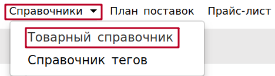
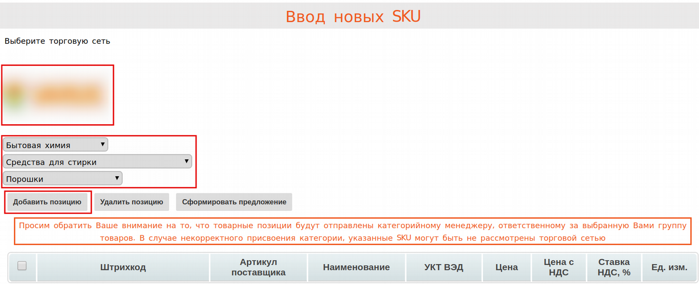
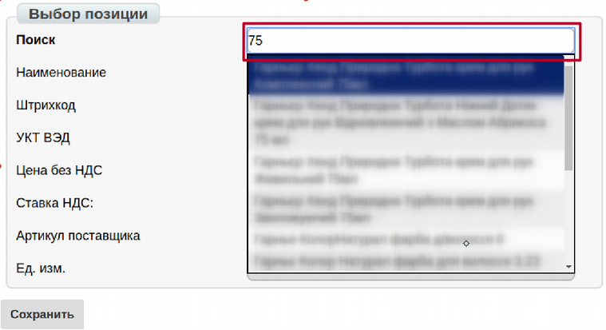
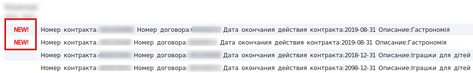
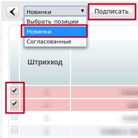
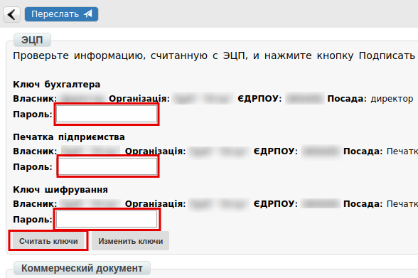
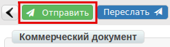

Ввод новых SKU на платформе
###############################

**Введение**

Инструкция описывает процесс создания предложения по расширению
ассортимента в действующих спецификациях.

**Для формирования предложения необходимо**:

1. **Проверить наличие товарной позиции в Товарном справочнике**

1.1 Для этого в меню выберите «**Справочники» => «Товарный справочник**»

1.2. Воспользоваться стандартным поиском по Штрихкоду, Наименованию
или Вн. No продукта.

.. image:: pics_Vvod_novyh_SKU_na_platforme/Vvod_novyh_SKU_na_platforme_02.png
   :align: center

Если позиция найдена - необходимо проверить корректность заполнения и
дополнить недостающие параметры товара.
Если позиция не найдена - воспользовавшись кнопкой «**+**» создать карточку
нового товара, заполнив все необходимые параметры.

.. image:: pics_Vvod_novyh_SKU_na_platforme/Vvod_novyh_SKU_na_platforme_03.png
   :align: center

2. **Сформировать предложение нажав кнопку Сформировать**

.. image:: pics_Vvod_novyh_SKU_na_platforme/Vvod_novyh_SKU_na_platforme_04.png
   :align: center

Откроется форма создания в которой необходимо выбрать торговую сеть,
категории, позиции для отправки на рассмотрение.

При добавлении товара в строке «Наименование из товарного справочника» Вы
можете воспользоваться поиском по штрихкоду, артикулу покупателя или
наименованию.

После выбора товарной позиции, все поля заполнятся автоматически. В случае, если
часть полей оказались пустыми – внесите недостающую информацию и нажмите
кнопку **Сохранить**.

.. image:: pics_Vvod_novyh_SKU_na_platforme/Vvod_novyh_SKU_na_platforme_07.png
   :align: center

3. **Создать документ Товарное согласование нажав на «Сформировать»**

.. image:: pics_Vvod_novyh_SKU_na_platforme/Vvod_novyh_SKU_na_platforme_08.png
   :align: center

.. important:: ! Выбранные Вами товарные позиции будут отправлены конкретному
категорийному менеджеру, ответственному за выбранную Вами группу товаров. В случае некорректного присвоения категории или выбора позиции не относящейся
к указанной Вами категории - SKU могут быть не рассмотрены торговой сетью.

Некоторые сети работают с вводом новых SKU только при наличии расширенных
характеристик. По таким сетям SKU, не имеющие ссылки на каталог *Listex* или *uCat*
не отправятся.

.. image:: pics_Vvod_novyh_SKU_na_platforme/Vvod_novyh_SKU_na_platforme_09.png
   :align: center

Если SKU занесены в Listex/uCat или же сеть не требует характеристик, то
документ сформируется. При необходимости можно указать дату начала действия
новой цены, дату окончания действия новой цены, сохранить, отправить.

.. image:: pics_Vvod_novyh_SKU_na_platforme/Vvod_novyh_SKU_na_platforme_10.png
   :align: center

На стороне поставщика, товарное согласование находится в «Отправленных»

4. **Далее, в зависимости от бизнес процесса внутри Торговой сети, происходит
отбор товара**.

4.1. В буфер УС сети импортируются все предложенные поставщиком позиции из
Товарного согласования. После подтверждения ввода позиций в спецификацию,
в УС для каждого товара создается карточка товара при этом каждой позиции
присваивается номер договора и контракт.

4.2. Торговая сеть из своей УС, интегрировано выгружает контракт с утвержденными
товарными позициями. В xml файле, для таких позиций указывается <ACTION>2</ACTION>.
Также, отправляет поставщику товарное согласование на отклоненные позиции.
В xml файле, для таких позиций указывается:

- подтип документа (действие) - <PRICETYPE>addSKU</PRICETYPE>
- признак документа - <DOCACTION>1</DOCACTION>

5. **На стороне Поставщика, контракты c новыми SKU размещаются в начале
списка и выделяются пометкой «NEW!»**

5.1. При открытии контракта с пометкой «NEW!», новые позиции выделяются
красным цветом и размещаются в начале списка. При наведении курсора мыши на такие
позиции, всплывает подсказка "Необходимо подписание новых SKU!"

.. image:: pics_Vvod_novyh_SKU_na_platforme/Vvod_novyh_SKU_na_platforme_12.png
   :align: center

5.2. Для выбора необходимых позиций в контракте, установите «флажок» напротив
новых или согласованных SKU.

**Внимание**! Выбор позиций разграничен на возможность выбрать только новые или
только согласованные позиции. При активации «флажков», к примеру, напротив новых
позиции - согласованные будут недоступны для выбора.

5.3. Массовый выбор позиций осуществляется с помощью выпадающего меню
«**Выбрать позиции**».

.. image:: pics_Vvod_novyh_SKU_na_platforme/Vvod_novyh_SKU_na_platforme_13.png
   :align: center

5.3.1. Для выбора только согласованных позиций, выберите пункт меню
«Согласованные». При этом «флажками» отметятся только все ранее согласованные
позиции и станет доступной кнопка «**Пересогласовать**».

.. image:: pics_Vvod_novyh_SKU_na_platforme/Vvod_novyh_SKU_na_platforme_14.png
   :align: center

5.3.2. Для выбора только новых позиций, выберите пункт меню «Новинки».
При этом «флажками» отметятся только новые позиции контракта и станет
доступной кнопка «**Подписать**».

5.4. Подписание новых товарных позиций

При нажатии на кнопку «Подписать» формируется коммерческий документ
«**Товарная спецификация**».

Введите пароли и нажмите «**Считать ключи**»

Далее нажмите «**Подписать**»

.. image:: pics_Vvod_novyh_SKU_na_platforme/Vvod_novyh_SKU_na_platforme_17.png
   :align: center

После считывания ключей нажмите «**Отправить**»

После чего документ отправляется в торговую сеть. На стороне поставщика
отобразится в разделе «Отправленные».

5.5. Новые SKU, в контракте, могут отображаться «сиреневым» цветом в случаях:

.. image:: pics_Vvod_novyh_SKU_na_platforme/Vvod_novyh_SKU_na_platforme_19.png
   :align: center

"-" Сформирован, но Не подписан, или подписан, но Не отправлен коммерческий 
документ «**Товарная спецификация**» (к примеру, случайно закрыли вкладку) -
такой документ переносится в раздел «Черновики».

Продолжить процесс подписания/отправки таких документов возможно из
раздела «Черновики» или снова открыв контракт с этой товарной позицией
(теперь он выделена «сиреневым» цветом) и кликнуть на нее.
При удалении документа из «Черновиков», новые SKU будут снова отображаться
красным цветом в Контракте.

"-" Сформирован, подписан, отправлен в торговую сеть коммерческий документ
«Товарная спецификация». Ожидается подписание со стороны сети. Кликнув на такую позицию откроется подписанный документ.

При наведении курсора мыши на позиции сиреневого цвета всплывает подсказка
«Коммерческий документ: No______ от __.__.__ До __.__.__»

6. **На стороне торговой сети, коммерческий документ отображается в разделе
«Входящие» с пометкой «Документ требует подписания**».

.. image:: pics_Vvod_novyh_SKU_na_platforme/Vvod_novyh_SKU_na_platforme_20.png
   :align: center

Сеть подписывает со своей стороны и отправляет поставщику.

7. **Процесс ввода новых товарных позиций считается завершенным, когда
коммерческий документ «Товарная спецификация» подписан с двух сторон.**

При этом, на стороне поставщика, возле контрактов, в которых подписаны Новые
SKU перестают отображаться пиктограммы «NEW!». Такие контракты не
отображаются в начале списка. Товарные позиции в таких контрактах не
отображаются красным или сиреневым цветами.

Повторная отправка коммерческого документа «Товарная спецификация» по
вводу новых SKU невозможен.
